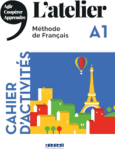

# LAF1201 Course Review
## Introduction
- **Full name**: [LAF1201 French 1](https://nusmods.com/courses/LAF1201/french-1)
- **Target audience**: any student who is interested in learning French
- **Purpose of the course**: Rather straightforward, to learn French :joy:
- **Notes Structure**:
  **LAF1201-Notes**: This folder contains the notes (mainly vocabulary and grammar) when I study this course.

I initially took this course to prepare for my Student Exchange Program (SEP). However, due to certain [reasons](https://ethz.ch/staffnet/en/news-and-events/internal-news/archive/2024/10/dual-use-and-sanctions-these-applications-require-security-screening.html), it seems I may not be able to participate in SEP in the second half of 2024. That said, learning a new language is always a valuable experience, so I don’t regret it—it's still worthwhile!

## Course Content
### Overview of Topics Covered
1. **Unit 1: C'est qui?**
2. **Unit 2: On fait quoi ce week-end?**
3. **Unit 3: On va où cet été?**
4. **Unit 4: On mange quoi cette semaine?**

### Depth and Balance of Coverage
As an introductory language course for total beginners, I believe the key focus should be on understanding essential grammar points and building a solid vocabulary foundation. However, the listening and speaking components require consistent practice to improve, as they are crucial for effective communication and these two parts are the most challenging parts also I think.

## Teaching Style and Materials
- **Tutorial**: Most of my tutorials are conducted by Ms. Bernadette, who is incredibly kind and approachable! She explains grammar points with great clarity and often delves deeper into them, giving us a richer understanding. *C'est génial*! My last few tutorials were taught by Mr. Yannick, who has a great sense of humor and makes the lessons very engaging hahaha.
### Course Book
**Textbook**:

  

The pdf file version can be found [here](./images/LAF1201_Coursebook.pdf).

**Exercise Book**:

  

The pdf file version can be found [here](./images/LAF1201_Workbook.pdf).

## Learning Experience
I truly enjoyed my French 1 learning experience and want to express my heartfelt thanks to my amazing teachers and wonderful classmates! They made the class feel warm and welcoming. I’ll never forget the support and kindness we shared with one another. Without all of you, I can’t imagine how this class would have been — *merci beaucoup*!

## Workload and Time Management 
- **Level of Difficulty**: **6/10**
- **Tips for Future Students**:
  The mémo at the end of each unit of the textbook is very very very useful! They are great resources for preparing for the tests! Besides that, I hope that my notes can also help you through your learning journey!

## Conclusion
This is a great course with kind and nice teachers and classmates! 