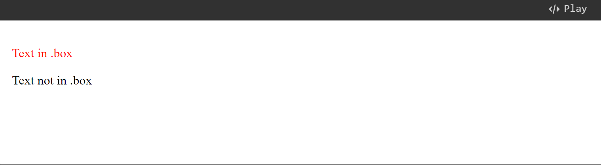
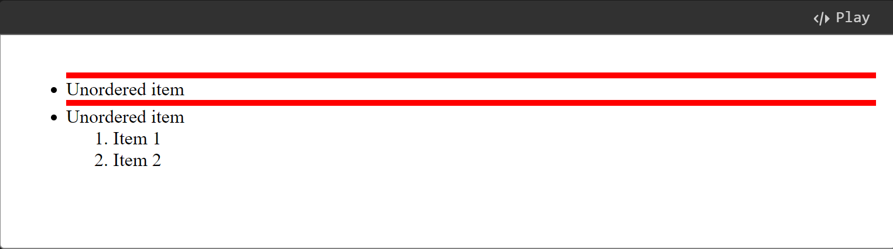
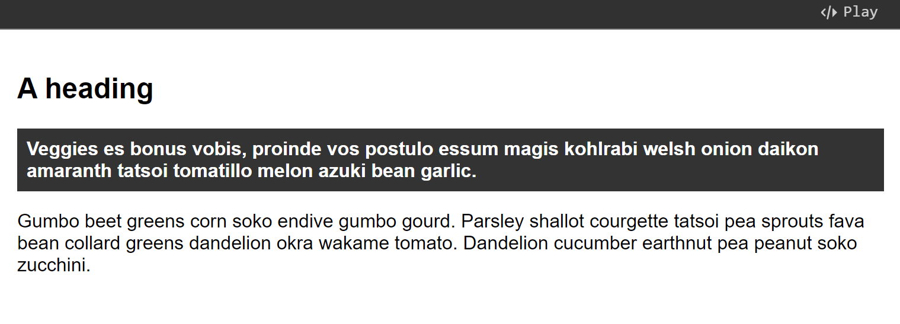
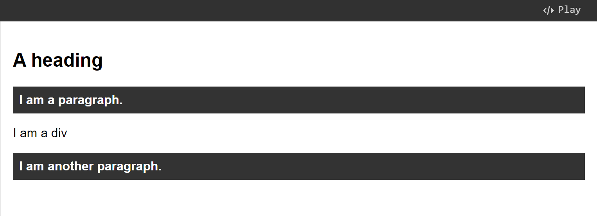

# CSS Combinators

Combinator itself is a type of [CSS selector](css-selectors.md). Combinators are used to **combine** other selectors in a way that allows us to select elements based on their location in the DOM relative to other elements (for example, **child** or **sibling**).

## Descendant combinator

The **descendant combinator** — typically represented by a single space ( ) character — combines two selectors such that elements matched by the second selector are selected if they have an ancestor (parent, parent's parent, parent's parent's parent, etc.) element matching the first selector. Selectors that utilize a descendant combinator are called _descendant selectors_.


```css
body article p {
}
```


In the example below, we are matching only the `<p>` element which is inside an element with a class of `.box`.


```html
<div class="box"><p>Text in .box</p></div>
<p>Text not in .box</p>
```



```css
.box p {
  color: red;
}
```


<figure><figcaption></figcaption></figure>

## Child combinator

The **child combinator** (`>`) is placed between two CSS selectors. It matches **only** **all of** those elements matched by the second selector that are the **direct children** of elements matched by the first. **Descendant elements further down the hierarchy don't match**. For example, to select only `<p>` elements that are direct children of `<article>` elements:


```css
article > p
```


In this next example, we have an ordered list ([`<ol>`](https://developer.mozilla.org/en-US/docs/Web/HTML/Element/ol)) nested inside an unordered list ([`<ul>`](https://developer.mozilla.org/en-US/docs/Web/HTML/Element/ul)). The child combinator selects only those `<li>` elements which are direct children of a `<ul>`, and styles them with a top border.

If you remove the `>` that designates this as a child combinator, you end up with a descendant selector and **all** `<li>` elements will get a red border.


```markup
<ul>
  <li>Unordered item</li>
  <li>
    Unordered item
    <ol>
      <li>Item 1</li>
      <li>Item 2</li>
    </ol>
  </li>
</ul>
```



```css
ul > li {
  border-top: 5px solid red;
}
```


<figure><figcaption></figcaption></figure>

## Next-sibling combinator

The **next-sibling combinator** (`+`) is placed between two CSS selectors. It matches **only** the element matched by the second selector that come right after the element matched by the first selector. For example, to select all `` elements that are immediately preceded by a `<p>` element:


```css
p + img
```


A common use case is to do something with a paragraph that follows a heading, as in the example below. In that example, we are looking for any paragraph which shares a parent element with an `<h1>`, and immediately follows that `<h1>`.

If you insert some other element such as a `<h2>` in between the `<h1>` and the `<p>`, you will find that the paragraph is no longer matched by the selector and so does not get the background and foreground color applied when the element is adjacent.


```markup
<article>
  <h1>A heading</h1>
  <p>
    Veggies es bonus vobis, proinde vos postulo essum magis kohlrabi welsh onion
    daikon amaranth tatsoi tomatillo melon azuki bean garlic.
  </p>

  <p>
    Gumbo beet greens corn soko endive gumbo gourd. Parsley shallot courgette
    tatsoi pea sprouts fava bean collard greens dandelion okra wakame tomato.
    Dandelion cucumber earthnut pea peanut soko zucchini.
  </p>
</article>
```



```css
body {
  font-family: sans-serif;
}

h1 + p {
  font-weight: bold;
  background-color: #333;
  color: #fff;
  padding: 0.5em;
}
```


<figure><figcaption></figcaption></figure>


One **difference** between [#child-combinator](css-combinators.md#child-combinator "mention") and [#next-sibling-combinator](css-combinators.md#next-sibling-combinator "mention") is that Child combinator can select **multiple** elements/classes, while Next-sibling combinator can only select **one** element/class.


## Subsequent sibling combinator

If you want to select siblings of an element even if they are not directly adjacent, then you can use the **subsequent-sibling combinator** (`~`). To select all `` elements that come _anywhere_ after `<p>` elements, we'd do this:


```css
p ~ img
```


In the example below we are selecting all `<p>` elements that come after the `<h1>`, and even though there is a `<div>` in the document as well, the `<p>` that comes after it is selected.


```html
<article>
  <h1>A heading</h1>
  <p>I am a paragraph.</p>
  <div>I am a div</div>
  <p>I am another paragraph.</p>
</article>
```



```css
body {
  font-family: sans-serif;
}

h1 ~ p {
  font-weight: bold;
  background-color: #333;
  color: #fff;
  padding: 0.5em;
}
```


<figure><figcaption></figcaption></figure>
