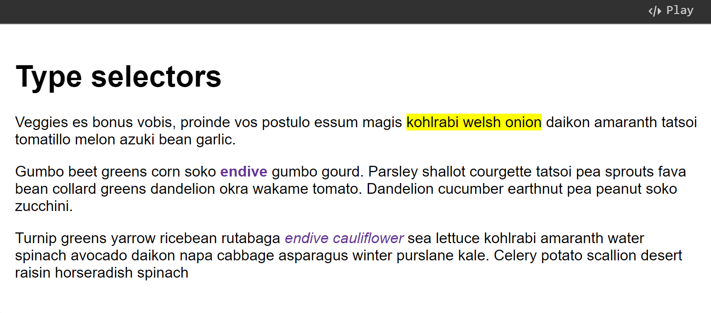
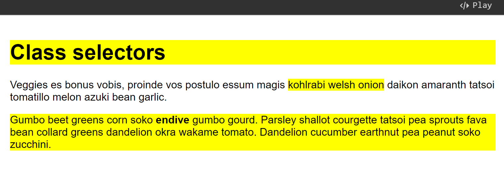
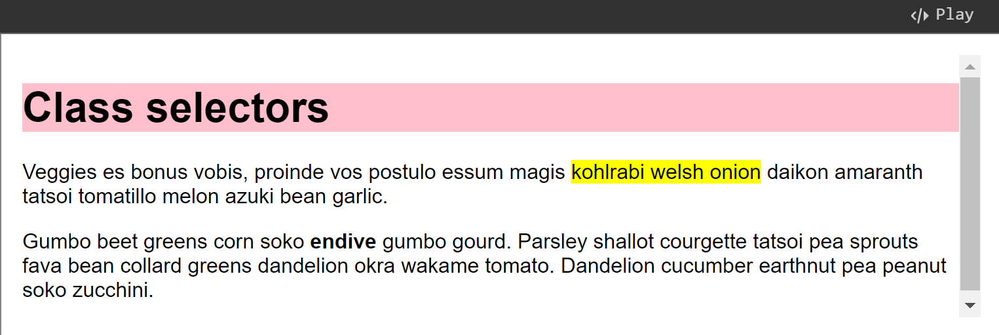
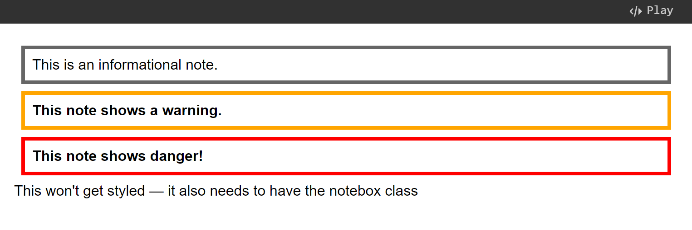
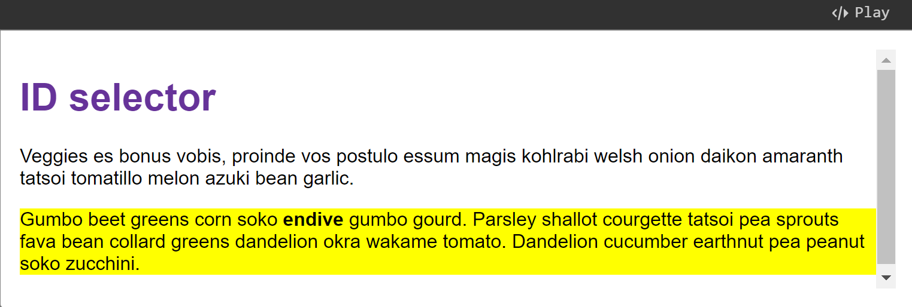
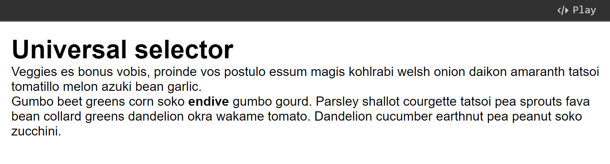
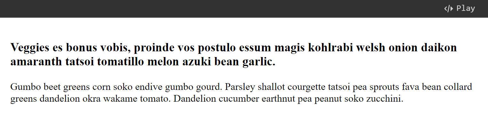
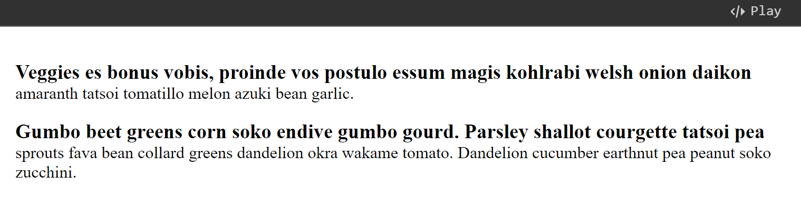

# CSS Selectors

## Basic CSS selectors

### What is a selector?

A CSS selector is the first part of a CSS Rule. It is a pattern of elements and other terms that tell the browser **which HTML elements** should be selected to have the CSS property values inside the rule applied to them. The element or elements which are selected by the selector are referred to as the _subject of the selector_.

### Type selectors

A **type selector** is sometimes referred to as a _tag name selector_ or _element selector_ because it selects an HTML tag/element in your document. In the example below, we have used the `span`, `em` and `strong` selectors.

Try adding a CSS rule to select the `<h1>` element and change its color to blue:


```html
<h1>Type selectors</h1>
<p>
  Veggies es bonus vobis, proinde vos postulo essum magis
  <span>kohlrabi welsh onion</span> daikon amaranth tatsoi tomatillo melon azuki
  bean garlic.
</p>

<p>
  Gumbo beet greens corn soko <strong>endive</strong> gumbo gourd. Parsley
  shallot courgette tatsoi pea sprouts fava bean collard greens dandelion okra
  wakame tomato. Dandelion cucumber earthnut pea peanut soko zucchini.
</p>

<p>
  Turnip greens yarrow ricebean rutabaga <em>endive cauliflower</em> sea lettuce
  kohlrabi amaranth water spinach avocado daikon napa cabbage asparagus winter
  purslane kale. Celery potato scallion desert raisin horseradish spinach
</p>
```



```css
body {
  font-family: sans-serif;
}

span {
  background-color: yellow;
}

strong {
  color: rebeccapurple;
}

em {
  color: rebeccapurple;
}
```


<figure><figcaption></figcaption></figure>

### Class selectors

So far, we have styled elements based on their HTML element names. This works as long as you want **all** of the elements of that type in your document to look the same. To select a **subset** of the elements without changing the others, you can add a `class` to your HTML element and target that class in your CSS.

The case-sensitive class selector starts with a dot (`.`) character. It will select everything in the document with that class applied to it. In the live example below we have created a class called `highlight`, and have applied it to several places in my document. All of the elements that have the class applied are highlighted.


```html
<h1 class="highlight">Class selectors</h1>
<p>
  Veggies es bonus vobis, proinde vos postulo essum magis
  <span class="highlight">kohlrabi welsh onion</span> daikon amaranth tatsoi
  tomatillo melon azuki bean garlic.
</p>

<p class="highlight">
  Gumbo beet greens corn soko <strong>endive</strong> gumbo gourd. Parsley
  shallot courgette tatsoi pea sprouts fava bean collard greens dandelion okra
  wakame tomato. Dandelion cucumber earthnut pea peanut soko zucchini.
</p>
```



```css
body {
  font-family: sans-serif;
}

.highlight {
  background-color: yellow;
}
```


<figure><figcaption></figcaption></figure>

#### Targeting classes on particular elements <a href="#targeting_classes_on_particular_elements" id="targeting_classes_on_particular_elements"></a>

You can create a selector that will target specific elements with the class applied. In this next example, we will highlight a `<span>` with a class of `highlight` differently to an `<h1>` heading with a class of `highlight`. We do this by **using the type selector for the element we want to target, with the class appended using a dot, with no white space in between.**


```css
body {
  font-family: sans-serif;
}

span.highlight {
  background-color: yellow;
}

h1.highlight {
  background-color: pink;
}
```


<figure><figcaption></figcaption></figure>

This approach reduces the scope of a rule. The rule will only apply to that particular element and class combination. You would need to add another selector if you decided the rule should apply to other elements too.

#### Target an element if it has more than one class applied <a href="#target_an_element_if_it_has_more_than_one_class_applied" id="target_an_element_if_it_has_more_than_one_class_applied"></a>

You can apply multiple classes to an element and target them individually, or only select the element when all of the classes in the selector are present. This can be helpful when building up components that can be combined in different ways on your site.

In the example below, we have a `<div>` that contains a note. The grey border is applied when the box has a class of `notebox`. If it also has a class of `warning` or `danger`, we change the [`border-color`](https://developer.mozilla.org/en-US/docs/Web/CSS/border-color).

We can tell the browser that we only want to match the element if it has two classes applied by chaining them together with no white space between them (in the `.css` file). You'll see that the last `<div>` doesn't get any styling applied, as it only has the `danger` class; it needs `notebox` as well to get anything applied.


```html
<div class="notebox">This is an informational note.</div>

<div class="notebox warning">This note shows a warning.</div>

<div class="notebox danger">This note shows danger!</div>

<div class="danger">
  This won't get styled — it also needs to have the notebox class
</div>
```



```css
body {
  font-family: sans-serif;
}

.notebox {
  border: 4px solid #666;
  padding: 0.5em;
  margin: 0.5em;
}

.notebox.warning {
  border-color: orange;
  font-weight: bold;
}

.notebox.danger {
  border-color: red;
  font-weight: bold;
}
```


<figure><figcaption></figcaption></figure>

### ID selectors

The case-sensitive ID selector begins with a `#` rather than a dot character, but is used in the same way as a class selector. The difference is that an ID can be used only once per page, and elements can only have a **single** `id` value applied to them. It can select an element that has the `id` set on it, and you can precede the ID with a type selector to only target the element if both the element and ID match. You can see both of these uses in the following example:


```html
<h1 id="heading">ID selector</h1>
<p>
  Veggies es bonus vobis, proinde vos postulo essum magis kohlrabi welsh onion
  daikon amaranth tatsoi tomatillo melon azuki bean garlic.
</p>

<p id="one">
  Gumbo beet greens corn soko <strong>endive</strong> gumbo gourd. Parsley
  shallot courgette tatsoi pea sprouts fava bean collard greens dandelion okra
  wakame tomato. Dandelion cucumber earthnut pea peanut soko zucchini.
</p>
```



```css
body {
  font-family: sans-serif;
}

#one {
  background-color: yellow;
}

h1#heading {
  color: rebeccapurple;
}
```


<figure><figcaption></figcaption></figure>


Using the **same** ID **multiple** times in a document may appear to work for styling purposes, but **don't do this**. It results in invalid code, and will cause strange behavior in many places.


### Selector lists

If you have more than one thing which uses the same CSS then the individual selectors can be combined into a _selector list_ so that the rule is applied to all of the individual selectors This is done by adding a **comma** between them.


```css
h1, .special {
  color: blue;
}
```


White space is valid before or after the comma. You may also find the selectors more readable if each is on a new line.


```css
h1,
.special {
  color: blue;
}
```


### The universal selector

The universal selector is indicated by an asterisk (`*`). It selects **everything in the document**. If `*` is chained using a [descendant combinator](https://developer.mozilla.org/en-US/docs/Web/CSS/Descendant_combinator), it selects **everything inside that ancestor element**. For example, `p *` selects all the nested elements inside the `<p>` element.

In the following example, we use the universal selector to remove the margins on all elements. Instead of the browser's default styling, which spaces out headings and paragraphs with margins, everything is close together.


```markup
<h1>Universal selector</h1>
<p>
  Veggies es bonus vobis, proinde vos postulo essum magis
  <span>kohlrabi welsh onion</span> daikon amaranth tatsoi tomatillo melon azuki
  bean garlic.
</p>

<p>
  Gumbo beet greens corn soko <strong>endive</strong> gumbo gourd. Parsley
  shallot courgette tatsoi pea sprouts fava bean collard greens dandelion okra
  wakame tomato. Dandelion cucumber earthnut pea peanut soko zucchini.
</p>
```



```css
body {
  font-family: sans-serif;
}

* {
  margin: 0;
}
```


<figure><figcaption></figcaption></figure>

## Attribute selectors

As you know from your study of HTML, elements can have attributes that give further detail about the element being marked up. In CSS you can use attribute selectors to target elements with certain attributes.


However, I personally feel this is an advanced course and won't be of great use in the practical project. So, provide the [original link](https://developer.mozilla.org/en-US/docs/Learn_web_development/Core/Styling_basics/Attribute_selectors) for reference.


## Pseudo-classes and Pseudo-elements

The next set of selectors we will look at are referred to as **pseudo-classes** and **pseudo-elements**. There are a large number of these, and they often serve quite specific purposes. Once you know how to use them, you can look through the different types to see if there is something which works for the task you are trying to achieve.

### What is a pseudo-class?

A pseudo-class is a selector that selects elements that are **in a specific state**, e.g. they are the first element of their type, or they are being hovered over by the mouse pointer. They tend to **act as if you had applied a class to some part of your document**, often helping you [cut down on excess classes](#user-content-fn-1)[^1] in your markup, and giving you more flexible, maintainable code.

Pseudo-classes are **keywords** that start with a colon. For example, `:hover` is a pseudo-class.

Let's look at a basic example. If we wanted to make the first paragraph in an article larger and bold, we could add a class to that paragraph and then add CSS to that class.

However, this could be annoying to maintain — what if a new paragraph got added to the top of the document? We'd need to move the class over to the new paragraph. Instead of adding the class, we could use the [`:first-child`](https://developer.mozilla.org/en-US/docs/Web/CSS/:first-child) pseudo-class selector — this will _always_ **target the first child element in the article**, and we will no longer need to edit the HTML (this may not always be possible anyway, maybe due to it being generated by a CMS).


```markup
<article>
  <p>
    Veggies es bonus vobis, proinde vos postulo essum magis kohlrabi welsh onion
    daikon amaranth tatsoi tomatillo melon azuki bean garlic.
  </p>

  <p>
    Gumbo beet greens corn soko endive gumbo gourd. Parsley shallot courgette
    tatsoi pea sprouts fava bean collard greens dandelion okra wakame tomato.
    Dandelion cucumber earthnut pea peanut soko zucchini.
  </p>
</article>
```



```css
article p:first-child {
  font-size: 120%;
  font-weight: bold;
}
```


<figure><figcaption></figcaption></figure>

All pseudo-classes behave in this same kind of way. They target some bit of your document that is in a certain state, behaving as if you had added a class into your HTML. Take a look at some other examples on MDN:

* [`:last-child`](https://developer.mozilla.org/en-US/docs/Web/CSS/:last-child)
* [`:only-child`](https://developer.mozilla.org/en-US/docs/Web/CSS/:only-child)
* [`:invalid`](https://developer.mozilla.org/en-US/docs/Web/CSS/:invalid)


It is valid to write pseudo-classes and elements without any element selector preceding them. In the example above, you could write `:first-child` and the rule would apply to _any_ element that is the first child of an `<article>` element, not just a paragraph first child — `:first-child` is equivalent to `*:first-child`. However, usually you want more control than that, so you need to be more specific.


#### User-action pseudo classes

Some pseudo-classes only apply when the user interacts with the document in some way. These **user-action** pseudo-classes, sometimes referred to as **dynamic pseudo-classes**, act as if a class had been added to the element when the user interacts with it. Examples include:

* [`:hover`](https://developer.mozilla.org/en-US/docs/Web/CSS/:hover) — mentioned above; this only applies if the user moves their pointer over an element, typically a link.
* [`:focus`](https://developer.mozilla.org/en-US/docs/Web/CSS/:focus) — only applies if the user focuses the element by clicking or using keyboard controls.

### What is a pseudo-element?

Pseudo-elements behave in a similar way. However, they act **as if you had added a whole new HTML element into the markup**, rather than applying a class to existing elements.

Pseudo-elements start with a double colon `::`. `::before` is an example of a pseudo-element.


Some early pseudo-elements used the single colon syntax, so you may sometimes see this in code or examples. Modern browsers support the early pseudo-elements with single- or double-colon syntax for backwards compatibility.


For example, if you wanted to select the first line of a paragraph you could wrap it in a `<span>` element and use an element selector; however, that would fail if the number of words you had wrapped were longer or shorter than the parent element's width. As we tend not to know how many words will fit on a line — as that will change if the screen width or font-size changes — it is impossible to robustly do this by adding HTML.

The `::first-line` pseudo-element selector will do this for you reliably — if the number of words increases or decreases it will still only select the first line.


```html
<article>
  <p>
    Veggies es bonus vobis, proinde vos postulo essum magis kohlrabi welsh onion
    daikon amaranth tatsoi tomatillo melon azuki bean garlic.
  </p>

  <p>
    Gumbo beet greens corn soko endive gumbo gourd. Parsley shallot courgette
    tatsoi pea sprouts fava bean collard greens dandelion okra wakame tomato.
    Dandelion cucumber earthnut pea peanut soko zucchini.
  </p>
</article>
```



```css
article p::first-line {
  font-size: 120%;
  font-weight: bold;
}
```


<figure><figcaption></figcaption></figure>

It acts as if a `<span>` was magically wrapped around that first formatted line, and updated each time the line length changed. And this selects the first line of both paragraphs.

[^1]: this means you can use fewer classes in your html code.
