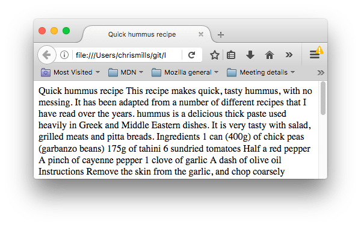

# Headings and paragraphs in HTML

One of HTML's main jobs is to give text structure so that a browser can display an HTML document the way its developer intends. This article explains how [HTML](https://developer.mozilla.org/en-US/docs/Glossary/HTML) can be used to provide fundamental page structure by defining headings and paragraphs.

## Headings and paragraphs

Most structured text consists of headings and paragraphs, whether you are reading a story, a newspaper, a college textbook, a magazine, etc. _Structured content makes the reading experience easier and more enjoyable._

In HTML, each paragraph has to be wrapped in a [`<p>`](https://developer.mozilla.org/en-US/docs/Web/HTML/Element/p) element, like so:


```html
<p>I am a paragraph, oh yes I am.</p>
```


Each heading has to be wrapped in a heading element:


```html
<h1>I am the title of the story.</h1>
```


There are six heading elements: [h1](https://developer.mozilla.org/en-US/docs/Web/HTML/Element/Heading_Elements), [h2](https://developer.mozilla.org/en-US/docs/Web/HTML/Element/Heading_Elements), [h3](https://developer.mozilla.org/en-US/docs/Web/HTML/Element/Heading_Elements), [h4](https://developer.mozilla.org/en-US/docs/Web/HTML/Element/Heading_Elements), [h5](https://developer.mozilla.org/en-US/docs/Web/HTML/Element/Heading_Elements), and [h6](https://developer.mozilla.org/en-US/docs/Web/HTML/Element/Heading_Elements). Each element represents a different level of content in the document; `<h1>` represents the main heading, `<h2>` represents subheadings, `<h3>` represents sub-subheadings, and so on.

## Implementing structural hierarchy

For example, in this story, the `<h1>` element represents the title of the story, the `<h2>` elements represent the title of each chapter, and the `<h3>` elements represent subsections of each chapter:


```html
<h1>The Crushing Bore</h1>

<p>By Chris Mills</p>

<h2>Chapter 1: The dark night</h2>

<p>
  It was a dark night. Somewhere, an owl hooted. The rain lashed down on the…
</p>

<h2>Chapter 2: The eternal silence</h2>

<p>Our protagonist could not so much as a whisper out of the shadowy figure…</p>

<h3>The specter speaks</h3>

<p>
  Several more hours had passed, when all of a sudden the specter sat bolt
  upright and exclaimed, "Please have mercy on my soul!"
</p>
```


It's really up to you what the elements involved represent, as long as the hierarchy makes sense. You just need to bear in mind a few best practices as you create such structures:

* Preferably, you should use **a single** `<h1>` per page—this is the top level heading, and all others sit below this in the hierarchy.
* Make sure you use the headings in the correct order in the hierarchy. Don't use `<h3>` elements to represent subheadings, followed by `<h2>` elements to represent sub-subheadings—that doesn't make sense and will lead to weird results.
* Of the six heading levels available, you should aim to use **no more than three** per page, unless you feel it is necessary. Documents with many levels (for example, a deep heading hierarchy) become unwieldy and difficult to navigate. On such occasions, it is advisable to spread the content over multiple pages if possible.

## Why do we need structure?

If we don't use structure, our whole content will appear as a big chunk! For example, the following code only uses "Enter/Return pressed to go onto the next line" to separate the content.


```html
<!DOCTYPE html>
<html lang="en-US">
  <head>
    <meta charset="utf-8">
    <meta name="viewport" content="width=device-width">
    <title>Quick hummus recipe</title>
  </head>
  <body>
    Quick hummus recipe

    This recipe makes quick, tasty hummus, with no messing. It has been adapted from a number of different recipes that I have read over the years.

    Hummus is a delicious thick paste used heavily in Greek and Middle Eastern dishes. It is very tasty with salad, grilled meats and pitta breads.

    Ingredients

    1 can (400g) of chick peas (garbanzo beans)
    175g of tahini
    6 sundried tomatoes
    Half a red pepper
    A pinch of cayenne pepper
    1 clove of garlic
    A dash of olive oil

    Instructions

    Remove the skin from the garlic, and chop coarsely
    Remove all the seeds and stalk from the pepper, and chop coarsely
    Add all the ingredients into a food processor
    Process all the ingredients into a paste.
    If you want a coarse "chunky" hummus, process it for a short time
    If you want a smooth hummus, process it for a longer time

    For a different flavour, you could try blending in a small measure of lemon and coriander, chili pepper, lime and chipotle, harissa and mint, or spinach and feta cheese. Experiment and see what works for you.

    Storage

    Refrigerate the finished hummus in a sealed container. You should be able to use it for about a week after you've made it. If it starts to become fizzy, you should definitely discard it.

    Hummus is suitable for freezing; you should thaw it and use it within a couple of months.


  </body>
</html>
```


And it will appear in our browser as follows:

<figure><figcaption></figcaption></figure>

This is because there are no elements to give the content structure, so the browser does not know what is a heading and what is a paragraph. Furthermore:

* Users looking at a web page tend to scan quickly to find relevant content, often just reading the headings, to begin with. (We usually [spend a very short time on a web page](https://www.nngroup.com/articles/how-long-do-users-stay-on-web-pages/).) If they can't see anything useful within a few seconds, they'll likely get frustrated and go somewhere else.
* Search engines indexing your page consider the contents of headings as important keywords for influencing the page's search rankings. Without headings, your page will perform poorly in terms of [SEO](https://developer.mozilla.org/en-US/docs/Glossary/SEO) (Search Engine Optimization).
* Severely visually impaired people often don't read web pages; they listen to them instead. This is done with software called a [screen reader](https://en.wikipedia.org/wiki/Screen_reader). This software provides ways to get fast access to given text content. Among the various techniques used, they provide an outline of the document by reading out the headings, allowing their users to find the information they need quickly. If headings are not available, they will be forced to listen to the whole document read out loud.
* To style content with [CSS](https://developer.mozilla.org/en-US/docs/Glossary/CSS), or make it do interesting things with [JavaScript](https://developer.mozilla.org/en-US/docs/Glossary/JavaScript), you need to have elements wrapping the relevant content, so CSS/JavaScript can effectively target it.

## Why do we need semantics?

Semantics are relied on everywhere around us—we rely on previous experience to tell us what the function of an everyday object is; when we see something, we know what its function will be. So, for example, we expect a red traffic light to mean "stop," and a green traffic light to mean "go." Things can get tricky very quickly if the wrong semantics are applied. (Do any countries use red to mean "go"? We hope not.)

In a similar way, we need to make sure we are using the correct elements, giving our content the correct meaning, function, or appearance. In this context, the [h1](https://developer.mozilla.org/en-US/docs/Web/HTML/Element/Heading_Elements) element is also a semantic element, which gives the text it wraps around the role (or meaning) of "a top level heading on your page."


```html
<h1>This is a top level heading</h1>
```



The use of **semantic elements** is awesome! Here, `<h1>` is one of the many **semantic elements** in HTML. You will learn more in the later courses.


By default, the browser will give it a large font size to make it look like a heading (although you could style it to look like anything you wanted using CSS). More importantly, its semantic value will be used in multiple ways, for example by search engines and screen readers (as mentioned above).

On the other hand, you could make any element _look_ like a top level heading. Consider the following:


```html
<span style="font-size: 32px; margin: 21px 0; display: block;">
  Is this a top level heading?
</span>
```


This is a [`<span>`](https://developer.mozilla.org/en-US/docs/Web/HTML/Element/span) element. It has no semantics. You use it to wrap content when you want to apply CSS to it (or do something to it with JavaScript) without giving it any extra meaning. (You'll find out more about these later on in the course.) We've applied some CSS to it to make it look like a top level heading, but since it has no semantic value, it will not get any of the extra benefits described above. It is a good idea to use the relevant HTML element for the job.


[The explanation](https://developer.mozilla.org/en-US/docs/Web/HTML/Element/span) of the difference between `<span>` and `<div>` is pretty clear and awesome!

