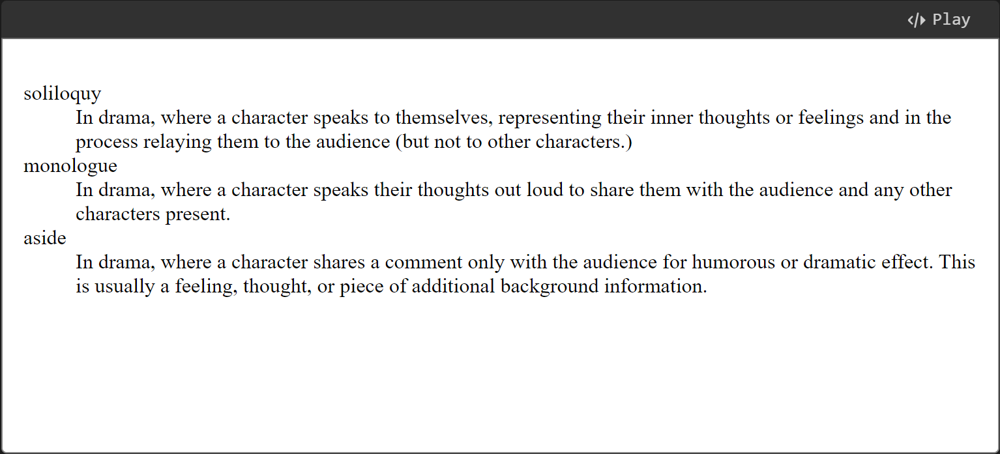
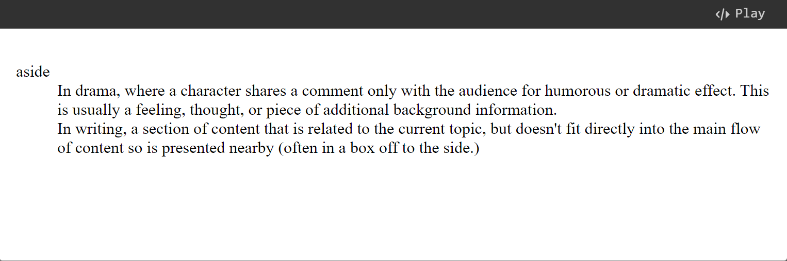

# Lists

Now let's turn our attention to lists. Lists are everywhere in life—from your shopping list to the list of directions you subconsciously follow to get to your house every day, to the lists of instructions you are following in these tutorials! It may not surprise you that HTML has a convenient set of elements that allows us to define different types of list. On the web, we have three types of lists: **unordered**, **ordered**, and **description lists**. This lesson shows you how to use the different types.

## Unordered lists

Unordered lists are used to mark up lists of items for which the order of the items doesn't matter. Let's take a shopping list as an example:

```
milk
eggs
bread
hummus
```

Every unordered list starts off with a [`<ul>`](https://developer.mozilla.org/en-US/docs/Web/HTML/Element/ul) element—this wraps around all the list items:


```html
<ul>
  milk
  eggs
  bread
  hummus
</ul>
```


The last step is to wrap each list item in a [`<li>`](https://developer.mozilla.org/en-US/docs/Web/HTML/Element/li) (list item) element:


```html
<ul>
  <li>milk</li>
  <li>eggs</li>
  <li>bread</li>
  <li>hummus</li>
</ul>
```


## Ordered lists

Ordered lists are lists in which the order of the items _does_ matter. Let's take a set of directions as an example:


```
Drive to the end of the road
Turn right
Go straight across the first two roundabouts
Turn left at the third roundabout
The school is on your right, 300 meters up the road
```


The markup structure is the same as for unordered lists, except that you have to wrap the list items in an [`<ol>`](https://developer.mozilla.org/en-US/docs/Web/HTML/Element/ol) element, rather than `<ul>`:


```html
<ol>
  <li>Drive to the end of the road</li>
  <li>Turn right</li>
  <li>Go straight across the first two roundabouts</li>
  <li>Turn left at the third roundabout</li>
  <li>The school is on your right, 300 meters up the road</li>
</ol>
```


## Nested lists

It is also allowed. Omit it here because it is too easy. If you need more information about this, you can go to the [original website](https://developer.mozilla.org/en-US/docs/Learn_web_development/Core/Structuring_content/Lists#nesting_lists).

## Description lists

The purpose of description lists is to mark up a set of items and their associated descriptions, such as terms and definitions, or questions and answers. Let's look at an example of a set of terms and definitions:


```
soliloquy
In drama, where a character speaks to themselves, representing their inner thoughts or feelings and in the process relaying them to the audience (but not to other characters.)
monologue
In drama, where a character speaks their thoughts out loud to share them with the audience and any other characters present.
aside
In drama, where a character shares a comment only with the audience for humorous or dramatic effect. This is usually a feeling, thought or piece of additional background information
```


Description lists use a different wrapper than the other list types — [`<dl>`](https://developer.mozilla.org/en-US/docs/Web/HTML/Element/dl); in addition each term is wrapped in a [`<dt>`](https://developer.mozilla.org/en-US/docs/Web/HTML/Element/dt) (description term) element, and each description is wrapped in a [`<dd>`](https://developer.mozilla.org/en-US/docs/Web/HTML/Element/dd) (description definition) element.

### Description list example

Let's finish marking up our example:


```html
<dl>
  <dt>soliloquy</dt>
  <dd>
    In drama, where a character speaks to themselves, representing their inner
    thoughts or feelings and in the process relaying them to the audience (but
    not to other characters.)
  </dd>
  <dt>monologue</dt>
  <dd>
    In drama, where a character speaks their thoughts out loud to share them
    with the audience and any other characters present.
  </dd>
  <dt>aside</dt>
  <dd>
    In drama, where a character shares a comment only with the audience for
    humorous or dramatic effect. This is usually a feeling, thought, or piece of
    additional background information.
  </dd>
</dl>
```


The browser default styles will display description lists with the descriptions indented somewhat from the terms.

<figure><figcaption></figcaption></figure>

### Multiple descriptions for one term

Note that it is permitted to have a single term with multiple descriptions, for example:


```html
<dl>
  <dt>aside</dt>
  <dd>
    In drama, where a character shares a comment only with the audience for
    humorous or dramatic effect. This is usually a feeling, thought, or piece of
    additional background information.
  </dd>
  <dd>
    In writing, a section of content that is related to the current topic, but
    doesn't fit directly into the main flow of content so is presented nearby
    (often in a box off to the side.)
  </dd>
</dl>  
```


<figure><figcaption></figcaption></figure>
