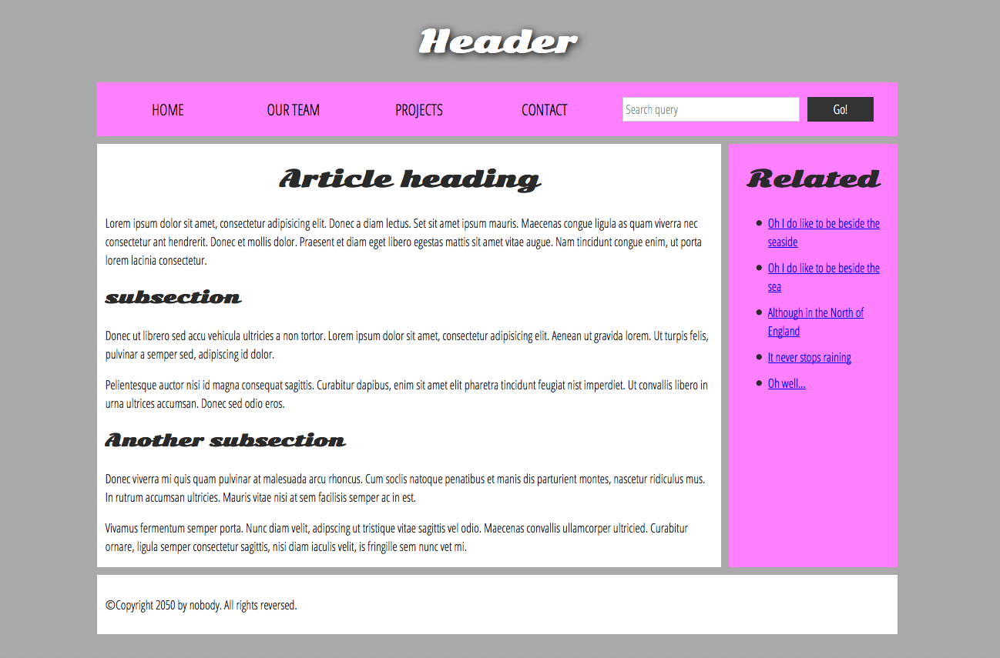

# Structuring documents

In addition to defining individual parts of your page (such as "a paragraph" or "an image"), [HTML](https://developer.mozilla.org/en-US/docs/Glossary/HTML) also boasts a number of block level elements used to define areas of your website (such as "the header", "the navigation menu", "the main content column"). This article looks into how to plan a basic website structure, and write the HTML to represent this structure.

## Basic sections of a document

Webpages can and will look pretty different from one another, but they all tend to share similar standard components, unless the page is displaying a fullscreen video or game, is part of some kind of art project, or is just badly structured:

* **header:** Usually a big strip across the top with a big heading, logo, and perhaps a tagline. This usually stays the same from one page of a website to another.
* **navigation bar**: Links to the site's main sections; usually represented by menu buttons, links, or tabs. Like the header, this content usually remains consistent from one webpage to another — having inconsistent navigation on your website will just lead to confused, frustrated users. Many web designers consider the navigation bar to be part of the header rather than an individual component, but that's not a requirement; in fact, some also argue that having the two separate is better for [accessibility](https://developer.mozilla.org/en-US/docs/Learn_web_development/Core/Accessibility), as screen readers can read the two features better if they are separate.
* **main content**: A big area in the center that contains most of the unique content of a given webpage, for example, the video you want to watch, or the main story you're reading, or the map you want to view, or the news headlines, etc. This is the one part of the website that definitely will vary from page to page!
* **sidebar**: Some peripheral info, links, quotes, ads, etc. Usually, this is contextual to what is contained in the main content (for example on a news article page, the sidebar might contain the author's bio, or links to related articles) but there are also cases where you'll find some recurring elements like a secondary navigation system.
* **footer**: A strip across the bottom of the page that generally contains fine print, copyright notices, or contact info. It's a place to put common information (like the header) but usually, that information is not critical or secondary to the website itself. The footer is also sometimes used for [SEO](https://developer.mozilla.org/en-US/docs/Glossary/SEO) purposes, by providing links for quick access to popular content.

A "typical website" could be structured something like this:

<figure><figcaption></figcaption></figure>


The image above illustrates the main sections of a document, which you can define with HTML. However, the _appearance_ of the page shown here — including the layout, colors, and fonts — is achieved by applying [CSS](https://developer.mozilla.org/en-US/docs/Learn_web_development/Core/Styling_basics) to the HTML.


## HTML for structuring content

The example shown above isn't pretty, but it is perfectly fine for illustrating a typical website layout example. Some websites have more columns, some are a lot more complex, but you get the idea. With the right CSS, you could use pretty much any elements to wrap around the different sections and get it looking how you wanted, but as discussed before, we need to respect semantics and **use the right element for the right job**.

This is because visuals don't tell the whole story. We use color and font size to draw sighted users' attention to the most useful parts of the content, like the navigation menu and related links, but what about visually impaired people for example, who might not find concepts like "pink" and "large font" very useful?

In your HTML code, you can mark up sections of content based on their _functionality_ — you can use elements that represent the sections of content described above unambiguously, and assistive technologies like screen readers can recognize those elements and help with tasks like "find the main navigation", or "find the main content." As we mentioned earlier in the course, there are a number of [consequences of not using the right element structure and semantics for the right job](https://developer.mozilla.org/en-US/docs/Learn_web_development/Core/Structuring_content/Headings_and_paragraphs#why_do_we_need_structure).

To implement such semantic mark up, HTML provides dedicated tags that you can use to represent such sections, for example:

* **header:** [`<header>`](https://developer.mozilla.org/en-US/docs/Web/HTML/Element/header).
* **navigation bar:** [`<nav>`](https://developer.mozilla.org/en-US/docs/Web/HTML/Element/nav).
* **main content:** [`<main>`](https://developer.mozilla.org/en-US/docs/Web/HTML/Element/main), with various content subsections represented by [`<article>`](https://developer.mozilla.org/en-US/docs/Web/HTML/Element/article), [`<section>`](https://developer.mozilla.org/en-US/docs/Web/HTML/Element/section), and [`<div>`](https://developer.mozilla.org/en-US/docs/Web/HTML/Element/div) elements.
* **sidebar:** [`<aside>`](https://developer.mozilla.org/en-US/docs/Web/HTML/Element/aside); often placed inside [`<main>`](https://developer.mozilla.org/en-US/docs/Web/HTML/Element/main).
* **footer:** [`<footer>`](https://developer.mozilla.org/en-US/docs/Web/HTML/Element/footer).

## HTML layout elements in more detail

It's good to understand the overall meaning of all the HTML sectioning elements in detail — this is something you'll work on gradually as you start to get more experience with web development. You can find a lot of detail by reading our [HTML element reference](https://developer.mozilla.org/en-US/docs/Web/HTML/Element).


The [HTML element reference](https://developer.mozilla.org/en-US/docs/Web/HTML/Element) here is an encyclopedia for different HTML elements and their usage. Pretty useful!


### Non-semantic wrappers

Sometimes you'll come across a situation where you can't find an ideal semantic element to group some items together or wrap some content. Sometimes you might want to just group a set of elements together to affect them all as a single entity with some [CSS](https://developer.mozilla.org/en-US/docs/Glossary/CSS) or [JavaScript](https://developer.mozilla.org/en-US/docs/Glossary/JavaScript). For cases like these, HTML provides the [`<div>`](https://developer.mozilla.org/en-US/docs/Web/HTML/Element/div) and [`<span>`](https://developer.mozilla.org/en-US/docs/Web/HTML/Element/span) elements. You should use these preferably with a suitable [`class`](https://developer.mozilla.org/en-US/docs/Web/HTML/Global_attributes/class) attribute, to provide some kind of label for them so they can be easily targeted.

[`<span>`](https://developer.mozilla.org/en-US/docs/Web/HTML/Element/span) is an inline non-semantic element, which you should only use if you can't think of a better semantic text element to wrap your content, or don't want to add any specific meaning. For example:


```html
<p>
  The King walked drunkenly back to his room at 01:00, the beer doing nothing to
  aid him as he staggered through the door.
  <span class="editor-note">
    [Editor's note: At this point in the play, the lights should be down low].
  </span>
</p>
```


In this case, the editor's note is supposed to merely provide extra direction for the director of the play; it is not supposed to have extra semantic meaning. For sighted users, CSS would perhaps be used to distance the note slightly from the main text.

[`<div>`](https://developer.mozilla.org/en-US/docs/Web/HTML/Element/div) is a block level non-semantic element, which you should only use if you can't think of a better semantic block element to use, or don't want to add any specific meaning. For example, imagine a shopping cart widget that you could choose to pull up at any point during your time on an e-commerce site:


```html
<div class="shopping-cart">
  <h2>Shopping cart</h2>
  <ul>
    <li>
      <p>
        <a href=""><strong>Silver earrings</strong></a>: $99.95.
      </p>
      
    </li>
    <li>…</li>
  </ul>
  <p>Total cost: $237.89</p>
</div>
```


This isn't really an `<aside>`, as it doesn't necessarily relate to the main content of the page (you want it viewable from anywhere). It doesn't even particularly warrant using a `<section>`, as it isn't part of the main content of the page. So a `<div>` is fine in this case. We've included a heading as a signpost to aid screen reader users in finding it.


Divs are so convenient to use that it's easy to use them too much. As they carry no semantic value, they just clutter your HTML code. Take care to use them only when there is no better semantic solution and try to reduce their usage to the minimum otherwise you'll have a hard time updating and maintaining your documents.


### Line breaks and horizontal rules

Two elements that you'll use occasionally and will want to know about are [`<br>`](https://developer.mozilla.org/en-US/docs/Web/HTML/Element/br) and [`<hr>`](https://developer.mozilla.org/en-US/docs/Web/HTML/Element/hr).

#### `<br>`: the line break element

`<br>` creates a line break in a paragraph; it is the only way to force a rigid structure in a situation where you want a series of fixed short lines, such as in a postal address or a poem. For example:


```html
<p>
  There once was a man named O'Dell<br />
  Who loved to write HTML<br />
  But his structure was bad, his semantics were sad<br />
  and his markup didn't read very well.
</p>
```


Without the `<br>` elements, the paragraph would just be rendered in one long line (as we said earlier in the course, [HTML ignores most whitespace](./#html-basic)); with `<br>` elements in the code, the markup renders like this:

#### `<hr>`: the thematic break element

`<hr>` elements create a horizontal rule in the document that denotes a thematic change in the text (such as a change in topic or scene). **Visually it just looks like a horizontal line**.
