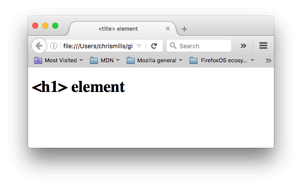
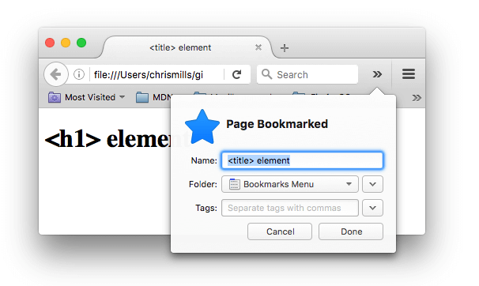
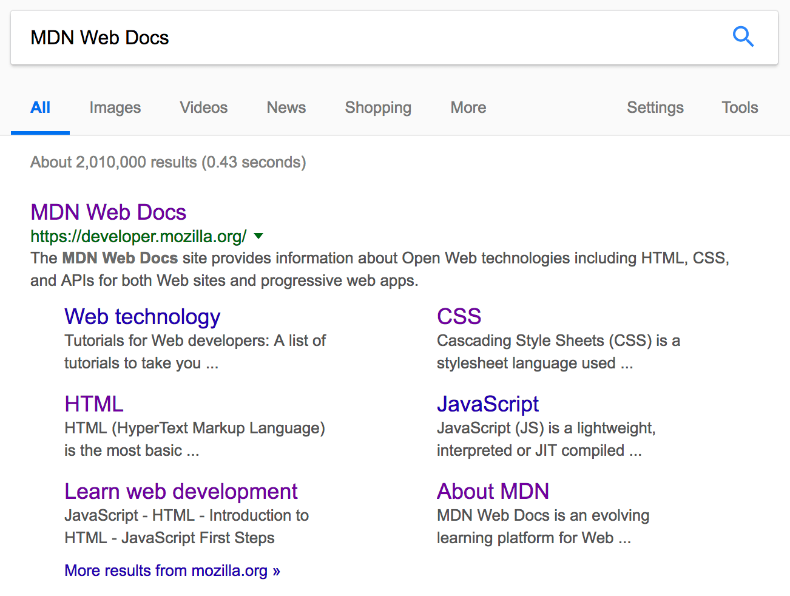

# What's in the head? Webpage metadata

The [head](https://developer.mozilla.org/en-US/docs/Glossary/Head) of an HTML document is the part that is not displayed in the web browser when the page is loaded. It contains metadata information such as the page [`<title>`](https://developer.mozilla.org/en-US/docs/Web/HTML/Element/title), links to [CSS](https://developer.mozilla.org/en-US/docs/Glossary/CSS) (if you choose to style your HTML content with CSS), links to custom favicons, and other metadata (data about the HTML, such as the author, and important keywords that describe the document).

Web browsers use information contained in the [head](https://developer.mozilla.org/en-US/docs/Glossary/Head) to render the HTML document correctly. In this article we'll cover all of the above and more, in order to give you a good basis for working with markup.

## What is the HTML head?

Let's revist the example we've discussed in [HTML Basic](./#html-basic).


```html
<!doctype html>
<html lang="en-US">
  <head>
    <meta charset="utf-8" />
    <title>My test page</title>
  </head>
  <body>
    <p>This is my page</p>
  </body>
</html>
```


The HTML head is the contents of the [`<head>`](https://developer.mozilla.org/en-US/docs/Web/HTML/Element/head) element. Unlike the contents of the [`<body>`](https://developer.mozilla.org/en-US/docs/Web/HTML/Element/body) element (which are displayed on the page when loaded in a browser), the head's content is **not displayed** on the page. Instead, the head's job is to contain [metadata](https://developer.mozilla.org/en-US/docs/Glossary/Metadata) about the document. In the above example, the head is quite small:


```html
<head>
  <meta charset="utf-8" />
  <title>My test page</title>
</head>
```


In larger pages however, the head can get quite large. Try going to some of your favorite websites and use the [developer tools](https://developer.mozilla.org/en-US/docs/Learn_web_development/Howto/Tools_and_setup/What_are_browser_developer_tools) to check out their head contents. Our aim here is not to show you how to use everything that can possibly be put in the head, but rather to teach you how to use the major elements that you'll want to include in the head, and give you some familiarity. Let's get started.

## Adding a title

We've already seen the [`<title>`](https://developer.mozilla.org/en-US/docs/Web/HTML/Element/title) element in action — this can be used to add a title to the document. This however can get confused with the [h1](https://developer.mozilla.org/en-US/docs/Web/HTML/Element/Heading_Elements) element, which is used to add a top level heading to your body content — this is also sometimes referred to as the page title. But they are different things!

* The [h1](https://developer.mozilla.org/en-US/docs/Web/HTML/Element/Heading_Elements) element appears on the page when loaded in the browser — generally this should be used once per page, to mark up the title of your page content (the story title, or news headline, or whatever is appropriate to your usage.)
* The [`<title>`](https://developer.mozilla.org/en-US/docs/Web/HTML/Element/title) element is metadata that represents the title of the overall HTML document (not the document's content.)

For example, if you try the following code.


```html
<!DOCTYPE html>
<html lang="en-US">
  <head>
    <meta charset="utf-8">
    <meta name="viewport" content="width=device-width">
    <title>&lt;title&gt; element</title>
  </head>
  <body>
    <h1>&lt;h1&gt; element</h1>
  </body>
</html>
```


You will get the following result if you open the `title-example.html` in your browser

<figure><figcaption><p>title-example</p></figcaption></figure>

It should now be completely obvious where the `<h1>` content appears and where the `<title>` content appears! Basically, `<title>` element sets the title that appears in the browser **tab** the page is loaded in, while the `<h1>` element sets the page title that will appear in the website page.

The `<title>` element contents are also used in other ways. For example, if you try bookmarking the page (_Bookmarks > Bookmark This Page_ or the star icon in the URL bar in Firefox), you will see the `<title>` contents filled in as the suggested bookmark name.

<figure><figcaption></figcaption></figure>

The `<title>` contents are also used in search results, as you'll see below.

## Metadata: the `<meta>` element

Metadata is data that describes data, and HTML has an "official" way of adding metadata to a document — the [`<meta>`](https://developer.mozilla.org/en-US/docs/Web/HTML/Element/meta) element. Of course, the other stuff we are talking about in this article could also be thought of as metadata too. There are a lot of different types of `<meta>` elements that can be included in your page's `<head>`, but we won't try to explain them all at this stage, as it would just get too confusing. Instead, we'll explain a few things that you might commonly see, just to give you an idea.

### Specifying your document's character encoding

In the example we saw above, this line was included:


```html
<meta charset="utf-8" />
```


**This element specifies the document's character encoding — the character set that the document is permitted to use**. `utf-8` is a universal character set that includes pretty much any character from any human language. This means that your web page will be able to handle displaying any language; it's therefore a good idea to set this on every web page you create!

### Adding an author and description

Many `<meta>` elements include `name` and `content` attributes:

* `name` specifies the type of meta element it is; what type of information it contains.
* `content` specifies the actual meta content.

Two such meta elements that are useful to include on your page define the author of the page, and provide a concise description of the page. Let's look at an example:


```html
<meta name="author" content="Chris Mills" />
<meta
  name="description"
  content="The MDN Web Docs Learning Area aims to provide
complete beginners to the Web with all they need to know to get
started with developing websites and applications." />
```


Specifying an author is beneficial in many ways: it is useful to be able to understand who wrote the page, if you have any questions about the content and you would like to contact them. Some content management systems have facilities to automatically extract page author information and make it available for such purposes.

Specifying a description that includes keywords relating to the content of your page is useful as it has the potential to make your page appear higher in relevant searches performed in search engines (such activities are termed [Search Engine Optimization](https://developer.mozilla.org/en-US/docs/Glossary/SEO), or [SEO](https://developer.mozilla.org/en-US/docs/Glossary/SEO).)

For example, in the MDN website, the `name` and `content` are as follows:


```html
<meta
  name="description"
  content="The MDN Web Docs site
  provides information about Open Web technologies
  including HTML, CSS, and APIs for both websites and
  progressive web apps." />
```


Now search for "MDN Web Docs" in your favorite search engine (We used Google.) You'll notice the description `<meta>` and `<title>` element content used in the search result — definitely worth having!

<figure><figcaption></figcaption></figure>


In Google, you will see some relevant subpages of MDN Web Docs listed below the main homepage link — these are called sitelinks, and are configurable in [Google's webmaster tools](https://search.google.com/search-console/about?hl=en) — a way to make your site's search results better in the Google search engine.



Many `<meta>` features just aren't used anymore. For example, the keyword `<meta>` element (`<meta name="keywords" content="fill, in, your, keywords, here">`) — which is supposed to provide keywords for search engines to determine the relevance of that page for different search terms — is **ignored** by search engines, because spammers were just filling the keyword list with hundreds of keywords, biasing results.


### Other types of metadata

#### The use of `og:`

As you travel around the web, you'll find other types of metadata, too. Many of the features you'll see on websites are proprietary creations designed to provide certain sites (such as social networking sites) with specific information they can use.

For example, [Open Graph Data](https://ogp.me/) is a metadata protocol that Facebook invented to provide richer metadata for websites. In the MDN Web Docs sourcecode, you'll find this:


```html
<meta
  property="og:image"
  content="https://developer.mozilla.org/mdn-social-share.png" />
<meta
  property="og:description"
  content="The Mozilla Developer Network (MDN) provides
information about Open Web technologies including HTML, CSS, and APIs for both websites
and HTML Apps." />
<meta property="og:title" content="Mozilla Developer Network" />
```


One effect of this is that when you link to MDN Web Docs on Facebook, the link appears along with an image and description: a richer experience for users.

<figure><figcaption></figcaption></figure>

## Adding CSS and JavaScript to HTML

Just about all websites you'll use in the modern day will employ [CSS](https://developer.mozilla.org/en-US/docs/Glossary/CSS) to make them look cool, and [JavaScript](https://developer.mozilla.org/en-US/docs/Glossary/JavaScript) to power interactive functionality, such as video players, maps, games, and more. These are most commonly applied to a web page using the [`<link>`](https://developer.mozilla.org/en-US/docs/Web/HTML/Element/link) element and the [`<script>`](https://developer.mozilla.org/en-US/docs/Web/HTML/Element/script) element, respectively.

* The [`<link>`](https://developer.mozilla.org/en-US/docs/Web/HTML/Element/link) element should always go inside the head of your document. This takes two attributes, `rel="stylesheet"`, which indicates that it is the document's stylesheet, and `href`, which contains the path to the stylesheet file:


```html
<link rel="stylesheet" href="my-css-file.css" />
```


* The [`<script>`](https://developer.mozilla.org/en-US/docs/Web/HTML/Element/script) element should also go into the head, and should include a `src` attribute containing the path to the JavaScript you want to load, and `defer`, which basically instructs the browser to load the JavaScript after the page has finished parsing the HTML. This is useful as it makes sure that the HTML is all loaded before the JavaScript runs, so that you don't get errors resulting from JavaScript trying to access an HTML element that doesn't exist on the page yet. There are actually a number of ways to handle loading JavaScript on your page, but this is the most reliable one to use for modern browsers (for others, read [Script loading strategies](https://developer.mozilla.org/en-US/docs/Learn_web_development/Core/Scripting/What_is_JavaScript#script_loading_strategies)).


```html
<script src="my-js-file.js" defer></script>
```



The `<script>` element may look like a [void element](https://developer.mozilla.org/en-US/docs/Glossary/Void_element), but it's not, and so needs a closing tag. Instead of pointing to an external script file, you can also choose to put your JavaScript code inside the `<script>` element.


## Setting the primary language of the document

Finally, it's worth mentioning that you can (and really should) set the language of your page. This can be done by adding the [lang attribute](https://developer.mozilla.org/en-US/docs/Web/HTML/Global_attributes/lang) to the opening HTML tag.


```html
<html lang="en-US">
  …
</html>
```


This is useful in many ways. Your HTML document will be indexed more effectively by search engines if its language is set (allowing it to appear correctly in language-specific results, for example), and it is useful to people with visual impairments using screen readers (for example, the word "six" exists in both French and English, but is pronounced differently.)

You can also set subsections of your document to be recognized as different languages. For example, we could set our Japanese language section to be recognized as Japanese, like so:


```html
<p>Japanese example: <span lang="ja">ご飯が熱い。</span>.</p>
```


These codes are defined by the [ISO 639-1](https://en.wikipedia.org/wiki/ISO_639-1) standard. You can find more about them in [Language tags in HTML and XML](https://www.w3.org/International/articles/language-tags/).
