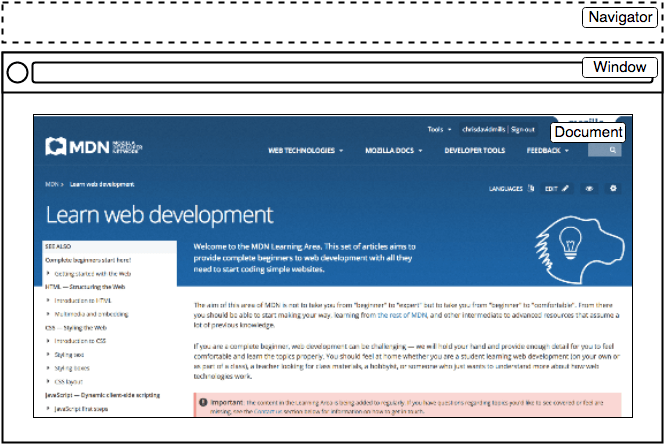
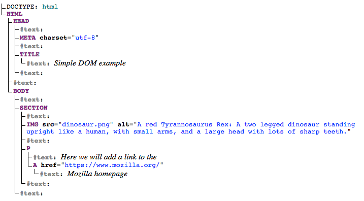

# DOM scripting

When writing web pages and apps, one of the most common things you'll want to do is change the document structure in some way. This is usually done by manipulating the Document Object Model (DOM) via a set of built-in browser APIs for controlling HTML and styling information.

## The important parts of a web browser

Web browsers are very complicated pieces of software with a lot of moving parts, many of which can't be controlled or manipulated by a web developer using JavaScript. You might think that such limitations are a bad thing, but browsers are locked down for good reasons, mostly centering around security. Imagine if a website could get access to your stored passwords or other sensitive information, and log into websites as if it were you?

Despite the limitations, Web APIs still give us access to a lot of functionality that enable us to do a great many things with web pages. There are a few really obvious bits you'll reference regularly in your code — consider the following diagram, which represents the main parts of a browser directly involved in viewing web pages:

<figure><figcaption></figcaption></figure>

* The window is the browser tab that a web page is loaded into; this is represented in JavaScript by the [`Window`](https://developer.mozilla.org/en-US/docs/Web/API/Window) object. Using methods available on this object you can do things like return the window's size (see [`Window.innerWidth`](https://developer.mozilla.org/en-US/docs/Web/API/Window/innerWidth) and [`Window.innerHeight`](https://developer.mozilla.org/en-US/docs/Web/API/Window/innerHeight)), manipulate the document loaded into that window, store data specific to that document on the client-side (for example using a local database or other storage mechanism), attach an [event handler](https://developer.mozilla.org/en-US/docs/Learn_web_development/Core/Scripting/Events) to the current window, and more.
* The navigator represents the state and identity of the browser (i.e. the user-agent) as it exists on the web. In JavaScript, this is represented by the [`Navigator`](https://developer.mozilla.org/en-US/docs/Web/API/Navigator) object. You can use this object to retrieve things like the user's preferred language, a media stream from the user's webcam, etc.
* The document (represented by the DOM in browsers) is the actual page loaded into the window, and is represented in JavaScript by the [`Document`](https://developer.mozilla.org/en-US/docs/Web/API/Document) object. You can use this object to return and manipulate information on the HTML and CSS that comprises the document, for example get a reference to an element in the DOM, change its text content, apply new styles to it, create new elements and add them to the current element as children, or even delete it altogether.

In this article we'll focus mostly on manipulating the document, but we'll show a few other useful bits besides.

## The document object model (DOM)

Let's provide a brief recap on the Document Object Model (DOM), which we also looked at earlier in the course about [CSS](../../css/#more-on-the-dom). The document currently loaded in each one of your browser tabs is represented by a DOM. This is a "tree structure" representation created by the browser that enables the HTML structure to be easily accessed by programming languages — for example the browser itself uses it to apply styling and other information to the correct elements as it renders a page, and developers like you can manipulate the DOM with JavaScript after the page has been rendered.

For example, using the HTML source code as follows:


```javascript
<!doctype html>
<html lang="en-US">
  <head>
    <meta charset="utf-8" />
    <title>Simple DOM example</title>
  </head>
  <body>
    <section>
      
      <p>
        Here we will add a link to the
        <a href="https://www.mozilla.org/">Mozilla homepage</a>
      </p>
    </section>
  </body>
</html>
```


The DOM on the other hand looks like this:

<figure><figcaption></figcaption></figure>


This DOM tree diagram was created using Ian Hickson's [Live DOM viewer](https://software.hixie.ch/utilities/js/live-dom-viewer/).


Each entry in the tree is called a **node**. You can see in the diagram above that some nodes represent elements (identified as `HTML`, `HEAD`, `META` and so on) and others represent text (identified as `#text`). There are [other types of nodes as well](https://developer.mozilla.org/en-US/docs/Web/API/Node/nodeType), but these are the main ones you'll encounter.

Nodes are also referred to by their position in the tree relative to other nodes:

* **Root node**: The top node in the tree, which in the case of HTML is always the `HTML` node (other markup vocabularies like SVG and custom XML will have different root elements).
* **Child node**: A node _directly_ inside another node. For example, `IMG` is a child of `SECTION` in the above example.
* **Descendant node**: A node _anywhere_ inside another node. For example, `IMG` is a child of `SECTION` in the above example, and it is also a descendant. `IMG` is not a child of `BODY`, as it is two levels below it in the tree, but it is a descendant of `BODY`.
* **Parent node**: A node which has another node inside it. For example, `BODY` is the parent node of `SECTION` in the above example.
* **Sibling nodes**: Nodes that sit on the same level under the same parent node in the DOM tree. For example, `IMG` and `P` are siblings in the above example.

It is useful to familiarize yourself with this terminology before working with the DOM, as a number of the code terms you'll come across make use of them. You'll also come across them in CSS (e.g. descendant selector, child selector).

<details>

<summary>So, why is DOM useful when we learn JavaScript?</summary>

Remember the[`Document.querySelector()`](https://developer.mozilla.org/en-US/docs/Web/API/Document/querySelector) we have used many times before? We need to know **what** to select and **how** to select it in our document using the knowledge of DOM.

Note that, as with many things in JavaScript, there are many ways to select an element and store a reference to it in a variable. [`Document.querySelector()`](https://developer.mozilla.org/en-US/docs/Web/API/Document/querySelector) is the **recommended modern approach**. It is convenient because it allows you to select elements using CSS selectors.

</details>

For more live examples, please proceed to [MDN's tutorials](https://developer.mozilla.org/en-US/docs/Learn_web_development/Core/Scripting/DOM_scripting#active_learning_basic_dom_manipulation)!
