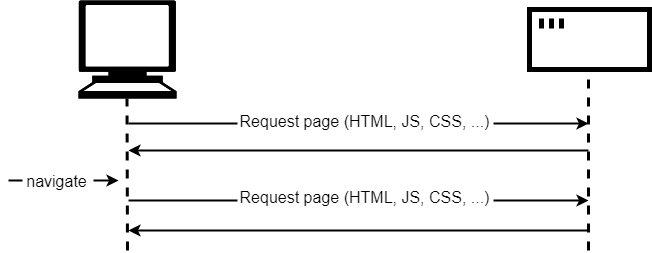
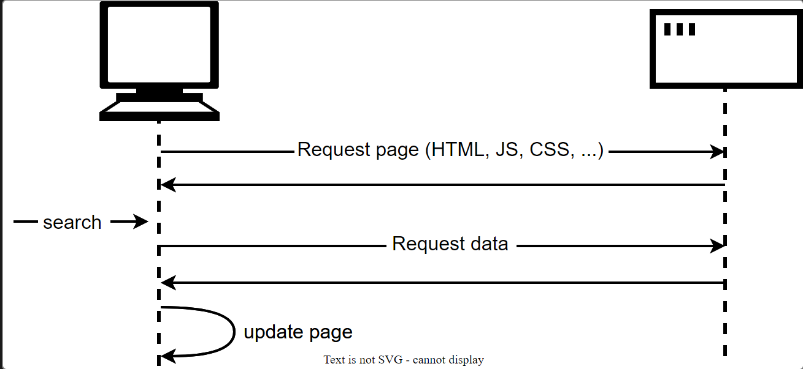

# Make network request

The problem

A web page consists of an HTML page and (usually) various other files, such as stylesheets, scripts, and images. The **basic model** of page loading on the Web is that your browser makes one or more HTTP requests to the server for the files needed to display the page, and the server responds with the requested files. If you visit another page, the browser requests the new files, and the server responds with them. (For more detailed introduction, please see [how-the-web-works.md](../../../web-basic/how-the-web-works.md "mention"))

<figure><figcaption>
Basci web page loading model
</figcaption></figure>

The trouble with the traditional model here is that _we'd have to fetch and load the entire page, even when we only need to update one part of it_. This is inefficient and can result in a poor user experience.

So instead of the traditional model, many websites use **JavaScript APIs** to request data from the server and update the page content without a page load. So when the user searches for a new product, the browser only requests the data which is needed to update the page — the set of new books to display, for instance.

<figure><figcaption>
JS web page loading model
</figcaption></figure>

The main API here is the [Fetch API](https://developer.mozilla.org/en-US/docs/Web/API/Fetch_API). This enables JavaScript running in a page to make an [HTTP](https://developer.mozilla.org/en-US/docs/Web/HTTP) request to a server to retrieve specific resources. When the server provides them, the JavaScript can use the data to update the page, typically by using [DOM manipulation APIs](https://developer.mozilla.org/en-US/docs/Learn_web_development/Core/Scripting/DOM_scripting). The data requested is often [JSON](https://developer.mozilla.org/en-US/docs/Learn_web_development/Core/Scripting/JSON), which is a good format for transferring structured data, but can also be HTML or just text.

To speed things up even further, some sites also store assets and data on the user's computer when they are first requested, meaning that on subsequent visits they use the local versions instead of downloading fresh copies every time the page is first loaded. The content is only reloaded from the server when it has been updated.

## The Fetch API

This part is mainly about doing [examples](https://developer.mozilla.org/en-US/docs/Learn_web_development/Core/Scripting/Network_requests#the_fetch_api).
