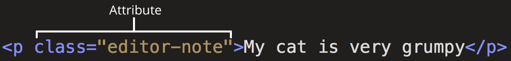
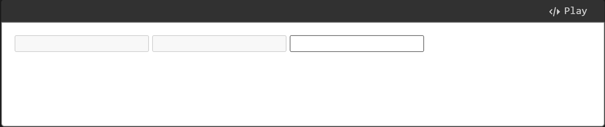

# HTML

HTML (**H**yper**T**ext **M**arkup **L**anguage) is the code that is used to structure a web page and its content. For example, content could be structured within a set of paragraphs, a list of bulleted points, or using images and data tables.

## HTML Basic

> This part is mainly from MDN [HTML Crash Course](https://developer.mozilla.org/en-US/docs/Learn_web_development/Getting_started/Your_first_website/Creating_the_content) and MDN's Core module about [Basic HTML syntax](https://developer.mozilla.org/en-US/docs/Learn_web_development/Core/Structuring_content/Basic_HTML_syntax). I found them pretty useful and suitable for beginners.

HTML is a _markup language_ that defines the structure of your content. HTML consists of a series of [**elements**](https://developer.mozilla.org/en-US/docs/Glossary/Element), which you use to enclose, or wrap, different parts of the content to make it appear a certain way, or act a certain way. The enclosing [tags](https://developer.mozilla.org/en-US/docs/Glossary/Tag) can make a word or image hyperlink to somewhere else, can italicize words, can make the font bigger or smaller, and so on. For example, take the following line of content:

```
My cat is very grumpy
```

If we wanted the line to stand by itself, we could specify that it is a paragraph by enclosing it in paragraph tags:

```html
<p>My cat is very grumpy</p>
```

### Element <a href="#anatomy_of_an_html_element" id="anatomy_of_an_html_element"></a>

Let's explore this paragraph element a bit further.

<figure><figcaption></figcaption></figure>

The main parts of our element are as follows:

1. **The opening tag:** This consists of the name of the element (in this case, `p`), wrapped in opening and closing **angle brackets**. This states where the element begins or starts to take effect — in this case where the paragraph begins.
2. **The closing tag:** This is the same as the opening tag, except that it includes a _forward slash_ before the element name. This states where the element ends — in this case where the paragraph ends. Failing to add a closing tag is one of the standard beginner errors and can lead to strange results.
3. **The content:** This is the content of the element, which in this case, is just text.
4. **The element:** The opening tag, the closing tag, and the content together comprise the element.


Note that here the element's name is `p`, which represents paragraph.&#x20;


#### Void elements

Some elements have no content and are called [**void elements**](https://developer.mozilla.org/en-US/docs/Glossary/Void_element). Take the [``](https://developer.mozilla.org/en-US/docs/Web/HTML/Element/img) element that we already have in our HTML page:


```javascript

```


This contains two attributes, but there is no closing `</img>` tag and no inner content. This is because an image element doesn't wrap content to affect it. Its purpose is to embed an image in the HTML page in the place it appears.

### Attributes

Elements can also have attributes. Attributes look like this:

<figure><figcaption></figcaption></figure>

Attributes contain extra information about the element that you don't want to appear in the actual content. Here, `class` is the attribute _name_ and `editor-note` is the attribute _value_. The `class` attribute allows you to give the element a non-unique identifier that can be used to target it (and any other elements with the same `class` value) with style information and other things. Some attributes have no value, such as [`required`](https://developer.mozilla.org/en-US/docs/Web/HTML/Attributes/required).

Attributes that set a value always have:

1. A space between it and the element name (or the previous attribute, if the element already has one or more attributes).
2. The attribute name followed by an equal sign.
3. The attribute value wrapped by opening and closing quotation marks.

#### Boolean attributes

Sometimes you will see attributes written without values. This is entirely acceptable. These are called [Boolean attributes](https://developer.mozilla.org/en-US/docs/Glossary/Boolean/HTML). When a boolean attribute is written without a value, or with any value, even like `"false"`, the boolean attribute is always set to **true**. Otherwise, if the attribute is not written in an HTML tag, the attribute is set to **false**. The spec requires the attribute's value to either be the empty string (including when the attribute has no value explicitly specified) or the same as the attribute's name, but other values work the same. For example, consider the [`disabled`](https://developer.mozilla.org/en-US/docs/Web/HTML/Element/input#disabled) attribute, which you can assign to form input elements. (You use this to _disable_ the form input elements so the user can't make entries. The disabled elements typically have a grayed-out appearance.) For example:


```html
<input type="text" disabled="disabled" />
```


As shorthand, it is acceptable to write this as follows:


```html
<!-- using the disabled attribute prevents the end user from entering text into the input box -->
<input type="text" disabled />

<!-- text input is allowed, as it doesn't contain the disabled attribute -->
<input type="text" />
```


For reference, the example above also includes a non-disabled form input element. The HTML from the example above produces this result:

<figure><figcaption></figcaption></figure>

#### Single or double quotes? <a href="#single_or_double_quotes" id="single_or_double_quotes"></a>

In this article, you will also notice that the attributes are wrapped in double quotes. However, you might see single quotes in some HTML code. This is a matter of style. You can feel free to choose which one you prefer. Both of these lines are equivalent:


```html
<a href='https://www.example.com'>A link to my example.</a>

<a href="https://www.example.com">A link to my example.</a>
```


### Document

Individual HTML elements aren't very useful on their own. Next, let's examine how individual elements combine to form an entire HTML page:


```html
<!doctype html>
<html lang="en-US">
  <head>
    <meta charset="utf-8" />
    <title>My test page</title>
  </head>
  <body>
    <p>This is my page</p>
  </body>
</html>
```


Here we have:

1.  `<!doctype html>`: The doctype. When HTML was young (1991-1992), doctypes were meant to act as links to a set of rules that the HTML page had to follow to be considered good HTML. Doctypes used to look something like this:

    <pre class="language-html" data-overflow="wrap"><code class="lang-html">&#x3C;!DOCTYPE html PUBLIC "-//W3C//DTD XHTML 1.0 Transitional//EN" "http://www.w3.org/TR/xhtml1/DTD/xhtml1-transitional.dtd">
    </code></pre>

    More recently, the doctype is a historical artifact that needs to be included for everything else to work right. `<!doctype html>` is the shortest string of characters that counts as a valid doctype. **That is all you need to know!**
2. `<html></html>`: The [`<html>`](https://developer.mozilla.org/en-US/docs/Web/HTML/Element/html) element. This element wraps all the content on the page. It is sometimes known as the root element.
3. `<head></head>`: The [`<head>`](https://developer.mozilla.org/en-US/docs/Web/HTML/Element/head) element. This element acts as a container for everything you want to include on the HTML page, **that isn't the content** the page will show to viewers. This includes keywords and a page description that would appear in search results, CSS to style content, character set declarations, and more. You will learn more about this in the next article of the series.
4. `<meta charset="utf-8">`: The [`<meta>`](https://developer.mozilla.org/en-US/docs/Web/HTML/Element/meta) element. This element represents metadata that cannot be represented by other HTML meta-related elements, like [`<base>`](https://developer.mozilla.org/en-US/docs/Web/HTML/Element/base), [`<link>`](https://developer.mozilla.org/en-US/docs/Web/HTML/Element/link), [`<script>`](https://developer.mozilla.org/en-US/docs/Web/HTML/Element/script), [`<style>`](https://developer.mozilla.org/en-US/docs/Web/HTML/Element/style) or [`<title>`](https://developer.mozilla.org/en-US/docs/Web/HTML/Element/title). The [`charset`](https://developer.mozilla.org/en-US/docs/Web/HTML/Element/meta#charset) attribute specifies the character encoding for your document as UTF-8, which includes most characters from the vast majority of human written languages. With this setting, the page can now handle any textual content it might contain. There is no reason not to set this, and it can help avoid some problems later.
5. `<title></title>`: The [`<title>`](https://developer.mozilla.org/en-US/docs/Web/HTML/Element/title) element. This sets the title of the page, which is the title that appears in the browser tab the page is loaded in. The page title is also used to describe the page when it is bookmarked.
6. `<body></body>`: The [`<body>`](https://developer.mozilla.org/en-US/docs/Web/HTML/Element/body) element. This contains _all_ the content that displays on the page, including text, images, videos, games, playable audio tracks, or whatever else.

#### Whitespace in HTML

These two code snippets are equivalent:


```html
<p id="noWhitespace">Dogs are silly.</p>

<p id="whitespace">Dogs
    are
        silly.</p>
```


No matter how much whitespace you use inside HTML element content (which can include one or more space characters, but also line breaks), the HTML parser reduces each sequence of whitespace to a single space when rendering the code. So why use so much whitespace? The answer is readability.

### Character references

In HTML, the characters `<`, `>`, `"`, `'`, and `&` are special characters. They are parts of the HTML syntax itself. So how do you include one of these special characters in your text? For example, if you want to use an ampersand or less-than sign, and not have it interpreted as code.

You do this with [character references](https://developer.mozilla.org/en-US/docs/Glossary/Character_reference). These are special codes that represent characters, to be used in these exact circumstances. Each character reference starts with an ampersand (&), and ends with a semicolon (;).

| Literal character | Character reference equivalent |
| ----------------- | ------------------------------ |
| <                 | `&lt;`                         |
| >                 | `&gt;`                         |
| "                 | `&quot;`                       |
| '                 | `&apos;`                       |
| &                 | `&amp;`                        |

The character reference equivalent could be easily remembered because the text it uses can be seen as less than for `&lt;`, quotation for `&quot;` and similarly for others. To find more about entity references, see [List of XML and HTML character entity references](https://en.wikipedia.org/wiki/List_of_XML_and_HTML_character_entity_references) (Wikipedia).

### HTML comments

HTML has a mechanism to write comments in the code. Browsers ignore comments, effectively making comments invisible to the user. The purpose of comments is to allow you to include notes in the code to explain your logic or coding. This is very useful if you return to a code base after being away for long enough that you don't completely remember it. Likewise, comments are invaluable as different people are making changes and updates.

To write an HTML comment, wrap it in the special markers `<!--` and `-->`. For example:


```html
<p>I'm not inside a comment</p>

<!-- <p>I am!</p> -->
```


## HTML Advanced

To quickly master HTML, you still need to know the following:

* **All HTML elements**: The basic founding stone of HTML. Fortunately, MDN has provided a quite detailed [HTML elements reference](https://developer.mozilla.org/en-US/docs/Web/HTML/Element).
* **Document page structure:**&#x20;
  * **Metadata:** [webpage-metadata.md](webpage-metadata.md "mention")
  * **Main content:** How to structure the main content in your website
    * [headings-and-paragraphs.md](headings-and-paragraphs.md "mention")
    * [emphasis-and-importance.md](emphasis-and-importance.md "mention")
    * [lists.md](lists.md "mention")
  * **Other areas of your page**: [Header, nagivation menu, ...](structuring-documents.md)

## Learning Resources

* [HTML Crash Course](https://developer.mozilla.org/en-US/docs/Learn_web_development/Getting_started/Your_first_website/Creating_the_content) by MDN
* [Basic HTML syntax](https://developer.mozilla.org/en-US/docs/Learn_web_development/Core/Structuring_content/Basic_HTML_syntax) by MDN
