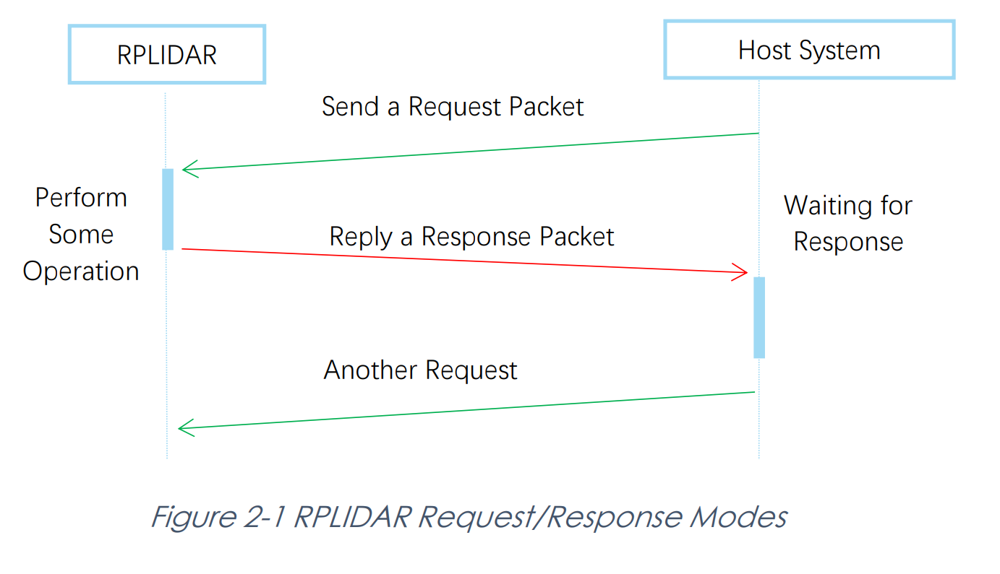
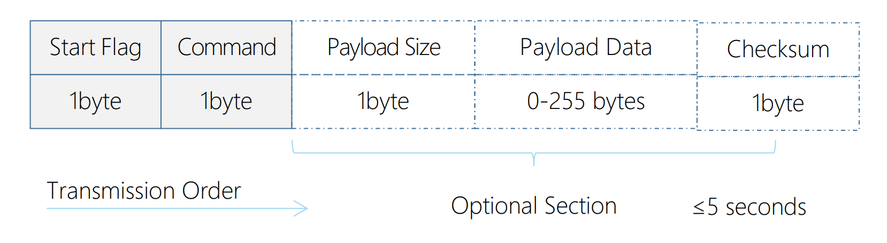
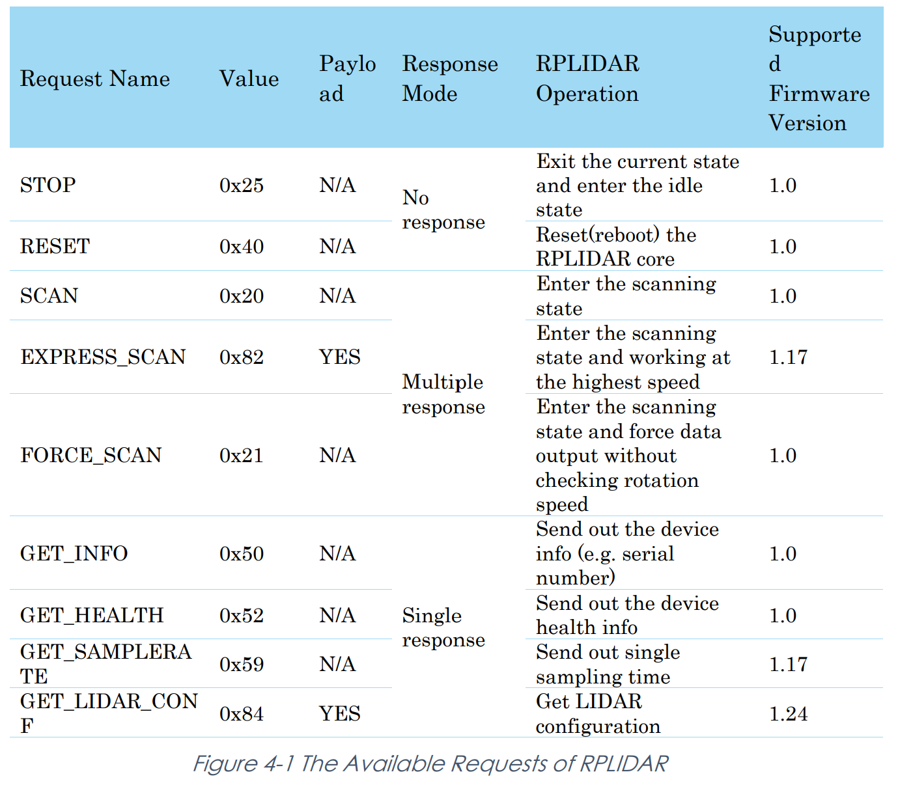
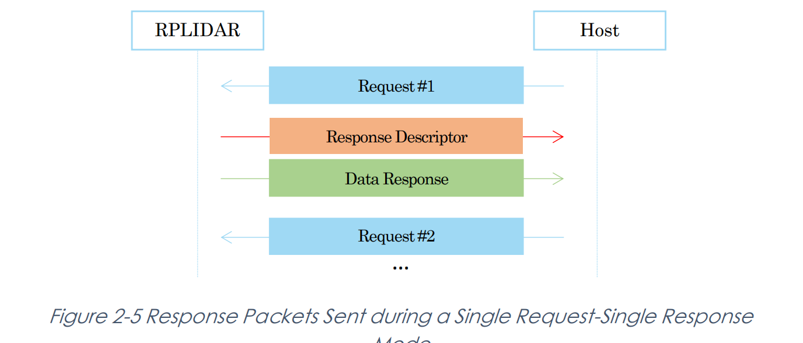
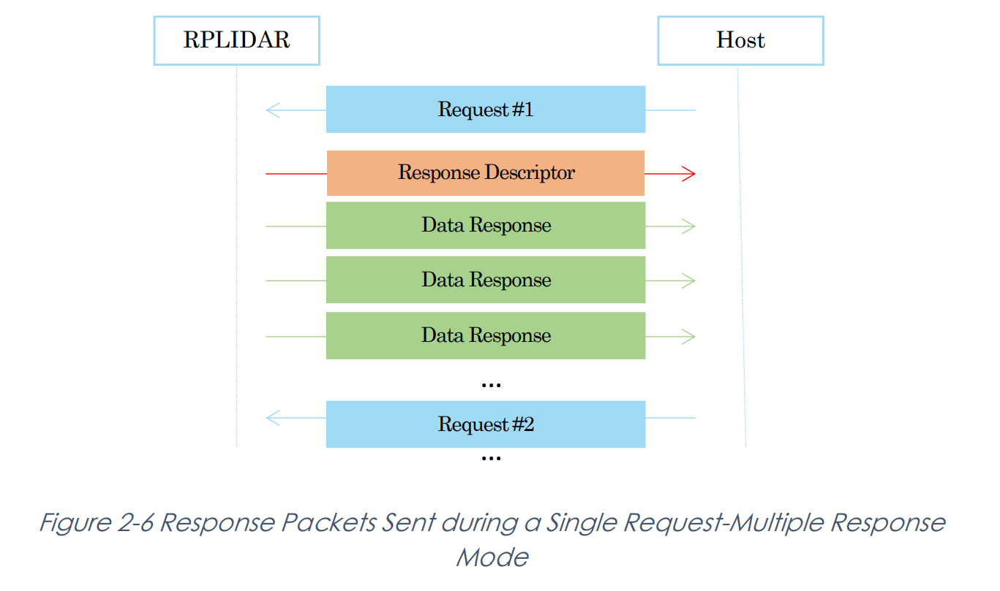
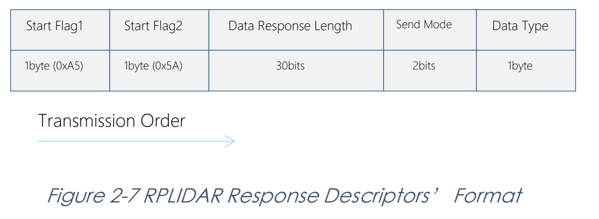
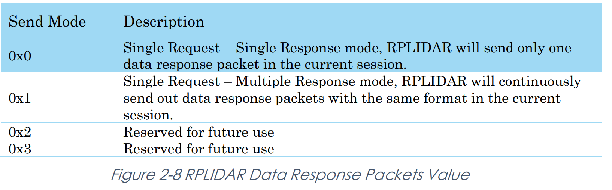

# Studio 10 - LiDAR Programming

## LiDAR Basics

### Working Principle

LIDAR sensors use light to measure the distance between the sensor and an object or surface. More specifically, the LiDAR sensors measure distance by emitting a laser beam and measuring the time it takes for the beam to reflect off an object and return to the sensor.

### LiDAR Protocol

In CG2111A Project, LiDAR communicates with the RPi using **Serial** over **USB**. The sensor's operation, such as its sampling rate, rotation speed, and scan initiation, is controlled by sending commands as **bytes** defined in its datasheet and **protocol** documentation. To simplify this process, a **Python Library** is provided!


[**Protocols**](studio-13-communication-protocol.md#protocols-the-rules-of-engagement) define how devices communicate, and **libraries** can abstract these details to simplify sensor interaction.


### Process LiDAR Output

2D LiDARs provide **angle** and **distance** measurements of the environment around the sensor. (This is known as the **polar coordinates**). To extract useful information from this data, you may need to convert them from **polar coordinates** to **cartesian coordinates**.

## More on LiDAR Protocol

* The RPLIDAR uses a non-textual binary data packet based protocol to communicate with host systems (e.g., RPi, PC)
* All the packets transmitted on the interface channel share [**uniform**](#user-content-fn-1)[^1] packet formats.


A communication session is **always** initialized by a **host system**, e.g., a MCU, a PC, a RPi etc. RPILIDAR **won't send any data out** automatically after powering up.


***

* If a data packet is sent from host systems to RPLIDARs, such a packet is called a **Request**.
* Once an RPILIDAR receives a request, it will reply the host system with a data packet called a **Response**.

<figure><figcaption></figcaption></figure>

Based on the related **request types**, there are **three** different request/response modes:

1. Single Request-Single Response
2. Single Request-Multiple Response
3. Single Request-No Response

### Request Packets' Format

All request packets sent by a host system share the following common format. Little endian byte order is used.

<figure><figcaption></figcaption></figure>

A fixed `0xA5` byte is used for each request packet, RPLIDAR uses this byte as the
&#x20;identification of a new request packet. An 8-bit (1 byte) command field must follow
&#x20;the start flag byte.

#### Request Overview

All the available requests are listed in the below table. The value should be in `Command`.

<figure><figcaption></figcaption></figure>

### Response Packets' Format

All the response packets are divided into two classes: **response descriptors** and
&#x20;**data responses**. If the current request received by RPiLiDAR requires a response,
&#x20;RPiLiDAR will always send a **response descriptor packet first** and then send **one or
&#x20;more data response packets** based on the type of requests.&#x20;


Only **one response
&#x20;descriptor packet** will be sent out during a request/response session.&#x20;




<figure><figcaption></figcaption></figure>



<figure><figcaption></figcaption></figure>




The response
&#x20;descriptors carry the information of the incoming data responses. All the response
&#x20;descriptors share a same format. Its format is shown as follows

<figure><figcaption></figcaption></figure>

1. A response descriptor uses fixed two bytes’ pattern `0xA5 0x5A` for the host system
   &#x20;to identify the start of a response descriptor.
2. The response descriptor is **different** from the data response, and it doesn't tell any information about the RPiLiDAR's error code and status, only the data reponse contains this information!
3. The 2 bits for Send Mode will determine whether its **single response mode** or **multiple response mode**.

<figure><figcaption></figcaption></figure>

[^1]: "uniform" means the general structure of packets is standardized (e.g., header, payload, checksum). But within this structure, **request and response packets have different formats based on their role**.
