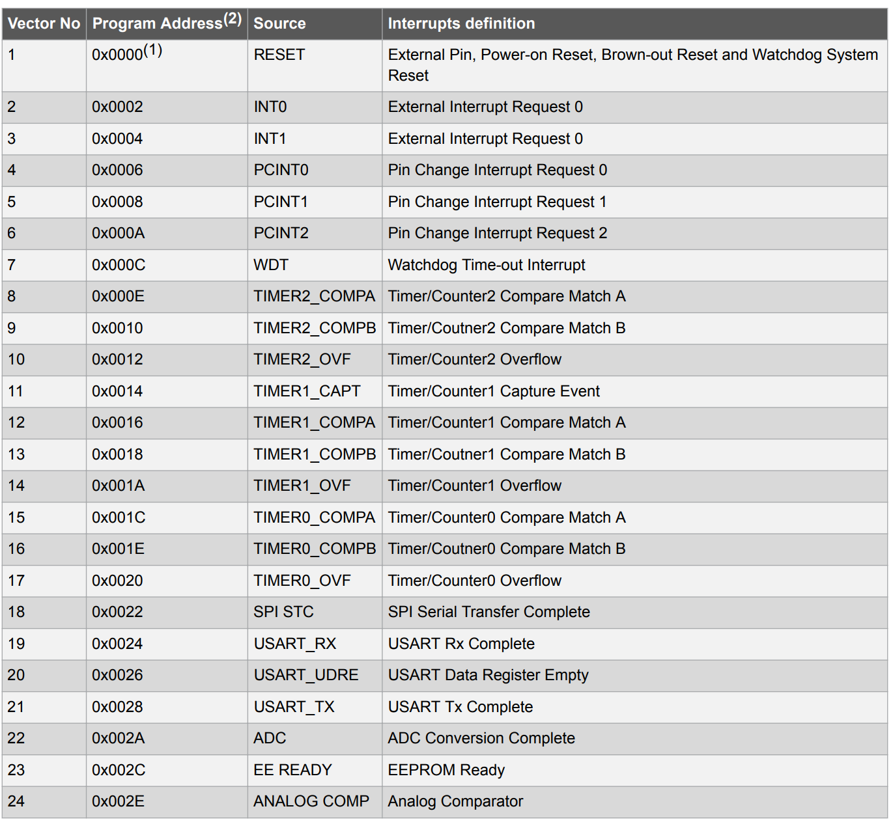
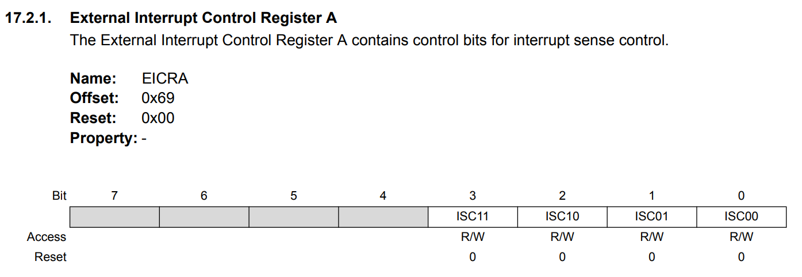
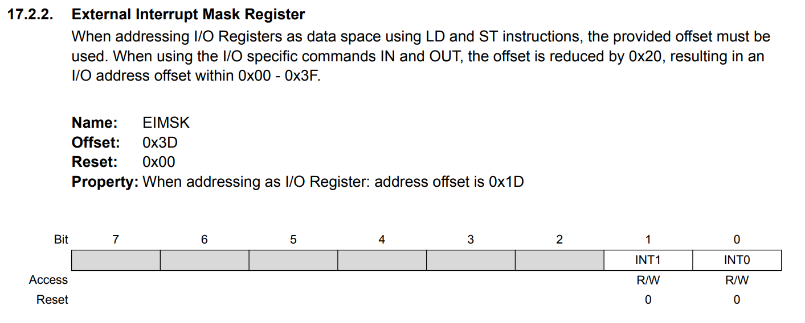

# Studio 2 - Interrupts

## Interrupts

**Motivation:** Using **interrupts** in Arduino (or any microcontroller) is a powerful technique that allows the system to respond immediately to external or internal events **without constantly checking for them in the main loop**.

### I/O Device

"**I/O**" stands for "**Input/Output**". The ATmega328 (used in Arduino Uno) has various I/O devices that interact with the CPU through interrupts for efficient processing, like:

* **Digital I/O (GPIO)** (External Interrupts, Pin Change Interrupts)
* **Analog-to-Digital Converter (ADC)**
* **Timers (Timer/Counter 0, 1, 2)**
* **USART (Serial Communication)**
* **SPI (Serial Peripheral Interface)**
* **I²C (Inter-Integrated Circuit, TWI - Two-Wire Interface)**


**Interrupts** make I/O handling more efficient, responsive, and accurate! That's why I/O is closely related to interrupts.


### **Three modes of accessing I/O**

The three modes are:

1. Polling
2. Interrupts
3. Direct Memory Access (DMA, not needed for CG2111A)

#### **Why is called "Accessing I/O"**

They are called **modes of accessing I/O** because they define **how the CPU interacts with I/O devices** to transfer data or handle events. The term "accessing I/O" refers to how the CPU **monitors, receives, or sends data** to peripherals like sensors, buttons, serial ports, etc.

#### What is being accessed?

* **I/O Device Registers** → Status, control, and data registers of peripherals.
* **Memory** → Data buffers (especially for DMA).

#### How they access I/O?

* **Polling** → The CPU actively reads I/O registers.
* **Interrupts** → The I/O device signals the CPU when it's ready.
* **DMA** → The I/O device directly moves data to/from memory without CPU intervention.

***

Now, let's look at the how the first **two** modes work in detail!

#### Polling

**Polling** is a method where the **CPU repeatedly checks the status** of an I/O device in a loop to see if an event has occurred.



**How Polling Works in General**

* The CPU **reads a status register** of an I/O device.
* If the device is **not ready**, the CPU keeps checking (looping).
* Once the device is ready, the CPU **processes the event** (e.g., reading sensor data).
* The cycle repeats indefinitely.



**Example on Atmega328p**


```cpp
#define REDPIN    11
#define GREENPIN  12
#define SWITCHPIN 2

#define LED_DELAY   100

// This variable decides which LED's turn it is to flash.
// 0 = green, 1 = red
static volatile int turn=0;

void setup() {
  // put your setup code here, to run once:

  pinMode(REDPIN, OUTPUT);
  pinMode(GREENPIN, OUTPUT);
  pinMode(SWITCHPIN, INPUT);
}

void flashGreen()
{
  int counter=1;

  while(turn==0)
  {
    for(int i=0; i<counter; i++)
    {
      digitalWrite(GREENPIN, HIGH);
      delay(LED_DELAY);
      digitalWrite(GREENPIN, LOW);
      delay(LED_DELAY);
    }

    counter++;
    check_pressed();
    delay(1000);
  }
}

void flashRed()
{
  int counter=1;

  while(turn==1)
  {
    for(int i=0; i<counter; i++)
    {
      digitalWrite(REDPIN, HIGH);
      delay(LED_DELAY);
      digitalWrite(REDPIN, LOW);
      delay(LED_DELAY);
    }

    counter++;
    check_pressed();
    delay(1000);
  }
}

void loop() {
  // put your main code here, to run repeatedly:

  if(turn == 0)
    flashGreen();

  if(turn == 1)
    flashRed();
}

void check_pressed() {
  if (digitalRead(SWITCHPIN)) {
    turn = 1 - turn;
  }
}

```


The above is a classic polling code, and basically the reason for its being polling is as follows,


```cpp
void check_pressed() {
  if (digitalRead(SWITCHPIN)) {
    turn = 1 - turn;
  }
}
```


* The function **`check_pressed()`** is called **inside loops** in `flashGreen()` and `flashRed()`.
* The CPU **continuously checks** `digitalRead(SWITCHPIN)` to detect a button press.
* The code does **not react immediately** to the button press—it only checks at certain times.
* This is a classic polling behavior where the CPU **wastes time checking** instead of doing useful work.



**Issues / Disadvantages of Polling**

From the example above, we can summarize the disadvantages of using polling as follows,

* **Inefficient CPU Usage**
  * The CPU **keeps checking** for button presses, even when nothing happens.
  * It **cannot perform other tasks** efficiently while waiting.
* **Delayed Response**
  * The CPU **only checks** the button at specific points (after LED flashes & delays).
  * If the button is pressed **between checks**, it might be missed or take time to respond.
* **Unnecessary Power Consumption**
  * The CPU stays **active even when idle**, consuming power.
  * This is a problem for **battery-powered devices**.
* **Not Scalable**
  * If multiple I/O devices (e.g., sensors, serial input) need monitoring, polling becomes **slow and inefficient**.



#### Interrupts

An **interrupt** is a mechanism that allows an I/O device to signal the CPU **asynchronously** when an event occurs, stopping the CPU’s current task and executing a special function (Interrupt Service Routine, ISR).



**How Interrupts Work**

* The CPU is executing its normal instructions.
* An external event (e.g., button press, timer overflow) **triggers an interrupt signal**.
* The CPU **pauses its current execution** and jumps to the **ISR (Interrupt Service Routine)**.
* The ISR executes to handle the event (e.g., toggling an LED state).
* Once ISR completes, the CPU **resumes** its original task.



**Example on Atmega328p**


```cpp
#define buttonPin 2
#define LEDPIN 12

static volatile int onOff = 0;

void switchISR() {
  onOff = 1 - onOff;
}

void setup() {
  attachInterrupt(digitalPinToInterrupt(buttonPin), switchISR, RISING);
  pinMode(LEDPIN, OUTPUT);
}

void loop() {
  if (onOff == 0)
    digitalWrite(LEDPIN, LOW);
  else
    digitalWrite(LEDPIN, HIGH);
}
```


In the code above,&#x20;

* Instead of continuously checking the button state in `loop()`, the code **uses an interrupt** to detect the button press immediately.
* `attachInterrupt(digitalPinToInterrupt(buttonPin), switchISR, RISING);` registers an **interrupt on the rising edge** of the button signal.
* When the button is pressed, the CPU **automatically** runs `switchISR()` to toggle the `onOff` variable.
* This makes the LED **respond instantly** without needing a `digitalRead()` inside `loop()`.



**Rising Edge vs. Falling Edge**

A digital signal is either **LOW (0V)** or **HIGH (e.g., 5V on Arduino Uno)**. The moment it **switches** from one state to another is called an **edge**.

**Rising Edge:**

* **Definition:** The signal changes from **LOW (0V) → HIGH (5V)**.
* **Use Case:** Detect when a button is **pressed** (if using **pull-down resistor**).
*   **Example:**

    <pre class="language-vbnet"><code class="lang-vbnet"><strong>RISING:  _|-‾‾‾‾  (Detects when signal goes HIGH)
    </strong></code></pre>

**Falling Edge:**

* **Definition:** The signal changes from **HIGH (5V) → LOW (0V)**.
* **Use Case:** Detect when a button is **released** (if using **pull-up resistor**).
*   **Example:**

    ```vbnet
    FALLING: ‾‾‾‾|_  (Detects when signal goes LOW)
    ```
* **Why Use RISING in the Code?**
  * The button press is detected **when the voltage jumps from LOW to HIGH**, triggering the ISR.



**Advantages of Using Interrupts (Compared to Polling)**

* **Instant Response**
  * The CPU **immediately detects** button presses without waiting.
  * Unlike polling, which might **miss** a quick press between checks, interrupts **never miss an event**.
* **CPU Efficiency**
  * The CPU **can perform other tasks** instead of constantly checking the button state.
  * Saves processing power, making the system **faster and more efficient**.
* **Power Saving**
  * Microcontrollers can enter **low-power sleep modes** and wake up only on interrupts.
  * Ideal for battery-powered applications.
* **Scalability**
  * Works well even with **multiple** input devices.
  * Polling multiple I/O devices would be inefficient, but interrupts allow handling multiple events **without wasting CPU cycles**.



## Bare Metal Programming

### Vector Table

In the ATmega328p, when an interrupt occurs,&#x20;

1. the microcontroller uses the **vector table** to find the address of the corresponding **Interrupt Service Routine (ISR)**.
2. The CPU then **jumps** to the ISR address, executes it, and returns to the main program after completion.

The vector table is located at the beginning of flash memory and stores addresses for each interrupt source.

<figure><figcaption><p>Reset and Interrupt Vectors in ATmega328/P (P82)</p></figcaption></figure>

### External Interrupts for Digital I/O

* **INT0** and **INT1** are **external interrupt pins** (pins D2 and D3 on the ATmega328p).
* They are typically used for **detecting changes** in external signals, such as **button presses** or **sensor readings**.
* **INT0** and **INT1** can be triggered on specific **edge transitions** (rising or falling) or **low level** signals.



**Configuring EICRA for INT0 and INT1**

**EICRA** (External Interrupt Control Register A) is used to configure how the external interrupts are triggered.

<figure><figcaption><p>EICRA (P89)</p></figcaption></figure>

The configuration for **INT0** and **INT1** is done by setting specific bits in **EICRA**.

* `ISC01` and `ISC00`: Control the trigger condition for **INT0** (bits for rising/falling edge).
* `ISC11` and `ISC10`: Control the trigger condition for **INT1** (bits for rising/falling edge).

This is the table summarizing the `ISCx[1:0]` bits' behavior. (`x` means either 0 or 1)

| Value | Description                                                    |
| ----- | -------------------------------------------------------------- |
| 00    | The low level of INT1/INT0 generates an interrupt request      |
| 01    | Any logical change on INT1/INT0 generates an interrupt request |
| 10    | The falling edge of INT1/INT0 generates an interrupt request.  |
| 11    | The rising edge of INT1/INT0 generates an interrupt request.   |

**Example:**

* **INT0 triggers on rising edge**: `EICRA |= (1 << ISC01) | (1 << ISC00);`
* **INT1 triggers on falling edge**: `EICRA |= (1 << ISC11);`



**Enabling INT0 and INT1 with EIMSK**

**EIMSK** (External Interrupt Mask Register) enables or disables external interrupts for INT0 and INT1.

<figure><figcaption><p>EIMSK (P90)</p></figcaption></figure>

**Example:**

* To **enable** INT0, set `EIMSK |= (1 << INT0);`
* To **enable** INT1, set `EIMSK |= (1 << INT1);`



**Interrupt Mask:** `cli()` **and** `sei()`

* **cli()** (Clear Interrupts):
  * Disables global interrupts.
  * It clears the **I-bit** in the status register, stopping the processor from accepting interrupts.
* **sei()** (Set Interrupts):
  * Enables global interrupts.
  * It sets the **I-bit** in the status register, allowing interrupts to be processed by the CPU.

These functions are used to globally enable or disable interrupts in the system.

**Example:**


```cpp
void setup() {
  // Disable interrupts globally
  cli();

  // Set up your system, configure peripherals, etc.
  // This part runs before enabling interrupts.

  // Enable global interrupts
  sei();
}
```




### `volatile` keyword

TLDR;

> Always declare GLOBAL variables that are changed by ISRs to be `volatile`

#### Why use `volatile`?

* When an ISR changes a global variable, the value of the variable can be updated at any time, and the main program or other code **might not** expect it.
* Without `volatile`, the compiler may optimize accesses to the variable by assuming its value doesn't change unexpectedly, potentially causing incorrect behavior.


Why "optimize" here? Because `ld` instruction consumes lots of CPU cycles. (2 iirc in ARM assembly)


#### Explanation with Assembly


```asmatmel
; Example of a volatile variable, say 'counter'
; Assume 'counter' is a global variable modified by ISR

; ISR increments counter
ISR(INT0_vect):
    inc counter        ; increment counter in ISR
    reti               ; return from interrupt

; Main loop accesses counter
main_loop:
    lds r16, counter   ; load counter value into register
    ; other code...
    rjmp main_loop     ; repeat loop

```


In this example, if `counter` is not declared `volatile`, the compiler might optimize the read (`lds r16, counter`), assuming that the variable doesn't change outside the main program's control. This could lead to reading **stale** data and incorrect behavior.


Basically, just think of moving Line 11 outside the main loop.


By declaring `counter` as `volatile`, the compiler ensures that each read/write operation accesses the memory location directly, preserving the value updated by the ISR.


Basically, just think of moving Line 11 back into the main loop so that during each iteration, it will load the counter variable.

