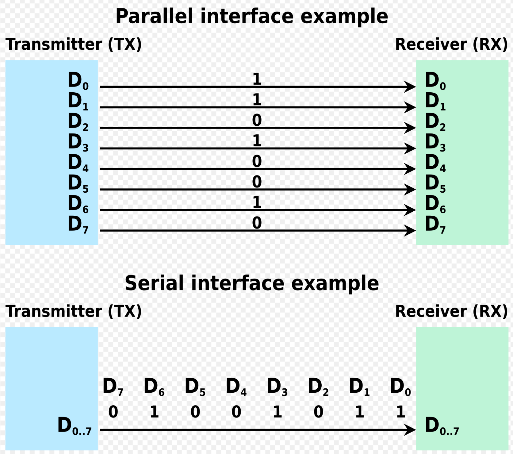
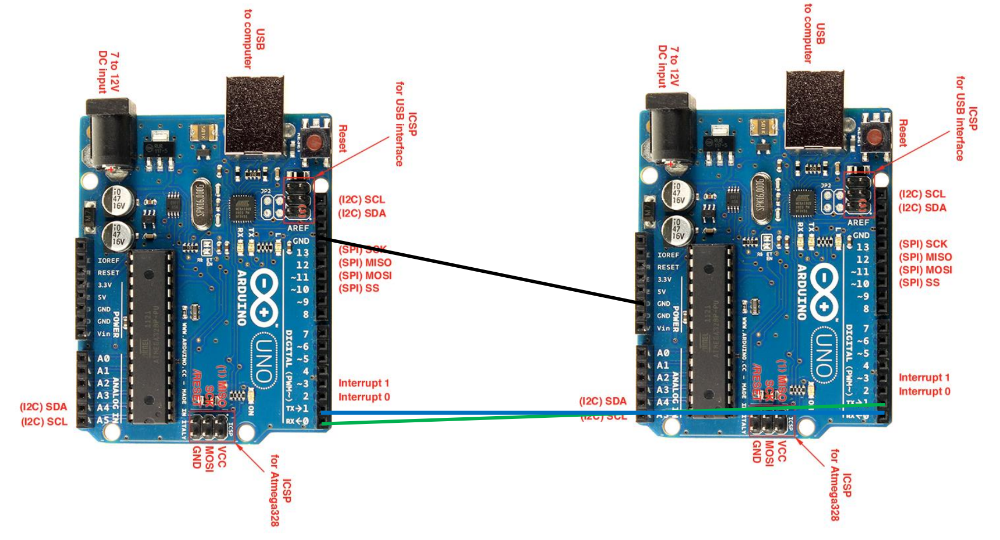
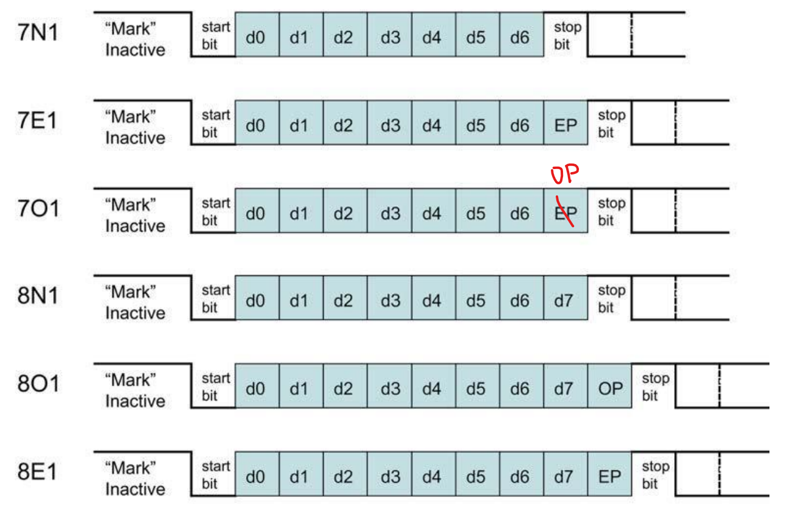

# Studio 9 - Serial Communication

Before we move on to this studio, let's have a brief recap. So far, we have used the ATmega328p (AVR) largely in "stand-alone" mode:

* We've used GPIO to read/write binary devices like switches, and LEDs in simple fully on/fully off mode.
* We've used PWM to write to analog devices, like controlling the brightness of an LED.
* We've used timers to coordinate activities within the AVR chip.
* We've used ADC Module to convert analog voltage signal to discrete digital signal that can be processed by AVR.

In the next couple of studio (including this one), we will look at coordinating between the AVR and smarter devices:

* Other AVRs or MCUs
* Smart devices like GPS modules, LIDARs, compasses, etc

***

In this studio, we will introduce the **serial communication.**

> **Serial communication** is the process of sending data **one bit at a time**, **sequentially**, over **a communication channel or computer bus**. This is in contrast to **parallel communication**, where **several bits are sent as a whole**, on **a link with several parallel channels**.

<figure><figcaption><p>Serial communication vs. Parallel Communication</p></figcaption></figure>

In **serial communication**, we will mainly focus on the **U(S)ART Communication** in this studio.

## U(S)ART Communication

**USART** stands for **U**niversal **S**ynchronous **A**synchronous **R**eceiver **T**ransceiver. The ATmega328p supports USRAT Communcation. And as its name suggests, USART communication can be operated in two modes:



**Asynchronous mode**

This means that data is transmitted **independently** of any **clocking signal**. And the receiver can derive a clocking signal from the received data.


The reason that the receiver can derive the clocking signal is that **both the transmitter and receiver** agree on **the same bit rate** to transmit the data. Thus, the interval between two bits are known, and the clock signal can be derived by the receiver from the transmitter.




**Synchronous mode**

This means that data transmit and received are **coordinated by a seperate clock**.



For EPP2, we will only use USART in the **Asynchronous Mode**, which basically uses the USART port as UART port.

***

Next, we will introduce the **USART Transmission Specification** from three aspects, using the ISO [OSI Model](https://en.wikipedia.org/wiki/OSI_model)

* Physical Layer
* Data Link Layer
* Application Layer (Not included in this studio)

### Physical Layer



**Wiring Level**

* Receive (`RX`): Incoming data bits come here.
* Transmit (`TX`): Outgoing data bits go out from here.
* Ground (`GND`): Return path for `RX` and `TX`. Both receiver and transmitter must **share a common ground**. (A demo is shown below)

<figure><figcaption></figcaption></figure>



**Voltage level**

* 5V for standard device (e.g. Arduino UNO)
* 3.3V for low-power devices (e.g. Raspberry Pi)

For EPP2, we will cheat:&#x20;

* We will connect the UNO to the USB of the Raspberry Pi.
* USB works at 5V. Conversion to 3.3V is handled by the Pi itself.



### Data Link Layer

To set up a USART session between two computers (Arduino UNO or otherwise), BOTH sides must agree on:

1. Numebr of data bits - 5, 6, 7, 8 or 9. Standard is 8.
2. Type of parity bits: None(N), Even(E), or Odd(O)
3. Number of stop btis: 1 or 2.
4. [Bit rate](#user-content-fn-1)[^1]: 1200, 2400, 4800, 9600, etc.&#x20;

#### Parity Bit

The extra one **parity bit** is used to error checking.

* Odd: the extra parity bit is set to 1 to make the **total number of 1 bits odd**.
* Even: the extra bit is set to 1 to make the **total number of 1 bits even**.

The receiver will count the number of 1 bits to ensure that is is odd or even as previously agreed.


The UART parity bit is set up when the **transmitting device is preparing to send data**. It is **not set in the receiver**. The receiver just receives the data the transmitter sends and **uses** the parity bit to check whether an error occurs.


Here is an demo of a "frame[^2]" of the data transmission using UART.

<figure><figcaption></figcaption></figure>

From the demo, we have the following **key takeaways:**

* start bit is 0 or LOW and is transmitted **at the beginning of each UART frame**, it is used to signal the **start** of the data transmission.
* stop bit is 1 or HIGH and is **at the end of each UART frame,** it is used to signal the **end** of data transmission.
* the parity bit is always **before the stop bit** in the "frame"


In U(S)ART, **what you send is what you get**. e.g. You send the **start bit first**, then the **first bit** received by the receiver will be the **start bit**.


## Bare Metal Programming

### The Programming Procedure



**USART Initialization**

The USART has to be initialized before any communication can take place. The initialization process normally consists of:

1. setting the baud rate
2. setting frame format, and
3. enabling the Transmitter or Receiver depending on the usage.


For **interrupt driven** USART operation, the Global Interrupt Flag should be **cleared** (and interrupts globally disabled) when doing the initialization. (This is done by using `cli()` in your setup code)


The following example code assumes asynchronous operation using polling (no interrupts enabled) and a fixed frame format.


```cpp
#define FOSC 16000000 // Clock Speed
#define BAUD 9600
#define MYUBRR FOSC/16/BAUD-1
void main( void )
{
 ...
 USART_Init(MYUBRR)
 ...
}
void USART_Init( unsigned int ubrr)
{
 /*Set baud rate */
 UBRR0H = (unsigned char) (ubrr >> 8);
 UBRR0L = (unsigned char) ubrr;
 /* Enable receiver and transmitter */
 UCSR0B = (1 << RXEN0)|(1 << TXEN0);
 /* Set frame format: 8data, 2stop bit */
 UCSR0C = (1 << USBS0)|(3 << UCSZ00);
}
```




**Data Transmission — The USART Transmitter**

The USART Transmitter is enabled by **setting the Transmit Enable** (`TXEN`) bit in the `UCSRnB` Register. When the Transmitter is enabled, the normal port operation of the TxDn pin is **overridden** by the USART and **given the function as the Transmitter’s serial output**. The **baud rate**, **mode of operation** and **frame format** must be set up once **before doing any transmissions**.

A data transmission is initiated by **loading the transmit buffer** `UDR0` **with the data to be transmitted**. The CPU can load the transmit buffer by writing to the `UDRn` I/O location. The buffered data in the **transmit buffer** will be **moved to the** **Shift Register** when the Shift Register is ready to send a new frame. The **Shift Register** is loaded with new data if it is in idle state (no ongoing transmission) or immediately after the last stop bit of the previous frame is transmitted. When the Shift Register is loaded with new data, it will **transfer one complete frame** at the configured baud rate.


There is a bit difference between **sending** the frame of 9-bits and the frame of 5-8 bits. For more information, please read P231-P232 from the ATmega328p's datasheet.


The following example shows a simple USART transmit function based on polling of the **Data Register Empty** (`UDRE`) Flag.


```cpp
void USART_Transmit( unsigned char data )
{
    /* Wait for empty transmit buffer */
    while (!(UCSR0A & (1 << UDRE)));
    /* Put data into buffer, sends the data */
    UDR0 = data;
}
```



1. When using frames with less than eight bits, the **most significant bits** written to the `UDR0` are ignored
2. The USART has to be initialized (Step 1) before the function can be used.




**Data Reception — The USART Receiver**

The USART Receiver is enabled by writing the Receive Enable (`RXEN`) bit in the `UCSRnB` Register to '1'. When the Receiver is enabled, the normal pin operation of the `RxDn` pin is overridden by the USART and given the function as the Receiver’s serial input. The baud rate, mode of operation and frame format must be set up once before any serial reception can be done.

The Receiver starts data reception when it detects a **valid start bit**. Each bit that follows the start bit will be sampled at the baud rate or `XCKn` clock, and **shifted into the Receive Shift Register** until the **first stop bit** of a frame is received. A **second stop bit will be ignored** by the Receiver. When the first stop bit is received, i.e., a complete serial frame is present in the **Receive Shift Register**, the contents of the **Shift Register will be moved into the receive buffer**. The receive buffer can then be read by reading the `UDRn` I/O location.


There is a bit difference between **receiving** the frame of 9-bits and the frame of 5-8 bits. For more information, please read P233-P234 from the ATmega328p's datasheet.


The following code example shows a simple USART receive function based on polling of the **Receive Complete** (`RXC`) Flag.

```cpp
unsigned char USART_Receive( void )
{
    /* Wait for data to be received */
    while (!(UCSR0A & (1 << RXC)));
    /* Get and return received data from buffer */
    return UDR0;
}
```



### Register

#### USART Baud Rate Register (UBRR)

UBRR is a 12-bit register. The value inside this register will set the **baud rate** of your USART. The equations are given below:

$$
\begin{align*}
\text{BAUD}&=\frac{f_{\text{OSC}}}{16\times(\text{UBRRn+1})}\\
\text{UBRR}&=\frac{f_{\text{OSC}}}{16\times \text{BAUD}}-1
\end{align*}
$$

### Sample Code

The following code shows how we can use the interrupt to send/receive the data.

```cpp
ISR(USART_RX_vect)
{
  // Write received data to dataRecv
  dataRecv = UDR0;
}

ISR(USART_UDRE_vect)
{
  // Write dataSend to UDR0
  UDR0 = dataSend;

  // Disable UDRE interrupt
  UCSR0B &= ~(1 << UDRIE0);
}

void sendData(const char buttonVal)
{
  // Copy data to be sent to dataSend
  dataSend = buttonVal+'0';
  // Enable UDRE interrupt below
  UCSR0B |= (1 << UDRIE0);
}

char recvData()
{
  return dataRecv - '0';
}

void startSerial()
{
  // Start the serial port.
  // Enable RXC interrupt, but NOT UDRIE
  // Remember to enable the receiver
  // and transmitter
  uint16_t baud = (F_CPU / 16 / 9600) - 1; // Calculate baud rate for 9600 bps
  UBRR0H = (baud >> 8);  // Set high byte
  UBRR0L = baud;         // Set low byte

  // Set frame format: 8 data bits, no parity, 1 stop bit (8N1)
  UCSR0C = (1 << UCSZ01) | (1 << UCSZ00);

  // Enable transmitter and receiver
  UCSR0B = (1 << RXEN0) | (1 << TXEN0) | (1 << RXCIE0);

  // Disable double speed and clear flags
  UCSR0A = 0;
}
```

[^1]: **Bit rate** refers to the number of bits processed per second or bits per second (bps). **Baud rate** and **Bit rate** are **not the same thing**, but they are often used **interchangeably**.

[^2]: A “frame” is a unit of data transmission.
