# Tut 1 - GPIO and Interrupts

## 01. Understanding GPIO Options

### Question

<figure>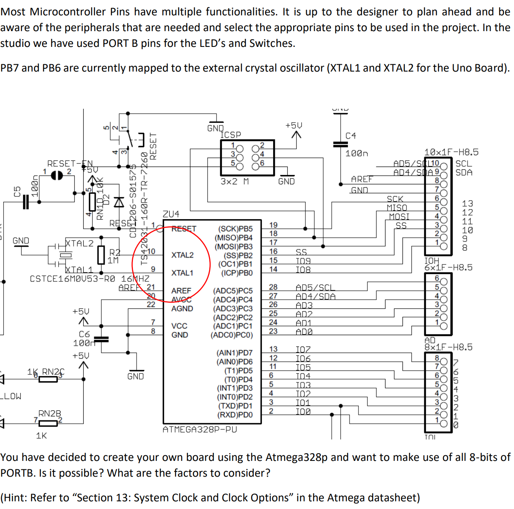<figcaption></figcaption></figure>

### Solution

Referring to Table 13-1, it can be seen that there are different clocking options available for the 328p. Two of those options refer to the ability to use an internal clock. By selecting those options we can free up PB7 and PB6 to be used as GPIO.

The most important factor to consider is that when we use an **external clock**, we have a **wide range** of frequencies to choose from. Once we switch to an internal clock, we are limited by what the device provides. We need to check and see if what is provided is sufficient for our needs.

#### Discussion Point - Frequency

<details>

<summary>What are the factors to consider when choosing the Frequency?</summary>

Speed, Power Consumption, Stability.

</details>

<details>

<summary>What are the implications to code</summary>

Calculated values for timing related features like ADC Sampling, Timers, etc.

</details>

### Takeaway

#### Clock in the ATmega328p

A clock in microcontrollers like the ATmega328p is essentially the "heartbeat" of the system - it's a signal that oscillates at a regular frequency, providing timing for all operations in the microcontroller.

#### How a Clock Works

The clock generates a square wave signal that alternates between high and low voltage at a consistent frequency (measured in Hertz, or cycles per second). Each cycle of this signal is used to synchronize and sequence operations within the microcontroller.

For example, the ATmega328p (commonly found in Arduino Uno boards) typically runs at 16MHz, meaning the clock completes 16 million cycles every second.

#### Clock Source on Atmega 328p

<figure>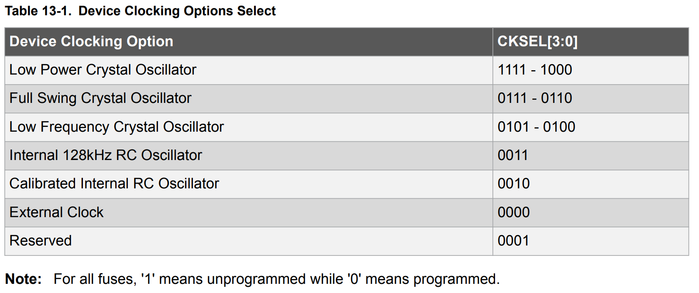<figcaption><p>Table 13-1: Device CLocking Options Select (P49)</p></figcaption></figure>

The following table briefly summarizes the usage of each clock source.

| Clock Source Type           | Options                                         | Characteristics                                                                                                                         | Advantages                                                                                             | Disadvantages                                                                                                  |
| --------------------------- | ----------------------------------------------- | --------------------------------------------------------------------------------------------------------------------------------------- | ------------------------------------------------------------------------------------------------------ | -------------------------------------------------------------------------------------------------------------- |
| **Crystal Oscillators**     | <p>Low Power<br>Full Swing<br>Low Frequency</p> | <p>• External quartz crystal connected to MCU<br>• Very precise and stable timing<br>• Different options balance power vs stability</p> | <p>• High accuracy<br>• Excellent stability<br>• Low frequency drift</p>                               | <p>• Requires external components<br>• More board space<br>• Higher cost</p>                                   |
| **Internal RC Oscillators** | <p>128kHz<br>Calibrated Internal RC</p>         | <p>• Built into the chip itself<br>• No external components required<br>• Calibrated version offers improved accuracy</p>               | <p>• Simplifies design<br>• Reduces component count<br>• Lower cost</p>                                | <p>• Less accurate than crystals<br>• More susceptible to temperature drift<br>• Limited frequency options</p> |
| **External Clock**          | External Clock                                  | <p>• Uses clock signal from another device<br>• Allows synchronization with other system components</p>                                 | <p>• System synchronization<br>• Can use higher precision sources<br>• Flexibility in clock source</p> | <p>• Requires external clock generation<br>• More complex design<br>• Dependency on external source</p>        |

#### Why Clocks Are Important

The clock is crucial for several reasons:

1. **Instruction Execution**: Every instruction the CPU executes requires a certain number of clock cycles. The clock ensures these operations happen in sequence.
2. **Timing Functions**: Functions like delays, PWM outputs, and communication protocols (UART, SPI, I2C) all depend on precise timing from the clock.
3. **Power Consumption**: Clock frequency directly affects power consumption - higher frequencies enable faster operation but use more power.
4. **Peripherals**: All peripherals (timers, ADCs, communication modules) use the system clock or a derived clock for their operation.
5. **Reliability**: A stable clock ensures consistent operation under varying conditions like temperature changes.


####

## 02. GPIO Configuration

### Question

<figure>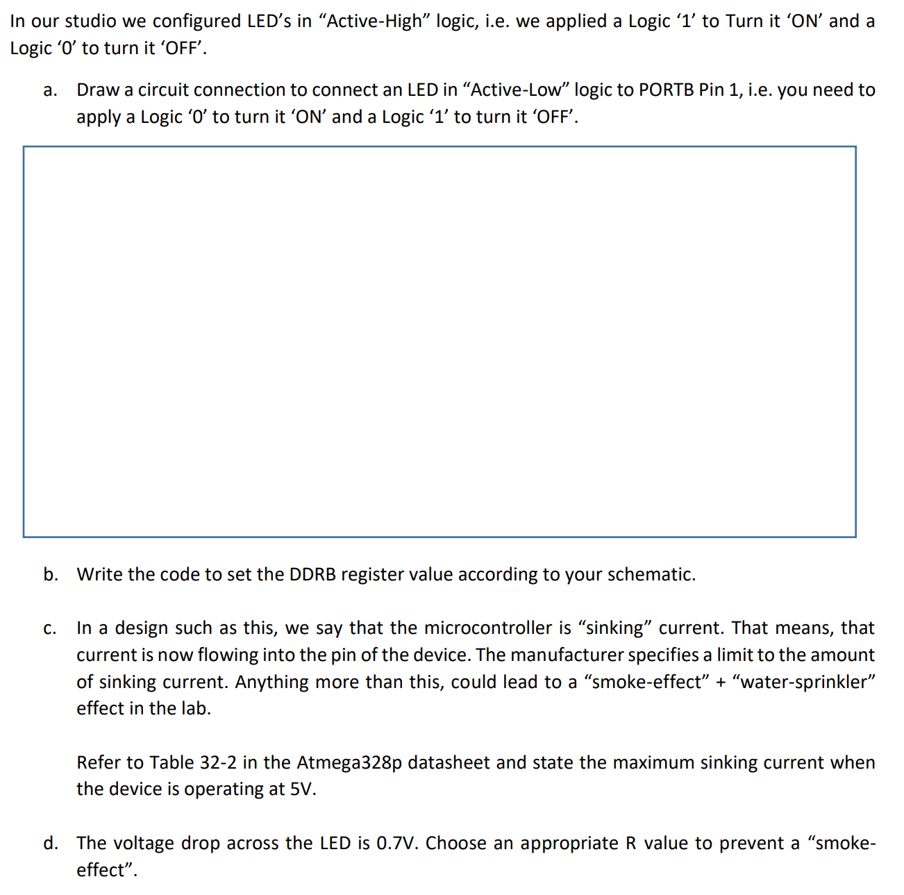<figcaption></figcaption></figure>

### Solution



**Active-Low Circuit Design**

<figure>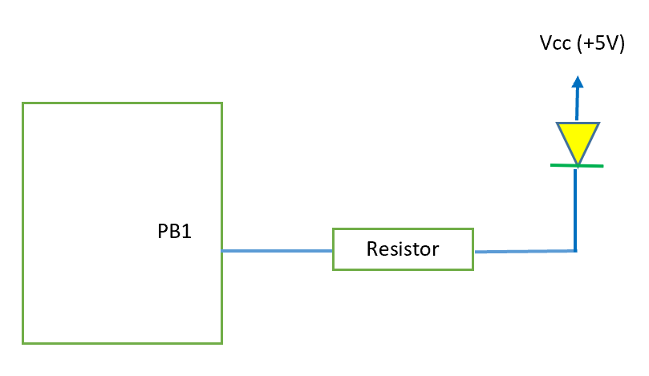<figcaption></figcaption></figure>


We don't need to design a pull-up or pull-down resistor system here.




**Configure the GPIO Pin**

```cpp
DDRB |= 0b00000010; // Set Bit 1 to output by OR with ‘1’.
```



**Maximum sinking current**

Ans: 20mA.

<figure>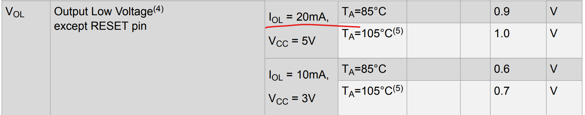<figcaption><p>Table 32-2: Common DC Characteristics (VOL, P365-P366)</p></figcaption></figure>


The positive sign indicates current flowing into of the pin (sinking)


The note 4 here is as follows:

<figure>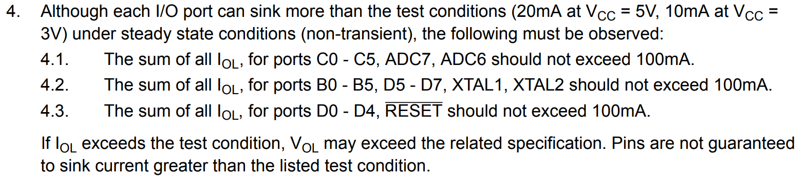<figcaption><p>Table 32-2: Common DC Characteristics (Note 4, P366)</p></figcaption></figure>

This note tells us that there is a **maximum limit** on the **total amount of current that the various pins can collectively sink**.



**Choose the appropriate resistor value**

$$
R =\frac{5-0.7}{0.02}=215~\Omega
$$

This $$R$$ is the **minimum** value.



#### Discussion Points



**How much is the source current when you set the output to ‘1’?**

20mA. The absolute maximum is 40mA.

<figure>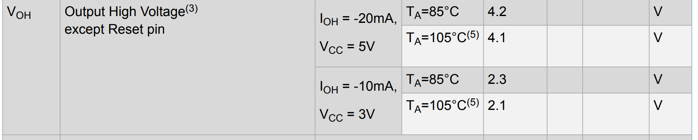<figcaption><p>Table 32-2: Common DC Characteristics (VOH, P365-P366)</p></figcaption></figure>


Here, "how much" specifies that we are only interested in **maganitude**. The negative sign of $$I_{OH}$$ indicates current flowing out of the pin (sourcing)


**Why Absolute Maximum Rating** = 40mA **matters**?

* This is the absolute limit beyond which permanent damage will likely occur
* It represents a "never exceed" threshold, not a normal operating condition
* Exceeding this value even momentarily risks permanent damage to the microcontroller



**Is that enough?**

Depends on the application. If you are controlling an LED, then it should be. If you are trying to interface to a Motor, then it may not be enough.



**What if I want a higher output voltage / current?**

When the microcontroller's output capabilities (20mA at 5V) aren't sufficient for your application, you'll need external components to boost either current or voltage.

***

**Current Boost using Darlington Transistor Pair**

A Darlington pair consists of two bipolar transistors connected so that the current amplified by the first transistor is amplified further by the second one. This creates a compound transistor with a very high current gain (β).

**How it works:**

1. The microcontroller provides a small current to the base of the first transistor
2. The first transistor amplifies this current and feeds it to the base of the second transistor
3. The second transistor amplifies it again, resulting in a much larger collector current

**Key benefits:**

* Can easily handle currents of several amperes
* Requires very little base current from the microcontroller
* Simple and inexpensive implementation

**Example application:**

* Driving motors, high-power LEDs, or relays directly from a microcontroller pin

The trade-off is a higher voltage drop (typically 0.7V × 2 = 1.4V) across the Darlington pair compared to a single transistor.

***

**Voltage Boost using Op-Amp**

Operational amplifiers (op-amps) can be configured to increase the voltage level of a signal.

**How it works:**

1. The microcontroller's output is connected to the op-amp's input
2. The op-amp is configured in a non-inverting amplifier configuration with a gain greater than 1
3. The op-amp draws power from a higher voltage supply than the microcontroller
4. The output signal is amplified to a higher voltage level

**Key configurations:**

1. **Non-inverting amplifier**: Output = Input × (1 + R₂/R₁)
2. **Voltage follower with higher supply**: Maintains the signal but references it to a higher voltage
3. **Level shifter**: Adds a constant voltage to the input signal

**Example application:**

* Driving displays or components that require higher voltages
* Interfacing with devices that use different logic levels

The limitation is that most op-amps can only source/sink limited current (typically 20-50mA), so they're best for voltage boosting rather than current boosting.

***

For applications requiring both higher voltage AND higher current, you might need to combine both approaches or use specialized driver ICs designed specifically for that purpose.



### Takeaway

#### Sinking Current

When we talk about a microcontroller "sinking" current, we're referring to the direction of current flow. In an active-low LED configuration:

1. **Current Sinking**: The current flows FROM the positive supply (VCC), THROUGH the LED and resistor, and INTO the microcontroller pin.
2. **Current Sourcing**: The opposite scenario, where current flows OUT FROM the microcontroller pin, through components, and to ground.

When a pin is configured as an output and set to logic '0' (LOW/0V), it's essentially connecting that pin to ground inside the microcontroller. This creates a path for current to flow from VCC through the LED and resistor into the microcontroller pin.

#### "Smoke" Effect and "Water-Sprinkler" Effect

These colorful terms refer to catastrophic failure scenarios:

* **Smoke Effect**: When **too much** current flows through a component (exceeding its absolute maximum ratings), it can overheat to the point where internal materials begin to burn or melt. This often results in visible smoke being released as the component fails.
* **Water-Sprinkler Effect**: This likely refers to what happens when components physically rupture due to extreme overheating. Electrolytic capacitors, for example, contain liquid electrolyte that can be ejected when they fail catastrophically - spraying the liquid around like a tiny sprinkler.

These effects happen when you **exceed the maximum current** ratings of the microcontroller pins. The Atmega328p datasheet specifies these maximum values to prevent permanent damage.

#### Why Current Limiting is Critical

The maximum sinking current specification is crucial because:

1. Exceeding it causes immediate or gradual damage to the internal structure of the output pin
2. The internal traces and transistors in the chip have physical limitations on how much current they can handle
3. Excessive current generates heat that can damage surrounding components
4. Once damaged, the pin or entire microcontroller typically needs replacement

This is why selecting the appropriate resistor value is so important - it limits the current to a safe level while still allowing the LED to function properly.

## 03. Power Consumption

### Question

<figure>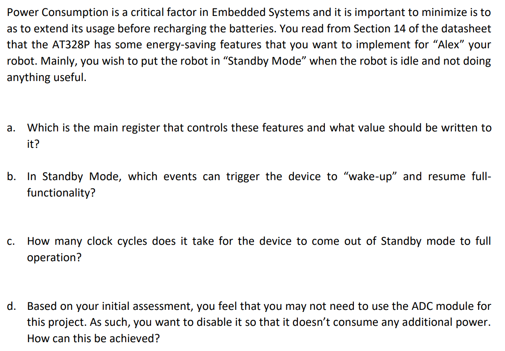<figcaption></figcaption></figure>

### Solution



**Configure the Sleep Mode Control Register (SMCR)**

Below is the SMRC Register:

<figure>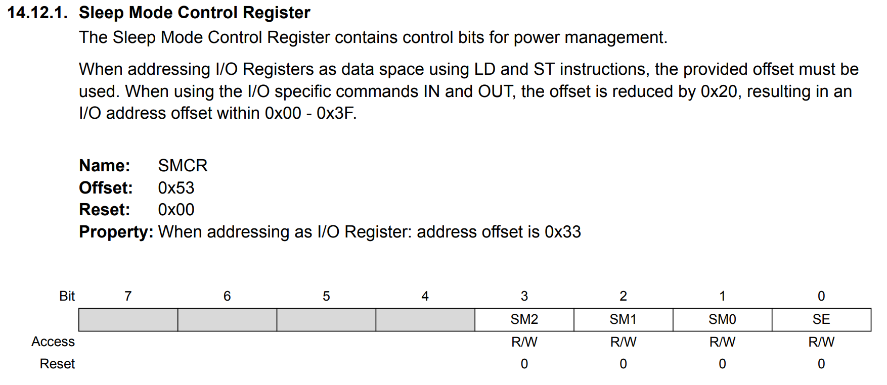<figcaption><p>Sleep Mode Control Resgiter (P68)</p></figcaption></figure>

To put it in "Standby Mode", according to the Sleep Mode Select Table as follows, we need to set the `SM[2:0]` to `110`.

<figure>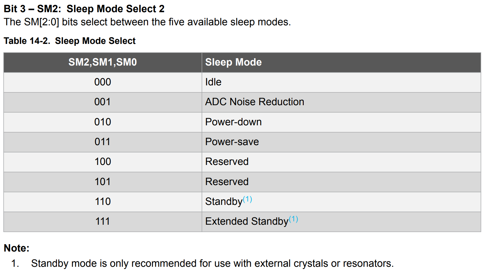<figcaption><p>Table 14-2: Sleep Mode Select (P68)</p></figcaption></figure>



**Events to "wake-up" the device**

<figure>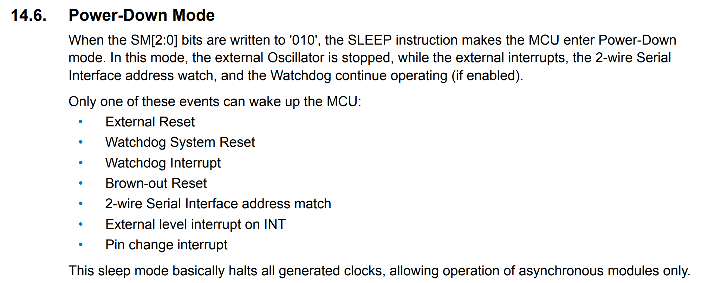<figcaption><p>Power Down Mode (P64)</p></figcaption></figure>

**Why these events for Power Down Mode applies to Standby Mode also?**

In the ATmega328P, the similarities between wake-up events for Power-Down and Standby modes are due to their underlying architectural design and clock management mechanisms.

The **key difference** between these two modes is how they handle the main oscillator:

* **Power-Down mode**: Completely stops the external oscillator
* **Standby mode**: Keeps the external oscillator running, but stops the CPU and most I/O

Despite this difference, **both modes share the same wake-up sources** because:

1. **Asynchronous Operation**: The wake-up source (external interrupts, watchdog, etc.) are specifically designed to operate asynchronously - they don't depend on the main system clock. They have their own timing mechanisms or respond to external events.
2. **Clock Domain Separation**: The ATmega328P architecture separates clock domains. The main CPU and peripheral clocks can be stopped independently from the circuits that monitor wake-up events.
3. **Power Efficiency Design**: Both modes are designed to maximize power savings while maintaining essential monitoring capabilities. The difference is primarily in startup time - Standby mode offers faster wake-up since the oscillator is already running.
4. **Hardware Implementation**: From a hardware perspective, it's more efficient to implement the wake-up detection circuitry once and reuse it across different sleep modes rather than creating separate circuits for each mode.

The main advantage of Standby mode over Power-Down is the significantly faster wake-up time, as the oscillator doesn't need to restart and stabilize, which can take many milliseconds. This makes **Standby Mode more suitable** for applications that need to wake up quickly but still want significant power savings.



**Clock cycles taken to fully "wake-up" from Standby Mode**

From the following description of standby mode, we can see the it takes **6 cycles** to fully "wake-up" from Standby Mode.

<figure>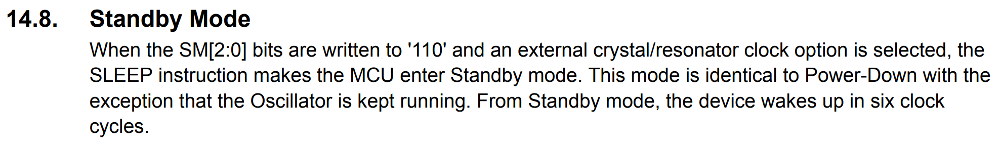<figcaption><p>Standby Mode (P65)</p></figcaption></figure>



**How to disable the ADC module?**

**Why we need to turn off the ADC module if we won't use them?**

This is because according to the following description, the ADC will be **enabled** in all sleep modes! So, if we don't want to use it, we should disable it manually to **save power!**

<figure>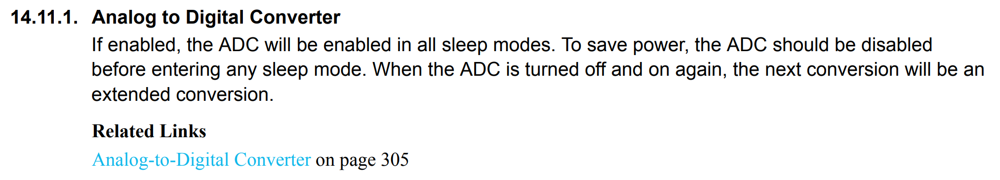<figcaption><p>ADC (P65)</p></figcaption></figure>

**How to disable ADC?**

From the description of Power Reduction Register (PRR), we know that it provides a method to stop the clock to individual peripherals to reduce power consumption.

<figure>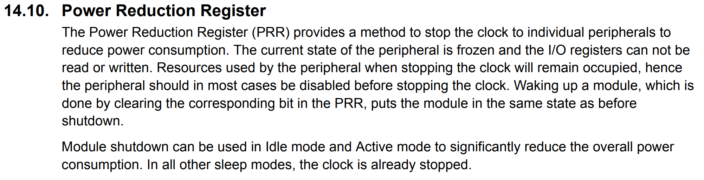<figcaption><p>Power Reduction Register (PRR, P65)</p></figcaption></figure>

The method is achieved by setting certain bits inside the register, the following is a complete guide.

<figure>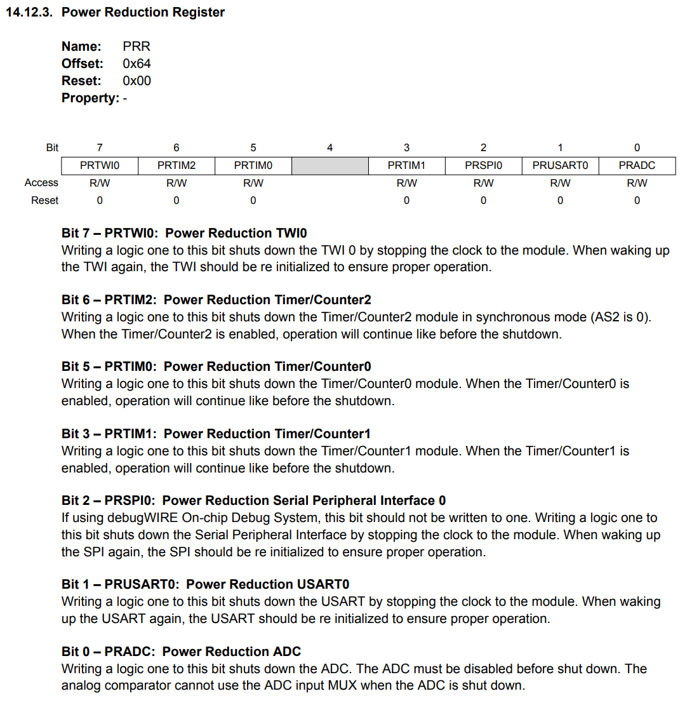<figcaption><p>PRR Configuration (P71)</p></figcaption></figure>

So, to disable the ADC, we only need to set Bit 0 to be 1.

```cpp
PRR |= 0b00000001; // 1 to disable and 0 to enable!
```


Here, `1` is to disable! (Not `0`)




### Takeaway

#### Power Consumption

It is important that Energy Consumption must be thought through while you are designing the project and not after it is complete. The microcontroller is only one component in the system. Your device may have a lot of other subsystems that consume power. Putting those components into a low-energy state may be more complicated and require HW design like “electronicswitches”.

#### Rule of Thumb in Atmega328p

According to the data sheet, we have the following **Rule of Thumb** about minimizing power consumption in Atmega328p.

<figure>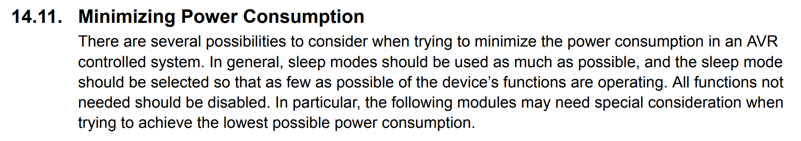<figcaption><p>Minimizing Powe Consumption (P65)</p></figcaption></figure>

The following modules which need special consideration are:

1. Analog to Digital Converter
2. Analog Comparator
3. Brown-Out Detector
4. Internal Voltage Reference
5. Watchdog Timer
6. Port Pins
7. On-chip Debug System


For detailed information, please go to the P65-P66 on the data sheet.


## 04. Calculating Transfer Times

### Question

<figure>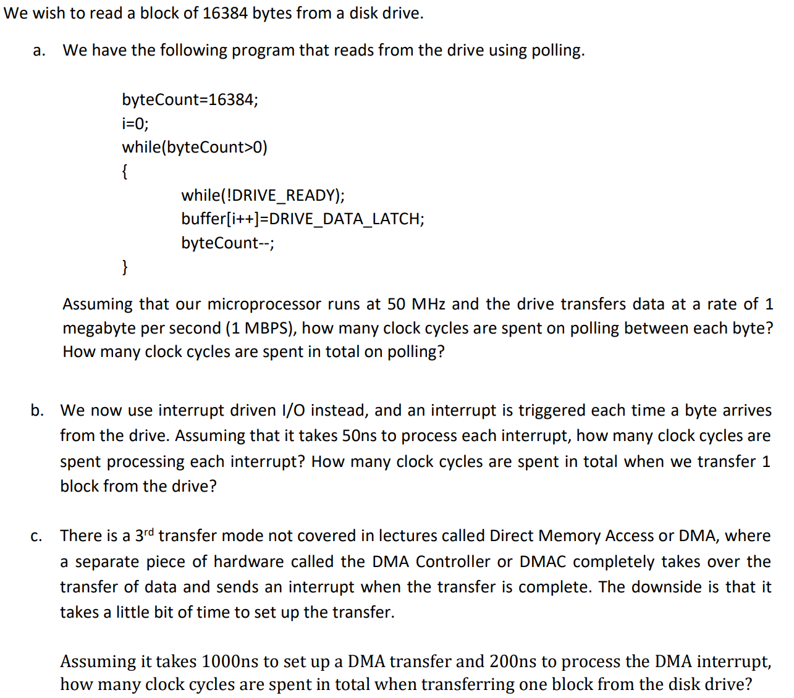<figcaption></figcaption></figure>

### Solution



**Total clock cycles spent using polling**

We get 1000000 bytes per second, or 1 byte every microsecond ($$\mu s$$). Each clock cycle is $$\frac{1}{50\text{ Mhz}}=\frac{1}{50\times 10^6}=20\text{ ns}$$, and hence it takes $$\frac{1~\mu s}{20\text{ ns}}=50$$ cycles per byte.

We thus spend 50 cycles stuck in the `while(!DRIVE_READY);` loop for a total of 16384 times, giving us $$16364\times 50=819200$$ cycles wasted.

***

Why Polling Consumes 50 Cycles Per Byte

1. The system transfers data at 1 MB/s (1 byte per microsecond)
2. The CPU runs at 50 MHz (one cycle every 20 ns)
3. For each byte transfer, the CPU must wait 1 microsecond (1000 ns)
4. During this 1000 ns wait time, the CPU can execute 50 cycles (1000 ns ÷ 20 ns = 50)
5. Instead of doing useful work, these cycles are wasted in a polling loop just checking a status flag

This is inefficient because the CPU is actively running and consuming power, but not accomplishing any useful computation during those 50 cycles per byte.


The key for polling calculation is to calculate the number of cycles it takes in each polling `while` loop. (In this case, it means polling for each byte)




**Total clock cycles using interrupts**

$$50\text{ ns}=2.5$$ clock cycles. Each byte triggers an interrupt. Time taken to process the entire block is $$2.5\times 16384=40960$$ cycles.


The key for interrupt calculation is to calculate the clock cycles it takes to execute the ISR once. (In this case, executing the ISR once meaning we have dealt with one byte)




**Total clock cycles using DMA**

$$\text{Total}=1000+200=1200\text{ ns}=\frac{1200}{20}=60\text{ cycles}$$


The key for DMA calculation is to calculate the **setup time**.




### Takeaway

#### Bandwidth / Throughput and Memory

**Bandwidth and Throughput**

Bandwidth and throughput both refer to **the rate** at which data can be transferred, but with subtle differences:

* **Bandwidth**: The theoretical **maximum data transfer capacity** of a channel or connection
* **Throughput**: The actual amount of data **successfully transferred** over a period of time

When discussing bandwidth or throughput, we use decimal-based prefixes (powers of 10):

* 1 KB/s (kilobyte per second) = 10³ bytes per second = 1,000 bytes per second
* 1 MB/s (megabyte per second) = 10⁶ bytes per second = 1,000,000 bytes per second
* 1 GB/s (gigabyte per second) = 10⁹ bytes per second = 1,000,000,000 bytes per second

This convention comes from telecommunications and networking industries, where data rates have traditionally been measured in bits per second using SI (metric) prefixes.

***

**Memory and Storage**

When discussing memory or storage capacity, we use binary-based prefixes (powers of 2):

* 1 KiB (kibibyte) = 2¹⁰ bytes = 1,024 bytes
* 1 MiB (mebibyte) = 2²⁰ bytes = 1,048,576 bytes
* 1 GiB (gibibyte) = 2³⁰ bytes = 1,073,741,824 bytes

However, it's common to see these abbreviated as KB, MB, and GB (without the "i"), which can create confusion.

***

**Why the Difference?**

The different measurement systems exist for historical and practical reasons:

1. **Memory addressing**: Computer memory is addressed in binary (powers of 2), making binary-based units natural for memory and storage.
2. **Signal processing**: Telecommunications and data transmission evolved from analog systems that used decimal-based measurements.
3. **Marketing**: Storage manufacturers often use decimal-based measurements (1TB = 1,000,000,000,000 bytes) because it yields larger-sounding numbers than binary measurement (1TiB = 1,099,511,627,776 bytes).

This distinction matters in practice - for example, when calculating how long it will take to transfer a file of a certain size, you need to be aware of which system is being used for each measurement to avoid calculation errors.

#### Calculation Tips on Polling, Interrupts and DMA

* **Polling:** The key for polling calculation is to calculate the total clock cycles the CPU spends **in the polling loop** (a.k.a we are only interested in the **number of cycles wasted** between each arrival of the byte). We ignore the cycles taken to **read the data**.
* **Interrupt:** The key for interrupt calculation is to calculate the total clock cycles required to **handle each interrupt**, which typically **processes one byte**. (But in interrupt, we care again)
* **DMA:** The key for DMA calculation is to calculate the CPU cycles spent on setting up the DMA transfer, which can then transfer multiple bytes without further CPU intervention.

## 05. Small Block Sizes

### Question

<figure>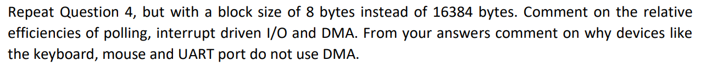<figcaption></figcaption></figure>

### Solution

* **Polling:**
  * Each byte takes 1 microsecond or 50 cycles.
  * Total number of cycles = 50 × 8 = 400 cycles.
* **Interrupts:**
  * Each interrupt takes 2.5 cycles.
  * Total time = 8 × 2.5 = 20 cycles.
* **DMA:**
  * No matter the block size, it always takes 60 cycles.

***

Since **DMA setup** and **interrupt processing** time is **independent** of block size, **DMA is not efficient** for **small block sizes**.

This means “character devices” like the mouse, keyboard, and UART port do not benefit from the advantages of DMA.

## 06. Interrupt Masking

### Question

<figure>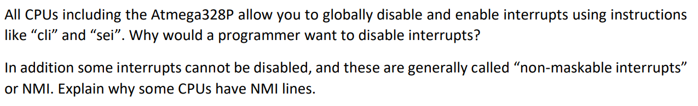<figcaption></figcaption></figure>

### Solution

**The "behind-the-scene" principle of** `cli()` **and** `sei()`

This is done by setting the Bit 7 (I) in the Status Register (SREG)

<figure>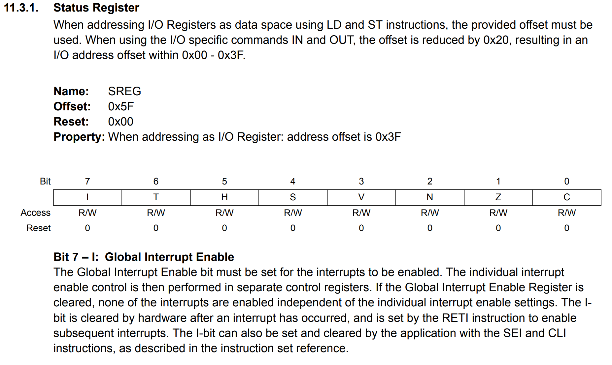<figcaption><p>Status Register (SREG, P27)</p></figcaption></figure>

So, `cli()` is basically equivalent to `SREG &= 0b01111111;`

`sei()` is basically equivalent to `SREG |= 0b10000000;`

***

Interrupts are disabled for several reasons:

* **Automicity**: To create “atomic” blocks of code that are executed completely before control is handed over to anything else, including other running processes. Disabling interrupts **guarantees that control is never handed to an interrupt handler**. Multitasking environments switch between processes using timer interrupts, and disabling interrupts prevents the operating system from switching to another process, thus **guaranteeing the “atomicity”** of the code disabling the interrupt.
* **Setup Key Components**: Code may also disable interrupts when in the process of setting up key system components like timers and serial ports, to guarantee that spurious interrupts are not triggered half way, which can lead to unpredictable results.

NMI are often used for extremely critical interrupts like “power failure” interrupts, which allow a system to save critical data in the event of a power failure, before the battery in the uninterruptable power supply runs out.

## 07. Interrupts on ATmega328p

### Question

<figure><figcaption></figcaption></figure>

### Solution

There are two main types of interrupt request lines:

* Two external interrupt lines INT0 and INT1 (PD2 and PD3)
* 23 “pin change” interrupt request lines PCINT0 to PCINT23 (note: No PCINT15).

<figure>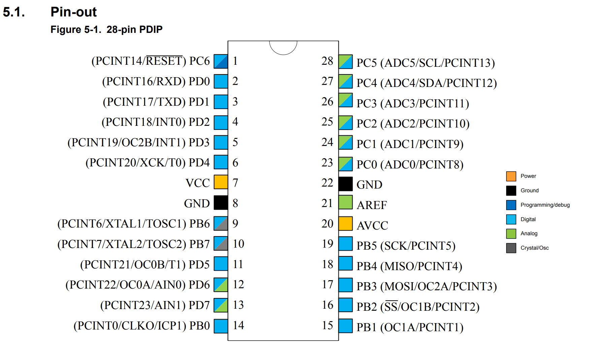<figcaption><p>ATmega328p Pin-out (P14)</p></figcaption></figure>

INT0 and INT1 are much more flexible. They can be triggered by (See more at [Studio 2](../studio/studio-2-interrupts.md#external-interrupts-for-digital-i-o))

* A low signal level
* A change in signal level
* Rising edge
* Falling edge

Additionally, INT0 and INT1 each have their own ISR.

The pin change interrupt requests (PCINT0 to PCINT23) only respond to **changes in voltage levels**. In addition, the 23 PCINT lines are grouped into 2 groups of 8 lines each and one group of 7 lines. **All lines in the same group will trigger the execution of the same ISR**. i.e. there are **only 3 unique ISRs** even though there are 23 lines.

<figure><figcaption><p>ISR for Pin Change Interrupts (Modified from the Vector Table, P82)</p></figcaption></figure>

## 08. Handling the Interrupts - The ISR

### Question

<figure>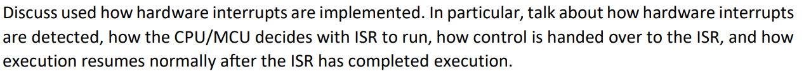<figcaption></figcaption></figure>

### Solution

**Detection**

* Every interrupt request line is assigned an index number
* The CPU tests the state of the interrupt request lines many times a second. (On the MIPS range of microprocessors, for example, the CPU tests the lines at the end of each instruction execution).
* When one line is detected to have been triggered, the CPU **takes note of its index number**.
* The CPU consults a table called the **Interrupt Vector Table** using the index number of the triggered line. This table tells the CPU **where the ISR** for this particular line is. (This table is set up at powerup with the correct ISR addresses. Like-wise the ISRs are actually loaded into the addresses indicated. This is usually done by the OS)
* The CPU saves the contents of the Program Counter (PC) onto the “process stack” – a data structure similar to what you have learnt in CS2040C, which tells the CPU where to get the next program instruction for execution.
* The CPU loads the address of the ISR into PC, causing it to execute the ISR code.
* The ISR ends with a Return from Interrupt (RETI) instruction, that causes the CPU pop the stack containing the previous PC value into PC. This causes execution to resume at the point of interruption.

**Nested interrupts**

* What if an interrupt occurs while processing another interrupt?
  * Interrupts have **priority levels**.
  * If the new interrupt has a **lower priority** than the current interrupt, it is ignored until processing for the current interrupt completes.
  * If the new interrupt has a higher priority than the current one, **PC is again saved** on the process stack, and the vector for the new interrupt is loaded into PC, causing it to execute the new ISR.
  * When the new interrupt exits, PC is popped off the stack, causing the previous ISR to resume.
