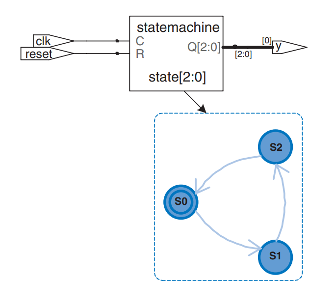
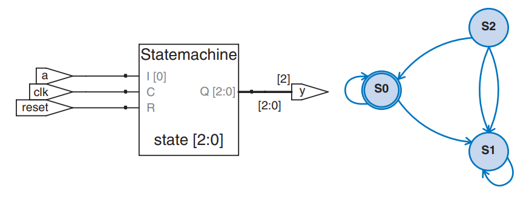
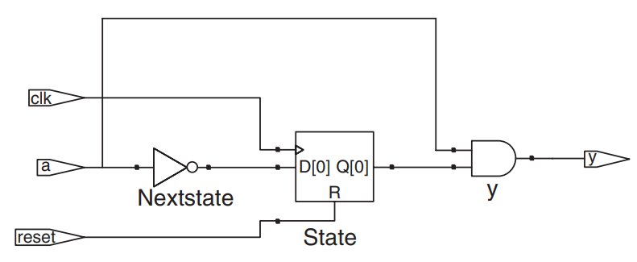

# Finite State Machines

Recall that a FSM contains three main parts:

1. a state register and,
2. **two** blocks of combinational logic to compute the next state and the output given the current state and the input

HDL descriptions of state machines are correspondingly divided into three parts to model the **state register**, the **next state logic**, and the **output logic**.

## Basic FSM Template

HDL Example 4.30 describes the divide-by-3 FSM from the [example we have introduced in state encodings](../sequential-logic-design/finite-state-machines.md#example-fsm-state-encoding). It provides an **asynchronous reset** to initialize the FSM. The **state register** uses the ordinary idiom for flip-flops. The **next state** and **output logic** blocks are combinational.




```system-verilog
module divideby3FSM(input  logic clk,
                    input  logic reset,
                    output logic y);
  typedef enum logic [1:0] {S0, S1, S2} statetype;
  statetype [1:0] state, nextstate;
  
  // state register
  always_ff @(posedge clk, posedge reset)
    if (reset) state <= S0;
    else       state <= nextstate;
  
  // next state logic
  always_comb
    case (state)
      S0:       nextstate <= S1;
      S1:       nextstate <= S2;
      S2:       nextstate <= S0;
      default:  nextstate <= S0;
    endcase
  
  // output logic
  assign y = (state == S0);
endmodule
```



#### Code Explanation

1. **(SystemVerilog Specific)** The `typedef` statement defines `statetype` to be a two-bit `logic` value with three possibilities: `S0`, `S1`, or `S2`. `state` and `nextstate` are `statetype` signals.
2. **(SystemVerilog Specific)** The enumerated encodings default to numerical order: `S0=00`, `S1=01`, and `S2=10`.
3. Notice how a `case` statement is used to define the state transition table. Because the next state logic should be combinational, a `default` is necessary even though the state `2'b11` should never arise.





```verilog
module divideby3FSM(input  clk,
                    input  reset,
                    output y);
  reg [1:0] state, nextstate;
  parameter S0 = 2'b00;
  parameter S1 = 2'b01;
  parameter S2 = 2'b10;
  
  // state register
  always @(posedge clk, posedge reset)
    if (reset) state <= S0;
    else       state <= nextstate;
  
  // next state logic
  always @(*)
    case (state)
      S0:       nextstate = S1;
      S1:       nextstate = S2;
      S2:       nextstate = S0;
      default:  nextstate = S0;
    endcase
  
  // output logic
  assign y = (state == S0);
endmodule
```



#### Code Explanation

1. The `parameter` statement is used to define constants within a module. Naming the states with parameters is not required, but it makes changing state encodings much easier and makes the code more readable.




Synthesis tools produce just a block diagram and **state transition diagram** for **state machines**; they do not show the **logic gates** or the **inputs** and **outputs** on the arcs and states. Therefore, be careful that you have specified the **FSM** correctly in your **HDL** code. The **state transition diagram** in Figure 4.25 for the **divide-by-3 FSM** is analogous to the diagram in [Figure 3.28(b)](../sequential-logic-design/finite-state-machines.md#example-fsm-state-encoding). The double circle indicates that **S0** is the **reset state**. Gate-level implementations of the **divide-by-3 FSM** were shown in [Figure 3.29](../sequential-logic-design/finite-state-machines.md#example-fsm-state-encoding).

<figure><figcaption><p><strong>Figure 4.25</strong> <code>divideby3fsm</code> synthesized circuit</p></figcaption></figure>

Notice that the **states** are named with an **enumeration data type** rather than by referring to them as binary values. This makes the code more readable and easier to change. If, for some reason, we had wanted the **output** to be HIGH in states **S0** and **S1**, the **output logic** would be modified as follows.

```system-verilog
assign y = (state == S0 | state == S1);
```

The next two examples describe the **snail pattern recognizer FSM** from the [example before](../sequential-logic-design/finite-state-machines.md#example-moore-versus-mealy-machines). The code shows how to use `case` and `if` statements to handle **next state** and **output logic** that depend on the **inputs** as well as the **current state**. We show both **Moore** and **Mealy** modules. In the **Moore machine** (HDL Example 4.31), the **output** depends only on the **current state**, whereas in the **Mealy machine** (HDL Example 4.32), the **output logic** depends on both the **current state** and **inputs**.

## Moore FSM Template




```system-verilog
module patternMoore(
    input  logic       clk,
    input  logic       reset,
    input  logic       a,
    output logic       y
);

    typedef enum logic [1:0] {S0, S1, S2} statetype;
    statetype state, nextstate;

    // State register
    always_ff @(posedge clk, posedge reset)
        if (reset) state <= S0;
        else       state <= nextstate;

    // Next state logic
    always_comb
        case (state)
            S0: nextstate = a ? S0 : S1;
            S1: nextstate = a ? S2 : S1;
            S2: nextstate = a ? S0 : S1;
            default:    nextstate = S0;
        endcase

    // Output logic
    assign y = (state == S2);

endmodule
```



Note how **nonblocking assignments** (`<=`) are used in the **state register** to describe **sequential logic**, whereas **blocking assignments** (`=`) are used in the **next state logic** to describe **combinational logic**.





```verilog
module patternMoore(
    input  clk,
    input  reset,
    input  a,
    output y
);

    // 1. State Encoding: Replace enum with localparam
    localparam [1:0] S0 = 2'b00;
    localparam [1:0] S1 = 2'b01;
    localparam [1:0] S2 = 2'b10;

    // 2. Variable Declaration: Replace logic with reg/wire
    // 'state' and 'nextstate' are assigned in always blocks, so they must be reg
    reg [1:0] state, nextstate;

    // 3. State register: Replace always_ff with always @(posedge...)
    always @(posedge clk or posedge reset) begin
        if (reset) 
            state <= S0;
        else       
            state <= nextstate;
    end

    // 4. Next state logic: Replace always_comb with always @(*)
    always @(*) begin
        case (state)
            S0: nextstate = a ? S0 : S1;
            S1: nextstate = a ? S2 : S1;
            S2: nextstate = a ? S0 : S1;
            default: nextstate = S0;
        endcase
    end

    // 5. Output logic: continuous assignment (implicitly a wire)
    assign y = (state == S2);

endmodule
```




<figure><figcaption><p><strong>Figure 4.26</strong> <code>patternMoore</code> synthesized circuit</p></figcaption></figure>

## Mealy FSM Template




```system-verilog
module patternMealy(
    input  logic       clk,
    input  logic       reset,
    input  logic       a,
    output logic       y
);

    typedef enum logic {S0, S1} statetype;
    statetype state, nextstate;

    // State register
    always_ff @(posedge clk, posedge reset)
        if (reset) state <= S0;
        else       state <= nextstate;

    // Next state logic
    always_comb
        case (state)
            S0: nextstate = a ? S0 : S1;
            S1: nextstate = a ? S0 : S1;
            default:    nextstate = S0;
        endcase

    // Output logic
    assign y = (a & (state == S1));

endmodule
```





```verilog
module patternMealy(
    input  clk,
    input  reset,
    input  a,
    output y
);

    // 1. State Encoding: Replace enum with localparam
    // Since there are only 2 states, we need 1 bit
    localparam S0 = 1'b0;
    localparam S1 = 1'b1;

    // 2. Variable Declaration
    // 'state' and 'nextstate' are assigned in always blocks -> reg
    reg state, nextstate;

    // 3. State register
    always @(posedge clk or posedge reset) begin
        if (reset) 
            state <= S0;
        else       
            state <= nextstate;
    end

    // 4. Next state logic
    always @(*) begin
        case (state)
            S0: nextstate = a ? S0 : S1;
            S1: nextstate = a ? S0 : S1;
            default: nextstate = S0;
        endcase
    end

    // 5. Output logic
    // In Mealy machines, output depends on State AND Input (a)
    assign y = (a & (state == S1));

endmodule
```




<figure><figcaption><p><strong>Figure 4.27</strong> <code>patternMealy</code> synthesized circuit</p></figcaption></figure>
