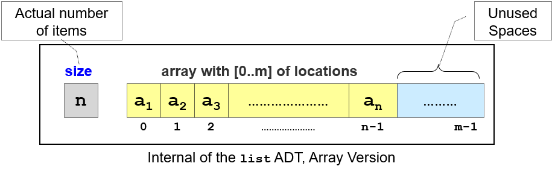

# Lec 01 - (Resizeable) Array

## Compact Array

According the Visualgo, the definition for a compact array is,

> an array that has **no gap**, i.e., if there are N items in the array (that has size M, where M ≥ N), then only index \[0..N-1] are occupied and other indices \[N..M-1] should remain **empty**.

The illustration for a compact array.

<figure><figcaption></figcaption></figure>

The size of the compact array M is not infinite, but a finite number. This poses a problem as the maximum size may not be known in advance in many applications.

* If **M** is too big, then the unused spaces are wasted.
* If **M** is too small, then we will run out of space easily.

### Variable Space

To solve the above fixed-size problem, we can make **M** a variable. So when the array is full, we create a larger array (usually two times larger) and move the elements from the old array to the new array. Thus, there is no more limits on size other than the (usually large) physical computer memory size.

[C++ STL std::vector](https://en.cppreference.com/w/cpp/container/vector), [Python list](https://docs.python.org/3/tutorial/datastructures.html#more-on-lists), [Java Vector](https://docs.oracle.com/javase/8/docs/api/java/util/Vector.html), or [Java ArrayList](https://docs.oracle.com/javase/8/docs/api/java/util/ArrayList.html) all implement this **variable-size array**. Note that Python _list_ and Java Arra&#x79;_&#x4C;ist_ are not Linked Lists, but are actually **variable-size arrays**. This array visualization implements this doubling-when-full strategy.
