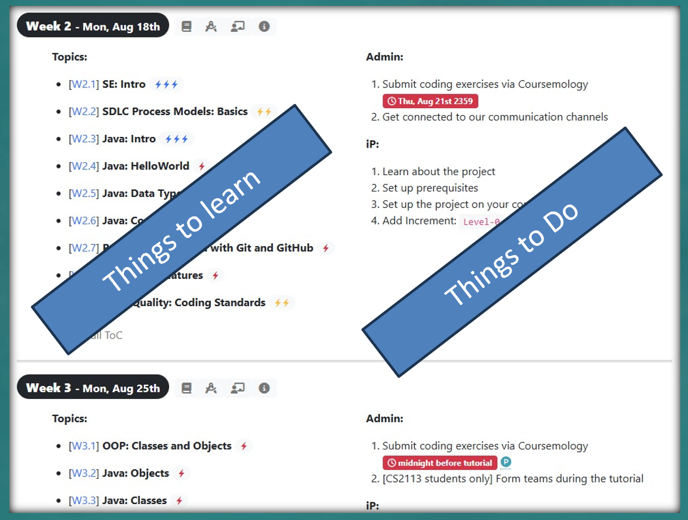
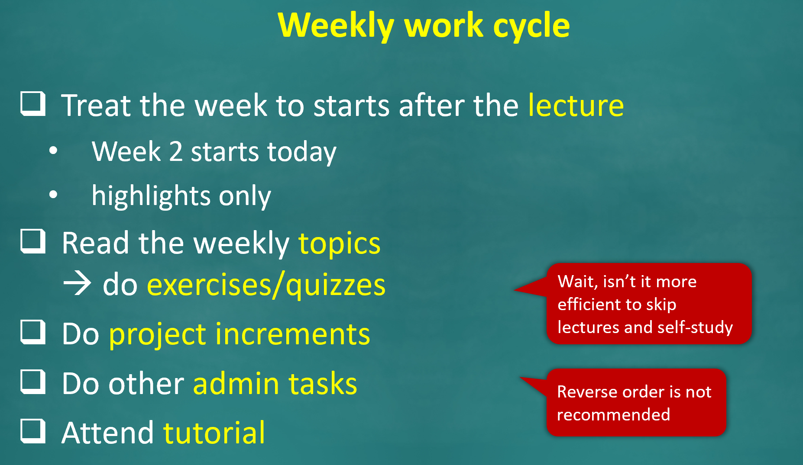

# Lec 01

## Tips

### TP/IP

1. In the TP/IP, the version 2.0 should have almost all features, no magic in one week!
2. Make everything work first!

### General



**Weekly topics: Things to do, things to learn**

<figure><figcaption></figcaption></figure>

For example, the following is week 2's things to do and learn





**Wait for the last enlightning moment**

The course content may seem unorganized, but don't give up, wait for the last enlightning moment.



**Use of the** [**course website**](https://nus-cs2113-ay2526s1.github.io/website)**: Don't read everything**

Don't study in advance. Study with the schedule! Make sure you are a mster of this week's content!



**Forum**

The Forum for this course is the [Github Issue](https://github.com/nus-cs2113-AY2526S1/forum/issues)!



**Weekly work cycle**

It is highly recommended to follow the following weekly work cycle.

<figure><figcaption></figcaption></figure>



## Technical Content

### RCS

RCS stands for Rivistion Control System. The RCS we use in this course is Git.



**Basic Git Workflow**

1. `git add` untracked/modified files
2. files will go into a **staging area** (kind of a temporary area)
3. `git commit msg` to store changes in your repo


#### Tips

1. `git commit` is **powerful**, although you can revert, but the history cannot be reverted or hidden.
2. Pay attendtion to the commit `msg`, make sure it follows the style recommended in this course.
3. The `git commit` operation actually creates a commit object.




**Add a new line at the end of each file**

If your repo is organized by Git, add a new line at the end of each file. This is nothing but to make Git happy. Otherwise, you will get `CLRF` warnings.


