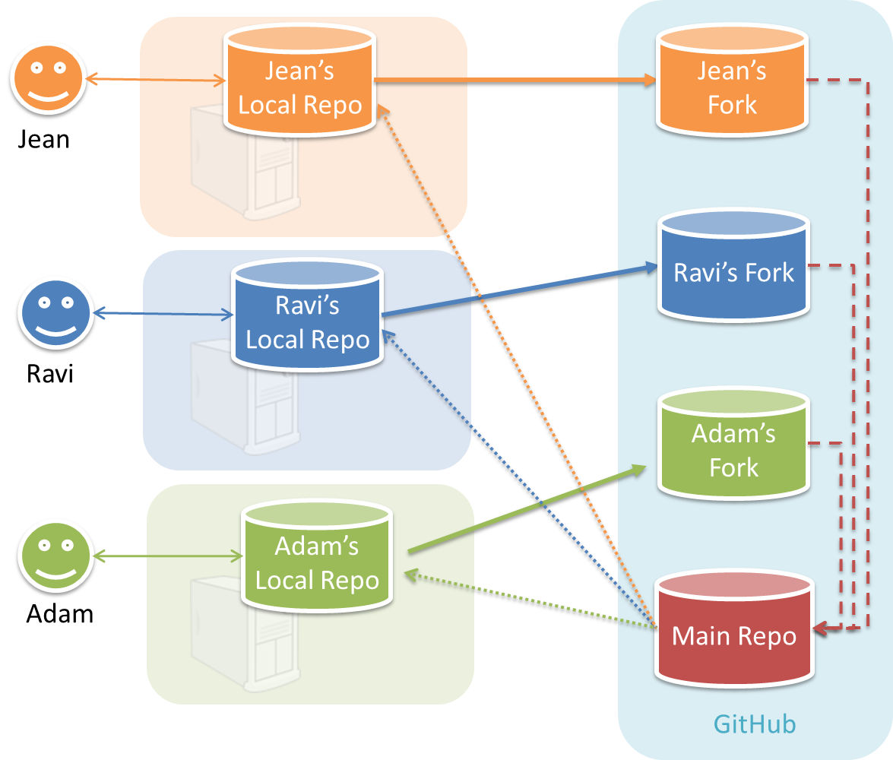

# Topics

## Important Points

### Java Varargs

> This syntactic sugar has appeared [CS2030S](https://wenbo-notes.gitbook.io/cs2030s-notes/lec-rec-lab-exes/lecture/lec-07-immutability-and-nested-classes/diagnostic-quiz#id-05.-...-and-safevarargs)!

Variable Arguments (Varargs) is a _syntactic sugar_ type feature that allows writing a method that can take a variable number of arguments. For example,


```java
public static void search(String ... keywords) {
   // method body
}
```



#### Code Explanation

The `search` method below can be called as `search()`, `search("book")`, `search("book", "paper")`, etc.


### Java Streams

> Again, this is the emphasis of CS2030S, but unfortunately not CS2113. FYI, please go to my [CS2030S notes](https://wenbo-notes.gitbook.io/cs2030s-notes/lec-rec-lab-exes/lecture/lec-09-infinitelist-and-stream) to know more about it!

### Java FX

JavaFX is a technology for building Java-based GUIs. Previously it was a part of Java itself, but has become a third-party dependency since then. It is now being maintained by [OpenJDK](https://wiki.openjdk.java.net/display/OpenJFX).


As this is not the emphasis in CS2113, please refer to the [_JavaFX tutorial_ @SE-EDU/guides](https://se-education.org/guides/tutorials/javaFx.html) to learn how to get started with JavaFX.


### JavaDoc

JavaDoc is a tool for generating API documentation in HTML format from comments in the source code. In CS2113, you only need to follow the following examples to write your JavaDoc




```java
/**
 * Returns lateral location of the specified position.
 * If the position is unset, NaN is returned.
 *
 * @param x X coordinate of position.
 * @param y Y coordinate of position.
 * @param zone Zone of position.
 * @return Lateral location.
 * @throws IllegalArgumentException If zone is <= 0.
 */
public double computeLocation(double x, double y, int zone)
    throws IllegalArgumentException {
    // ...
}
```





```java
package ...

import ...

/**
 * Represents a location in a 2D space. A <code>Point</code> object corresponds to
 * a coordinate represented by two integers e.g., <code>3,6</code>
 */
public class Point {
    // ...
}
```




### SWE Code Quality: Code Comments

Always do code comment is not recommended. Avoid writing comments to explain bad code. Improve the code to make it self-explanatory.



#### Don't comment obvious code

Do not repeat in comments information that is already obvious from the code. If the code is self-explanatory, a comment may not be needed.


```java
// Bad
//increment x
x++;

//trim the input
trimInput();
```




#### Write comments targeting users, not you

Write comments targeting other programmers reading the code. Do not write comments as if they are private notes to yourself.


```java
// Bad
// a quick trim function used to fix bug I detected overnight
void trimInput() {
    ....
}

// Good
/** Trims the input of leading and trailing spaces */
void trimInput() {
    ....
}
```




#### Explain WHAT, WHY, but not HOW

* ✅WHAT: The specification of what the code is _supposed_ to do.
* ✅WHY: The rationale for the current implementation.
* ❌HOW: The explanation for how the code works.



### SWE CI/CD

#### Integration

Combining parts of a software product to form a whole is called _integration_. Some popular build tools relevant to Java developers: [Gradle](https://gradle.org/), [Maven](http://maven.apache.org/), [Apache Ant](http://ant.apache.org/), [GNU Make](http://www.gnu.org/software/make/). Some build tools also serve as _dependency management tools_, like Gradle and Maven.

#### CI/CD

* An extreme application of build automation is called _continuous integration (CI)_ in which integration, building, and testing happens automatically after each code change.
* A natural extension of CI is _Continuous Deployment (CD)_ where the changes are not only integrated continuously, but also deployed to end-users at the same time.

Some examples of CI/CD tools: [Travis](https://travis-ci.org/), [Jenkins](http://jenkins-ci.org/), [Appveyor](https://www.appveyor.com/), [CircleCI](https://circleci.com/), [GitHub Actions](https://github.com/features/actions)

### RCS Merging PRs

This is very trivial for now. Just click-click on GitHub.

### RCS Workflows

> This is very important! And it is the exactly workflow I am using in my CS2113 tP and other collboration projects on GitHub.

The main idea is that in the _forking workflow_, the 'official' version of the software is kept in a remote repo designated as the 'main repo'. All team members fork the main repo and create pull requests from their fork to the main repo.

<figure><figcaption></figcaption></figure>

1. Jean creates a **separate branch** in her local repo and fixes the bug in that branch.
   1. **Mistake**: Don't make the changes at your `master/main` branch! Create a new branch for every update! Naming of the branch can be arbitrary.
2. Jean pushes the **branch** to her **fork**.
3. Jean creates a **pull request** from that **branch** in her **fork** to the **main repo**.
4. Other members **review** Jean’s pull request.
5. If reviewers suggested any changes, Jean **updates the PR** accordingly by making changes locally on that branch, commits and push commits to her fork.
6. When reviewers are satisfied with the PR, one of the members (usually the team lead or a designated 'maintainer' of the main repo) **merges** the PR, which brings Jean’s code to the main repo.
7. Other members, realizing there is new code in the upstream repo, **sync** their forks with the new upstream repo (i.e., the main repo).
