# Topics

## Important Points

### SWE Class Diagrams Intermediate

A class diagram can also show different types of relationships between classes: [inheritance](topics.md#inheritance), [compositions](topics.md#composition), [aggregations](topics.md#aggregation), [dependencies](topics.md#dependency).

#### [Inheritance](https://wenbo-notes.gitbook.io/cs2030s-notes/lec-rec-lab-exes/lecture/lec-02-class-instance-methods-inheritance#inheritance)

We can use a **triangle** and a **solid line** (not to be confused with an **arrow**, which means [navigation](https://wenbo-notes.gitbook.io/cs2113-notes/lec/lec-08/topics#uml-notes)) to indicate class inheritance.

<figure>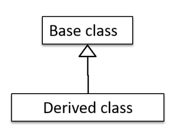<figcaption></figcaption></figure>


It does not matter whether the triangle is **filled** or **empty**.


Here's an example that combines inheritance with generics:


```java
class Foo<T> {
}

class Bar<T> extends Foo<T> {
}

class Goo extends Foo<String> {
}
```


<figure>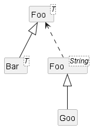<figcaption></figcaption></figure>

#### Composition



#### Concept

A bit unlike what I have learned in CS2030S, here a **composition** is an **association** that represents a strong **whole-part** relationship. It implies that

1. **when the&#x20;**_**whole**_**&#x20;is destroyed,&#x20;**_**parts**_**&#x20;are destroyed too** e.g., the _part_ cannot exist without being attached to a _whole_.
2. **there cannot be cyclical links**.



#### UML Notation

UML uses a **solid diamond** symbol to denote composition.

<figure>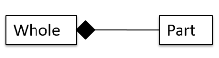<figcaption></figcaption></figure>



#### Aggregation



#### Concept

_**Aggregation**_**&#x20;represents a&#x20;**_**container-contained**_**&#x20;relationship.** It is a weaker relationship than composition.


Aggregation is also an **association**.




#### UML Notation

UML uses a **hollow diamond** to indicate an aggregation.

<figure>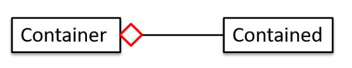<figcaption></figcaption></figure>



<details>

<summary>Aggregation vs. Composition</summary>

The distinction between composition (◆) and aggregation (◇) is rather blurred. Martin Fowler’s famous book _UML Distilled_ advocates **omitting the aggregation** symbol altogether because using it adds more confusion than clarity.


In CS2113, we should avoid using aggregation!


</details>

#### Dependency



#### Concept

In the context of OOP associations, **a&#x20;**_**dependency**_**&#x20;is a need for one class to depend on another without having a direct association in the same direction.** Reason for the exclusion: If there is an association from class `Foo` to class `Bar` (e.g., navigable from `Foo` to `Bar`), that means `Foo` is _obviously_ dependent on `Bar` and hence there is no point in mentioning _dependency_ specifically. In other words, we are specifically focusing on _non-obvious_ dependencies here. One cause of such dependencies is interactions between objects that do not have a long-term link between them.

One example of **dependency** lies in the method's **parameters**. For example, in the code below, `Foo` has a **dependency** on `Bar` but it is not an association because it is only a transient[^1] interaction and there is no long term relationship between a `Foo` object and a `Bar` object. e.g., the `Foo` object does not keep the `Bar` object it receives as a parameter.


```java
class Foo {

    int calculate(Bar bar) {
        return bar.getValue();
    }
}

class Bar {
    int value;

    int getValue() {
        return value;
    }
}

```




#### UML Notation

UML uses a **dashed arrow** to show dependencies.

<figure>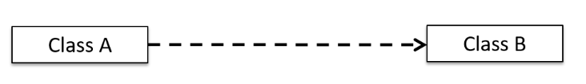<figcaption></figcaption></figure>

For example, in the example above, the dependency between `Foo` and `Bar` can be drawn as follows,

<figure>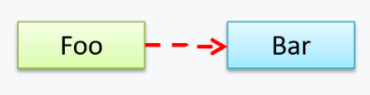<figcaption></figcaption></figure>



<details>

<summary>Dependency vs. Association</summary>

1. An association and an inheritance already shows dependency, thus no need to show them as a dashed arrow in the UML again.
2. Use a dependency arrow to indicate a dependency only if that dependency is not already captured by the diagram in another way (for instance, as an association or an inheritance)&#x20;

</details>

***

A class diagram can also show different types of class-like entities, like [enumerations](topics.md#enumerations), [abstract class](topics.md#abstract-class), interfaces

#### [Enumerations](https://wenbo-notes.gitbook.io/cs2113-notes/lec/lec-04/topics#java-enumeration)

We have introduced the concept of enumerations in Lec 04. In UML, the enumerations are represented as follows,

<figure>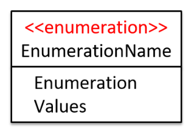<figcaption></figcaption></figure>

#### [Abstract Class](https://wenbo-notes.gitbook.io/cs2113-notes/lec/lec-05/topics#java-abstract-classes)

In UML, we can use _italics_ or `{abstract}` (preferred) keyword to denote abstract classes/methods.

<figure>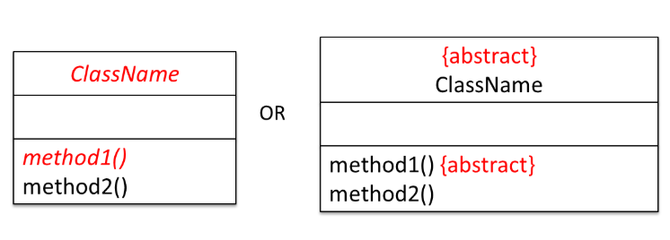<figcaption></figcaption></figure>

#### [Interface](https://wenbo-notes.gitbook.io/cs2030s-notes/lec-rec-lab-exes/lecture/lec-03-polymorphism#interface)



#### Concept

Nothing much to add on. Just recall that a class implementing an interface results in an _is-a_ relationship.



#### UML Notation

An interface is shown similar to a class with an additional keyword `<<interface>>`. When a class implements an interface, it is shown similar to class inheritance except a **dashed line** is used instead of a solid line.

For example, the `AcademicStaff` and the `AdminStaff` classes _implement_ the `SalariedStaff` interface.

<figure>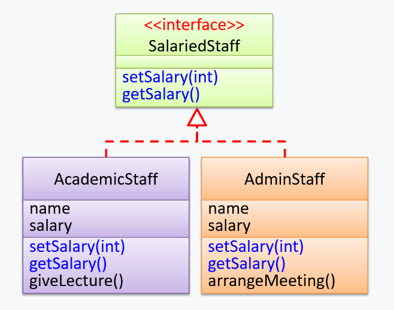<figcaption></figcaption></figure>



### Java Logging

_Logging_ is the deliberate recording of certain information during a program execution for future reference and it **can be useful for troubleshooting problems.**


A log file is like the black box of an airplane.


#### Creating a Logger

To use the default Java logging system, import `java.util.logging.*`. We obtain a logger instance using a factory method.


```java
// Standard syntax
private static final Logger logger = Logger.getLogger(MyClass.class.getName());
```



Although we can use arbitrary names (e.g., "Foo"), it is **recommended** to use the class name: `Logger.getLogger(MyClass.class.getName())`.


#### Logging Levels (Hierarchy)

Java assigns a level of importance to every log message. This hierarchy determines which messages are important enough to be saved. The standard levels from highest to lowest are:

* **SEVERE** (Highest): Critical failures (crashes).
* **WARNING**: Potential issues.
* **INFO**: Standard operational messages (e.g., "Start", "Stop").
* **CONFIG**: Configuration details.
* **FINE / FINER / FINEST** (Lowest): Detailed tracing for debugging.

#### Filtering Mechanism

The Logger acts as a filter (like a volume threshold). We set a specific level for the Logger, and it will only output messages that are **equal to or higher** than that level.

* If Level is set to **WARNING**: It records `WARNING` and `SEVERE`. (It ignores `INFO` and below).
* If Level is set to **INFO**: It records `INFO`, `WARNING`, and `SEVERE`.

### Java Assertions

**Assertions** are used to define assumptions about the program state so that the runtime can verify them. If the runtime detects an **assertion failure**, it typically takes some drastic action such as terminating the execution with an error message.&#x20;

#### Implementation

To implement a **Java assertion**, we can use the keyword `assert`. For example, this assertion will fail with the message `x should be 0` if `x` is not 0 at this point.


```javascript
x = getX();
assert x == 0 : "x should be 0";
...
```



By default, Java will **disable the Java assertions**.


<details>

<summary>Java <code>assert</code> vs. JUnit assertion</summary>

**Both check for a given condition but JUnit assertions are more powerful and customized for testing.** In addition, JUnit assertions are not disabled by default. Use JUnit assertions in test code and Java `assert` in functional code.

</details>

#### When to use Java assertion

**Exceptions and assertions** are two complementary ways of handling errors in software but they serve different purposes. Therefore, both assertions and exceptions should be used in code.

* The raising of an exception indicates an **unusual condition created by the user** (e.g. user inputs an unacceptable input) or the environment (e.g., a file needed for the program is missing).
* An assertion failure indicates the **programmer made a mistake in the code** (e.g., a null value is returned from a method that is not supposed to return null under any circumstances).

### SWE Design Principles

In this part, we will learn **three most fundamental design qualities** ([abstraction](topics.md#abstraction), [coupling](topics.md#coupling) and [cohesion](topics.md#cohesion)) upon which all other design principles are built.

#### Abstraction

The guiding principle of abstraction is that only details that are relevant to the current perspective or the task at hand need to be considered. As most programs are written to solve complex problems involving large amounts of intricate details, it is impossible to deal with all these details at the same time. That is where abstraction can help.

> Awesome explanation above. This is also what we are doing in [DDCA](https://wenbo-notes.gitbook.io/ddca-notes/textbook/from-zero-to-one)!

We have the two abstraction examples,

1. **Data abstraction**: abstracting away the lower level data items and thinking in terms of **bigger entities**
2. **Control abstraction**: abstracting away details of the actual control flow to focus on tasks at a higher level. In other words, wrap code into methods.

#### Coupling

**Coupling** is a measure of the degree of **dependence** between components, classes, methods, etc. Low coupling indicates less dependency between components and high coupling should be **avoided**.

For example, the following image shows that design `A` have more coupling between the components than design `B`.

<figure>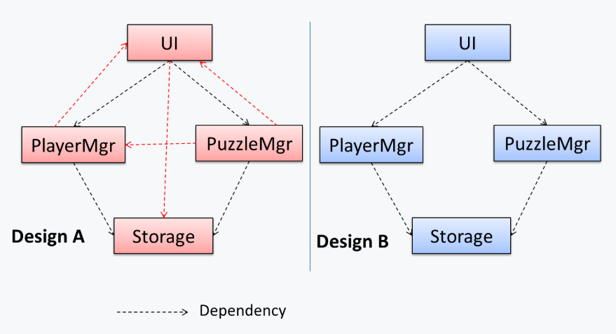<figcaption></figcaption></figure>

X is **coupled** to Y if a change to Y can potentially require a change in X. Some examples of coupling: `A` is coupled to `B` if,

* `A` has access to the internal structure of `B` (this results in a very high level of coupling)
* `A` and `B` depend on the same global variable
* `A` calls `B`  &#x20;
* `A` receives an object of `B` as a parameter or a return value
* `A` inherits from `B`
* `A` and `B` are required to follow the same data format or communication protocol

#### Cohesion

**Cohesion** is a measure of how strongly-related and focused the various responsibilities of a component are. **Higher cohesion is better.**

**Cohesion can be present in many forms**. Some examples:

* Code related to a single concept is kept together, e.g. the `Student` component handles everything related to students.
* Code that is invoked close together in time is kept together, e.g. all code related to initializing the system is kept together.
* Code that manipulates the same data structure is kept together, e.g. the `GameArchive` component handles everything related to the storage and retrieval of game sessions.

#### Some other principles



#### Single Responsibility Principle (SRP)

> A class should have one, and only one, reason to change.

If a class has only one responsibility, it needs to change only when there is a change to that responsibility.



#### Separation of Concerns Principle (SoC)

> To achieve better modularity, separate the code into distinct sections, such that each section addresses a separate _concern_.

A _concern_ in this context is a set of information that affects the code of a computer program. For example,

* A specific feature, such as the code related to the `add employee` feature
* A specific aspect, such as the code related to `persistence` or `security`
* A specific entity, such as the code related to the `Employee` entity

By applying the SoC principle, we have the following **benefits**

* reduces functional overlaps among code sections and also limits the ripple effect when changes are introduced to a specific part of the system.
* leads to higher [cohesion](topics.md#cohesion) and lower [coupling](topics.md#coupling).


By now, you may realize that the two principles given above are somewhat similar, one is specific to OOP and applied at class level while the other is not specific to OOP and can be applied at any level.




#### [Liskov Substitution Principle (LSP)](https://wenbo-notes.gitbook.io/cs2030s-notes/lec-rec-lab-exes/lecture/lec-03-polymorphism#liskov-substitution-principle)

> Derived classes must be substitutable for their base classes.

LSP implies that a subclass **should not be more restrictive** than the behavior specified by the superclass. In other words, the subclass cannot break the **specifications** set by the super class. (How to find that specifications, review CS2030S!)



## Classic Questions



#### Assertion failure

A Calculator program crashes with an ‘assertion failure’ message when you try to find the square root of a negative number.

* [ ] &#x20;a. This is a correct use of assertions.
* [ ] &#x20;b. The application should have terminated with an exception instead.
* [x] &#x20;c. The program has a bug.
* [ ] &#x20;d. All statements above are incorrect.

***

**Explanation**: An **assertion failure indicates a bug in the code**. (b) is not acceptable because of the word "terminated". The application should not fail at all for this input. But it could have used an exception to handle the situation internally.



#### Coupling Levels

Discuss the coupling levels of alternative designs _x_ and _y_.

<figure>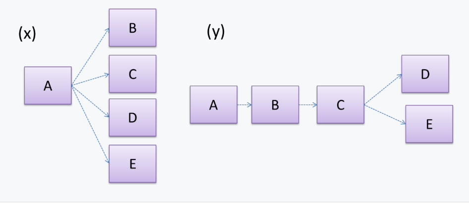<figcaption></figcaption></figure>

***

**Ans**: Overall coupling levels in _x_ and _y_ seem to be similar (neither has more dependencies than the other). (Note that the number of dependency links is not a definitive measure of the level of coupling. Some links may be stronger than the others.). However, in _x_, `A` is highly-coupled to the rest of the system while `B`, `C`, `D`, and `E` are standalone (do not depend on anything else). In _y_, no component is as highly-coupled as `A` of _x_. However, only `D` and `E` are standalone.



#### Statements on coupling

Choose the correct statements.

* [x] &#x20;a. As coupling increases, testability decreases.
* [x] &#x20;b. As coupling increases, the risk of regression increases.
* [x] &#x20;c. As coupling increases, the value of automated regression testing increases.
* [ ] &#x20;d. As coupling increases, integration becomes easier as everything is connected together.
* [x] &#x20;e. As coupling increases, maintainability decreases.

***

Easy to understand I think.



#### Some principles

“Only the GUI class should interact with the user. The GUI class should only concern itself with user interactions”. This statement follows from,

* [x] &#x20;a. A software design should promote separation of concerns in a design.
* [x] &#x20;b. A software design should increase cohesion of its components.
* [x] &#x20;c. A software design should follow single responsibility principle.

***

**Explanation**: By making ‘user interaction’ the GUI class’s sole responsibility, we increase its cohesion. This is also in line with the separation of concerns (e.g., we separated the concern of user interaction) and the single responsibility principle (the GUI class has only one responsibility).



[^1]: temporary
