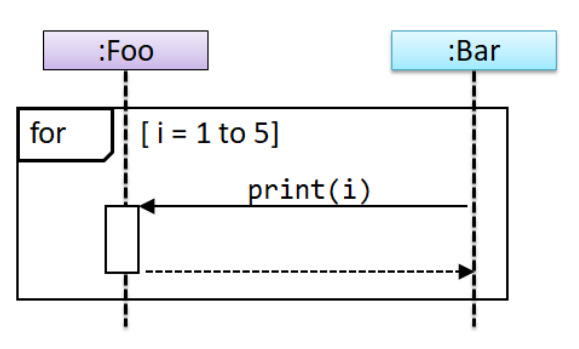
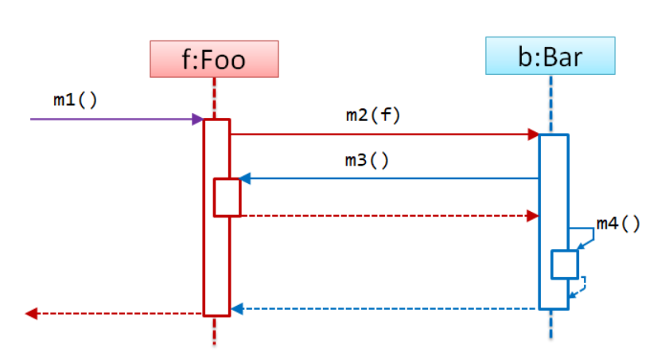

# Diagnostic Quiz

## Problem

## 1-2. Sequential Diagrams Loops

> The condition can be anything that makes sense to be a **terminating** or **non-terminating** condition.

<figure><figcaption></figcaption></figure>

This is the correct way to show a for-loop?

* [ ] True
* [x] False

Because the keyword to use is `loop`, not `for`.


This question has appeared in CS2113 AY25/26 Sem 1 Final!


### 1-12. Sequential Diagrams Alternative Paths

> There is only `alt` block in the UML sequential diagrams, there is no `if` block!

### 1-14. Sequential Diagrams Calling Convention

> The calling convention in UML Sequence Diagrams
>
> * **Caller (Sender)**: The lifeline where the message arrow **starts from**.
> * **Receiver**: The lifeline where the message arrow **points to**.
> * **Method**: The label on the arrow (`methodName()`) is the operation being called on the **receiver.**
> * **Parameter**: Anything inside the parentheses `(param)` is data being passed **from the caller** _to_ **the receiver.**
> * **Dashed Lines**: It's just at reply message. It can be
>   * Return of control
>   * Return values

<figure><figcaption></figcaption></figure>

Method m3 calls method m4 of self.

* [ ] True
* [x] False

***

Using the convention we have defined at the beginning, we can know that

1. `m2(f)` is a method from `b`.
2. `m2(f)` calls `m3()` from `f` and then calls `m4()` from itself.

Thus, the statement is False because its `m2(f)`, not `m3()` that calls `m4()`.

### 1-15. Sequence Diagrams Optional Path

> Whatever **path/block** in the sequence diagram has its **scope**, the code outside the **scope** is not controlled by the **path/block** anymore. It will always be executed.

### 2-3. Singleton Pattern and Testability

> Singleton Pattern can **reduce testability**?

## Tips

1. The condition can be anything that makes sense to be a **terminating** or **non-terminating** condition.
2. There is only `alt` block in the UML sequential diagrams, there is no `if` block!
3. The calling convention in UML Sequence Diagrams
   * **Caller (Sender)**: The lifeline where the message arrow **starts from**.
   * **Receiver**: The lifeline where the message arrow **points to**.
   * **Method**: The label on the arrow (`methodName()`) is the operation being called on the **receiver.**
   * **Parameter**: Anything inside the parentheses `(param)` is data being passed **from the caller** _to_ **the receiver.**
   * **Dashed Lines**: It's just at reply message. It can be
     * Return of control
     * Return values
4. Whatever **path/block** in the sequence diagram has its **scope**, the code outside the **scope** is not controlled by the **path/block** anymore. It will always be executed.
