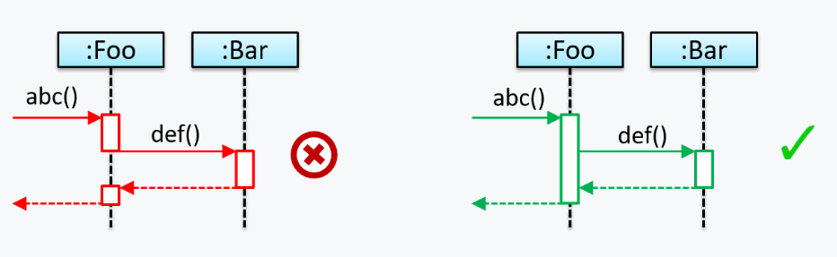
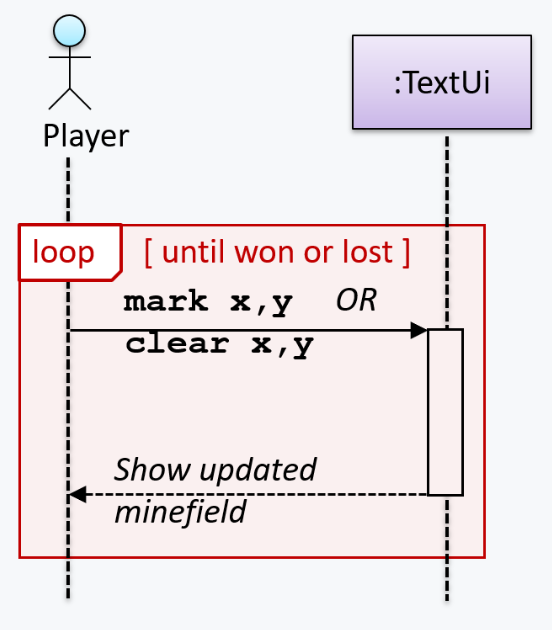
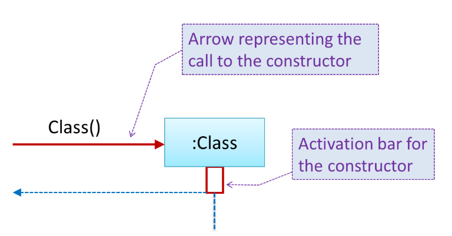
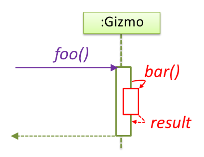
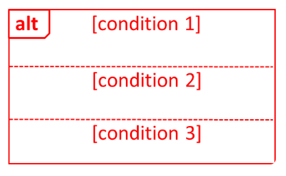
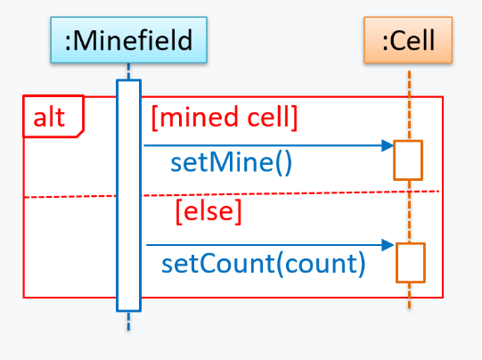
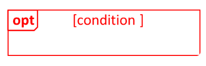
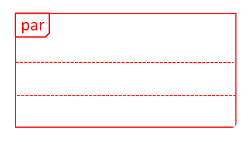
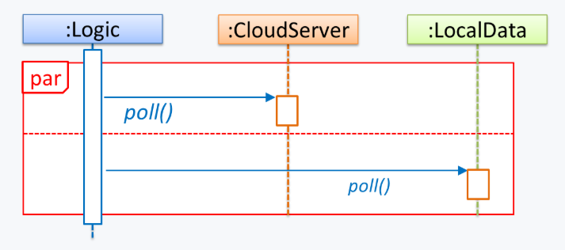
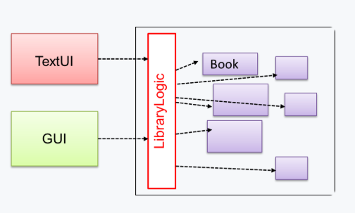

# Topics

## Important Points

### SWE Sequence Diagrams Basics

**Sequence diagrams** model the interactions between **various entities in a system**, in a specific scenario. Some examples that we can use sequence diagrams:

* To model how components of a system interact with each other to respond to a user action.
* To model how objects inside a component interact with each other to respond to a method call it received from another component.

A **UML sequence diagram** _captures the interactions between multiple entities for a given scenario._ For example,


```java
class Machine {

    Unit producePrototype() {
        Unit prototype = new Unit();
        for (int i = 0; i < 5; i++) {
            prototype.stressTest();
        }
        return prototype;
    }
}

class Unit {

    public void stressTest() {

    }
}
```


This code can be converted to the following UML sequence diagram

<figure><figcaption></figcaption></figure>

#### UML Notation

<figure><figcaption></figcaption></figure>


### Notes

1. The class/object name is **not underlined** in sequence diagrams.
2. The arrowhead styles depends on the type of method call.
   1. Synchronous method call will use **filled** arrowheads. (In CS2113, we **always** use the **filled** arrowheads, as shown in the example above)
   2. Asynchronous method call will use **lined** arrowheads. (Out of the scope of CS2113, but you must have learned it in CS2030S)
3. Some common notation errors
   1.  Activation bar too long:\


       <figure><figcaption></figcaption></figure>
   2.  Broken activation bar: When calling the **nested** methods, the outer method shouldn't be **broken**!\


       <figure><figcaption></figcaption></figure>




Now, we sill introduced some detailed notations that will be used when we construct the sequence diagram



#### Loops

<figure><figcaption></figcaption></figure>

For example, the `Player` calls the `mark x,y` command or `clear x y` command repeatedly until the game is won or lost.

<figure><figcaption></figcaption></figure>



#### Object Creation

<figure><figcaption></figcaption></figure>

* The arrow that represents the constructor arrives at the side of the box representing the instance.
* The activation bar represents the period the constructor is active.

For example, the `Logic` object creates a `Minefield` object.

<figure><figcaption></figcaption></figure>



#### Minimal Notation

To reduce clutter, **optional elements (e.g, activation bars, return arrows) may be omitted** if the omission does not result in ambiguities or loss of [relevant information](#user-content-fn-1)[^1].



### SWE Sequence Diagrams Intermediate

#### Object Deletion

UML uses an `X` at the end of the lifeline of an object to show its deletion.

<figure><figcaption></figcaption></figure>

Although Java doesn't support `delete` operation, we can use the object deletion notation to indicate the point at which the object becomes **ready to be garbage-collected** (e.g., the point at which it ceases to be referenced).

For example, note how `d` lifeline ends with an `X` to show that it is 'deleted' (e.g., ready to be garbage collected) after the `cook()` method returns.


```java
class Chef {
    void cook() {
        Dish d = new Dish();
    }
}
```


<figure><figcaption></figcaption></figure>

#### Self Invocation

UML can show a method of an object calling another of its own methods.

<figure><figcaption></figcaption></figure>

For example, the `markCellAt(...)` method of a `Logic` object is calling its own `updateState(...)` method.

<figure><figcaption></figcaption></figure>

<details>

<summary><strong>A small tip</strong>: 'Unroll' chained/compound method calls before drawing sequence diagram</summary>

Consider the Java statement `new Book().add(new Chapter());`. How do we show it as a sequence diagram?

First, "unroll" it into a simpler series of statements, which can then be drawn as a sequence diagram easily. For example, that statement is equivalent to the following:


```java
Book b = new Book();
Chapter c = new Chapter();
b.add(c);
```


And its sequence diagram will look like as follows:

> TODO:

</details>

#### Alternative Paths

UML uses `alt` frames to indicate alternative paths. This can be viewed as the `if/else` branch in the high-level Java code.

<figure><figcaption></figcaption></figure>

For example, the `Minefield` calls the `Cell#setMine` method if the cell is supposed to be a mined cell, and calls the `Cell:setMineCount(...)` method otherwise.

<figure><figcaption></figcaption></figure>


**No more than one** alternative partitions be executed in an `alt` frame.


#### Optional Paths

UML uses `opt` frames to indicate optional paths.

<figure><figcaption></figcaption></figure>

For example, `Logic#markCellAt(...)` calls `Timer#start()` only if it is the first move of the player.

<figure><figcaption></figcaption></figure>

#### Calls to Static Methods

Method calls to `static` (i.e., class-level) methods are received by the class itself, not an instance of that class. You can use `<<class>>` to show that a participant is the class itself.

For example, `m` calls the static method `Person.getMaxAge()` and also the `setAge()` method of a `Person` object `p`.

<figure><figcaption></figcaption></figure>

#### Parallel Paths

UML uses `par` frames to indicate parallel paths.

<figure><figcaption></figcaption></figure>

For example, `Logic` is calling methods `CloudServer#poll()` and `LocalData#poll()` in parallel.

<figure><figcaption></figcaption></figure>


If you show parallel paths in a sequence diagram, the corresponding Java implementation is likely to be _multi-threaded_ because a normal Java program cannot do multiple things at the same time.


### SWE Design Patterns

In Lec 09, we have seeen the [design principles](../lec-09/topics.md#swe-design-principles), now we will two design patterns that build on the several design principles we have introduced.

**Design pattern** is an **elegant reusable** _solution_ to a _c_**ommonly recurring problem** within a given _context_ in software design.

Usually, a design pattern has the following format:

* **Context**: The situation or scenario where the design problem is encountered.
* **Problem**: The main difficulty to be resolved.
* **Solution**: The core of the solution. It is important to note that the solution presented only includes the most general details, which may need further refinement for a specific context.
* **Anti-patterns** (optional): Commonly used solutions, which are usually incorrect and/or inferior to the Design Pattern.
* **Consequences** (optional): Identifying the pros and cons of applying the pattern.
* **Other useful information** (optional): Code examples, known uses, other related patterns, etc.

#### Singleton Pattern

Let's see what is a singleton pattern design from its **context**, **problem** and **solution**

1. **Context**: Certain classes should have no more than just one instance (e.g. the main controller class of the system). These single instances are commonly known as _singletons_.
2. **Problem**: A normal class can be instantiated multiple times by invoking the constructor.
3. **Solution**: Make the constructor of the singleton class `private`, because a `public` constructor will allow others to instantiate the class at will. Provide a `public` class-level method to access the _single instance_.

To implement a singleton pattern, the following code is an example,


```java
class Logic {
    private static Logic theOne = null;

    private Logic() {
        ...
    }

    public static Logic getInstance() {
        if (theOne == null) {
            theOne = new Logic();
        }
        return theOne;
    }
}
```


#### Facade Pattern

Similarly, let's see what is a facade pattern design from its **context**, **problem** and **solution:**

* **Context**: Components need to access functionality deep inside other components.
* **Problem**: Access to the component should be allowed without exposing its internal details.
* **Solution**: Include a Façade[^2] class that sits between the component internals and users of the component such that all access to the component happens through the Facade class.

For example, the `UI` component of a `Library` system might want to access functionality of the `Book` class contained inside the `Logic` component. After applying  the facade pattern, the `LibraryLogic` class is the Facade class.

<figure><figcaption></figcaption></figure>

### SWE Testing Coverage

**Test coverage** is a metric used to measure the extent to which testing exercises the code. e.g., how much of the code is 'covered' by the tests.

* **Function/method coverage** : based on functions executed e.g., testing executed 90 out of 100 functions.
* **Statement coverage** : based on the number of lines of code executed e.g., testing executed 23k out of 25k LOC.
* **Decision/branch coverage** : based on the decision points exercised e.g., an `if` statement evaluated to both `true` and `false` with separate test cases during testing is considered 'covered'.
* **Condition coverage** : based on the boolean sub-expressions, each evaluated to both true and false with different test cases. Condition coverage is not the same as the decision coverage.
* **Path coverage** measures coverage in terms of possible paths through a given part of the code executed. 100% path coverage means all possible paths have been executed. A commonly used notation for path analysis is called the _Control Flow Graph (CFG)_.
* **Entry/exit coverage** measures coverage in terms of possible _calls to_ and _exits_ from the operations in the SUT.
  * _Entry points_ refer to all places from which the method is called from the rest of the code i.e., all places where the control is handed over to the method in concern.
  * _Exit points_ refer to points at which the control is returned to the caller e.g., return statements, throwing of exceptions.

[^1]: e.g., information relevant to the purpose of the diagram

[^2]: a French word that means 'front of a building'
