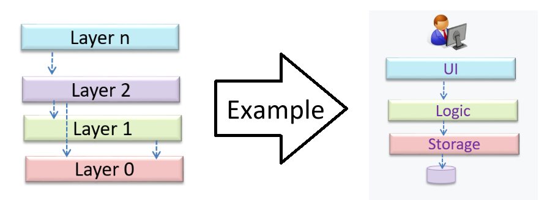

# Topics

## Important Points

### SWE Architecture

The software architecture shows the overall organization of the system and can be viewed as a very **high-level** design. It is typically designed by the software architect.


Architecture diagrams are free-form diagrams.


#### Architectural Styles

Software architectures follow various **high-level styles** (aka architectural patterns), just like how building architectures follow various architecture styles.



#### n-Tier Style

In the **n-tier** style, higher layers make use of services provided by lower layers.

<figure><figcaption></figcaption></figure>



#### Client-Server Style

The **client-server** style has at least one component playing the role of a server and at least one client component accessing the services of the server. For example, ChatGPT is an example.



### SWE Types of Testing

#### Unit Testing

**Unit testing** is to test individual units (methods, classes, subsystems, ...) to ensure each piece works correctly.

In the unit testing, we should know what are **stubs**. Basically, a stub has the same interface as the component it replaces, but its implementation is so simple that it is unlikely to have any bugs. It can isolate the SUT from its dependencies.

The **motivation** for using stubs is that: A proper unit test requires the unit to be tested in isolation so that bugs in the dependencies cannot influence the test i.e., bugs outside of the unit should not affect the unit tests.

#### Integration Testing

Integration testing is to test whether different parts of the software work together (e.g., integrates) as expected.


During the integration testing, we are not simply repeating the **unit test cases** using the actual dependencies.


### SWE Test Case Design

The testing should follow the E\&E rule, which is _efficient_ and _effective_.

#### Positive vs. Negative Test Cases

* A **positive** test case is when the test is designed to produce an **expected/valid** behavior. e.g., follow the happypath.
* On the other hand, a **negative** test case is designed to produce a behavior that indicates an **invalid/unexpected** situation, such as an **error message**. e.g., follow the errorneous path.

#### Black box vs. Glass box

Test case design can be of three types, based on how much of the SUT's internal details are considered when designing test cases:

* **Black-box approach**: test cases are designed exclusively based on the SUT’s specified external behavior.
* **White-box approach**: test cases are designed based on what is known about the SUT’s implementation, e.g., the code.
* _**Gray-box**_**&#x20;approach**: test case design uses some important information about the implementation.

#### Equivalence Partitioning

**Equivalence partition (aka equivalence class)** is a group of test inputs that are likely to be processed by the SUT in the **same** way. In this course, we have to know how to come up with the equivalence partitions.

## **Classic Pr**oblems



#### GUI Testing vs. API Testing

GUI Testing is usually **harder** than the API Testing because the GUI may be different on different devices, etc.



#### System Testing vs. Acceptance Testing

Choose the correct statements about system testing and acceptance testing.

* [x] &#x20;a. Both system testing and acceptance testing typically involve the whole system.
* [x] &#x20;b. System testing is typically more extensive than acceptance testing.
* [x] &#x20;c. System testing can include testing for non-functional qualities.
* [x] &#x20;d. Acceptance testing typically has more user involvement than system testing.
* [x] &#x20;e. In smaller projects, the developers may do system testing as well, in addition to developer testing.
* [ ] &#x20;f. If system testing is adequately done, we need not do acceptance testing.



#### Equivalence Partition

Consider this SUT:

```java
isValidName(String s): boolean
```

Description: returns true if `s` is not `null` and not longer than 50 characters.

Which one of these is least likely to be an equivalence partition for the parameter `s` of the `isValidName` method given above?

* [ ] &#x20;a. null.
* [ ] &#x20;b. strings having more than 50 characters.
* [ ] &#x20;c. strings having 50 or fewer characters.
* [x] &#x20;d. strings consisting of numbers instead of letters.

***

**Explanation:** The description does not mention anything about the content of the string. Therefore, the method is unlikely to behave differently for strings consisting of numbers.


