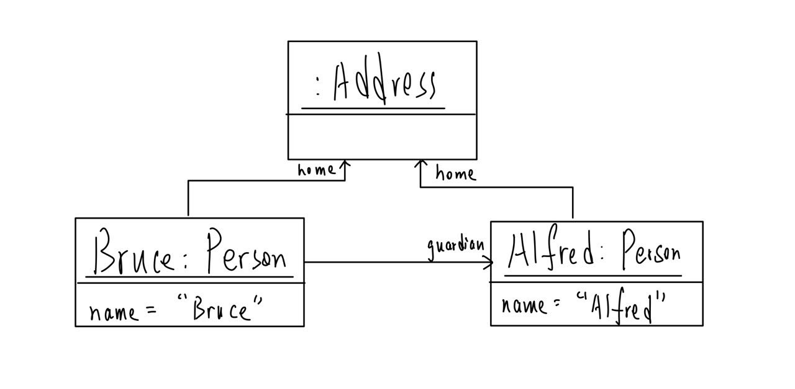
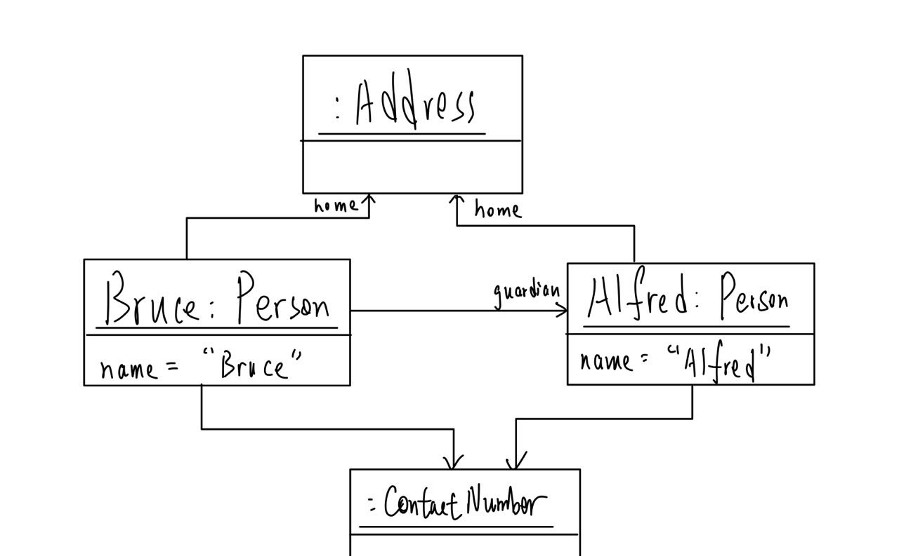
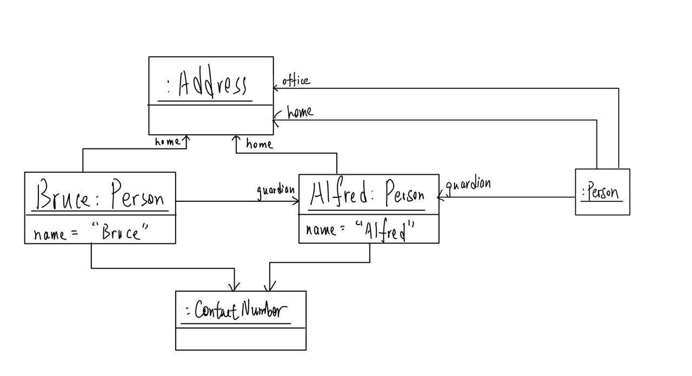
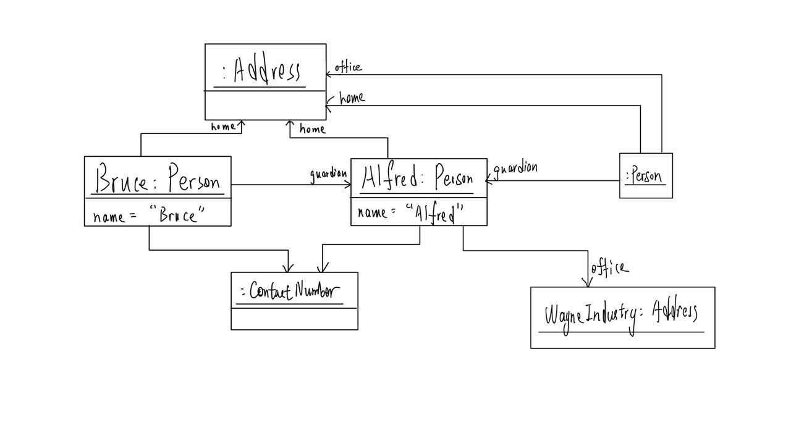
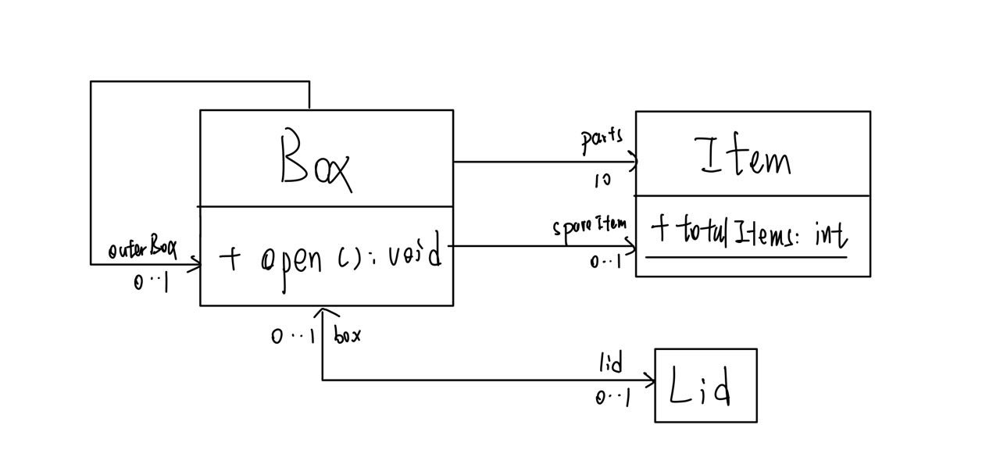

# Tut 10 - Class and Object Diagrams

## Problems

### 01. Interpret a Class Diagram



To solve this problem, I think the best way is to get the corresponding code, which should be as follows,


```java
class Person {
    private String name;
    private Address home;   // Required (multiplicity 1)
    private Address office; // Optional (multiplicity 0..1)
    private List<ContactNumber> contacts; // The 'ContactNumber' association
    
    // The constructor FORCES you to provide a home address
    public Person(String name, Address homeAddress) {
        this.name = name;
        
        if (homeAddress == null) {
            // This is good practice to prevent errors
            throw new IllegalArgumentException("A Person must have a home address.");
        }
        this.home = homeAddress;
        
        // Note: 'office' is left as null, which is valid (0..1)
    }
    
    public String getName() {
        return this.name;
    }
    
    // ...
}
```


> 1. **Attribute Multiplicity**: A plain attribute (e.g., `- name: String`) implicitly has a multiplicity of `1` (compulsory).
> 2. **Navigability (Arrow `->`)**: An arrow from `A` to `B` means "A knows about B." In code, this means Class `A` has an attribute of type `B`.
> 3. **Line Origin (Visuals)**: It does not matter where an association line starts (from the class name, attribute, or method compartment). It always represents an attribute for the entire class.

### 02. Draw an object diagram





**Step 1: There are no persons.**

No person, draw nothing LOL.



**Step 2**:`Alfred` **is the Guardian of** `Bruce`.

<figure><figcaption></figcaption></figure>

> Pay attention to the `Address` class which has a **compulsory multiplicity.**



**Step 3**: `Bruce`**'s contact number is the same as** `Alfred`**'s.**

<figure><figcaption></figcaption></figure>

> In the object diagram, the "arrow" of the association solid line **follows** the **navigability arrow** from the **class diagram**.



**Step 4**: `Alfred` **is also the guardian of another person. That person lists** `Alfred`**'s home address as his home address as well as office address.**

<figure><figcaption></figcaption></figure>



**Step 5**: `Alfred` **has an office address at the** `Wayne Industries` **building which is different from his home address (i.e.,** `Bat Cave`**).**

<figure><figcaption></figcaption></figure>



### 03. Draw a Class Diagram



<figure><figcaption></figcaption></figure>

> 1. The attribute's name will be the role name of that attribute.
> 2. Fixed sized array, like `new Items[10]` here means the `parts` attribute has the multiplicity of 10.

## Tips

1. **Attribute Multiplicity**: A plain attribute (e.g., `- name: String`) implicitly has a multiplicity of `1` (compulsory).
2. **Navigability (Arrow `->`)**: An arrow from `A` to `B` means "A knows about B." In code, this means Class `A` has an attribute of type `B`.
3. **Line Origin (Visuals)**: It does not matter where an association line starts (from the class name, attribute, or method compartment). It always represents an attribute for the entire class.
4. Pay attention to the class which has a **compulsory multiplicity.**
5. In the object diagram, the "arrow" of the association solid line **follows** the **navigability arrow** from the **class diagram**.
6. The attribute's name will be the role name of that attribute.
7. Fixed sized array, like `new Items[10]` here means the `parts` attribute has the multiplicity of 10.
