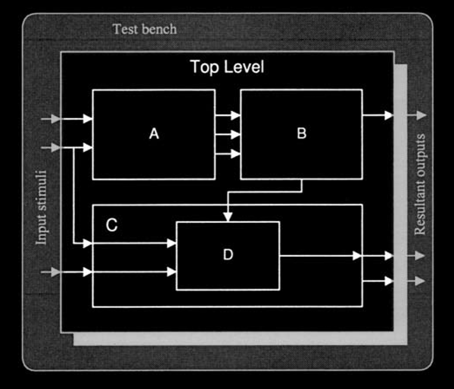
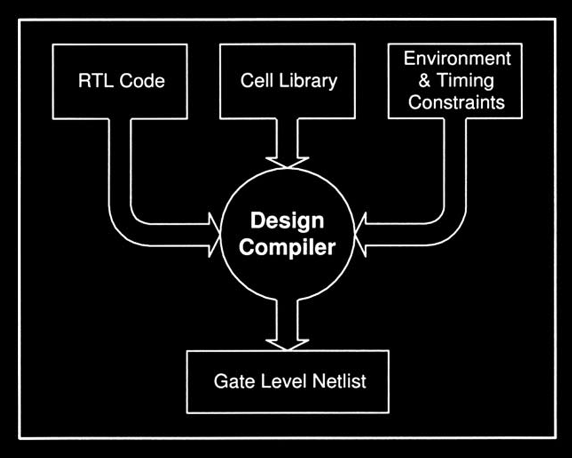

---
metaLinks:
  alternates:
    - >-
      https://app.gitbook.com/s/Sp0XaarBjbEX3JIMrRaR/textbook-2-synopsys/asic-design-methodology/traditional-design-flow
---

# Traditional Design Flow

The traditional ASIC design flow contains the steps outlined below:

1. **Architectural and electrical specification**
2. **RTL coding in HDL**
3. **DFT memory BIST insertion**, for designs containing memory elements
4. **Exhaustive dynamic simulation** of the design, in order to verify the functionality of the design
5. **Design environment setting.** This includes the **technology library** to be used, along with other environmental attributes
6. **Constraining and synthesizing** the design with **scan insertion** (and optional **JTAG**) using **Design Compiler**
7. Block level **static timing analysis**, using **Design Compiler’s built-in static timing analysis engine**
8. **Formal verification** of the design. RTL compared against the synthesized netlist, using **Formality**
9. Pre-layout **static timing analysis** on the full design through **PrimeTime**
10. Forward annotation of **timing constraints** to the layout tool
11. Initial **floorplanning** with **timing driven placement** of cells, **clock tree insertion** and **global routing**
12. Transfer of **clock tree** to the original design (netlist) residing in **Design Compiler**
13. **In-place optimization** of the design in **Design Compiler**
14. **Formal verification** between the synthesized netlist and clock tree inserted netlist, using **Formality**
15. Extraction of **estimated timing delays** from the layout after the **global routing** step (step 11)
16. Back annotation of **estimated timing data** from the global routed design, to **PrimeTime**
17. **Static timing analysis** in **PrimeTime**, using the estimated delays extracted after performing global route
18. **Detailed routing** of the design
19. Extraction of **real timing delays** from the detailed routed design
20. Back annotation of the **real extracted timing data** to **PrimeTime**
21. Post-layout **static timing analysis** using **PrimeTime**
22. Functional **gate-level simulation** of the design with post-layout timing (if desired)
23. **Tape out** after **LVS** and **DRC verification**

Figure 1-1, graphically illustrates the typical ASIC design flow discussed above.

<figure><picture><source srcset="../../.gitbook/assets/traditional-asic-design-flow-dark.png" media="(prefers-color-scheme: dark)"></picture><figcaption>
Figure 1-1 Traditional ASIC Design Flow
</figcaption></figure>


The acronyms STA and CT represent static timing analysis and clock tree respectively. DC represents Design Compiler.


## Specification and RTL Coding

### Specification

Chip design commences with the conception of an idea dictated by the market. These ideas are then translated into **architectural** and **electrical specifications**.&#x20;

1. The **architectural specifications** define the functionality and partitioning of the chip into several manageable blocks, while
2. the **electrical specifications** define the relationship between the blocks in terms of **timing** information.

The next phase involves the implementation of these specifications. Nowadays, we use HDL languages, like Verilog and VHDL, instead of drawing the schematics manually.

### Levels of Abstraction

There are three levels of abstraction that may be used to represent the design

1. **Behavioral**: It is primarily used for translating the architectural specification, to a code that can be simulated.
2. **RTL (Register Transfer Level)**: It actually describes and infers the structural components and their connections. This type of code is **synthesizable** to form a **structural netlist**.
3. **Structural:** This is usually the **netlist** and it comprises of the components from a **target library** and their respective connections; very similar to the schematic based approach.


Synopsys recently introduced **Behavior Compiler**, capable of synthesizing Behavior level style of coding. Since this is a major topic of discussion and is not relevant to this book, only RTL related synthesis is covered in this book.


## Dynamic Simulation

The next step is to check the functionality of the design by simulating the RTL code. Figure 1-2, illustrates a partitioned design surrounded by a **test bench** ready for simulation.

<figure><figcaption>
Figure 1-2 Design Hierarchy Example
</figcaption></figure>


This test bench is normally written in behavior HDL while the actual design is coded in RTL.


The purpose of the test bench is to provide necessary **stimuli** to the design. During the simulation of the RTL, the component (or gate) **timing** is not considered. Therefore, to minimize the difference between the RTL simulation and the synthesized gate-level simulation at a later stage, the delays are usually coded within the RTL source, usually for sequential elements.

## Constraints, Synthesis and Scan Insertion

### Synthesis

The advent of **synthesis tools** have taken over and performs the task of reducing the **RTL** to the **gate-level netlist**. This process is termed as **synthesis**.


Synopsys's **Design Compiler** (from now on termed as, DC) is the de-facto standard and by far the most popular synthesis tool in the ASIC industry today.


Synthesizing a design is an **iterative** process and begins with defining **timing constraints** for each block of the design. These timing constraints define the relationship of each signal with respect to the clock input for a particular block.


This is why in EE4415 Lab 01, we have the `constraint.tcl` in which we set the timing constraints and area constraints for each block of the design.


In addition to the constraints, a file defining the **synthesis environment** is also needed. The environment file specifies the technology cell libraries and other relevant information that DC uses during synthesis.


This is also why in EE4415, we have the step to setup the Synopsys environment, which we must make sure the path to the target library and link library, etc, is correct!


DC reads the RTL code of the design and using the timing constraints, synthesizes the code to structural level, thereby producing a mapped gatelevel netlist. This concept is shown in Figure 1-3.

<figure><figcaption>
Figure 1-3 Design Compiler Inputs and Outputs
</figcaption></figure>

## Formal Verification

Formal verification techniques perform validation of a design using **mathematical methods** without the need to technological considerations, such as timing and physical effects. They check for logical functions of a design by comparing it against the **reference design**.


The formal verification tool introduced by Synopsys is called **Formality**.


The main difference between **formal methods** and **dynamic simulation** is that former technique verifies the design by proving that the structure and functionality of two designs are logically equivalent. Dynamic simulation methods can only probe certain paths of the design that are sensitized, thus may not catch a problem present elsewhere.

## Static Timing Analysis using PrimeTime

As previously mentioned, the **block-level static timing analysis** is done using DC. Although, the **chip-level** static timing can be performed using the above approach, it is recommended that PrimeTime, be used instead.


PrimeTime is the Synopsys stand-alone sign-off quality static timing analysis tool that is capable of performing extremely fast static timing analysis on full **chip-level** designs.


The static timing is performed both for **pre** and **post-layout** gate-level netlist.

## Placement, Routing and Verification

### Placement

The quality of **floorplan** and **placement** is more critical than the actual **routing**. As explained previously, the constraint file is used to perform timing driven placement. The timing driven placement method forces the layout tool to place the cells according to the criticality of the timing between the cells.

### Clock Tree Insertion

After the placement of cells, the **clock tree** is inserted in the design by the **layout tool**. However, at this point of time, the **original netlist** that was generated from DC (and fed to the layout tool), lacks the **clock tree information**. Therefore, the clock tree must be **re-inserted** in the **original netlist** and **formally verified** (Step 14).

### Routing

The layout tool generally performs routing in two phases

1. Global routing (Step 11), and
2. Detailed routing (Step 18)

#### Global Routing

After **placement**, the design is globally routed to determine the quality of placement, and to provide estimated delays approximating the real delay values of the post-routed (after detailed routing) design.

#### Detailed Routing

**Detailed routing** is the final step that is performed by the layout tool. After detailed route is complete, the real timing delays of the chip are extracted, and plugged into PrimeTime for analysis.

> TODO: Add step number in Step 1 for reference.

## Engineering Change Order

**Engineering Change Order** (ECO) refers to the change required in the **netlist** at the very last stage of the ASIC design flow. For instance, ECO is performed when there is a hardware bug encountered in the design at the very last stage (say, after tape-out), and it is necessary to perform a metal mask change by re-routing a small portion of the design.
