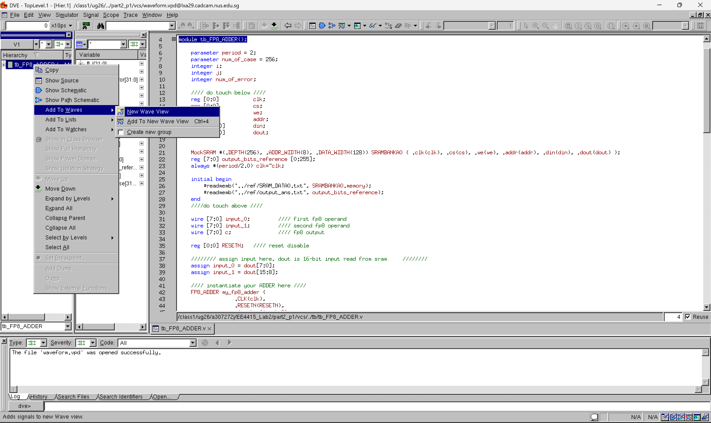
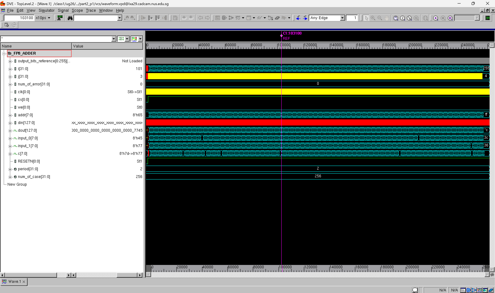

# Lab 2 - FP8 Adder Design

## System Architecture

The system architecture incorporating the FP8 adder can be shown as below.

<figure><figcaption></figcaption></figure>

In this system architecture, we shall pay close attention to the input/output registers. They exist because we want our system to **receive synchronized inputs** and **give synchronized outputs** to the next module.



#### Receive Synchronized Inputs

The synchronized inputs should **come from outside** of the module. More specifically, from the output of the previous module. This can be done in two ways:

1. Use a memory like SRAM, the data coming out from the memory can be easily **synchronized** providing that we are doing the synchronous read.
2. Add one more register at the output of the previous module to synchronize the output that will go into the input of the next module.

In Lab 2, we are using the first method to get the synchronized inputs into the FP8 adder. In our testbench, we input the cycle-incremented[^1] `addr` to the SRAM. Then after one cycle, the **synchronized** `InputA/B` will goes into our Real FP8 adder.



#### Give Synchronized Outputs

As you have seen from above, the output of a module can either

1. go into a memory system, or
2. another register

so that the output coming out from the module is **synchronized** and can be read by the next module accurately.




These two tips above explain the convention that we used in EE4415 Part 1, which is that there should always be at least one register at the input and output of the module.


## Synopsys Tips

### DC

The design compiler (DC) is a very powerful tool to know the usage of a bunch of commands that will be used in Synopsys. For example, when writing the `constraints.tcl`, I am not sure how to use the command `set_input_transition`, I can run the `dc_shell` and then type `set_input_transition -help`. This is very useful!

### VCS

VCS is usually used for us to look at the waveform and debug our RTL code. The steps from opening the waveform and then debug it are summarized as follows:



#### Open the Waveform

<figure><figcaption></figcaption></figure>

Right click the top-level module (the testbench), select the highlight part as shown above.



#### Debug the Waveform

After seeing the waveform, press <kbd>Shift</kbd> + <kbd>F</kbd> to enter the "Zoom Full" mode.

<figure><figcaption></figcaption></figure>

Then use the mouse to locate the testcase you want to debug, then press <kbd>Shift</kbd> + <kbd>=</kbd> (<kbd>+</kbd>) to "Zoom in" and you can use <kbd>Shift</kbd> + <kbd>o</kbd> (<kbd>O</kbd>) to "Zoom out".



[^1]: This means that the address going into the SRAM is incremented one cycle after another.
