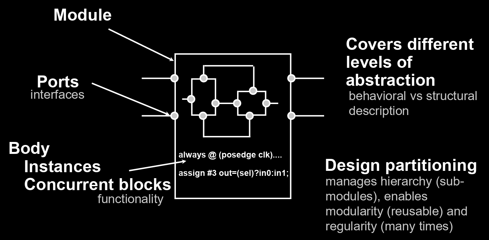
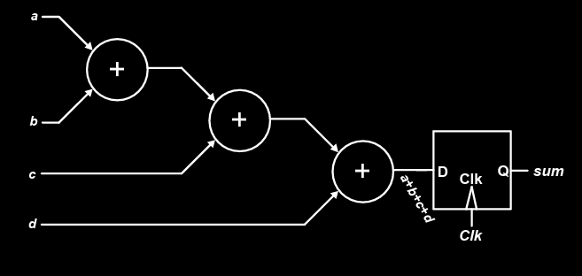
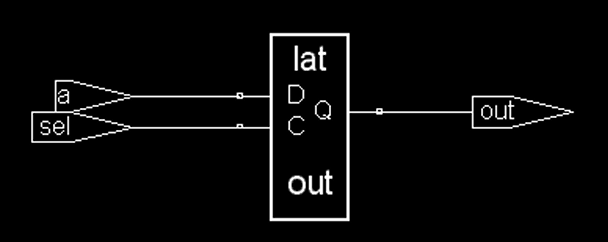
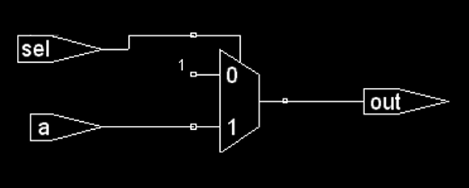

# Lec 3b - Verilog Fundamentals

At this point, we should be very familiar with the Verilog. So, the focus of this section will be

> Know how different statements written in Verilog are synthesized and how they are related to the powerful [RTL Transformation](lec-2b-rtl-transformations.md) skills we have learned.

## Verilog Coding

### Basic Verilog Concepts

### Comments

A small tip for coding comments style:

* Use single line comments (`//`) for comments.
* Reserve multi-line comments (`/* */`) for commenting out a section of code.

#### Identifiers

**Identifiers** are **names** assigned by the **user** to **Verilog objects**, such as **modules**, **variables**, and **tasks**.

#### Logic Values

**Verilog** has **four logic values**:

* **‘0’** represents **zero**, **low**, **false**, or **not asserted**.
* **‘1’** represents **one**, **high**, **true**, or **asserted**.
* **‘z’** or **‘Z’** represents a **high-impedance value**, often treated as an **unknown (‘x’)** in many contexts.
* **‘x’** or **‘X’** represents an **uninitialized** or **unknown logic value**, which may correspond to **‘0’**, **‘1’**, **‘z’**, or a value in **transition**.

#### Data Types

**Verilog** has **three data type classes**:

* **Nets** – represent **physical connections** between **devices**.
* **Registers** – represent **storage devices** or **variables**.
* **Parameters** – represent **constants**.



#### Nets

The `wire` data type in **Verilog** represents a **wire** in an **ASIC** and **cannot store or hold a value**. A **wire** must be **continuously driven** by an **assignment statement**, and its **default initial value** is **‘z’**. Most common net types are

* `wire` and `tri`
* `supply1`  and `supply0` (which are equivalent to the positive and negative power supplies respectively)



#### Registers

A **register** data type in **Verilog** is declared using the keyword **reg** and is comparable to a **variable** in a **programming language**.


Not all `reg` type variables are **always equivalent** to a hardware register, flip-flop or latch. (See when the physical registers will be inferred from [DDCA](https://app.gitbook.com/s/jTJFBPtKk6NwweAooH53/lec/lec-02-digital-system-design-and-verilog#when-are-physical-regs-inferred))


The default initial value for a reg is 'x'.



#### Parameters

Just the **constants** in Verilog.



#### Numbers

The number in verilog are represented using `<size>'<base><value>`.

* `<size>` is the number of **bits**.


One tricky example is that `2'ha5` will be truncated to `2'b01`.


### Code Structure

#### Design Entities

The **module** is the **basic unit of code** in the **Verilog language**. It should have the following structure


```verilog
module <name> (<port_names>);
    // Port declarations
    ...
    
    // Data type declarations
    ...
    
    // Functionality
    // Procedural blocks
    // Continuous assignments
    // User-defined tasks & functions
    // Primitive instances
    // Module instances
    // Specify blocks
    ...
endmodule
```




#### Basic Modeling Structure

The basic modeling structure is shown as follows:

<figure><figcaption></figcaption></figure>



#### Port Connection Rules

| Port Type | Parent Side (External Connection) | Child Side (Internal Port Declaration) |
| --------- | --------------------------------- | -------------------------------------- |
| Input     | Can be `reg` OR `wire`            | Must be `wire`                         |
| Output    | Must be `wire`                    | Can be `reg` OR `wire`                 |
| Inout     | Must be `wire`                    | Must be `wire`                         |

Think of the Parent side (external) as the place of verilog code where the **module** gets instantiated. And the Child side (internal) is the place of verilog code where the **module** is implemented.




```verilog
module Child (
    input  wire data_in,   // CHILD INPUT: Must be wire (wire is default, but explicitly written here)
    output reg  data_out,  // CHILD OUTPUT: Can be reg OR wire (using 'reg' here so we can use it in an always block)
    inout  wire data_io    // CHILD INOUT: Must be wire
);

    // Internal logic for the child
    always @(*) begin
        // Since data_out is a 'reg' internally, we can assign to it in an always block
        data_out = ~data_in; 
    end

    // Inout ports must be wires driven by continuous assignments (assign)
    // Here, we drive it to 0 if data_in is 1, otherwise we set it to high-impedance (Z)
    assign data_io = (data_in) ? 1'b0 : 1'bz;

endmodule
```





```verilog
module Parent;

    // 1. Declarations for the Parent Side
    reg  parent_data_in;   // PARENT to Child Input: Can be reg OR wire (using 'reg' to drive it in an initial block)
    wire parent_data_out;  // PARENT from Child Output: MUST be wire
    wire parent_data_io;   // PARENT to/from Child Inout: MUST be wire

    // 2. Instantiating the Child Module
    Child my_child_instance (
        .data_in  (parent_data_in),   // Driving a child 'wire' input with a parent 'reg'
        .data_out (parent_data_out),  // Reading a child 'reg' output into a parent 'wire'
        .data_io  (parent_data_io)    // Connecting a child 'wire' inout to a parent 'wire'
    );

    // 3. Driving the inputs (Why the parent input connection is often a 'reg')
    initial begin
        // Because parent_data_in is a 'reg', we can easily change its value in behavioral blocks
        parent_data_in = 1'b0;
        #10;
        parent_data_in = 1'b1;
    end

endmodule
```






#### User-Defined Primitives

We can define **primitive gates** (a **user-defined primitive** or **UDP**) using a **truth-table specification**. The **first port** of a UDP must be an **output port**, and it must be the **only output port**; **vector** or **inout ports** are not allowed. For example,


```verilog
primitive Adder(Sum, InA, InB);
    output Sum;
    input InA, InB;
    table
        // Inputs : Output
        00 : 0;
        01 : 1;
        10 : 1;
        11 : 0;
    endtable
endprimitive
```




#### User-Defined Functions

Similar to **functions in other programming languages**, **functions in Verilog are** useful for modeling **combinational logic** (like a **subroutine**). Its syntax is shown as follows:


```verilog
function [size or type] name_of_function;
    // Input declarations
    input [size-1:0] a, b, ...;
    
    // Local variable declarations
    reg [size-1:0] tmp;

    // Statements or statement group
    statement or statement_group;
endfunction
```


**Function calls** can occur:

* Within a **continuous assignment**, e.g., `assign b = func(a);`
* Indirectly within a **module instantiation**, e.g., `mod U1 (one, func(a, b));`
* Nested within another **function**

For example,


```verilog
`define FALSE 0
`define TRUE 1

module function_ex(clk);
    input clk;
    reg r1, r2, r3;

    // Function definition
    function error;
        input [7:0] a, b, c;
        if ((a != b) && (a != c))
            error = `FALSE;
        else
            error = `TRUE;
    endfunction

    always @(posedge clk)
        if (error(r1, r2, r3))
            $display("error in reg compare");

    reg d;
    always @(posedge clk)
        d = error(r1, r2, r3);
endmodule
```


The function **`error`** returns a **value** and can be used wherever a **value** is expected in the code.



## Procedures and Assignments

#### Procedures

A **Verilog procedure** is an `always` or `initial` statement, a **task**, or a **function**.

* The **statements** within a [**sequential block**](#user-content-fn-1)[^1] (i.e., statements between a **`begin`** and **`end`**) execute **sequentially** in the order in which they appear.
* However, the **procedure itself** executes **concurrently** with other **procedures** in the design.

#### Procedural Blocks

There are two types of procedural blocks:

* `initial` **blocks** – execute **only once** at the start of simulation (not synthesizable).
* `always` **blocks** – execute **repeatedly in a loop**.


Multiple procedural blocks may exist, and they execute **concurrently**.


**Contents of procedural blocks** may include:

* **Timing controls** – specify **delays** or conditions for statement execution.
* **Procedural assignments** – assign values to **variables or registers**.
* **Programming statements** – e.g., **if-else**, **case**, **loops**.

### Procedural Assignments

Assignments made within **procedural blocks** (`always` or `initial`) are called **procedural assignments**.

* **Data types**: The **LHS** must be a **register type** (`reg`, `integer`, `real`) and **cannot be a wire** (`net`).
* **RHS**: Can be **any valid expression or signal**; its value is **transferred** to the LHS.
* **Behavior**: Can be **blocking (`=`)** or **non-blocking (`<=`)**, which affects **simulation and synthesis**.

For example,


```verilog
always @(posedge clk) begin
    a = 5;               // procedural assignment
    c = 4 * 32 / 6;      // procedural assignment
    wake_up = $time;     // procedural assignment
end
```


#### Blocking Assignments (`=`)

The **next instruction** is executed **only after completing** the previous one.

* **RHS dependency**: The **RHS** is determined by the results of **previous instructions** in the same procedure.
* **Hardware implication**: Leads to **cascaded combinational logic**.

For example,


```verilog
module adder(clk, a, b, c, d, sum);
    input clk;
    input [63:0] a, b, c, d;
    output reg [64:0] sum;

    always @(posedge clk) begin
        sum = a + b + c + d;  // blocking procedural assignment
    end
endmodule
```


The synthesis of the above block of code will be:

<figure><figcaption></figcaption></figure>


There is a register in front of `sum` because `sum` is defined as a `reg` and it appears in an `always @(posedge)` block. But it is **not recommended** to do so, use **non-blocking assignment `<=`**  instead!


#### Non-Blocking Assignments (`<=`)

Instructions are executed **without waiting** for the previous one.

* **RHS dependency**: The **RHS** is taken from the **values available at the event** in the **sensitivity list** (`always @`).
* **Hardware implication**: **Registers** are inserted; all outputs are **updated together** at the **end of the procedure**, independent of input evaluation order.

For example,


```verilog
module adder(clk, a, b, c, d, sum);
    input clk;
    input [63:0] a, b, c, d;
    output reg [64:0] sum;
    reg [64:0] x, y;

    always @(posedge clk) begin
        x <= a + b;      // non-blocking assignment
        y <= c + d;      // non-blocking assignment
        sum <= x + y;    // sum uses x, y from beginning of cycle
    end
endmodule
```


The synthesis of the above block of code will be:

<figure><figcaption></figcaption></figure>

### Continuous Assignment

**Continuous assignment** assigns a value to a `wire` in a similar way that a real logic gate drives a real wire. Its main use is to **model combinational logic**.

### Control Statements

There are two types of programming statements:

1. Conditional (`if/else`, `case`)
2. Looping (`while/for`)


The programming statements should **only** be used in procedural blocks.


#### Conditional

In EE4218, we have a glimpse of how the [**conditional expansion**](https://app.gitbook.com/s/W45nwClYZdzz9MQG1dUb/micheli/hardware-modeling/compilation-and-behavioral-optimization#conditional-expansion) is done. This helps us a lot in knowing what is getting **synthesized** in an verilog `if/else`  or `case` statement.



#### If/Else Statements


```verilog
// Before synthesis
if (cond1)          signal_name<=value1;
else if (cond2)     signal_name<=value2;
else                signal_name<=defaultvalue;

// After synthesis
signal_name <= cond1*value1 + not(cond1)*cond2*value2 + not(cond1)*not(cond2)*...*defaultvalue
```


If we use the `if/else` statement, we are saying that the first-appeared **conditions** have **higher priority** than the later-appeared **conditions**.


Let's say if `cond1`  and `cond2` are **mutually exclusive**, then we will have a **redundant** term `not(cond1)*cond2*value2`. This gives us a warning that we should carefully decide our conditions.




#### Case Statements


```verilog
// Before Synthesis
case (a[n-1]...a[0])
    item1: value1;
    item2: value2;
    ...
    itemn: valuen;
endcase

// After Synthesis
signal_name <= cond1*value1 + cond2*value2 + ... condn*valuen
```


Unlike the `if/else` statements, we don't have any priority in the `case` statements.



<details>

<summary>Inferred Latches in Synthesis</summary>

> We have seen the danger of inferred latches in EE4218. Now, let's study it in detail.

Suppose we write the following code but we intend to write a multiplexier instead of a latch.


```verilog
always @(sel or a or b) begin
    if (sel) begin
        out = a;
    end
end
```


The synthesis tool will give us a **transparent high** latch shown as follows:

<figure><figcaption></figcaption></figure>

The latch is **transparent high** is because `out` will update only when `sel` is high. Otherwise, it will remember its state.

To avoid this issue, we should also write a default value for the `out`.


```verilog
always @(sel or a or b) begin
    out = 1'b1;
    if (sel) begin
        out = a;
    end
end
```


And this will give us the correct multiplexer we want:

<figure><figcaption></figcaption></figure>

</details>

#### Looping

Similarly, we have seen the power of loop unrolling in both [CG3207](https://app.gitbook.com/s/jTJFBPtKk6NwweAooH53/lec/lec-06-advanced-processor#loop-unrolling) and [EE4218](https://app.gitbook.com/s/W45nwClYZdzz9MQG1dUb/micheli/hardware-modeling/compilation-and-behavioral-optimization#loop-expansion). In Verilog, although the loop statements like `for/while` is supported, there is **no timing** information involved in these statements. This means that the hardware compiler will **expand all the loops** and if the unrolled statements are **independent**, they are all executed **in parallel**.

For example, in real-world applications (like [Mach-V](https://mendax1234.github.io/Mach-V/)), we prefer to use an `initial` block with a `for` loop to initialize the memory and it may look like below


```verilog
initial begin
    for (i = 0; i < ENTRIES; i = i + 1) begin
        btb[i] <= 32'd0; // btb is the branch target buffer which is essentially a memory
    end
end
```


In practice, this loop is **unrolled**, and all elements of the memory array are initialized to 0 in **parallel**.

## Simulation

There are two types of verilog event based simulators:

1. Interpreted: like Verilog-XL
2. Compiled: like Verilog Compiled Simulator (VCS)

We will use the VCS is EE4415's lab experience.

### Event Driven Simulation

Most [logical simulations](#user-content-fn-2)[^2] are **event-driven**, meaning that the simulator remains idle and performs computations only when specific changes occur.

One example is used to compare the blocking statements and non-blocking statements.


```verilog
module block_nonblock();
reg a, b, c, d , e, f ;

// Blocking assignments
initial begin
  a = #10 1'b1; // The simulator assigns 1 to a at time 10
  b = #20 1'b0; // The simulator assigns 0 to b at time 30
  c = #40 1'b1; // The simulator assigns 1 to c at time 70
end

// Nonblocking assignments
initial begin
  d <= #10 1'b1; // The simulator assigns 1 to d at time 10
  e <= #20 1'b0; // The simulator assigns 0 to e at time 20
  f  <= #40 1'b1; // The simulator assigns 1 to f at time 40
end
  
endmodule
```


> TODO: Do the exercises from Slide 55-63 in Lec 03b for Midterm review!

[^1]: This is just the **procedure** here.

[^2]: Logic simulation is the process of verifying the functional behavior and timing of a digital design (written in HDL like Verilog or VHDL) before it is manufactured. Unlike analog simulations (like SPICE) that calculate continuous voltages and currents, logic simulation abstracts signals into discrete values (0, 1, Z, X) to maximize speed and handle complex systems.
