# Lec 1 - MOSFET and CMOS Process

## Background

This part requires you to have a good command of [CG2027 Lec 1 Device](https://app.gitbook.com/s/6nPr3SObC3azazbFhfgF/lec/lec-01-the-devices), while you will also gain a deeper understanding of certain parts in CG2027.

### Semiconductors

**Semiconductors** are made mainly by **doping** the silicon (Group IV) with either dopants from Group V or dopants from Group III. This will give us two types of semiconductors:

1. **n-type**: Dopants are from Group V elements. The **free carriers** are **electrons**. Current flows in channel due to flow of free **electrons**.
2. **p-type**: Dopants are from Group III elements. The **free carriers** are **holes**. Current flows in channel due to flow of free **holes**.


The [**concentration** of **free carriers**](#user-content-fn-1)[^1] determine the resistivity of the semiconductor.


### The MOS Capacitor

#### The MOS Capapictor with P-substrate

There are 4 stages for the MOS capacitor with P-substrate and the **stage transformation** is done by increasing $$V_{\text{gate}}$$.

<figure>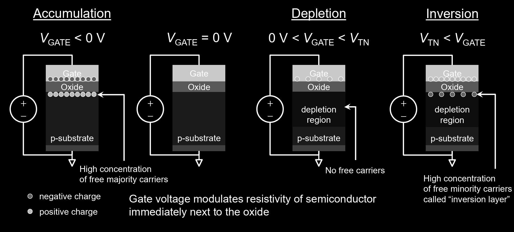<figcaption></figcaption></figure>



#### Accumulation

When $$V_{\text{gate}}<0$$, we have a large amount of **electrons** accumulating at the upper side of the Oxide. This will attract the **holes** with positive charge to the lower side of the Oxide. As a result, the **concentration** of the holes, which are the **free carriers** in the p-type semiconductor, **increases** at the top of the p-substrate. This makes the top of the p-substrate **a lot more "**&#x70;-typed".



#### $$V_{\text{gate}}=0$$

In this stage, we increase $$V_{\text{gate}}$$ from negative to 0. Now, there is no electron at the gate. Thus, the **concentration** of **holes** in the p-substrate is **balanced**.



#### Depletion

When we increase $$V_{\text{gate}}$$  to $$0<V_{\text{gate}}<V_{\text{TN}}$$, there will be **some** **positive charges** at the gate, causing the **holes** in the p-substrate to be pushed to its bottom. This will cause a special region called the **depletion region** to be formed at the top of the p-substrate.


#### Depletion Region

We can just think of the **depletion region** as the region where there is **few/no free carriers**. In this case, as the free carriers — holes — of p-substrate is pushed away by the positive charges in the gate, there is few holes in the top region of the p-substrate.




#### Inversion

When we increase $$V_{\text{gate}}$$ to $$V_{\text{gate}}>V_{\text{TN}}$$, there will be **a large amount** of **positive charges** at the gate, causing **more** holes to be pushed away. **And more electrons will be attracted** to the top of the p-substrate. This will cause a special layer called **inversion layer** to be formed at the top of the p-substrate.


#### Inversion Layer

The **inversion layer** can be thought of as the region/layer where there is a **high concentration** of **free minority carriers**. In this case, the free minority carriers in p-substrate are **electrons**.




#### The MOS Capacitor with N-Substrate

<figure>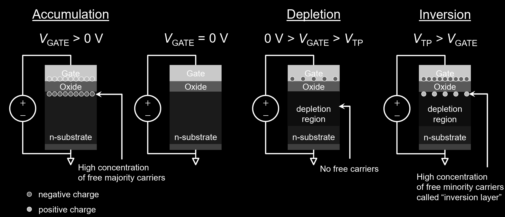<figcaption></figcaption></figure>


Note that for p-type semiconductor, the threshold voltage $$V_{\text{TP}}$$ is **negative**.


The derivation is very similar to the p-substrate and thus it is left as an exericse for the reader.

> TODO: Update the Depletion Region in the PN Junction a.k.a diode.

### Classification of FETs

The classification of FETs can be shown as follows.

<figure>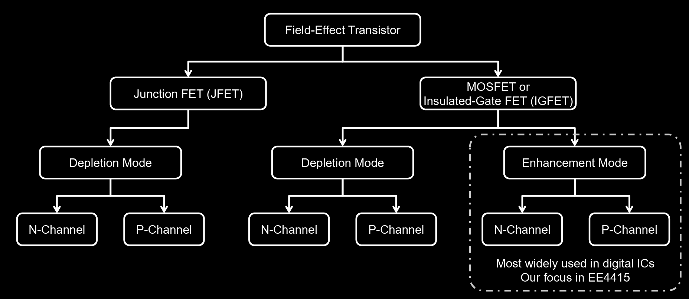<figcaption></figcaption></figure>

As you can see, our focus in EE4415 will be the MOSFETS under the **enhancement mode**.


#### Enhancement vs. Depletion mode

* **Enhancement**: Electrical stimulus ($$V_{\text{gate}}$$) applied to create **inversion layer** in channel.
* **Depletion**: Electrical stimulus ($$V_{\text{gate}}$$) applied to **deplete** channel of free carriers.


## The MOSFET

### Structure

#### NMOS

The NMOS structure as well as its circuit symbol used in EE4415 Part 2 is shown below.

<figure>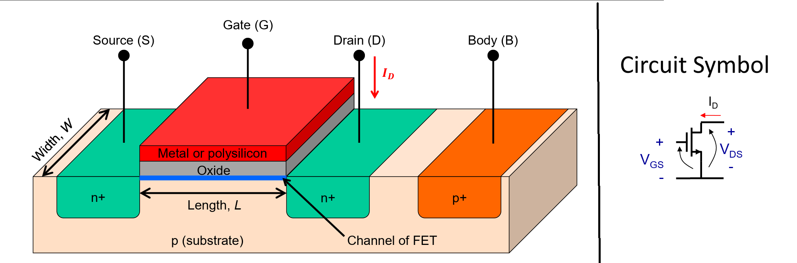<figcaption></figcaption></figure>

The NMOS/PMOS (we will see later) has four pins: 1) source, 2) drain, 3) gate and 4) body. Regarding these four pinrs, there are some very important conventions that we should know.



#### Body

The **body** pin is usually connected to a **fixed voltage**. We actually don't really care too much about how much that fixed voltage is.


If we really care about the body voltage, that's called **body effect** which we will see later. Basically, the idea for the body effect is that the body voltage may affect the threshold voltage of the MOSFET.




#### Source and Drain

In MOSFETs, the source and drain are **identical**! So, either the left or right n-doped region can be treated as source/drain. And the definition for the **source/drain** comes from the **current flow**, or more precisely, the **free carrier's flow**.

In NMOS, the current flows from the **drain** to the **source**. As the free carrier in N-doped region is **electron** which contain **negative charge**, the flow of free carriers is from **source** to the **drain**. This gives us the definition of **source** and **drain** in MOSFETs, which is

> The **source** is the **source of free carriers** while the **drain** is the **drain of free carriers**.



#### Gate

As we have seen in CG2027, the **gate** pin is where we apply the voltage to control the "channel width" of the n-channel (in NMOS). If we simply look at the gate part, we can find out that this is the [mos capacitor](lec-1-mosfet-and-cmos-process.md#the-mos-capacitor) we have seen above! Thus, whatever analysis we have done in the MOS capacitor applies here as well!

Besides, there is a small difference between the **gate voltage** we applied and the real voltage above the **channel**. The relationship can be shown below.

<figure><figcaption></figcaption></figure>



#### Circuit Symbol

In the circuit symbol of NMOS, we define the **positive current direction** $$I_D$$ to be the direction **flowing into** the drain.


We use the same convention in the PMOS as well even though some other textbooks might use different convention.




#### Assumptions

In NMOS, we usually make the following important assumptions:

1. **source** of NMOS is at **lower** voltage than **drain**.
2. **body** forms **pn-junction** diodes with **source** and **drain**.
3. **body** is usually connected to **GND**.



To understand the channel formation and the current flow in NMOS, we have the following animation.

<figure>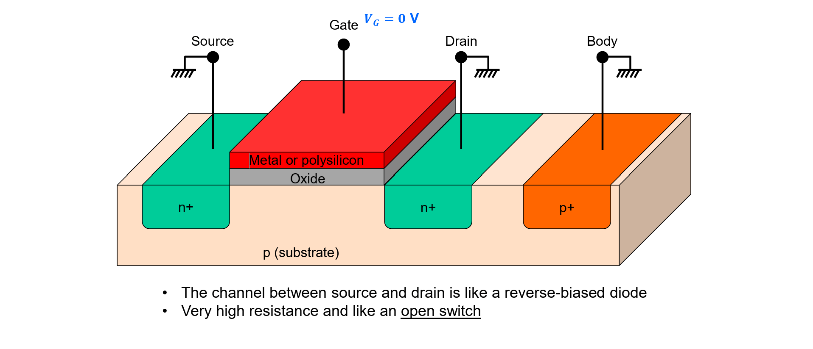<figcaption></figcaption></figure>

#### PMOS

Similarly, the structure and circuit symbol of PMOS can be shown as follows.

<figure>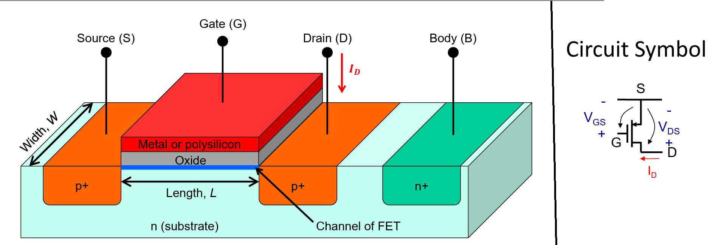<figcaption></figcaption></figure>

The conventions made in NMOS apply here as well.



#### Body

Same as NMOS.



#### Source and Drain

Same as NMOS. In PMOS, we will find out that the current flows from source to drain. As the free carrier in p-doped material is **holes** which contain positive charge. The free carrier's flow is the **same** as the current flow, which is from source to drain. Thus, the source and drain definition we made above also applies here!



#### Gate

Same as NMOS.



#### Circuit Symbol

Same as NMOS except that as we have seen above, the current flow in PMOS is from source to drain. Thus, using the same convention of the current direction we've set in NMOS, the current in PMOS will take a **negative sign**.



#### Assumptions

1. **source** of PMOS is at **higher** voltage than **drain**.
2. **body** forms **pn-junction** with **source** and **drain.**
3. **body** is usually connected to $$V_{\text{DD}}$$.



### I-V Characteristic

The same NMOS I-V characteristic equations can be applied to PMOS but the conditions for the regions of operations are **flipped**.

<figure>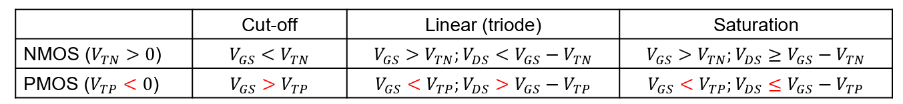<figcaption></figcaption></figure>

So, we just need to memorize one version of the equation. More specifically, we just need to memorize **one formula**, which is the formula of the linear region (Will see soon why it is this case)!


Feel a bit hard in memorizing this formula? Don't worry, we will derive the formula soon!


#### NMOS

Assume that in our NMOS,

* The voltage at source $$V_s=0$$.
* As per our previous assumption, the source voltage is **lower** than the drain voltage, thus $$V_D>0$$.
* Set the body voltage $$V_B=0$$ so that the source and drain diodes are off because of the **reverse-biased** pn-junction in between the source/drain and the body.

Three regions of operation:



#### Cut-off: $$V_{\text{GS}}\leq V_{\text{TN}}$$

$$
I_D\approx0
$$


We will see later in this section that in the **cut-off** region, the $$I_D$$ might not be exactly zero because of the **sub-threshold leakage**.




#### **Linear**: $$V_{\text{GS}}>V_{\text{TN}}$$ and "small" $$V_{\text{DS}}$$

$$
I_D=\mu_n C_{\text{OX}}\frac{W}{L}\left [ (V_{\text{GS}}-V_{\text{TN}})V_{\text{DS}}-\frac{V_{\text{DS}}^2}{2}\right](1+\lambda_nV_{\text{DS}})
$$

For small $$V_{\text{DS}}$$, e.g., $$V_{\text{DS}}\ll V_{\text{GS}}-V_{\text{TN}}$$, we can omit the second order term. Thus, we can get a **linear** dependence between $$V_{\text{DS}}$$ and $$I_D$$. (Assume $$\lambda_n=0$$, $$L>1\mu \text{m}$$)

$$
I_D=k_n'\frac{W}{L} (V_{\text{GS}}-V_{\text{TN}})V_{\text{DS}}~(k_n'=\mu_nC_{\text{OX}})
$$

The **on-resistance** of a transistor in a **linear region** can thus be easily calculated using the ohm's law.


Here, we assume that the gate voltage $$V_{\text{gate}}=V_{\text{DD}}$$.


$$
R_{\text{DS}}=\frac{V_{\text{DS}}}{I_{\text{D}}}=\frac{1}{k_n'(W/L)(V_{\text{GS}}-V_{\text{TN}})}=\frac{1}{k_n'(W/L)(V_{\text{DD}}-V_{\text{TN}})}
$$



#### **Saturation**: $$V_{\text{GS}}>V_{\text{TN}}$$ and "large" $$V_{\text{DS}}$$

$$
I_D=\mu_n C_{\text{OX}}\frac{W}{L}\left [ (V_{\text{GS}}-V_{\text{TN}})V_{\text{DSAT,n}}-\frac{V_{\text{DSAT,n}}^2}{2}\right](1+\lambda_nV_{\text{DS}})
$$

In the saturation region, $$V_{\text{DSAT,n}}$$ is the value that $$V_{\text{DS}}$$ saturates at. In our case, it will be $$V_{\text{GS}}-V_{\text{TN}}$$. After replacing $$V_{\text{DSAT,n}}$$ with $$V_{\text{GS}}-V_{\text{TN}}$$, we can get the exact same formula that we have seen in CG2027, which is

$$
I_D=\frac{1}{2}\mu_n C_{\text{OX}}\frac{W}{L}(V_{\text{GS}}-V_{\text{TN}})^2(1+\lambda_nV_{\text{DS}})
$$


We will see later in the **linear** and **saturation** region, the term $$(1+\lambda_nV_{\text{DS}})$$ is because of the [**channel length modulation**](lec-1-mosfet-and-cmos-process.md#channel-length-modulation) (CLM). What this term really means is that if we **don't consider** the CLM, then $$\lambda_n$$ or $$\lambda_p$$ will be 0, thus the drain current $$I_D$$ is **independent** of $$V_{\text{DS}}$$.





The **formula** (a quadratic formula about the independent variable $$V_{\text{DS}}$$ and the dependent variable $$I_D$$) for both the **linear** and **saturation** region is the **same**! It's just that in the saturation region, we prefer to take the fixed value of $$V_{\text{DS}}$$, plug it in and get a **maximum current**, which is the saturated current.


#### PMOS

Similarly, assume that in our PMOS

* The source voltage is $$V_s=V_{\text{DD}}$$.
* As per our previous assumption, the source voltage is **higher** than the drain voltage. Thus, $$V_{D}<V_{\text{DD}}$$.
* Set the body voltage $$V_B=V_{\text{DD}}$$ so that the source and drain diodes are off because of the pn-junction in between the source/drain and the body.

For the three regions of operation, it is exactly the same as NMOS except that we need to **flip all the inequality signs** and change some constants like the mobility $$\mu$$ and $$\lambda$$ to PMOS's one.



#### Cut-off: $$V_{\text{GS}}\geq V_{\text{TP}}$$

$$
I_D\approx0
$$



#### **Linear**: $$V_{\text{GS}}<V_{\text{TP}}$$ and "small" $$V_{\text{DS}}$$

$$
I_D=\mu_p C_{\text{OX}}\frac{W}{L}\left [ (V_{\text{GS}}-V_{\text{TP}})V_{\text{DS}}-\frac{V_{\text{DS}}^2}{2}\right](1+\lambda_pV_{\text{DS}})
$$

For small $$V_{\text{DS}}$$, e.g., $$V_{\text{DS}}\gg V_{\text{GS}}-V_{\text{TP}}$$, we can omit the second order term. Thus, we can get a **linear** dependence between $$V_{\text{DS}}$$ and $$I_D$$. (Assume $$\lambda_p=0$$, $$L>1\mu \text{m}$$)

$$
I_D=k_p'\frac{W}{L} (V_{\text{GS}}-V_{\text{TP}})V_{\text{DS}}~(k_p'=\mu_pC_{\text{OX}})
$$

The **on-resistance** of a transistor in a **linear region** can thus be easily calculated using the ohm's law.

$$
R_{\text{DS}}=\frac{V_{\text{DS}}}{I_{\text{D}}}=\frac{1}{k_n'(W/L)(V_{\text{GS}}-V_{\text{TP}})}=\frac{1}{k_n'(W/L)(-V_{\text{DD}}-V_{\text{TP}})}
$$


$$k_p'<0$$ and $$V_{\text{TP}}<0$$. We assume that the gate voltage $$V_{\text{gate}}=0.$$




#### **Saturation**: $$V_{\text{GS}}<V_{\text{TP}}$$ and "large" $$V_{\text{DS}}$$

$$
I_D=\mu_p C_{\text{OX}}\frac{W}{L}\left [ (V_{\text{GS}}-V_{\text{TP}})V_{\text{DSAT,p}}-\frac{V_{\text{DSAT,p}}^2}{2}\right](1+\lambda_pV_{\text{DS}})
$$

In the saturation region, $$V_{\text{DSAT,n}}$$ is the value that $$V_{\text{DS}}$$ saturates at. In our case, it will be $$V_{\text{GS}}-V_{\text{TN}}$$. After replacing $$V_{\text{DSAT,n}}$$ with $$V_{\text{GS}}-V_{\text{TN}}$$, we can get the exact same formula that we have seen in CG2027, which is

$$
I_D=\frac{1}{2}\mu_p C_{\text{OX}}\frac{W}{L}(V_{\text{GS}}-V_{\text{TP}})^2(1+\lambda_pV_{\text{DS}})
$$



### Derive the Ideal IV Formula

As the NMOS and PMOS are 99% the same, let's take NMOS as an example here. The strategy used here is that

> Use the **definition of current**, to determine the $$I_D$$, we need to determine the **total inversion layer charge** $$Q_{\text{inv}}$$ and divide it by the **time taken to go across channel** from source to drain $$t_{\text{transit}}$$.
>
> 
I_D=Q_{\text{inv}}\div t_{\text{transit}}

#### Transit Time $$t_{\text{transit}}$$

Assume that **free electrons** (free carriers in n-type material) move at a **constant velocity** $$v$$, across the channel of length $$L$$, then:

$$
v=\frac{L}{t_{\text{transit}}}\rightarrow\frac{1}{t_{\text{transit}}}=\frac{v}{L}
$$

In a semiconductor, $$v=\mu\xi=\mu\frac{V_{\text{DS}}}{L}$$.

* $$\mu$$: carrier mobility
* $$\xi$$: electric field
* The section substitution utilises the fact that $$\xi=\frac{V}{L}$$.

So, we can get our transit time $$t_{\text{transit}}$$ to be

$$
\frac{1}{t_\text{transit}}=\frac{\mu}{L^2}V_{\text{DS}}
$$

#### Total Charge $$Q_{\text{TOTAL}}$$

Our ultimate goal is to get the charge at the inversion layer $$Q_{\text{inv}}$$. To do that, we need to solve the following poisson equation in MOS structure.

$$
Q_{\text{TOTAL}}=Q_{\text{inv}}+Q_{\text{DEPLETION}}
$$

Before solving that, let's make the following approximations



#### First-order approximation 1

Consider the MOS capacitor structure in the channel to be a **parallel-plate capacitor** ($$Q=CV$$). Thus, we have $$Q_{\text{TOTAL}}$$ to be

$$
Q_{\text{TOTAL}}=C_{\text{OX}}WLV_{\text{CAP}}=C_{\text{OX}}WL(V_G-V_{\text{channel}})
$$

where $$C_{\text{OX}}$$ is the capacitance per unit area.



#### First-order approximation 2

Let's consider the channel voltage $$V_{\text{channel}}$$ to be at the **midpoint** of the channel so that,

$$
V_{\text{channel}}=\frac{V_D+V_S}{2}
$$



#### First-order approximation 3

Up until now, how do we determine the $$Q_{\text{DEPLETION}}$$? This is where oru first-order approximation 3 comes into play. We assume that when $$0<V_{\text{G}}\leq V_{\text{TN}}$$, $$Q_{\text{inv}}=0$$. Thus, right at the **onset/edge point** of inversion (e.g., $$V_G=V_{\text{TN}}$$):

$$
C_{\text{OX}}WLV_{\text{TH}}=Q_{\text{DEPLETION}}+Q_{\text{inv}}=Q_{\text{DEPLETION}}
$$

Thus, later increases in $$V_G$$ only increases $$Q_{\text{inv}}$$.



#### Inversion Charge $$Q_{\text{inv}}$$

Now, knowing how to denote the total charge $$Q_{\text{TOTAL}}$$ and the depletion charge $$Q_{\text{inv}}$$, we can plug in the numbers and get to our ultimate goal, which is the inversion charge $$Q_{\text{inv}}$$.

For $$V_{\text{G}}\geq V_{\text{TH}}$$, in our NMOS example (PMOS is the same):

$$
\begin{align*}
Q_{\text{inv}} &= C_{\text{OX}}WL \left( V_G - \frac{V_D + V_S}{2} \textcolor{red}{-} \textcolor{red}{V_{TN}} \right) \\
&= C_{\text{OX}}WL \left( V_G - \frac{V_D}{2} - \frac{V_S}{2} - V_{TN} \textcolor{red}{+} \textcolor{red}{V_S} \textcolor{red}{-} \textcolor{red}{V_S} \right) \\
&= C_{\text{OX}}WL \left( (V_G - V_S) - V_{TN} - \frac{V_D}{2} + \left( V_S - \frac{V_S}{2} \right) \right) \\
&= C_{\text{OX}}WL \left( V_{GS} - V_{TN} - \frac{V_D}{2} + \frac{V_S}{2} \right) \\
&= C_{\text{OX}}WL \left( V_{GS} - V_{TN} - \frac{V_D - V_S}{2} \right) \\
&= C_{\text{OX}}WL \left( V_{GS} - V_{TN} - \frac{V_{DS}}{2} \right)
\end{align*}
$$

#### Final Formula

Then we combine the $$Q_{\text{inv}}$$ and the $$t_{\text{transit}}$$, plug in the number, we will get the final formula!

$$
\begin{align*}
I_D&=Q_{\text{inv}}\frac{\mu_n}{L^2}V_{\text{DS}}\\
&=\mu_nC_{\text{OX}}\frac{W}{L}\left( (V_{\text{GS}}-V_{\text{TN}})V_{\text{DS}}-\frac{V_{\text{DS}}^2}{2}\right)
\end{align*}
$$

This will be the linear region equation and it is shown in the diagram below. This diagram is composed by fixing the $$V_{\text{GS}}$$, and then slowly increasing the $$V_{\text{DS}}$$ to measure the $$I_D$$.

<figure>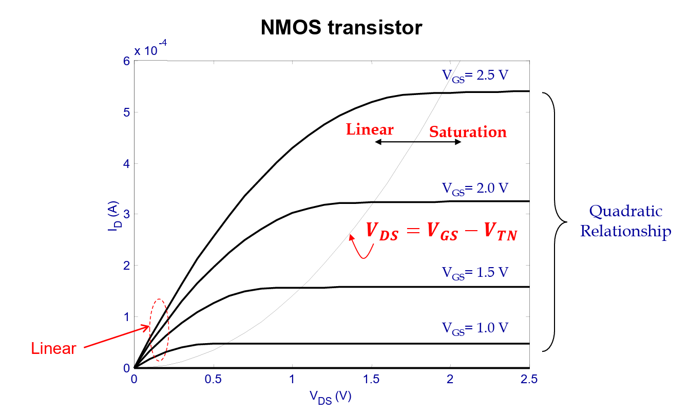<figcaption></figcaption></figure>

In the saturation region, we just need to find the **maximum point** of the parabola. This is when $$V_{\text{DS}}\geq V_{\text{GS}}-V_{\text{TN}}$$, we substitute $$V_{\text{DS}}=V_{\text{DSAT,n}}=V_{\text{GS}}-V_{\text{TN}}$$. We will get the following saturated $$I_D$$:

$$
I_D=\mu_n C_{\text{OX}}\frac{W}{L}(V_{\text{GS}}-V_{\text{TN}})^2
$$

## Secondary Effects

In the real case, the I-V characteristic diagram isn't as **ideal** as we think. We might encounter some seconday effects as well.

### Channel Length Modulation

When $$V_{\text{DS}}\neq0$$, the inversion layer is **not uniform** across channel.

<figure>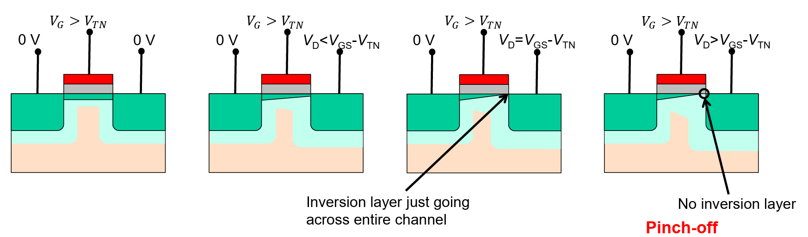<figcaption></figcaption></figure>

This can be intuitively understood by the ["suck" theorem](https://app.gitbook.com/s/6nPr3SObC3azazbFhfgF/lec/lec-01-the-devices#in-between-linear-and-saturation) we have seen in CG2027. Basically, this means that as we increase $$V_{\text{DS}}$$, it will suck **more** free carriers from the source and suck it faster, causing the channel near the drain to be thinner. To take care of this **secondary effect**, we add the term $$(1+\lambda_nV_{\text{DS}})$$ into our formula, so that

1. **Linear region**: $$I_D=\mu_n C_{\text{OX}}\frac{W}{L}\left [ (V_{\text{GS}}-V_{\text{TN}})V_{\text{DS}}-\frac{V_{\text{DS}}^2}{2}\right](1+\lambda_nV_{\text{DS}})$$
2. **Saturation region**: $$I_D=\mu_n C_{\text{OX}}\frac{W}{L}\left [ (V_{\text{GS}}-V_{\text{TN}})V_{\text{DSAT,n}}-\frac{V_{\text{DSAT,n}}^2}{2}\right](1+\lambda_nV_{\text{DS}})$$

The **channel length modulation** factor $$\lambda \propto\frac{1}{L}$$. Intuitively, this means that if the channle length $$L$$ is longer, the MOSFET suffers **less** from the channel length effect.


In the I-V diagram of $$I_D$$ and $$V_{\text{DS}}$$, this **channel length modulation** can be seen by how flat the saturation line is. If it is **flatter**, meaning that the device suffers little from the channel length modulation and vice versa. In other words, the device's current in the saturation region [isn't affected too much](#user-content-fn-2)[^2] by the change[^3] of $$V_{\text{DS}}$$. This will become clearer when we compare the **long-channel device** and the **short-channel device** later.



In the real circuit design, we often use the following two conventions to make the life easier

1. **Overdrive voltage**: $$V_{\text{OD}}=V_{\text{GS}}-V_{\text{TN}}$$.
2. **MOSFET Aspect ratio**: $$W/L$$ (Channel width / length).


#### Short-Channel Effect

The free carriers **cannot** be always accelerated under the electric field along the channel. When the electric field field along the channel reaches a critical value $$\xi_c$$ , the velocity tends to **saturate** due to scattering effects. This can be illustrated in the following Figure.

<figure>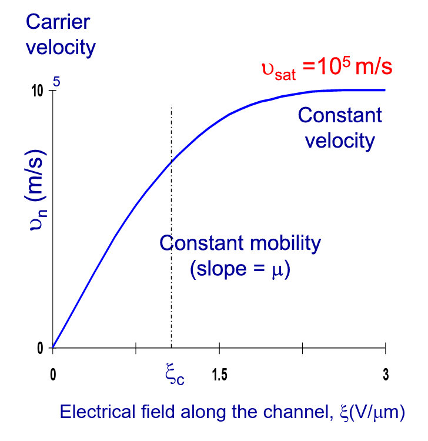<figcaption></figcaption></figure>

The saturation velocity for electrons and holes is approximately the same: $$10^5$$m/s. The velocity is approximated by the following expression:

$$
\begin{align*}
v&=\frac{\mu_n\xi}{1+\xi/\xi_c}\quad\quad\text{for }\xi<\xi_c\\
&=v_{\text{sat}}=\mu_n\xi_c\quad\text{ for }\xi\geq\xi_c
\end{align*}
$$

The critical electric field $$\xi_c=\frac{V_{\text{DSAT,S}}}{L}$$, where $$V_{\text{DSAT,S}}$$ is the saturation voltage for a short channel device.

<figure>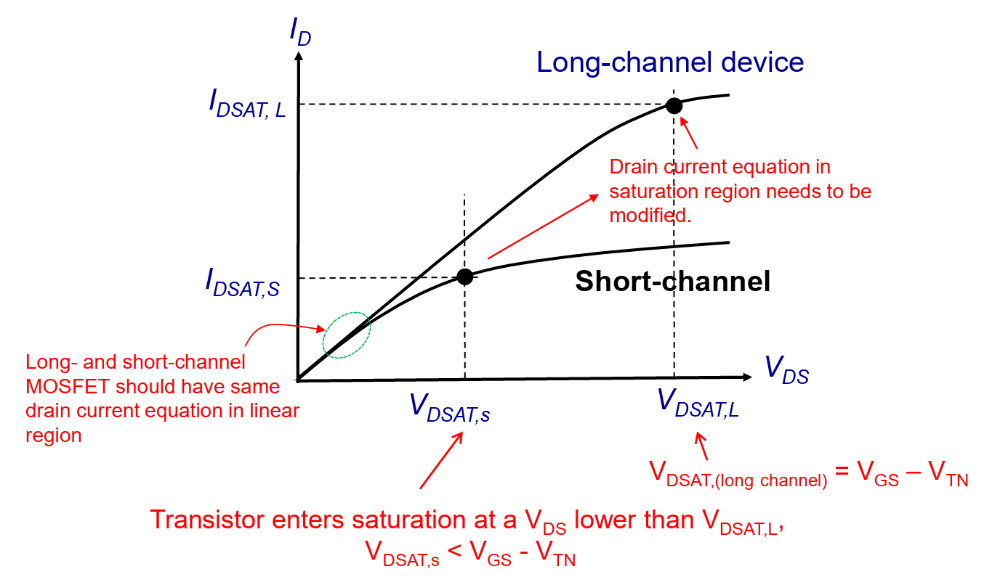<figcaption></figcaption></figure>

From this figure we can see that a short-channel device experiences an **extended saturation** region, and tend to operate more often in saturation condition than their long-channel counterparts.

To get the saturated current $$I_{\text{DSAT,S}}$$, we can replace the $$V_{\text{DS}}$$ in the formula we derived above with $$V_{\text{DSAT,S}}$$. Thus, we will get

$$
I_{\text{DSAT,S}}=\mu_nC_{\text{OX}}V_{\text{DSAT,S}}\left(\frac{W}{L}\right)\left(V_{\text{GS}}-V_{\text{TN}}-\frac{V_{\text{DSAT,S}}}{2}\right)
$$


This equation applies to both NMOS and PMOS. For the PMOS counterpart, we just need to change the constant and threshold voltage to the PMOS's ones.


In short, the comparison between long-channel device and short-channel device can be summarized  as below.

<figure>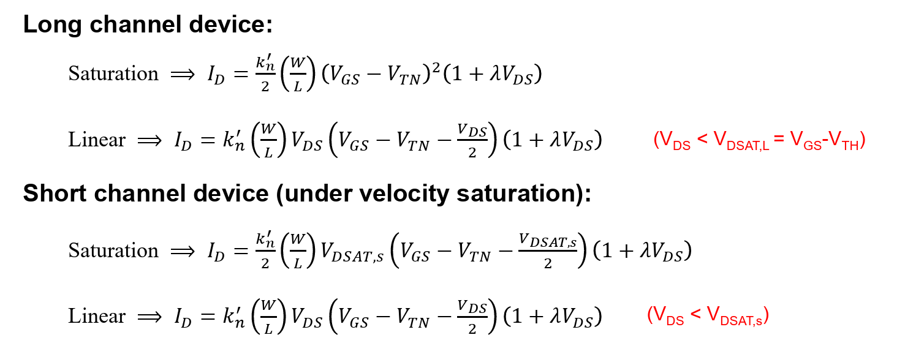<figcaption></figcaption></figure>

For the saturation voltage $$V_{\text{DSAT}}$$:

* Long channel -> $$V_{\text{DSAT,L}}=V_{\text{GS}}-V_{\text{TN}}$$
* Short channel -> $$V_{\text{DSAT,S}}<V_{\text{GS}}-V_{\text{TN}}$$

Output characteristic of long-channel vs. short-channel devices

Plot the $$I_D\sim V_{\text{DS}}$$ characteristic in LTSpice for the NMOS transistors below and observe the short-channel effect.

1. M1: $$L=4\mu m$$, $$W=20\mu m$$ -> $$W/L=20/4=5$$
2. M2: $$L=0.2\mu m$$, $$W=1\mu m$$ -> $$W/L=1/0.2=5$$

***

**Sol**. The plot is shown below.

<figure>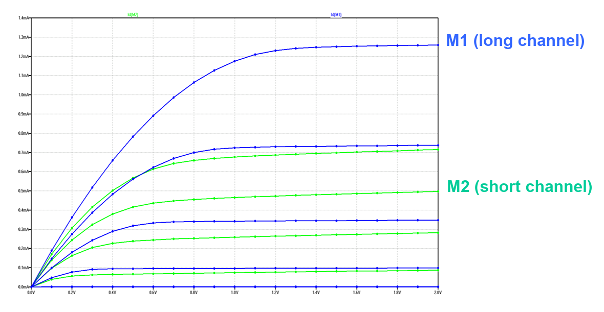<figcaption></figcaption></figure>

From the plot, we can not only observe the short-channel effect on M2 easily but also observe that the [#channel-length-modulation](lec-1-mosfet-and-cmos-process.md#channel-length-modulation "mention") affects M2 **more** than M1 because the saturation line in M2 is steeper than the saturation line in M1.

### Sub-threshold Leakage

When the gate voltage $$V_{\text{GS}}<V_{\text{TN}}$$, we say that the device operates in a **sub-threshold region** or **weak inversion**.

* In this case, the channel **almost** doesn't exist.
* In this region, the drain current $$I_D$$ follows an **exponential relationship** with $$V_{\text{GS}}$$ (not quadratic)

<figure>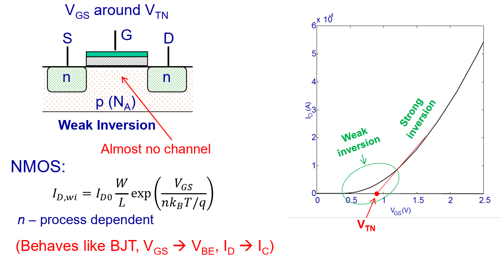<figcaption></figcaption></figure>

So, we can see that in this sub-threshold region, the drain current $$I_D$$ is **not zero**! Our understanding that before the gate voltage reaches $$V_{\text{TN}}$$, there is **no current** flowing in the channel is **wrong**! This causes leakage current when the NMOS transistor is turned off (e.g., $$V_{\text{GS}}=0$$) and increases static power consumption.

<figure>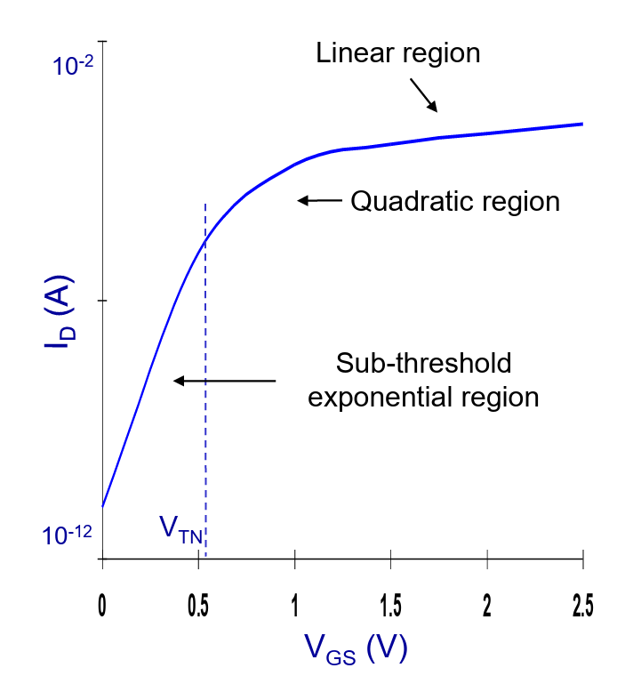<figcaption></figcaption></figure>


In this figure, the y-axis is $$\log(I_D)$$ instead of $$I_D$$!


If we put this $$\lg(I_D)\sim V_{\text{GS}}$$ plot together with the normal quadratic $$I_D\sim V_{\text{GS}}$$ plot, we will get something similar to below.

<figure>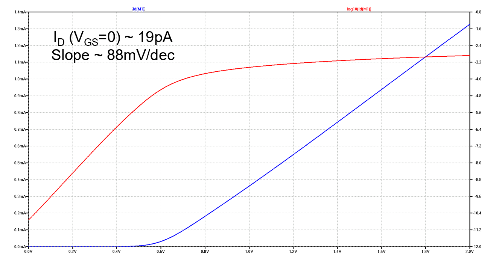<figcaption></figcaption></figure>

#### Sub-threshold Swing

This slope is defined and used in the $$\log(I_D)\sim V_{\text{GS}}$$ plot. It is defined to be as follows:

$$
\begin{align*}
S&=\frac{\partial V_{\text{GS}}}{\partial\lg(I_D)}\\
&=n\left(\frac{kT}{q}\right)\ln(10)
\end{align*}
$$

The intuitive understanding for the sub-threshold slope is that if it is smaller, than the gradient is **steeper**. Because we use $$\Delta x/\Delta y$$ to calculate the **swing**!


#### High or Low sub-threshold swing is better?

We prefer low sub-threshold swing because small change in the $$V_{\text{GS}}$$ will give us **greater** increase in drain current $$I_D$$ so that the MOSFET "wakes up" faster!


### Body Effect

As we have assumed at the beginning of this note, the body voltage $$V_B$$ is **fixed**. However, in reality, we can change the body voltage to change the **threshold voltage** of the device. This is the intuition of **body effect**.


#### Why Body Effect is not commonly used?

In a circuit, the body of each transistor is usually connected **together**! Thus it is hard to separate the body and then control the threshold voltage of each transistor.


## CMOS Process Flow

> TODO: The idea of this part is to know the layout.

This part has been introduced in the classical textbook [DICADP Chapter 2](/broken/pages/1EVEORIAWvRaoHyUMEPj).

[^1]: In other words, can simply think of it as the **number of free carriers**.

[^2]: This means that if the current plot in the saturation is **flatter**, then it is not affected  too much by the channel length modulation.

[^3]: This means **increasing** in NMOS or **decreasing** in PMOS.
