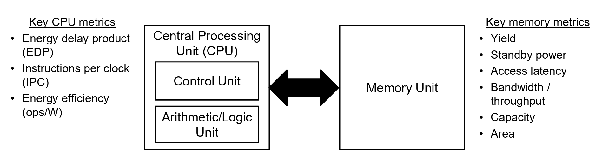
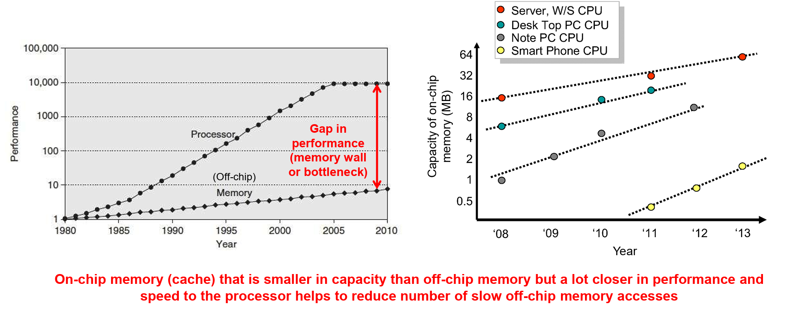
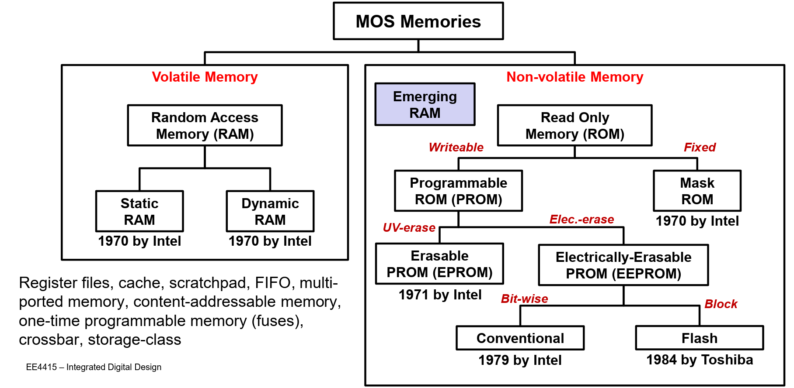
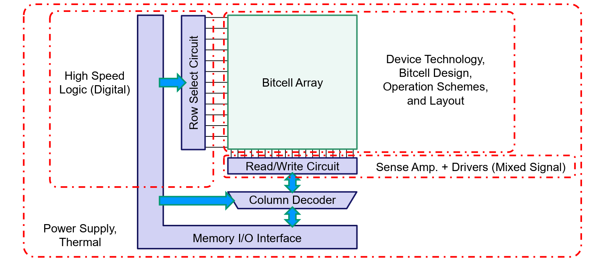
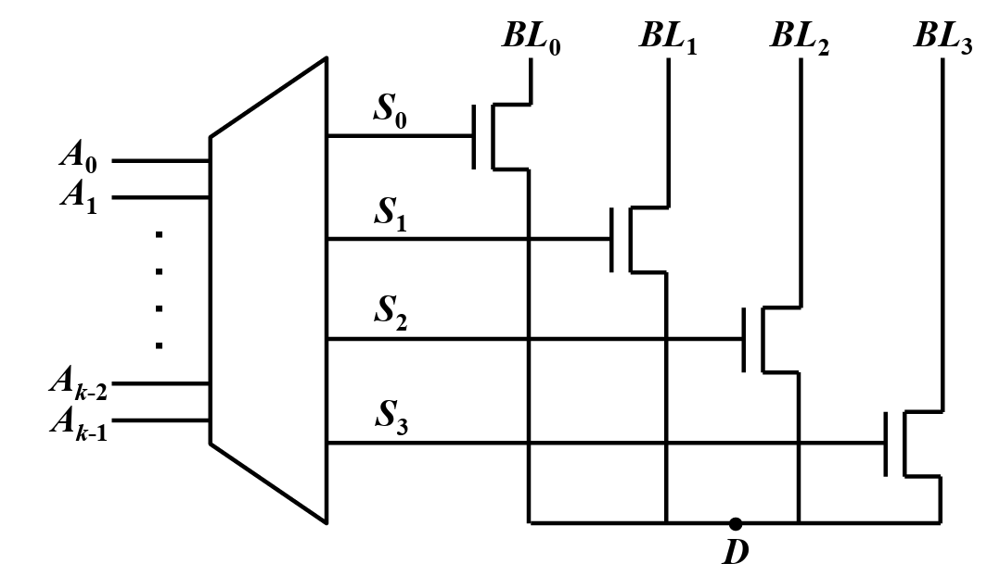
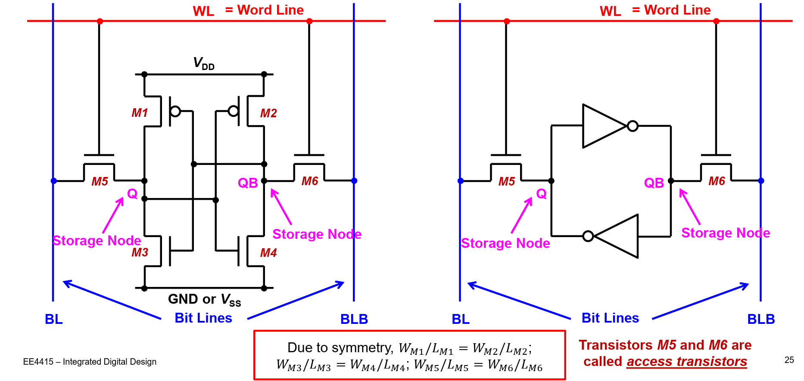
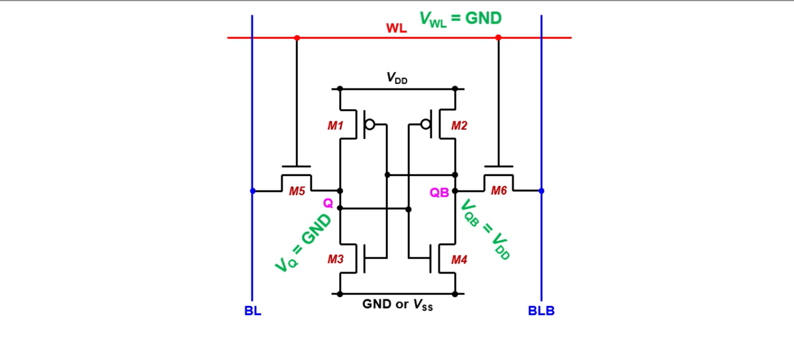
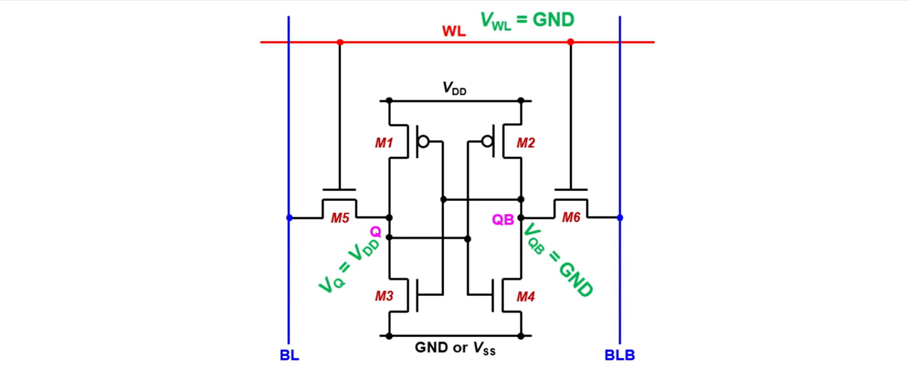
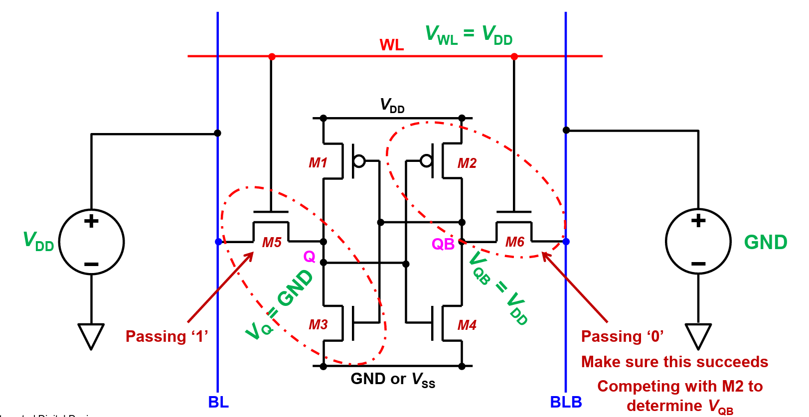
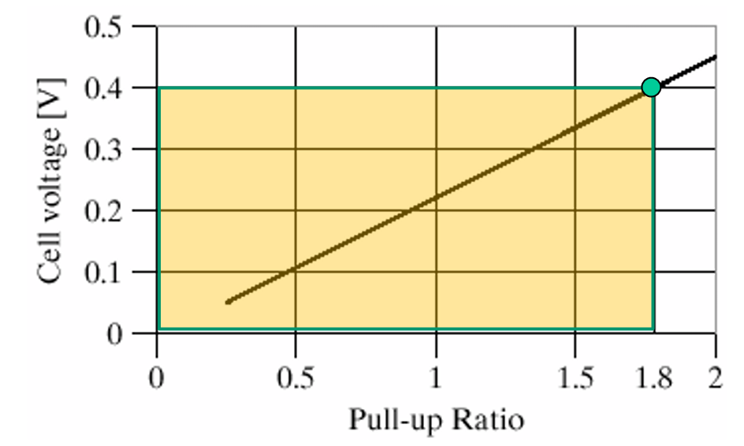

# Lec 6 - Memories

Firstly, let's start a brief recap of the Von Neumann architecture which is used widely in nowadays computers and other digital devices

<figure><figcaption></figcaption></figure>

In the image above, we can see different metrics to measure the CPU and memory speed. However, the memory speed is still the bottleneck which affects the performance of the system.

<figure><figcaption></figcaption></figure>

The MOS memory classification can be shown as follows:

<figure><figcaption></figcaption></figure>

## Peripheral Circuits

> Prof. Kelvin said, memory is another "beast" in the digital circuit and it deserves another whole course to talk about just memories.

The parts of a memory subsystem that we are going to see in EE4415 is shown as follows.

<figure><figcaption></figcaption></figure>

In this subsystem, we will focus everything **except** the memory I/O interface.

### Address Decoder

The main job for the address decoder is to decode the row and column index from an address so that a certain bit stored at the row and column index can be read or written. And indeed, the address decoder is composed of two decoders

1. Row decoder
2. Column decoder

#### Row Decoder

The job of the row decoder is mainly to decode the row index from the address.

#### Column Decoder

In the column decoder, we usually use the so-called **analog multiplexer**, which is nothing but that [pass-gate multiplexers](https://wenbo-notes.gitbook.io/ee4415-notes/sEXO3Z2k4TIWXI0ZZLNy/part-2-lec-analog-design-flow/lec-5-sequential-circuits#pass-transistor-mux). And its structure can be shown as follows:

<figure><figcaption></figcaption></figure>

At the point of D is our **shared sense amplifier** which is used to sense any small voltage difference at each bit line. However, as each of the NMOS at the bit line will have a certain resistance and this will affect the sense amplifier. Sometimes we can put the sense amplifier at the top, but in this case, we cannot share the sense amplifier anymore.

## 6T SRAM

The structure of the 6T SRAM is shown clearly as below. The reason it is static is because it uses the feedback loop to store the data instead of capacitors (dynamic).

<figure><figcaption></figcaption></figure>

SRAM has the following characteristics:

1. Volatile: Data will lose after power is down.
2. Fully differential: All the inputs should have its inverted version given and all the outputs should have its inverted version as well ($$Q,\bar Q$$).
3. Fast: It is relatively fast compared to DRAM.
4. Standby power is only leakage power.
5. Static: No need to periodically refresh stored data.
6. Non-destructive read

### Basic Operation Principles

There are 2 basic operation principles in SRAM:

1. **Access**: The bit cell is **accessed** to **read** from or **write** into the bitcell.
2. **Hold**: Other than the read/write, the bitcell is in **hold** or hold mode and retains its stored data.

#### Write

The write process of SRAM can be illustrated clearly in the following animation, supposed that the SRAM stores 0 and we want to write 1 into it.

<figure><figcaption></figcaption></figure>

In the previous [lecture](lec-5-sequential-circuits.md#latches), we have seen that in order to write to a cross-coupled inverter, we have only two methods:

1. Cut the feedback loop
2. Overpower the feedback loop

In SRAM, it is impossible to cut the feedback loop. Thus, we will have no choice but to use the second method, which can be clearly shown in the animation above!

#### Read

The read process is usually done after the write process and its process can be shown clearly in the following illustration.

<figure><figcaption></figcaption></figure>

### Design Issues

In the write and read process of SRAM, we actually have some issues

* **Write**: The Bit line (BL) and Bit line bar (BLB) must be able to overcome cross-coupled inverters.
* **Read**: The cross-coupled inverters must be able to drive BL and BLB.

These issue will give rise to the **sizing** of transistors in the 6T SRAM.

#### Sizing for write

In the write stage, suppose that we want to write 1 into the SRAM. We want the two storage nodes $$Q$$ and $$\bar Q$$ to be 1 and 0 respectively. Actually, if we can write **one of** the storage nodes to the value we want, it suffices. In this case, as the two **access tranasitors** $$M_5$$ and $$M_6$$ are NMOS transistors, which are good at passing a strong 0. We might find it easier to pull the storage node $$\bar Q$$ to 0.

However, in reality, it's not necessary to pull $$\bar Q$$ all the way down to 0, it suffices to just pull it down to below the **threshold voltage** of the NMOS transistor $$M_3$$ so that it can be turned off and won't pull the storage node $$Q$$ to 0!

In short, we want the NMOS transistor $$M_6$$ to be **stronger** than the PMOS transistor $$M_2$$.

<figure><figcaption></figcaption></figure>

By equating the current flowing through $$M_2$$ and $$M_6$$, we can get the **pull-up ratio** to be as follows:

$$
\text{PR}=\frac{W_2/L_2}{W_6/L_6}
$$

In practice, we want this pull-up ratio to be less than 1.8 so that the SRAM write works as normal.

<figure><figcaption></figcaption></figure>


The cell voltage in the y-axis represents the voltage at storage node $$\bar Q$$.

