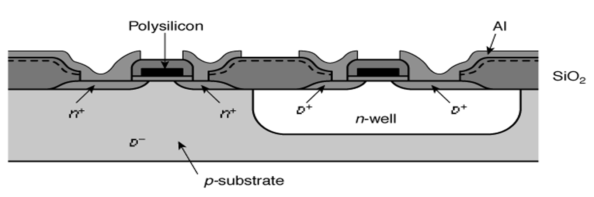
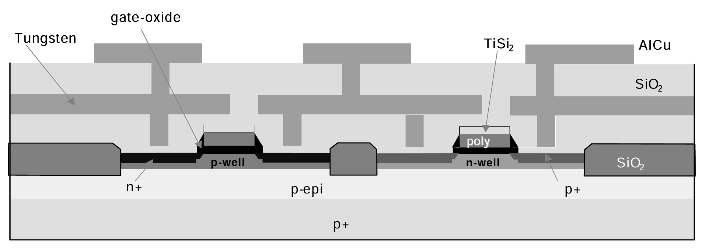
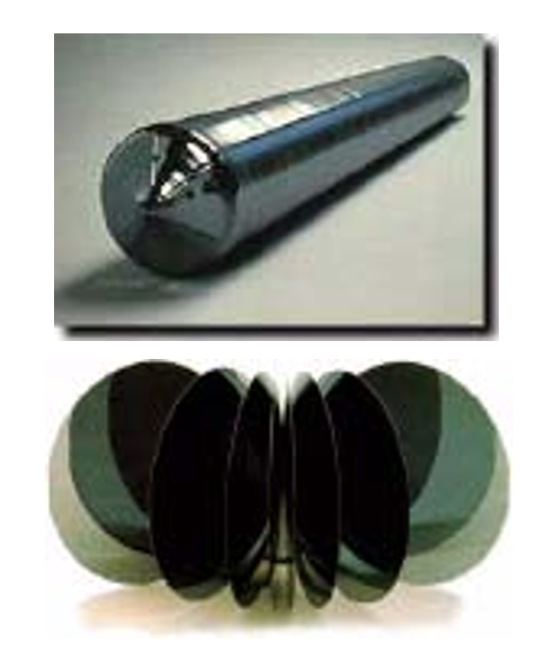
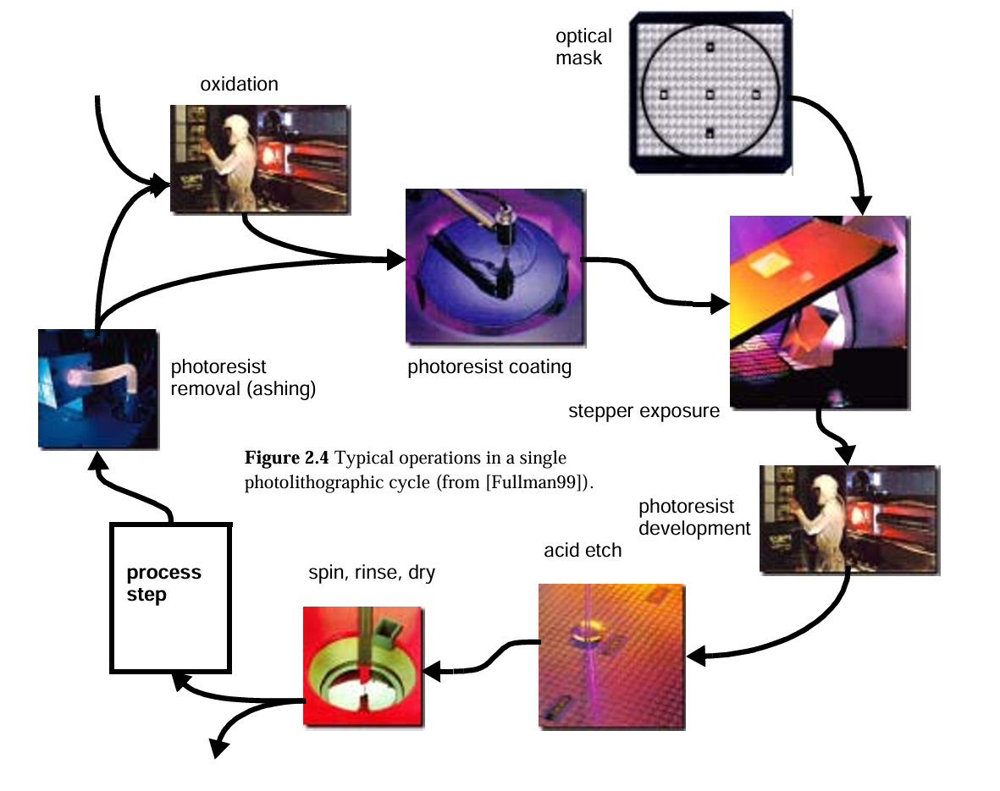

---
metaLinks:
  alternates:
    - /broken/spaces/o4JqYVwVk7U2q66ddB5L/pages/x7atx6SEKNLd8Qh1wUhD
---

# Manufacturing CMOS IC

The CMOS process requires that both n-channel (NMOS) and p-channel (PMOS) transistors be built in the **same** silicon material. To accommodate both types of devices, special regions called _wells_ must be created in which the semiconductor material is opposite to the type of the channel.&#x20;


A PMOS transistor has to be created in either an **n-type substrate** or an **n-well**, while an NMOS device resides in either a **p-type** substrate or a **p-well**.


#### N-well CMOS process

A simplified cross section of a typical CMOS inverter is shown in Figure 2.1.

<figure><figcaption>
Figure 2.1 Cross section of an n-well CMOS process.
</figcaption></figure>

The cross section shown in Figure 2.1 features an **n-well CMOS process**, where the NMOS transistors are implemented in the p-doped substrate, and the PMOS devices are located in the n-well.

#### Dual-well CMOS process

Modern processes are increasingly using a dual-well approach that uses both n- and p-wells, grown on top on a epitaxial[^1] layer, as shown in Figure 2.2.

<figure><figcaption>
Figure 2.2. Cross section of modern dual-well CMOS process
</figcaption></figure>


We will restrict the remainder of this discussion to the [**latter process**](#user-content-fn-2)[^2] (without loss of generality).


## The Silicon Wafer

The base material for the manufacturing process comes in the form of a **single-crystalline**, **lightly doped** _wafer_.


These **wafers** have typical diameters between 4 and 12 inches (10 and 30 cm, respectively) and a thickness of at most 1 mm.


They are obtained by cutting a singlecrystal ingot[^3] into thin slices (Figure 2.3).

<figure><figcaption>
Figure 2.3 Single-crystal ingot and sliced wafers
</figcaption></figure>

A starting wafer of the p--type might be doped around the levels of $$2\times10^{21}$$ impurities/m3. Often, the surface of the wafer is doped more heavily, and

1. in the **bipolar junction transistor** process, a single crystal epitaxial layer of the **opposite type** is grown over the surface before the wafers are handed to the processing company.
2. in the **CMOS** process, a single crystal epitaxial layer of the **same type** is grown over the surface as we have seen above in [Figure 2.2](manufacturing-cmos-ic.md#dual-well-cmos-process).


#### The defect density

One important metric is the **defect density** of the base material. High defect densities lead to a larger fraction of non-functional circuits, and consequently an increase in cost of the final product.


## Photolithography

In each processing step, a certain area on the chip is **masked** out using the appropriate _optical mask_ so that a desired processing step can be **selectively** applied to the remaining regions. The processing step can be any of a wide range of tasks including

* oxidation,
* etching,
* metal and polysilicon deposition, and
* ion implantation.

The technique to accomplish this selective masking, called _photolithography_, is applied throughout the manufacturing process. Figure 2.4 gives a graphical overview of the different operations involved in a typical photolitographic process.

<figure><figcaption>
Figure 2.4 Typical operations in a single photolithographic cycle
</figcaption></figure>

The following steps can be identified:



#### Oxidation Layering

This optional step deposits a thin layer of SiO2 over the complete wafer by exposing it to a mixture of high-purity oxygen and hydrogen at approximately 1000°C.


The oxide is used as an **insulation layer** and also forms **transistor gates**.




#### Photoresist Coating

A light-sensitive polymer (similar to latex) is evenly applied while spinning the wafer to a thickness of approximately 1 $$\mu m$$.

* **Negative photoresist**: This material is originally soluble in an organic solvent, but has the property that the polymers cross-link when exposed to light, making the affected regions insoluble. A photoresist of this type is called **negative**.
* **Positive photoresist**: A positive photoresist has the opposite properties; originally insoluble, but soluble after exposure.

By using both positive and negative resists, a single mask can sometimes be used for two steps, making complementary regions available for processing.


Since the cost of a mask is increasing quite rapidly with the scaling of technology, a reduction of the number of masks is surely of high priority.




#### Stepper Exposure

> This is where the **mask** we have talked about at the beginning coming into play!

A glass mask (or reticle), containing the patterns that we want to transfer to the silicon, is brought in close proximity to the wafer. The mask is opaque in the regions that we want to process, and transparent in the others (assuming a negative photoresist).


The glass mask can be thought of as the negative of **one layer** of the microcircuit.&#x20;


The combination of mask and wafer is now exposed to ultra-violet light. In the region where the mask is transparent, the photoresist becomes insoluble.



[^1]: **Epitaxy** is a manufacturing process that deposits a thin, single-crystal film onto a crystalline substrate, causing the layer to adopt the same crystal structure and orientation as the base.\
    \
    In this case, the bottommost layer labeled **p+** is the heavily doped p-type silicon substrate. The layer immediately above it, labeled **p-epi**, is a more lightly doped p-type epitaxial layer that has been grown directly onto that base.

[^2]: The dual-well CMOS process

[^3]: An **ingot** is a solid, often brick-shaped piece of metal (such as gold, silver, or steel) cast into a **convenient, manageable form** for transport, storage, or further processing like rolling or forging
