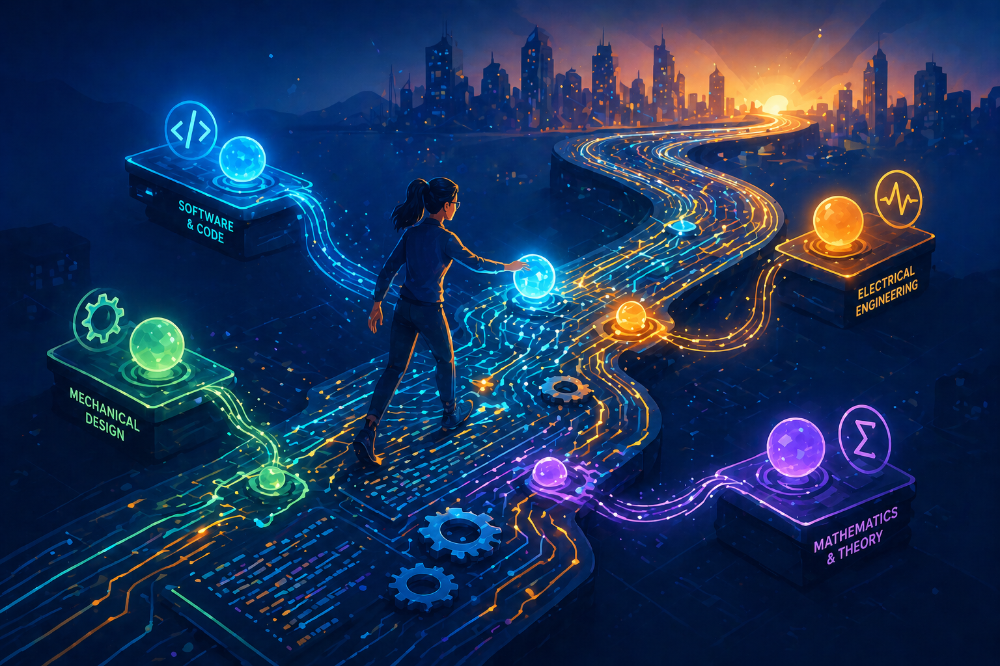
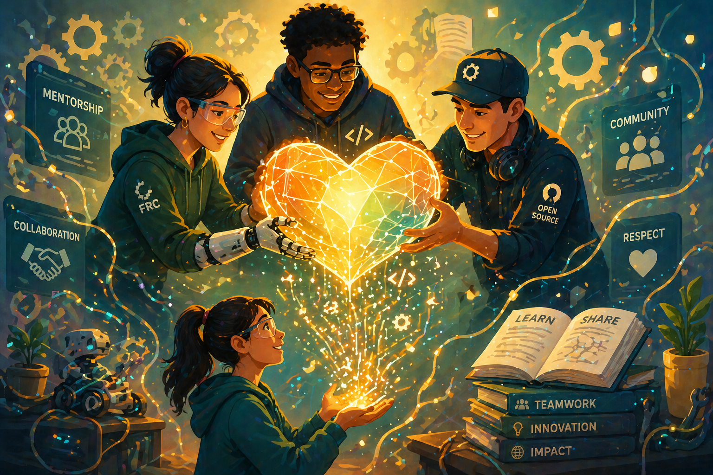

# Home

<h2 align="center">My Computer Engineering Journey</h2>

A collection of lecture notes, summaries, and things I've learned along the way.

<a href="http://app.gitbook.com/join" class="button primary">Explore the Knowledge Base</a> <a href="http://app.gitbook.com/join" class="button secondary">Browse by Topic</a>

<table data-view="cards"><thead><tr><th></th><th></th><th></th><th data-hidden data-card-target data-type="content-ref"></th><th data-hidden data-card-cover data-type="image">Cover image</th></tr></thead><tbody><tr><td><h4><i class="fa-notebook">:notebook:</i></h4></td><td><strong>The Journey</strong></td><td>Connecting theoretical concepts across different fields to solve real-world problems.</td><td><a href="https://app.gitbook.com/o/MnEKr5A4lYXtOfhoXGj5/s/kBwWKlDJwmXRyPHTg6XD/">Bachelor</a></td><td><a href=".gitbook/assets/home-6.png">home-6.png</a></td></tr><tr><td><h4><i class="fa-magnifying-glass">:magnifying-glass:</i></h4></td><td><strong>The Notes</strong></td><td>A growing, open-source collection of my lecture notes and academic summaries.</td><td><a href="https://app.gitbook.com/o/MnEKr5A4lYXtOfhoXGj5/s/kBwWKlDJwmXRyPHTg6XD/">Bachelor</a></td><td data-object-fit="cover"><a href=".gitbook/assets/home-7.png">home-7.png</a></td></tr><tr><td><h4><i class="fa-memo">:memo:</i></h4></td><td><strong>The Community</strong></td><td>Mentorship, collaboration, and the spirit of gracious professionalism.</td><td><a href="https://app.gitbook.com/o/MnEKr5A4lYXtOfhoXGj5/s/xakydb3VvWScDL0os4es/">API Reference</a></td><td><a href=".gitbook/assets/home-8.png">home-8.png</a></td></tr></tbody></table>



### Connecting the Dots

Becoming a solid computer engineer isn't just about isolating software from hardware or memorizing formulas. It is about seeing the bigger picture.

This space documents my journey of bridging the gaps between different technical disciplines. By connecting diverse fields of knowledge, I aim to build systems and solutions that tackle real-world problems innovatively.

<a href="https://app.gitbook.com/o/MnEKr5A4lYXtOfhoXGj5/s/kBwWKlDJwmXRyPHTg6XD/" class="button primary" data-icon="rocket-launch">Explore my notes</a>



<figure><figcaption></figcaption></figure>





<figure><figcaption></figcaption></figure>



### Gracious Professionalism

The best engineering is collaborative. Competing and building with FRC Team 6940 instilled in me the core value of **Gracious Professionalism** — the understanding that high-quality, fierce execution goes hand-in-hand with mutual respect and helping others succeed.

I strongly believe in the open-source spirit. Whether through sharing these study notes or helping peers when I can, my goal is to lower the barrier to entry, make knowledge more accessible, and contribute to a more supportive learning community.

<a href="https://app.gitbook.com/o/MnEKr5A4lYXtOfhoXGj5/s/fN8WpEzp1MLfkzY30iaR/" class="button primary" data-icon="book-open">How to contribute</a>


