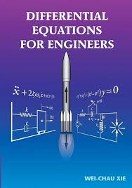
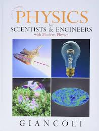

# MA1512 Differential Equations for Engineering

## Introduction

* **Full name**: [MA1512 Differential Equations for Engineering](https://nusmods.com/courses/MA1512/differential-equations-for-engineering)
* **Target audience**: NUS Year 1 Engineering Students
* **Purpose of the course**: Foundational differential equations knowledge for modeling real-world system
* **Notes Structure**: View the [MA1512 Lecture Notes](https://github.com/mendax1234/lecture-notes/tree/main/Y1S1/MA1512)
  * **MA1512-Notes**: This folder contains a comprehensive version of my notes, designed to break down and explain each concept covered in the course in a clear and easy-to-understand manner.
  * **MA1512-Cheatsheet**: Here, you'll find the cheatsheet I created and used throughout the course, summarizing key formulas and methods for quick reference.

I took this course in AY24/25 Sem 1 for my degree requirement.

## Course Content

### Overview of Topics Covered



#### Introduction to Differential Equations

1. **First Principles**
   * The method of separation of variables
   * The idea of substitution to change a differential equation into a separable one.
   * The Half-Life Model.
2. **The Geometry of Differential Equations**
   * The geometric meaning of general/particular solution for a differential equation.
   * The geometric meaning and method to find the equilibrium solutions for a differential equation.
3. **Population Dynamics**
   * The differential equation for the Malthusian Model and its solution.
   * The differential equation for the Verhulst Model and its solution.
   * The application of hunt rate used in the above two models.



#### Linear Differential Equations

1. **First-Order Linear Differential Equations**
   * The definition and standard form of a First-Order Linear Differential Equation.
   * The method of Integrating factors.
   * Special first-order nonlinear differential equations: Bernoulli differential equation.
   * Newton's Law of Cooling Down.
2. **Homogeneous Higher Order Differential Equation (But with constant coefficients only)**
   * The method of Characteristic Equation.
   * Superposition Principle.



#### The Harmonic Oscillator

1. **Non-homogeneous Linear Differntial Equation**
   * Rule of thumb: $y=y\_h+y\_p$.
   * The method of undertermined coefficients to find $y\_p$.
   * The method of variation of parameters to find $y\_p$.
2. **Simple Harmonic Mothion**
   * The physics and mathematical model of Simple Harmonic Motion (SHM).
   * The physics and mathematical model of Damped Harmonic Motion (DHM).
   * The physics and mathematical model of Force Oscillation.



#### The Laplace Transform

1. Several theorems for doing Laplace Transform and Inverse Transform.
2. The application of unit step functions and dirac delta function in physics and mathematical modelling.



#### Partial Differential Equations

1. The method of separation of variables to solve PDEs.
2. The application of PDE in the heat equations.



### Depth and Balance of Coverage

#### Theoretical Understanding

As a mathematics course designed for NUS Engineering freshmen, the focus is less on rigorous mathematical proofs and more on practical applications of theorems and techniques. However, the professor thoughtfully provides supplementary materials for those interested in exploring the derivations and deeper theoretical foundations.

#### Application and real-world examples

This course incorporates a moderate number of applications and real-world examples, many of which are interdisciplinary. For instance, it explores the harmonic oscillator (from Physics) and population dynamics (from Economics). These examples provide valuable insights, opening up a new perspective on how mathematics can be applied to explain and understand various phenomena!

#### Challenging or Unique Aspects



#### Formulating the Correct Differential Equation

This is perhaps the most challenging aspect, as it often requires a strong understanding of interdisciplinary concepts, including principles from physics or other fields. Successfully crafting an accurate differential equation cultivates the ability to approach real-world problems systematically and step-by-step.



#### Solving the Differential Equation

Once the equation is established, determining the appropriate method to solve it can be equally demanding. We’ve learned a variety of techniques, but choosing the right one depends on correctly identifying the type of differential equation at hand.



#### Strong Calculus Foundation

A solid grasp of calculus is fundamental to solving differential equations. Proficiency in key concepts, such as differentiation and integration theorems, is essential for solving the differential equations.



## Teaching Style and Materials

### Teaching Style

#### Lecture

The lectures are conducted by Prof. Christian, whose teaching is exceptional. He is, without a doubt, one of the best professors I’ve encountered at NUS! The lecture notes are well-structured, clear, and easy to follow. However, the lecture quizzes can occasionally be a bit tricky, adding an extra layer of challenge.

#### Tutorial

My tutorials are led by Clifton, who is both kind and exceptionally knowledgeable. The tutorial materials are well-designed and easy to understand, making complex concepts more approachable. While the tutorial assignments can be challenging and time-consuming, they are highly effective in helping us apply the theories we’ve learned to real-world scenarios.

#### Assessment

The assessment structure consists of 40% Continuous Assessment (CA) and 60% Final Exam. The final exam is the most challenging yet rewarding part of the course. This semester’s (AY24/25 Sem 1) paper was particularly well-designed, pushing us to think comprehensively and quickly, even though completing all the questions within the time limit was tough.

### Course Book

**Textbook**: _Differential Equations for Engineers_ by Wei-Chau Xie. This book has lots of classic examples for extra practice.

<figure><figcaption></figcaption></figure>

**Reference book**: Since this course involves some physics problems, for these physics problems, I take this book as reference: _Physics for Scientists & Engineers_ by Douglas C. Giancoli. This book is recommended by my physics prof in NTU!

<figure><figcaption></figcaption></figure>

## Learning Experience

### Personal Insights

Beyond the excellent content and the significance of differential equations for my future studies, what truly made this course memorable was the incredible teaching team and my supportive classmates. They created an engaging and enjoyable learning environment that I will never forget. I’m deeply grateful to them for making this experience so special!

### Skills Developed

This course has taught me one of the most valuable skills: analyzing real-world problems using differential equations. I’ve already seen its application in another module, CG1111A (RC-Circuits), which further demonstrates the practical relevance of what I’ve learned here.

## Workload and Time Management

* **Level of Difficulty**:
  * **6/10**: If your goal is simply to pass the course.
  * **9/10**: If you aim to excel and achieve a deep understanding of the material, beyond just the grades.
* **Tips for Future Students**: I hope my notes will ease your workload and provide clarity on the concepts covered in this course. They are designed to help you grasp the material more effectively and approach the challenges with confidence.

## Conclusion

I would say that differential equations are one of the most essential tools for any engineer. They serve as a critical bridge between the worlds of mathematics and physics, enabling us to model and analyze complex systems. Many future physics-based analyses will rely heavily on this technique. I hope you find this course both meaningful and engaging!
