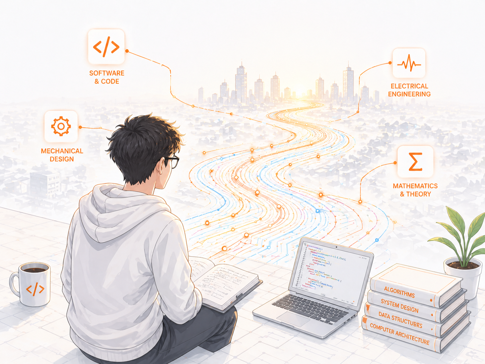
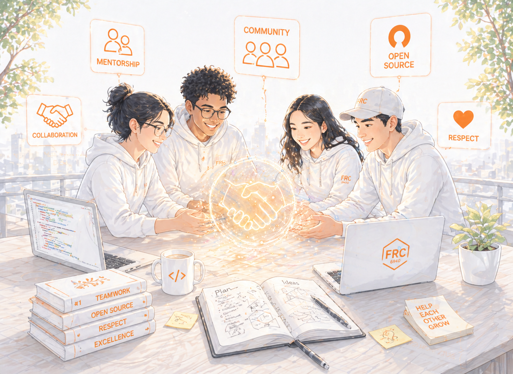

# Home

<h2 align="center">My Computer Engineering Journey</h2>

A collection of lecture notes, summaries, and things I've learned along the way.

<a href="https://app.gitbook.com/o/MnEKr5A4lYXtOfhoXGj5/s/kBwWKlDJwmXRyPHTg6XD/" class="button primary">Explore the Knowledge Base</a>

<table data-view="cards"><thead><tr><th></th><th></th><th></th><th data-hidden data-card-target data-type="content-ref"></th><th data-hidden data-card-cover data-type="image">Cover image</th><th data-hidden data-type="image">Cover image (dark)</th><th data-hidden data-type="image">Cover image (dark)</th><th data-hidden data-card-cover-dark data-type="image">Cover image (dark)</th></tr></thead><tbody><tr><td><i class="fa-notebook">:notebook:</i></td><td><strong>The Journey</strong></td><td>Connecting theoretical concepts across different fields to solve real-world problems.</td><td><a href="https://app.gitbook.com/o/MnEKr5A4lYXtOfhoXGj5/s/kBwWKlDJwmXRyPHTg6XD/">Undergraduate</a></td><td><a href=".gitbook/assets/home-1-light.png">home-1-light.png</a></td><td><a href=".gitbook/assets/home-1.png">home-1.png</a></td><td><a href=".gitbook/assets/home-1.png">home-1.png</a></td><td><a href=".gitbook/assets/home-1.png">home-1.png</a></td></tr><tr><td><i class="fa-magnifying-glass">:magnifying-glass:</i></td><td><strong>The Notes</strong></td><td>A growing, open-source collection of my lecture notes and academic summaries.</td><td><a href="https://app.gitbook.com/o/MnEKr5A4lYXtOfhoXGj5/s/kBwWKlDJwmXRyPHTg6XD/">Undergraduate</a></td><td><a href=".gitbook/assets/home-2-light.png">home-2-light.png</a></td><td></td><td><a href=".gitbook/assets/home-2.png">home-2.png</a></td><td><a href=".gitbook/assets/home-2.png">home-2.png</a></td></tr><tr><td><i class="fa-memo">:memo:</i></td><td><strong>The Community</strong></td><td>Mentorship, collaboration, and the spirit of gracious professionalism.</td><td><a href="https://app.gitbook.com/o/MnEKr5A4lYXtOfhoXGj5/s/kBwWKlDJwmXRyPHTg6XD/">Undergraduate</a></td><td><a href=".gitbook/assets/home-3-light.png">home-3-light.png</a></td><td></td><td></td><td><a href=".gitbook/assets/home-3.png">home-3.png</a></td></tr></tbody></table>



#### Connecting Everything

Becoming a solid computer engineer means learning from different disciplines and, more importantly, being able to connect those ideas together to solve meaningful problems.

This space documents my journey of bridging the gaps between different technical disciplines. By connecting diverse fields of knowledge, I aim to build systems and solutions that tackle real-world problems innovatively.

<a href="https://app.gitbook.com/o/MnEKr5A4lYXtOfhoXGj5/s/kBwWKlDJwmXRyPHTg6XD/" class="button primary" data-icon="rocket-launch">Explore my notes</a>



<figure><picture><source srcset=".gitbook/assets/home-4.png" media="(prefers-color-scheme: dark)"></picture><figcaption></figcaption></figure>





<figure><picture><source srcset=".gitbook/assets/home-5.png" media="(prefers-color-scheme: dark)"></picture><figcaption></figcaption></figure>



#### Gracious Professionalism

The best engineering is collaborative. My experience in FRC Team 6940 instilled in me the core value of Gracious Professionalism: to give back to the community the same help, guidance, and encouragement that I have once received. To me, this is the spirit of "Give to Gain."

I strongly believe in the open-source spirit. Whether through sharing these study notes or helping peers when I can, my goal is to lower the barrier to entry, make knowledge more accessible, and contribute to a more supportive learning community.

<a href="https://app.gitbook.com/o/MnEKr5A4lYXtOfhoXGj5/s/kBwWKlDJwmXRyPHTg6XD/" class="button primary" data-icon="book-open">How to contribute</a>


