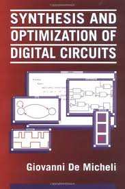

# EE4218 Embedded Hardare System Design

## Introduction

* **Full name**: [EE4218 Embedded Hardware System Design](https://nusmods.com/courses/EE4218/embedded-hardware-system-design)
* **Target audience**: NUS Year 4 EE/CEG Students
* **Purpose of the course**: To provide students with an amazing understanding of hardware/software co-design and the hands-on opportunity to design an modern AI accelerator.
* **Notes Content**: View the [EE4218 Notes](https://wenbo-notes.gitbook.io/ddca-notes/)

I took this course in AY25/26 Semester 2 mainly as a follow-up for the CG3207 that I took last sem.

## Course Content

### Overview of Topics Covered

1. **Introduction to Hardware and Embedded System**: Has quite a lot of content overlap with CG3207 Lec 01 and Lec 02, but added the content on introduction to embedded system and hardware/software co-design.
2. **Verilog for Synthesis**: Exactly same content as CG3207's second half of Lec 02.
3. **Sequential Logic Optimization**: This is a more advanced topic on FSM, including state formulation, state minimization and retiming, etc.
4. **Abstarct Models and Behavioural Optimisations**: This topic introduces the hardware modelling which abstracts the circuit into several types of graphs, which is very useful for the communication between human and machine.
5. **Microarchitecture Design**: As its name suggests, this topic will teach us how to do the microarchitecture design systemetically. (It will be a bonus point if you can connect it with the microarchitecture design we've seen in CG3207)
6. **High-Level Synthesis**: This topic will introduce the techniques behind the HLS that you've probably used as one or several lines in Vitis.
7. **Timing**: This topic is mainly about the setup and hold time and how to determine whether the circuit meets the timing constraint and what's its best performance. (It's an easier version of what's covered in EE4415's first half)
8. **Technology Mapping**: This is one of the most important things that is done behind the scene when we click "run synthesis" on Vivado.
9. **Physical Synthesis**: This is one of the most important things that is done behind the scene when we click "run implementation" on Vivado.

### Depth and Balance of Coverage

#### Theoretical Understanding

As Prof. Rajesh mentioned in the first lecture, this is a highly up-to-date course that teaches students how to use state-of-the-art tools such as Vivado and Vitis to design an AI accelerator from scratch. The course also provides a valuable overview of the ASIC design flow, including key steps such as logic synthesis and implementation, and explains how these processes work behind the scenes.

This course is also an excellent follow-up to CG3207. It allows students to further appreciate the beauty and elegance of RTL design through a more advanced and practical perspective.

#### Application and real-world examples

A key highlight of this course is its strong emphasis on application and real-world examples. Building on the knowledge gained from the four labs, students work on a hands-on AI accelerator design project, where they are given the freedom to choose the type of accelerator they want to implement.


For our project, we designed a customized accelerator for CNN inference, called VNN, or Verilog Neural Network.&#x20;


In thsis project, students are required to compare the inference performance across three approaches: a pure CPU implementation, an HLS-based implementation, and their own HDL implementation. Through this experience, students can gain a deeper understanding of AI accelerator design and better appreciate the importance of the usage of ASICs in modern AI applications.

#### Challenging or Unique Aspects

1. **Writing good RTL Code**: Some people may think writing good RTL code is a challenge for this course. For those who have taken CG3207, I would say honestly that your RTL coding skill should be enough to deal with EE4218. For those who haven't taken CG3207, the RTL coding side might be a bit difficult. But don't worry, Prof. Rajesh is always there for any help!
2. **Lecture Content**: Personally speaking, the lecture content sometimes is a little bit more difficult, especially when you are reviewing for the final exam. However, it is not impossible to conquer all the knowledge points (At least I believe reading my notes thoroughly and learn every knowledge point in it, you will be pretty much prepared for the finals unless Prof. adds some new content).

## Teaching Style and Materials

### Teaching Style

#### Lecture

I don't have to say too much here I guess, as Prof. Rajesh is the big boss of this course. He is the GOAT!

#### Lab

Compared to the four labs in CG3207, the four labs in this course are relatively manageable. Their main purpose is to help students build the necessary foundation and technical skills for the final project. This is especially important as the final project carries almost the same weightage as the four labs combined.

#### Project

As mentioned above, the project in EE4218 is definitely one of the highlight of this course! Very up-to-date and very interesting!


As far as I am concerned, the project for this course is likely to be changed in the future, as Prof. Rajesh also acknowledged to us that he is running out of new ideas on this project but will try to find more interesting stuff for future cohorts to do!


#### Assessments

1. **Quizzes**: For our cohort (AY25/26 Sem 2), the quizzes were take-home and carried a relatively small weightage of 10% in total, with three quizzes altogether.
2. **Final**: The final assessment felt more like a way to evaluate students' overall understanding of the course rather than simply a test of exam-taking skills. In my opinion, students who have a solid grasp of the key concepts covered in my [notes](https://app.gitbook.com/o/MnEKr5A4lYXtOfhoXGj5/s/08HOWaEgI5q3ZZTecFRP/) will find the final both manageable and enjoyable.

### Course Book

Prof. Rajesh provides a bunch of textbooks recommended for this course during Lecture 1. Among all these textbooks, the one that relates most to this course and is the most worth reading is:

**Textbook**: _Synthesis and optimization of digital circuits_ by Giovanni De Micheli.

<figure><figcaption></figcaption></figure>


The importance of this book to digital design is comparable to that of Hennessy and Patterson's book to computer architecture.


## Learning Experience

### Personal Insights

Overall, this was a very interesting and rewarding course for me. As a continuation of CG3207, it gave me the opportunity to apply the RTL design skills I had learned to something both meaningful and relevant to real-world applications.

The course also introduced me to the ASIC design flow, which I believe will be very useful for thos who are interested in working in the chip design industry in the future!

### Skills Developed

This course deepened my understanding of embedded hardware system design and helped me develop several important skills:

1. Basic understanding of neural networks and convolutional neural networks,
2. Stronger RTL coding skills through a large-scale project,
3. Foundational knowledge of SoC design, such as the commonly used buses and interfaces like AXI.

## Workload and Time Management

* **Level of Difficulty**: 7/10 (for those who have taken CG3207) and 9/10 (for those who haven't taken CG3207)
* **Tips for future cohort**: I have open-sourced all my [lecture notes](https://app.gitbook.com/o/MnEKr5A4lYXtOfhoXGj5/s/08HOWaEgI5q3ZZTecFRP/), highlighting the most difficult concepts I encountered. In addition, I am currently working on a project which might be published on APCCAS 2026 (yes, it's the VNN project). Hope that the documentation that I have written for VNN will also help with learning EE4218!

## Conclusion

I would like to express my heartfelt thanks to Prof. Rajesh, my lab group mates, and everyone who discussed questions with me during the post-lecture Q\&A sessions. This course would not have been as enjoyable and meaningful without yall!


Highly recommend to take this course together with EE4415!

