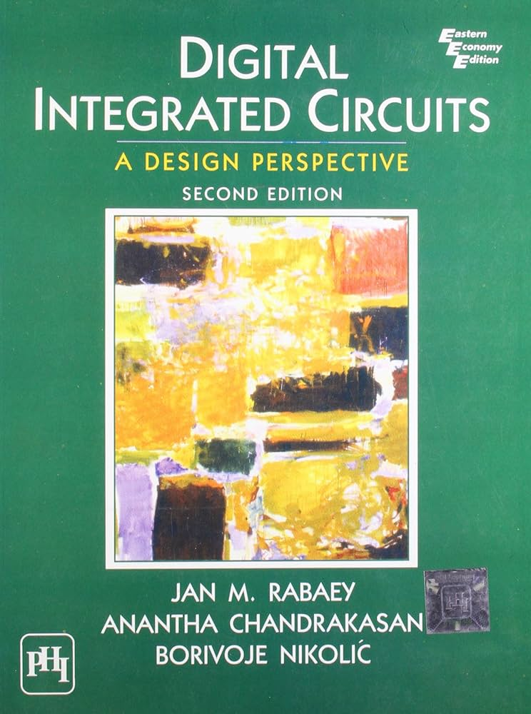
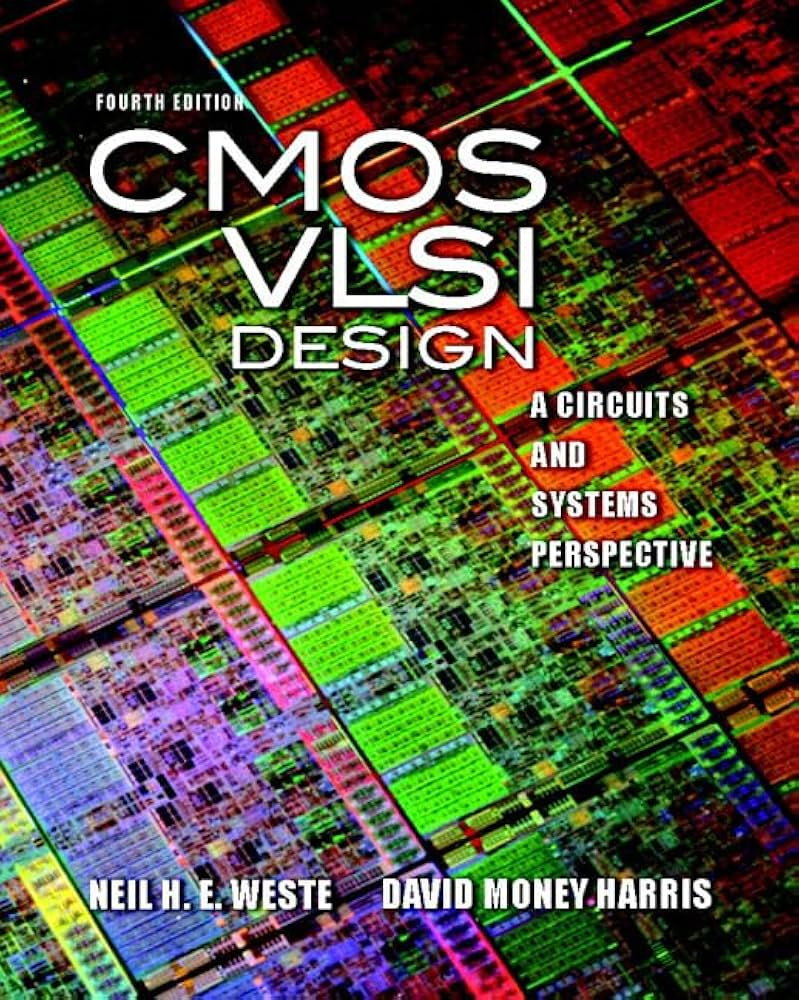
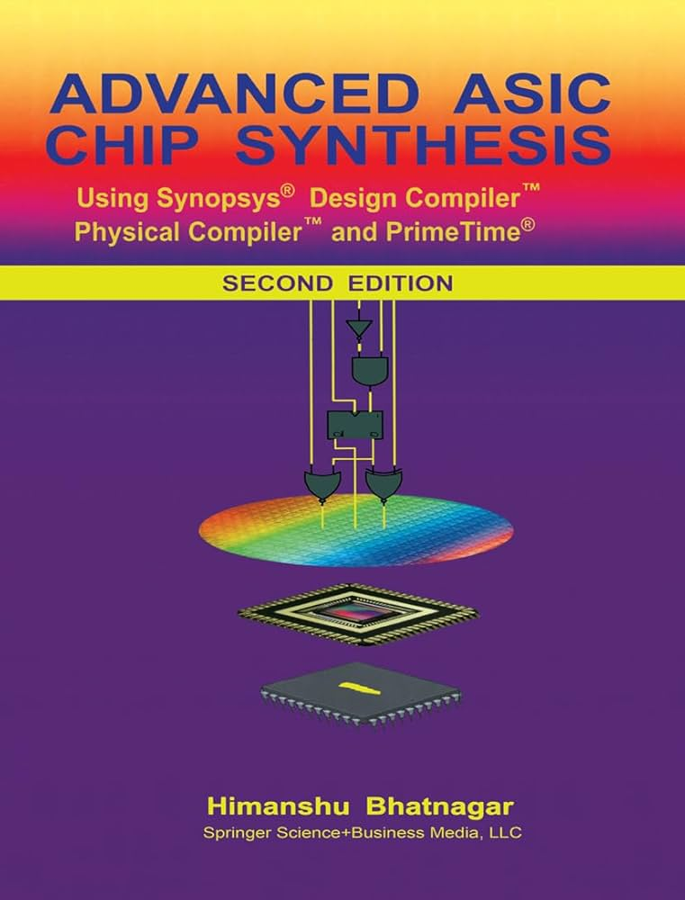
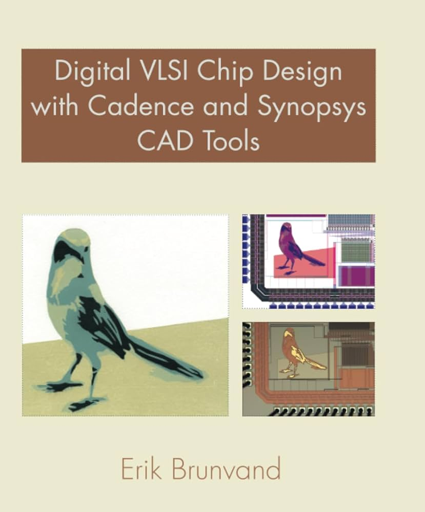

# EE4415 Integrated Digital Design

## Introduction

* **Full name**: [EE4415 Integrated Digital Design](https://nusmods.com/courses/EE4415/integrated-digital-design)
* **Target audience**: NUS Year 4 EE/CEG Students
* **Purpose of the course**: This course provides students with knowledge of integrated circuit design from both low-level and high-level perspectives. It covers topics ranging from CMOS transistor-level design to the use of RTL transformation techniques for optimizing the power, performance, and area of digital designs.
* **Notes Content**: View the [EE4415 Notes](https://app.gitbook.com/o/MnEKr5A4lYXtOfhoXGj5/s/Sp0XaarBjbEX3JIMrRaR/).

I took this course in AY25/26 Semester 2 as a bonus course which is recommended to take together with [EE4218](ee4218-embedded-hardware-system-design.md)!

## Course Content

### Overview of Topics Covered

* The first half of the course is conducted by Prof. Massimo and focuses on the digital design flow.
  * **Timing Synchronous**: This topic covers the timing characteristics of registers, such as setup and hold time. It also introduces how skew and jitter affect digital circuit performance in a systematic way.
  * **RTL Transformations**: This is the highlight of the course. Many of the RTL transformation techniques are associated with Prof. Massimo's Green-IC group and are not commonly found online. These methods are highly useful for improving digital circuit performance.
  * **Digital Design Flow**: This section provides an introduction to the ASIC design flow. I would recommend revisiting this topic when studying technology mapping and physical synthesis in [EE4218](https://app.gitbook.com/s/08HOWaEgI5q3ZZTecFRP/lec/lec-08-technology-mapping), as it helps deepen understanding of the overall flow.
  * **Verilog Fundamentals**: This serves mainly as a review of basic Verilog HDL concepts.
* The second half of the course is conducted by Prof. Kelvin and focuses on the analog design flow. The topics are similar to CG2027 but covered in greater depth.
  * **MOSFET and CMOS Process**
  * **CMOS Inverter**
  * **Combinational Logic Circuits**
  * **Layout & Parasitics**: This is a new topic in EE4415 that is not covered in CG2027.
  * **Sequential Circuits**
  * **Memories**

### Depth and Balance of Coverage

#### Theoretical Understanding

This course covers both high-level RTL design techniques and low-level transistor-level details. The first part focuses on RTL transformation techniques taught by Prof. Massimo, while the later part introduces transistor-level considerations that are useful when designing digital circuits.

I would say that the first half of EE4415 serves as a good follow-up to CG3207, while the second half serves as a good follow-up to CG2027.

#### Application and real-world examples

To be honest, EE4415 does not provide many application-based examples beyond the labs designed by the teaching team. That said, the labs and homework still give us the opportunity to work with state-of-the-art EDA tools such as Synopsys Design Compiler (DC) and Cadence Virtuoso, which is a valuable and exciting experience.

However, these tools can be quite challenging for beginners, and the manuals may not always be fully up to date. As a result, I personally sometimes struggle to understand the purpose or effect of certain operations at start.

One of the most useful takeaways from this course is the RTL transformation techniques. I would highly recommend applying these skills whenever you work on RTL code, as they are very practical and effective. I personally used them in my VNN project for EE4218, and they are proved to be very helpful!

#### Challenging or Unique Aspects

* **RTL Transformation:** To be honest, the first half of the course may seem difficult to understand at first glance. However, trust me that Prof. Massimo will explain the concepts very clearly and make sure that students understand each step of the RTL transformation process. These techniques are extremely useful, and once you understand the logic behind them, they are not as difficult as they may initially seem. Instead, as Prof. Massimo said, they are very very **intuitive**!
* **Using Synopsys and Cadence:** The use of Synopsys and Cadence is probably one of the most challenging parts of this course. These tools can be difficult for beginners, especially when students are still unfamiliar with the workflow. One useful piece of advice I received from Prof. Kelvin is to look for YouTube tutorials on how to use Cadence, as they can be very helpful for understanding the tool interface and basic operations.
* **Math and physics behind transistor-level circuits:** The second half of EE4415 covers many formulas related to transistor-level circuit design. However, we should not be too worried about memorizing every formula. The key is to understand what each formula represents and the trends it reveals. Also, since there is no final exam for the second half of the course, this part is relatively more manageable I believe.

## Teaching Style and Materials

### Teaching Style

#### Lecture

As mentioned above, the first half of the course is taught by Prof. Massimo, while the second half is taught by Prof. Kelvin. Both are excellent professors in NUS ECE, and their teaching makes the course very valuable.

I would especially recommend paying close attention during Prof. Massimo's lectures. From my experience, some of the content he teaches is not available online (exclusive to his Green-IC group), and since he has a very busy schedule, we may not always have many opportunities to clarify questions after lecture. Therefore, it is important to cherish the lecture time and make the most of it!

#### Labs/Homework

All the labs are individual and conducted online. In general, we are expected to read the lab or homework instruction manuals and complete the required tasks independently.

That said, I strongly recommend asking the lab TAs questions whenever you are unsure. As Prof. Massimo mentioned, the TAs are among the best designers in his group, so this is a valuable learning opportunity that should not be wasted. Personally, I benefited a lot from discussing my questions with the lab TAs.

#### Assessments

* **Midterm:** There is only one written test in EE4415, which is the midterm. To be honest, the midterm is not that difficult, as Prof. Massimo mainly aims to assess our understanding of the concepts taught in the first half of the course. In general, there are no overly tricky or unexpected questions, and he will make sure that the each question is clearly explained during the test. (In my cohort, there is one question that requires us to write RTL code by hand)
* **Labs and Homework:** A large portion of the course grade comes from the labs and homework. As mentioned above, both are take-home and OTOT, so we have flexibility in completing them. To get the most out of these assignments, both in terms of marks and learning, I strongly recommend clarifying doubts with the lab TAs and Prof. Kelvin whenever possible, especially since two of the homework assignments are related to the second half of the course only.

### Course Book

There are several course books recommended in this course:

**Textbook 1**: _Digital Integrated Circuits: A Design Perspective (Second Edition)_ by Jan M. Rabaey, Anantha Chandrakasan, and Borivoje Nikolic

<figure><figcaption></figcaption></figure>


Only several sections are covered in both first-half (1 section) and second-half (several sections) of EE4415. Not everything is covered.


**Textbook 2**: _CMOS VLSI Design: A Circuits and Systems Perspective (Fourth Edition)_ by Neil H.E. Weste and David Harris

<figure><figcaption></figcaption></figure>


To be honest, I didn't really use the second textbook when taking EE4415, as the first textbook is good enough!


**Textbook 3**: _Advanced ASIC Chip Synthesis
&#x20;Using Synopsys Design CompilerTM Physical CompilerTM and PrimeTime_ by Himanshu Bhatnagar

<figure><figcaption></figcaption></figure>


The third textbook might be useful for Lab 02, where we are supposed to know how to use certain Synopsys DC commands.


**Textbook 4**: _Digital VLSI Chip Design with Cadence and Synopsys CAD Tools_ by Erik Brunvand

<figure><figcaption></figcaption></figure>


This textbook might be useful for understanding the structure of Cadence Virtuoso which is mainly used for Homework 1&2.


## Learning Experience

### Personal Insights

Personally, I was very impressed by the RTL transformation techniques taught by Prof. Massimo. They are really practical and can be very useful in real-world RTL coding scenarios such as AI accelerator design!

At the same time, I believe that the transistor-level knowledge covered in the course will also be valuable for integrated circuit design. I hope to eventually experience a "full-circle moment" where both the high-level RTL techniques and low-level circuit knowledge come together in my future projects or my work in the industry.

### Skills Developed

* Strong RTL coding skills, with the ability to apply various RTL transformation techniques
* Intermediate experience with state-of-the-art EDA tools such as Cadence Virtuoso and Synopsys Design Compiler
* Solid transistor-level CMOS technology knowledge for optimizing digital circuits from a lower-level perspective

## Workload and Time Management

* **Level of difficulty**: 8/10
* **Tips for future cohort**: For the first half of the course, I believe my notes are well-structured and comprehensive enough to help students grasp each key concept and prepare effectively for the midterm. For the second half, I have tried to make my notes as detailed as possible. I am also still working on adding more content on the usage of Cadence Virtuoso and Synopsys Design Compiler!

## Conclusion

I would like to express my sincere thanks to Prof. Massimo, Prof. Kelvin, and my lab TAs, Xie Zhongheng and Zhao Yifan. Thank you for always patiently answering my questions and helping me see the deeper connections between EE4415, EE4218, and CG3207.
