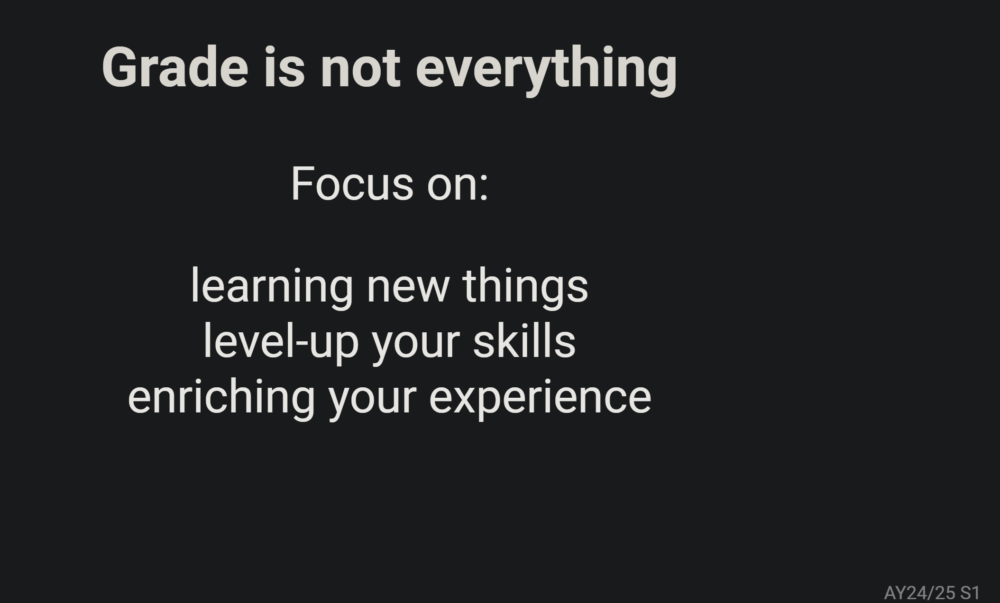

# CS1010 Course Review

## Introduction

- **Full name**: [CS1010 Programming Methodology](https://nusmods.com/courses/CS1010/programming-methodology)
- **Target audience**: NUS Year 1 SoC Students
- **Purpose of the course**: Introduces the fundamental concepts of problem solving by computing and programming using an imperative programming language - C
- **Notes Content**: View the [CS1010 Lecture Notes](https://wenbo-notes.gitbook.io/cs1010-notes/)

I took this course in AY24/25 Sem 1 for my degree requirement.

## Course Content

### Overview of Topics Covered

1. [**How to write C**](https://wenbo-notes.gitbook.io/cs1010-notes/lec-tut-lab-exes/lecture/lec-12-recap#id-1.-how-to-write-c): Types, Functions, Branching, Loops, Arrays
2. [**How a C program behaves**](https://wenbo-notes.gitbook.io/cs1010-notes/lec-tut-lab-exes/lecture/lec-12-recap#id-2.-how-a-c-program-behaves): Memory Mode, Interacting with OS
3. [**Tools and Practice**](https://wenbo-notes.gitbook.io/cs1010-notes/lec-tut-lab-exes/lecture/lec-12-recap#id-3.-tools-and-practices): Bash, Vim, Clang
4. [**Problem Solving Techniques**](https://wenbo-notes.gitbook.io/cs1010-notes/lec-tut-lab-exes/lecture/lec-12-recap#id-4.-problem-solving-techniques): Decomposition, Recursion, Thinking Tools
5. [**Computational Thinking**](https://wenbo-notes.gitbook.io/cs1010-notes/lec-tut-lab-exes/lecture/lec-12-recap#computational-thinking): Four Pillars of Computational Thinking

If you're curious, here's a small spoiler: [Lec 12 - Recap](https://wenbo-notes.gitbook.io/cs1010-notes/lec-tut-lab-exes/lecture/lec-12-recap), this will give you a detailed preview of everything you'll learn in CS1010.

### Depth and Balance of Coverage

#### Theoretical Understanding

As the first programming course for freshmen, CS1010 lays a solid foundation that prepares you for more advanced programming courses, such as CS2040C and beyond. While C is often considered a challenging language, it is chosen as an introductory language because it provides a deep understanding of low-level concepts, such as how a computer executes a program.

CS1010 not only teaches you how to write and debug C programs, but, most importantly, it fosters computational thinking, equipping you with the skills to solve real-world problems effectively.

#### Application and real-world examples

One clear benefit of CS1010 is the significant improvement in your problem-solving skills, especially for coding challenges commonly found in technical interviews on platforms like LeetCode or Kattis. With the foundational skills gained in CS1010, along with additional knowledge from data structures courses like CS2040S or CS2040C, you'll be well-prepared to excel in technical interviews.

Another key takeaway from this course is the development of computational thinking, which I consider a crucial skill in today's digital world. The problems we face are often far more complex than we realize, but how do we solve them effectively? A powerful approach is to apply computational thinking, particularly decomposition/divide-and-conquer. By breaking down large, complex problems into smaller, manageable ones, we can solve the bigger challenges piece by piece.

> All in all, think computationally!

#### Challenging or Unique Aspects

1. **How to correctly use computational thinking to solve problems?**:  
    This is perhaps the most challenging part in this course. The process usually starts with:
    - Break the problem into smaller, manageable parts.
    - Identify inputs, outputs, and key processes, and determine how they connect.
    - For each sub-problem, select the right algorithm and data structure to solve it.
    - Combine these solutions together to solve your original problem.

    This systematic approach simplifies problem-solving and ensures clarity in your solution. Among them, the most challenging part for me in CS1010 is recursion.

2. **How to use C to implement your thinking correctly?**:  
    After coming up with the correct idea, the next step is to implement it in C. For example, you should carefully plan how much memory you need to allocate, using functions like malloc or calloc for dynamic memory management, and ensure all allocated memory is freed with free() to prevent leaks.

    The low-level nature of C makes it challenging to write perfect code on the first attempt. However, persistence is the key -- keep debugging, testing, and refining your code. Over time, your debugging skills will improve significantly, turning these challenges into valuable learning experiences.

## Teaching Style and Materials

### Lecture

The lectures, taught by Prof. Ooi and Dr. Eldon, are incredibly engaging and insightful. Both are exceptionally kind and approachable, making the learning experience enjoyable. Every lecture is a treasure trove of knowledge -- I'm constantly amazed by how effectively they explain complex concepts and algorithms. The lecture notes are, without a doubt, the best documentation I've ever encountered. They are exceptionally well-structured and easy to understand, making them an invaluable resource.

### Tutorial

My tutorial is taught by Dr. Eric, a kind and highly knowledgeable teacher. His clear and detailed explanations consistently deepen my understanding of C, making even challenging concepts easier to grasp.

### Lab

My lab instructor, Zhang Puyu, is truly one of the geniuses at NUS. I've lost count of how many times I've been amazed by his insights during class. His rigorous mathematical thinking brings elegance and brilliance to algorithms, making them both inspiring and unforgettable.

### Assessment

1. **Take-Home Exercises**: Ungraded but important for practice. As Prof. Ooi wisely advised, "Always make your hands dirty" -- actively engaging with these exercises is key to deepening your understanding of C.
2. **Practical Exams (PE)**: Three PEs accounting for 45% total, with increasing difficulty. The PEs test problem-solving skills under time constraints and pressure. If you don't perform well in a PE, don't feel discouraged -- it doesn't define your programming ability. Remember, coding is mostly about practice: the more you practice, the more confident you'll become at tackling problems.
3. **Midterm and Final Exams**: These written exams are relatively easier compared to the PEs. To prepare effectively, focus on thoroughly studying the Lecture Notes and gaining a solid understanding of how a C program behaves.

### Course Book

**Textbook**: *Modern C* by Jens Gustedt. This is the textbook provided by the CS1010 Teaching Team.

{ width=200 style="display: block; margin: 0 auto" }

**Reference book**: *C Programming: A Modern Approach, 2nd Edition* by K. N. King. This reference book serves as my enlightenment teacher when learning C.

{ width=200 style="display: block; margin: 0 auto" }

## Learning Experience

### Personal Insights

> CS1010 is difficult, but useful.

I'll never forget the countless hours spent on the weekly take-home exercises, or the feeling of desperation after the PEs. But what I do remember most vividly is the excitement when running `./test.sh` and seeing "passed."

One of the most disappointing moments for me is that I have reviewed everything thoroughly, but I still struggle with the PEs and exercises. However, CS1010 taught me that coding isn't a "get rich overnight" skill -- it's more like a "constant dripping wears through the rock" process. Don't let the PEs destroy you! Look back at what you've learned, and you'll see how much you've grown in coding! That's already an achievement in itself! Stay confident, and keep practicing!

{ width=400 style="display: block; margin: 0 auto" }

### Skills Developed

This course has taught me computational thinking and problem-solving skills that extend far beyond programming. The ability to decompose complex problems, think algorithmically, and write efficient C code are foundational skills that will benefit me in future courses and technical interviews.

## Workload and Time Management  

- **Level of Difficulty**:  
    1. **9/10**: If you are new to programming.
    2. **4/10**: If you have experience in competitive programming.
- **Tips for Future Students**:  
    I hope my notes hosted in the website will ease your workload and provide clarity on the concepts covered in this course. They are designed to help you grasp the material more effectively and approach the challenges with confidence. Remember: always make your hands dirty -- actively engaging with the exercises is key to deepening your understanding of C.

## Conclusion

I want to express my heartfelt thanks to the amazing teaching team of CS1010. I'll always remember how quickly Prof. Ooi would respond to my questions on Piazza, offering clear and helpful answers every time! I also want to thank my classmates -- without them, my CS1010 journey wouldn't have been as rewarding and vibrant. I'll never forget the moments we tackled difficult exercises, PEs, and exams together. The end is always good! If it is not good, then it's not the end!
