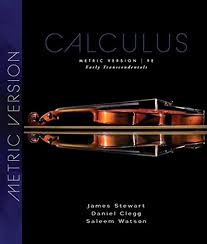

# MA1511 Course Review

## Introduction

- **Full name**: [MA1511 Engineering Calculus](https://nusmods.com/courses/MA1511/engineering-calculus)
- **Target audience**: NUS Year 1 Engineering Students
- **Purpose of the course**: Foundational calculus knowledge preparing for modeling real-world system
- **Notes Structure**: View the [MA1511 Lecture Notes](https://github.com/mendax1234/lecture-notes/tree/main/Y1S1/MA1511)
  - **MA1511-Notes**: This folder contains a comprehensive version of my notes, designed to break down and explain each concept covered in the course in a clear and easy-to-understand manner.  
  - **MA1511-Cheatsheet**: Here, you'll find the cheatsheet I created and used throughout the course, summarizing key formulas and methods for quick reference.  

I took this course in AY24/25 Sem 1 for my degree requirement.

## Course Content

### Overview of Topics Covered

1. **Partial Derivatives**: Level Curves, First Order Partial Derivatives, Higher Order Partial Derivatives, Normal Lines and Tangent Planes, Chain Rule, Directional Derivatives, Local Extrema, Lagrange Multipliers
2. **Multiple Integrals**: Double Integrals over Rectangular Domain and General Domain, Double Integrals in Polar Coordinates
3. **Vector Valued Functions**: Curves and Motion in Space, Integrals of Vector-valued Functions, Arc Length, Line Integrals, Parametric Surfaces
4. **Vector Fields**: Vector Fields, Line Integrals of Vector Fields, Conservative Fields, Line Integrals in Conservative Fields, Green's Theorem, Curl and Divergence
5. **Infinite Series**: Sequences, Infinite Series, Two Convergence Tests for Infinite Series, Power Series, Taylor Series, Maclaurin Series

### Depth and Balance of Coverage

#### Theoretical Understanding

As an engineering mathematics course, the focus is primarily on applying equations to solve problems. However, I believe engineers should also develop a deeper understanding of the underlying concepts. This theoretical foundation will help in analyzing and solving real-world problems more effectively, beyond just computation.

#### Application and Real-World Examples

While this course touches on the geometric interpretation and representation of concepts, I feel like it falls short of incorporating practical real-world examples. This limitation might stem from the course's brief duration. From my point of view, incorporating at least a few detailed real-world applications would greatly enhance the learning experience.

#### Challenging or Unique Aspects

The most challenging aspect of this course, in my opinion, is developing **spatial imagination**. Understanding certain concepts through their geometric interpretations can make them significantly easier to grasp. Without this visualization, however, the material can become quite difficult to comprehend.

## Teaching Style and Materials

### Teaching Style

#### Lecture

The lectures are conducted by Prof. Tan Ban Pin. The lecture notes are clear, concise, and easy to understand, making them an excellent resource for both learning during the semester and reviewing before the final examination.  

#### Tutorial

My tutorials are led by Clifton, who is an excellent instructor. He explains concepts clearly and is always approachable. The tutorial questions for this module are generally straightforward and not too challenging.

#### Assessment

The final examination is the primary assessment for this course. In my opinion, it is quite straightforward and mainly tests your familiarity with the formulas covered in the course. Most of the time, solving the problems involves directly substituting numbers into the equations, making it more of a test of accuracy than deep conceptual understanding.  

### Course Book

**Reference Book**: There is no specific textbook for this course. But based on my learning experience, I think the book *Calculus: Early Transcendentals, Metric Edition* by James Stewart is awesome! I love reading it since I was in NTU.

{ width=200 style="display: block; margin: 0 auto" }

## Learning Experience

### Personal Insights

The workload for this course is relatively light, so if your goal is simply to pass or secure a good grade, you don't need to invest an excessive amount of time. However, if you aim to gain a deeper understanding of the concepts by reading the textbook, be prepared for it to be quite time-consuming. I noticed that the content of one week's lecture typically corresponds to an entire chapter in the textbook. That said, this course provides a valuable opportunity to revisit and deepen your understanding during the holidays.

### Skills Developed

The calculus skills I developed in this course, including both integration and differentiation, are fundamental and incredibly important for succeeding in the follow-up module, MA1512 *Differential Equations for Engineers*.  

## Workload and Time Management

- **Level of Difficulty**:  **4/10**
- **Tips for Future Students**:  
      I hope my notes will ease your workload and provide clarity on the concepts covered in this course. They are designed to help you grasp the material more effectively and approach the challenges with confidence.

## Conclusion

Calculus is a fundamental skill, especially for engineers. As for this course, I legit have no comment. However, one key takeaway is the importance of self-study, which is an essential skill to develop and rely on during university.
