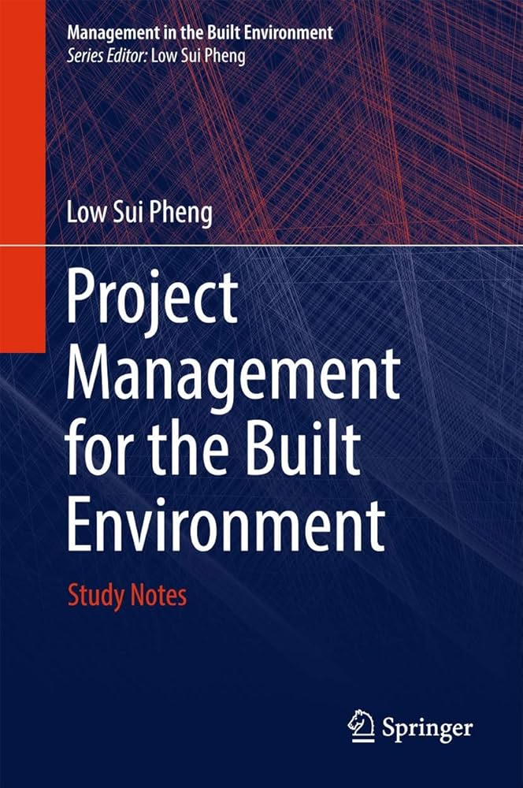

# PF1101 Course Review

## Introduction

- **Full name**: [PF1101 Fundamentals of Project Management](https://nusmods.com/courses/PF1101A/project-management-and-finance)
- **Target audience**: NUS Year 1 CDE Students
- **Purpose of the course**: To provide students with a hands-on experience in managing large projects by applying the "PM is a 9-5 job" skill introduced by Prof. Low.
- **Notes Structure**: View the [PF1101 Lecture Notes](https://github.com/mendax1234/lecture-notes/tree/main/Y1S2/PF1101)
    1. **PF1101-Notes**: The file `PF1101_Notes` contains the notes I made while studying this course and designing my project.

I took this course in AY24/25 Semester 2 to fulfill my degree requirement.

## Course Content

### Overview of Topics Covered

This entire course revolves around one major group project, which is proposed at the start of the semester by a group of 5–6 students. Every two weeks, we:

- Refine and then present our project idea to the rest of the class
- Add more technical and managerial details
- Improve feasibility and structure

By the end of the semester, we are required to submit a 6000-word project proposal document, which serves as the final culmination of all our planning and iterations.

### Depth and Balance of Coverage

As a common course for all CDE Year 1 students, the academic difficulty of PF1101 is relatively moderate and straightforward. However, instead of focusing on execution, this course places a strong emphasis on project planning and proposal design.

We learn how to apply well-known project management tools such as:

- Work Breakdown Structure (WBS)
- Gantt Charts
- Risk analysis and scheduling techniques

These tools train us to think systematically about how a large-scale project should be structured, managed, and evaluated before actual implementation.

## Teaching Style and Materials

### Teaching Style

#### Tutorial

The main learning component of this course lies in the once-every-two-weeks tutorial sessions. My tutor was Prof. Vincent Gan. He is an extremely kind and responsible instructor who always gave our group very detailed and practical feedback on our project progress.

Since our final grade is largely based on the project proposal, his feedback played a crucial role in shaping the direction, structure, and clarity of our work.

### Course Book

**Textbook**: *Project Management for the Built Environment* by Low Sui Pheng

{ width=200 style="display: block; margin: 0 auto" }

!!! info
    This textbook is written by Prof. Low Sui Pheng, he is also the lecturer for this course!

## Learning Experience

This is another common course that I genuinely enjoyed. For the first time, I truly learned how to manage a large project in a systematic way, instead of relying purely on intuition.

More importantly, I felt that this course became especially meaningful because of the creative direction and innovation that grew out of what I had learned in DTK1234.

For the first time, I could clearly see how an abstract idea evolves into a concrete, well-managed proposal through teamwork and proper planning. Watching our ideas take shape through collaboration was an extremely rewarding experience.

## Workload and Time Management

- **Level of Difficulty**: **5/10**
- **Tips for Future Students**: Lectures can just skip, but always actively consult your tutor. Your tutor's feedback is far more valuable than memorizing theory, especially since your project proposal determines most of your final grade.

!!! info
    As far as I know, the content of this course has changed since AY25/26 Semester 1, so future batches may experience a slightly different structure.

## Conclusion

I feel incredibly grateful to my group members — they are genuinely some of the most efficient, responsible, and kind people I've worked with at NUS. The teamwork made this long project journey smooth and enjoyable.

I would also like to express my sincere thanks to Prof. Vincent Gan for his patient guidance and sharp feedback throughout the semester. PF1101 was not only a course about project management, but also a valuable lesson in collaboration, planning, and execution.
