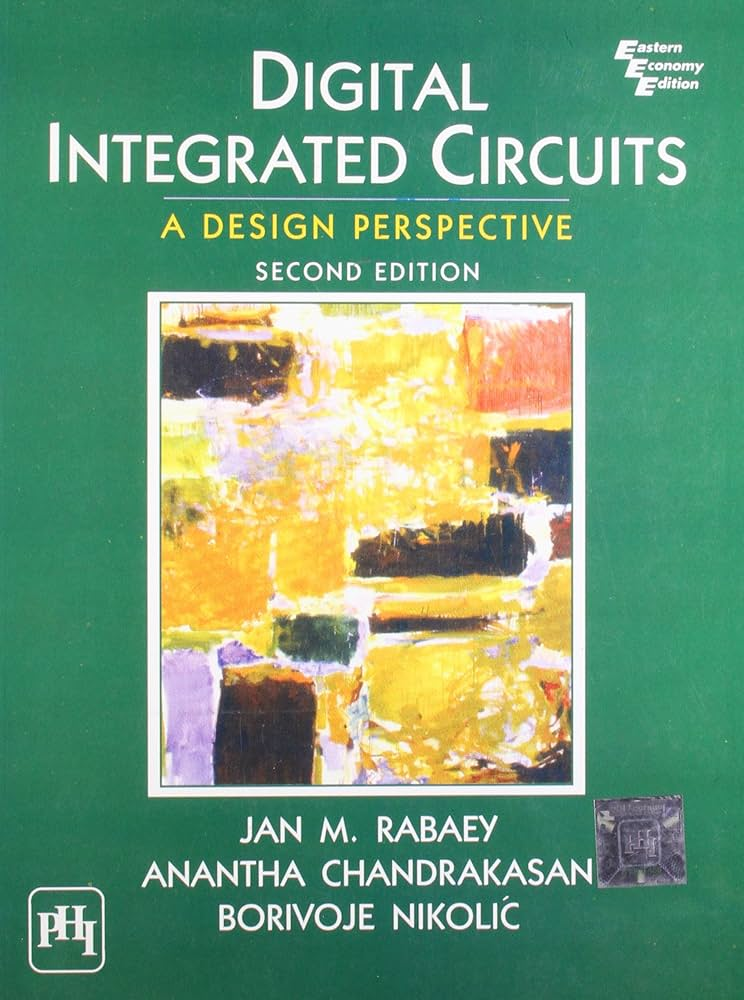
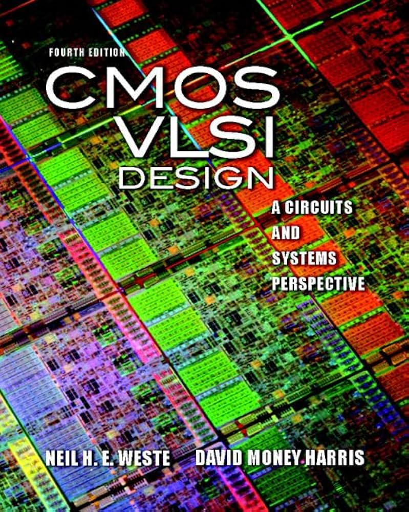

# CG2027 Course Review

## Introduction

- **Full name**: [CG2027 Transistor-level Digital Circuits](https://nusmods.com/courses/CG2027/transistor-level-digital-circuits)
- **Target audience**: NUS Year 2 CEG Students
- **Purpose of the course**: To introduce the fundamentals of MOSFETs and how CMOS transistors are used to construct digital logic gates and high-level functional units. The course also covers the power and timing analysis of CMOS circuits.
- **Notes Content**: View the [CG2027 Lecture Notes](https://wenbo-notes.gitbook.io/cg2027-notes/)

I took this course in AY25/26 Semester 1 to fulfill my degree requirement.

## Course Content

### Overview of Topics Covered

1. **The Device**: Understanding the operating principles and I–V characteristics of NMOS and PMOS transistors.
2. **CMOS Inverter**: Using CMOS transistors to build inverters and analyzing propagation delay and power consumption.
3. **CMOS Logic**: Constructing more complex logic circuits using CMOS, including pass transistors and transmission gates.
4. **ALU**: Performance analysis of different adder architectures, such as Ripple-Carry Adders, Carry Bypass Adders, and Linear/Square Carry Select Adders.
5. **Memory**: Understanding the working principles of DRAM, SRAM, and NAND Flash, including how data is stored and accessed.

### Depth and Balance of Coverage

---

#### Theoretical Understanding

This is another rigorous core module for CEG students. It spans three abstraction levels described in Harris & Harris (DDCA) -- from physics, to devices, and finally to digital circuits. The concepts of PN junctions, MOSFET operation, and how transistors are used to construct digital circuits are extremely important for students who wish to pursue further studies in digital or analog circuit design.

---

#### Application and real-world examples

CMOS transistors are the fundamental building blocks of modern integrated circuits. Understanding how transistors operate provides valuable insight into the elegance and impact of this invention. More importantly, by applying first-principles reasoning, we can only meaningfully optimize modern technologies after understanding how their predecessors work.

However, as a 2k module, CG2027 focuses more on conceptual understanding than on advanced theoretical depth or full-scale industrial design workflows. This also means that there remains a significant gap between what is learned in the course and the practical digital circuit design experience using industrial tools such as Cadence or Synopsys.

---

#### Challenging or Unique Aspects

1. **Timing Analysis of Different Adder Architectures**: The key challenge lies in understanding where propagation delays originate. After that, one must carefully analyze the combinational paths that the data traverses and identify the longest path, which determines the critical path and the maximum propagation delay.
2. **CCMOS Transistors in Memory Design**: If you wish to truly understand how different types of memory are built using CMOS transistors and how data is stored and read, attending lectures alone may not be sufficient. I strongly recommend supplementing the lectures with visual resources such as online videos, which provide much more intuitive explanations. (These resources are included in my notes.)

## Teaching Style and Materials

### Teaching Style

---

#### Lecture

This year, the lectures are conducted by Prof. Annie Kumar. I heard that the lecturer in AY24/25 Semester 2 was not as well received. Personally, I find Prof. Annie to be very kind and highly willing to help students with their questions.

At the same time, I do feel somewhat regretful that one of the most renowned analog circuit experts in NUS ECE, Prof. Jerald Yoo, has left. When reading through the lecture slides, I could clearly feel his excellence in this field. It is hard not to imagine how insightful and inspiring the lectures would have been if they were still conducted by Prof. Jerald Yoo.

---

#### Tutorials

My tutor is Mr. Juezhao Yu. He is very knowledgeable and kind. I would strongly recommend his tutorial if the alternatives are not Prof. Kelvin or Prof. Jerald. One memorable example was when Mr. Juezhao used the analogy of a drop of ink diffusing in water to explain electron diffusion in CMOS transistors. At times, his explanations provided deeper insights beyond what was covered in the lectures.

---

#### Assessments

1. **Take-Home Exercises**: These are the best opportunities to practise the theoretical concepts. The problems are generally not overly difficult but are very helpful for consolidating understanding.
2. **Final**: The final exam largely consists of tutorial-style questions with some variations. It is not excessively difficult, but it is intellectually engaging and tests conceptual understanding thoroughly.

### Course Book

There is one textbook and one reference book used for this course!

**Textbook**: *Digital Integrated Circuits: A Design Perspective (Second Edition)* by Jan M. Rabaey, Anantha Chandrakasan, and Borivoje Nikolic

{ width=200 style="display: block; margin: 0 auto" }

!!! warning "Attention"
    This textbook is intended for graduate-level study. In CG2027, we only cover the surface of some device-level concepts. The book is also mathematically heavy, but it is a highly classical and authoritative reference.

**Reference book**: *CMOS VLSI Design: A Circuits and Systems Perspective (Fourth Edition)* by Neil H.E. Weste and David Harris

{ width=200 style="display: block; margin: 0 auto" }

!!! info
    During my time, this book was not initially available in the NUS Library. After my request, the library acquired it in less than one month. It is now available at the NUS Central Library.

## Learning Experience

### Personal Insights

This course successfully completes the lower levels of the eight-layer abstraction stack. It feels deeply rewarding to understand the computer systems I work with starting from low-level physics, to transistor operation, and finally to digital functional unit construction using CMOS.

### Skills Developed

In this course, I learned the theoretical foundations of CMOS transistors. However, how these devices are applied in large-scale integrated circuit design will be covered in subsequent modules, like EE4415, etc.

## Workload and Time Management

- **Level of Difficulty**: 7/10
- **Tips for future cohort**: I hope that my compiled lecture notes can help ease your workload and support your learning throughout the course.

## Conclusion

This is a must-take course if you are interested in pursuing digital or analog integrated circuit design in the future.
