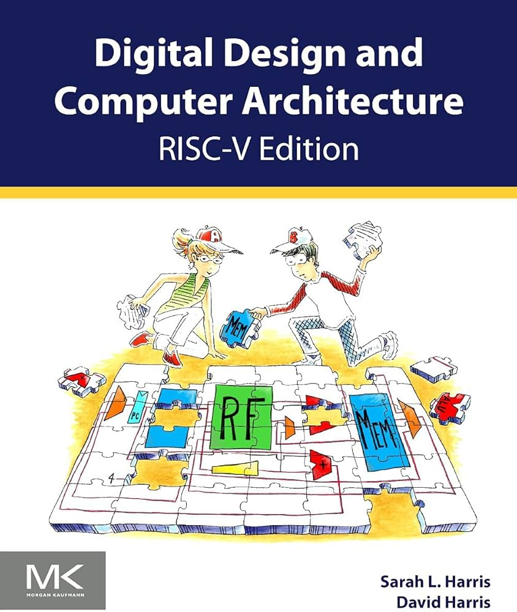
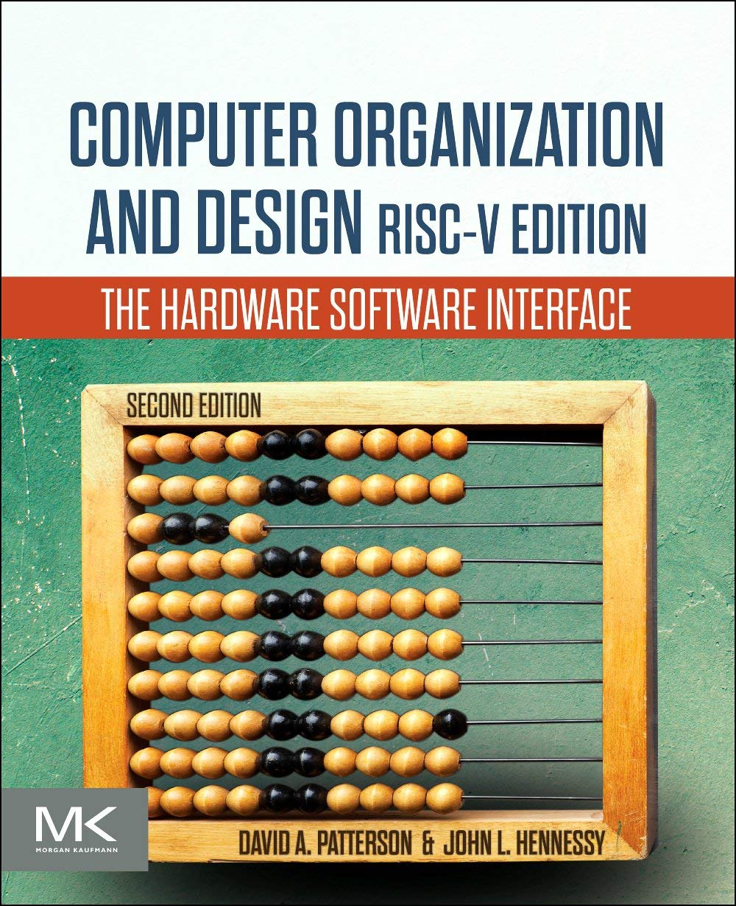

# CG3207 Course Review

## Introduction

- **Full name**: [CG3207 Computer Architecture](https://nusmods.com/courses/CG3207/computer-architecture)
- **Target audience**: NUS Year 3/4 CEG Students
- **Purpose of the course**: To provide students with a comprehensive understanding of the principles and elegance of computer architecture, and to implement these ideas on the Nexys 4 FPGA using Verilog HDL.
- **Notes Content**: View the [CG3207 Lecture Notes](https://wenbo-notes.gitbook.io/ddca-notes/) (also known as DDCA - Digital Design and Computer Architecture)

I took this course in AY25/26 Semester 1 in advance to prepare for my potential internship in Year 3 and my study at CentraleSupélec.

## Course Content

### Overview of Topics Covered

1. **History, Technology and Performance**: Moore’s Law, modern technology trends (industry challenges and current solutions), and performance measurement (CPU Time = IC x CPI x Clock Cycle Time)
2. **Digital System Design**: FPGA/ASIC design flow and FPGA working principles
3. **Verilog for Synthesis**: Rules for synthesizable Verilog and physical register inference
4. **RISC-V Instruction Set Architecture**: Instruction format, design elegance, and key features of RISC-V
5. **RISC-V Microarchitecture**: Datapath, control unit, and implementation of a single-cycle processor
6. **Arithmetic for Computers**: Adders, shifters, multipliers, dividers, ALU design, and number systems
7. **Pipelining**: Principles of pipelining, pipeline hazards, and hazard handling
8. **Advanced Processor**: Branch prediction, deep pipelining, micro-operations, multiple-issue processors, multithreading, multiprocessors, SIMD/vector processing, and systolic arrays
9. **Memory System Principles**: Memory hierarchy, cache, and virtual memory
10. **Embedded I/O Systems**: System interconnection, addressing mechanisms, data transfer models, and communication protocols
11. **Exception Handling in RISC-V Processors**: Exception types, handlers, execution modes, privilege levels, and RISC-V exception-related instructions

### Depth and Balance of Coverage

---

#### Theoretical Understanding

This is a highly rigorous course that lays a very solid foundation for processor design. Within the eight-level abstraction model from Harris & Harris, CG3207 primarily focuses on the architecture and microarchitecture layers. By the end of this course, students will acquire the essential skills needed to design a simple RISC-V processor.

More importantly, this course offers a rare opportunity to experience the beauty and elegance of processor design. As both **Verilog HDL** and **RISC-V assembly** are extensively used, students’ understanding of **RTL design** is also greatly strengthened.

---

#### Application and real-world examples

Under Prof. Rajesh’s teaching, this course is highly industry-relevant. A key practical highlight is that after four labs, students will successfully build a **pipelined RISC-V CPU** using the concepts learned in lectures. Being able to translate theory into a working processor immediately is one of the most rewarding aspects of this module.

In addition, Prof. Rajesh introduces several cutting-edge technologies in the later part of the course, such as **GPUs** and **Google TPUs**, offering students a broader perspective on modern computing systems and accelerators.

---

#### Challenging or Unique Aspects

1. **Writing Good RTL Code**: Hardware programming differs fundamentally from software programming. In digital design, we must truly **think in hardware**. The basic abstraction becomes how data flows between registers, and how long that transfer takes -- the propagation delay, which directly limits system performance.
2. **Pipeling**: Debugging a single-cycle processor is relatively manageable. However, once pipelining is introduced, the design and debugging complexity increases dramatically. This is especially evident in **Lab 04**.
3. **Advanced Processor Topics**: Many modern and advanced processor techniques are introduced conceptually, which significantly increases the theoretical difficulty of the course. Fortunately, these topics are mainly examined in the **final** and are not mandatory for lab implementation. Nevertheless, they are extremely interesting to explore further after the course.

## Teaching Style and Materials

### Teaching Style

---

#### Lecture

The lectures are conducted by Prof. Rajesh every Wednesday evening (6 pm – 9 pm). Without exaggeration, Prof. Rajesh is the best professor I have encountered in NUS ECE. His depth of knowledge spans across RISC-V processor design, computer architecture, and practical tools such as Vivado. I still vividly remember him spending over an hour patiently explaining a single technical question to me.

Beyond his technical excellence, Prof. Rajesh is also exceptionally approachable and supportive, whether for academic or general guidance. His lectures are always worth attending.

---

#### Lab

The lab instructor is Dr. Neil, and the four labs form one of the highlights of this module. This is where theory is fully transformed into practice. I still remember the excitement when our benchmark and OLED display ran successfully during the final lab.

By the end of the lab series, students will have implemented a pipelined RISC-V processor supporting almost all RV32IM instructions.

---

#### Assessments

1. **Quizzes**: There are three quizzes, all conducted during lecture time. Some of the quiz questions are non-trivial and serve as excellent conceptual challenges. Prof. Rajesh also provides practice questions before each quiz, which should not be skipped, as many of them are highly instructive.
2. **Finals**: The final exam is, honestly, one of the **hardest finals** I have taken. A major challenge is that some questions test advanced processor concepts that students may be seeing formally for the first time, particularly from the Advanced Processor topic.

### Course Book

Two highly classical and strongly recommended textbooks are used in this course:

**Textbook 1**: *Digital Design and Computer Architecture (RISC-V Edition)* by David Harris and Sarah Harris

{ width=200 style="display: block; margin: 0 auto" }

**Textbook 2**: *Computer Organization and Design RISC-V Edition: The Hardware Software Interface* by David A. Patterson and John L. Hennessy

{ width=200 style="display: block; margin: 0 auto" }

!!! info
    During my time, both books were not initially available in the NUS Library. After my request, the library acquired them in less than one month. They are now available at the NUS Central Library.

## Learning Experience

### Personal Insights

> CG3207 is difficult, but useful.

This is one of the most challenging yet most rewarding courses I have taken at NUS. As a continuation of EE2026 and CG2028 for NUS CEG students (and NTU SC1005 + SC1006 for me), this course allowed me to truly appreciate the elegance of RISC-V processors, from ISA design to performance optimization techniques.

Throughout the course, I learned how to extract performance using eight great ideas presented in the Hennessy & Patterson framework. While trade-offs are unavoidable, a computer architect must never sacrifice correctness for raw performance. In this sense, I truly believe that computer architecture is an art.

### Skills Developed

This course significantly deepened my understanding of computer architecture and equipped me with:

- Strong RTL design skills using Verilog HDL
- RISC-V assembly programming
- Practical experience with Makefiles when running benchmarks on custom processors

## Workload and Time Management

- **Level of Difficulty**: 9/10
- **Tips for future cohort**: I have open-sourced all my lecture notes, highlighting the most difficult concepts I encountered. In addition, I am currently working on an open-source RISC-V processor project, aimed at helping beginners learn how to design a complete processor. I hope these resources will be helpful.

## Conclusion

I would like to express my heartfelt thanks to Prof. Rajesh, Dr. Neil, and my lab group mates. Without their guidance and support, I would not have been able to complete this extremely challenging yet deeply rewarding course.

This is undoubtedly one of the most impressive modules I have ever taken at NUS.
