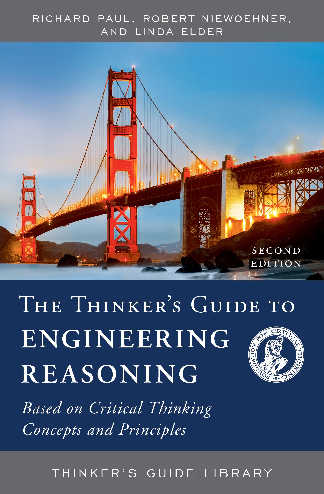

# ES2631 Course Review

## Introduction

- **Full name**: [ES2631 Critique and Communication of Thinking and Design](https://nusmods.com/courses/ES2631/critique-and-communication-of-thinking-and-design)
- **Target audience**: NUS Year 2 CDE students who do not have an RC module to replace this requirement
- **Purpose of the course**: To train students in academic writing using a specific framework selected by the teaching team, known as the Engineering Reasoning Framework (ERF).
- **Notes Structure**: View the [ES2631 Lecture Notes](https://github.com/mendax1234/lecture-notes/tree/main/Y1S1/LAF1201)
    1. **LAF1201-Notes**: This folder contains the notes  when I study this course.

I took this course in AY25/26 Semester 1 to fulfill my degree requirement.

## Course Content

### Overview of Topics Covered

1. **Engineering Reasoning Framework (ERF)**: Intellectual traits, Eight Elements of Thought, and Nine Intellectual Standards.
2. **How to find reliable sources and cite them correctly**
3. **How to give effective presentations**
4. **How to critique others' work**
5. **Academic language and tone**

### Depth and Balance of Coverage

#### Theoretical Understanding

As a writing-focused module, the only major theoretical component is Paul's Engineering Reasoning Framework (ERF). To perform well in this course, you must understand this framework thoroughly.

The framework begins with the Eight Elements of Thought, and you are expected to identify each element mentioned from any given text. You must then apply the appropriate Intellectual Standards to evaluate these elements and construct a logical and well-supported argument. This forms the core methodology of the entire course.

#### Application and real-world examples

Unlike the crazy thinking framework I have come up with in modules such as DTK1234 and PF1101, the ERF in this module is highly specialised for academic essay writing. In practice, its primary function is to help you complete the two written assignments in this module.

Beyond these assignments, I personally do not observe strong real-world applicability of this framework in daily reasoning, engineering problem-solving, or professional settings.

#### Challenging or Unique Aspects

One of the most challenging aspects of this course is that almost everything is **subjective**.

The core task -- correctly identifying the Element of Thought and applying the "right" Intellectual Standard -- relies heavily on the tutor's personal interpretation. Since your assignments are graded solely by your tutor, disagreements in interpretation are extremely difficult to resolve. Even if you provide extensive justification, it is often hard to change the tutor's stubborn judgment once it is formed.

What makes this more frustrating is that when I ask whether any objective standard exists to reduce this **subjectivity**, the answers tend to be very vague. This creates uncertainty in learning expectations and results in a rather demoralising experience at times. (I hope this issue wont appear across different tutors.)

## Teaching Style and Materials

### Teaching Style

#### Tutorial

My tutor was Ms. Lee Jun Hiang. She appears kind at first impression -- and indeed, she is patient and polite. I rememebered that I asked her many questions throughout the semester. Some of my ideas were rejected due to course constraints, but overall, she was consistent in following the teaching team's guidelines very strictly, leaving little room for deviation or unconventional approaches.

!!! info
    This module does not have any lectures. All teaching is conducted through weekly 3-hour tutorials.

#### Assessments

There are three Continuous Assessments (CAs):

- One group presentation (Assignment 1)
- Two individual essays (Assignment 2 and Assignment 3)

The group presentation requires all three group members to be functional and cooperative. If not, the workload easily becomes unbalanced.

For the two essay assignments, I highly recommend booking consultations with the NUS Writing Centre, as the grading criteria are extremely specific and strict.

### Course Book

**Textbook**: *The thinker's guide to engineering reasoning: based on critical thinking concepts and tools* by Richard Paul, Robert Niewoehner and Linda Elder.

{ width=200 style="display: block; margin: 0 auto" }

## Learning Experience

### Personal Insights

This is the first module at NUS where I felt genuinely frustrated.

First, during the Assignment 1 group presentation, I had to carry most of the workload due to a lack of contribution from my group members. This was both stressful and discouraging.

Second, regarding the content of the course, I strongly felt that I was being trained to write something very similar to the "eight-legged essay" (八股文) from ancient Chinese imperial examinations -- a rigid, formulaic structure that prioritises compliance over creativity.

I distinctly remember proposing an innovative idea aimed at solving a real problem I encountered on campus. The same problem has been encountered by my group memebr as well. However, it was rejected solely because it did not qualify as a "significant engineering problem" under the course's requirements -- despite the fact that the definition of what constitutes a "significant problem" is itself highly subjective.

### Skills Developed

The main skills I developed (or was forced to develop) from this course are:

1. **Learning how to execute a group project even when the rest of the group is largely non-functional**
2. **Forcing my thinking into a very narrow framework in order to produce a highly constrained, formulaic essay**

The first skill will undoubtedly be useful in real life. As for the second, I have no comment for now.

## Workload and Time Management

- **Level of Difficulty**: **6/10**
- **Tips for Future Students**: This is not a fully individual module. Try to form a group of three with friends before the semester starts. Your life will be significantly easier when handling Assignment 1 (group presentation).

## Conclusion

I understand the intended purpose of this course -- to improve the academic English writing skills of CDE students. However, I do not believe that enforcing a highly rigid framework should come at the cost of suppressing students' innovative ideas. And also, the correctness of this framework itself is questionable.
