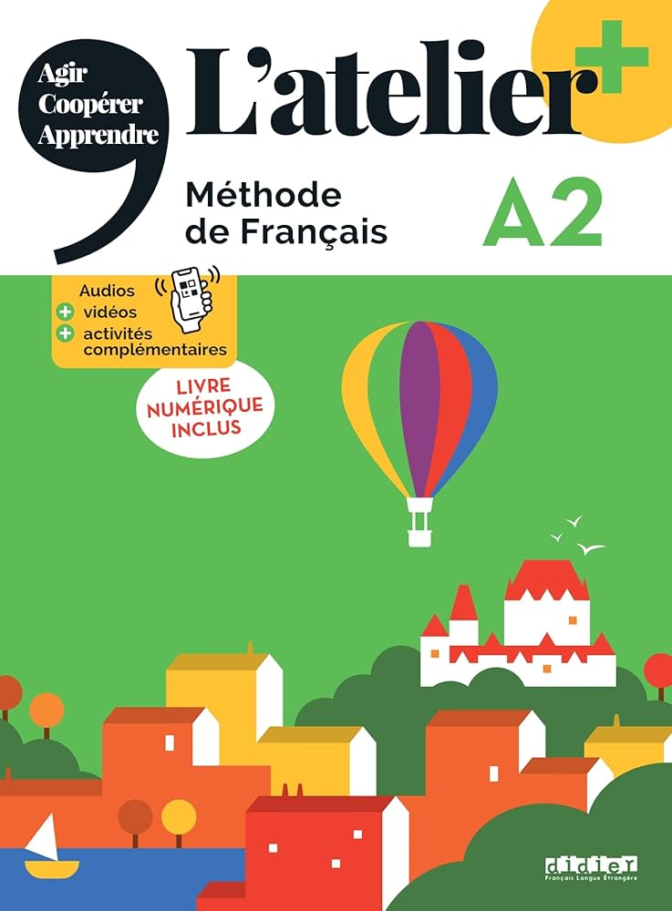
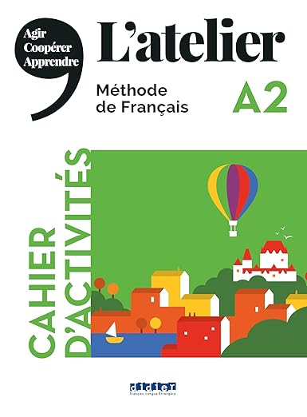

# LAF3202 Course Review

## Introduction

- **Full name**: [LAF3202 French 4](https://nusmods.com/courses/LAF3202/french-4)
- **Target audience**: any student who is interested in learning French
- **Purpose of the course**: Rather straightforward, to learn French :joy:
- **Notes Structure**: View the [LAF3202 Lecture Notes](https://github.com/mendax1234/lecture-notes/tree/main/Y2S1/LAF3202)
    1. **LAF3202-Notes**: The file `LAF3202_Notes.pdf` contains the notes I made while studying this course.

I took this course in AY25/26 Semester 1. I skipped French 3 after completing a one-month French immersion programme in Normandy, France during the mid-year break of AY24/25. After my immersion trip, I took the placement test and was technically able to skip both French 3 and French 4. However, to better consolidate my foundation and make my academic schedule more manageable, I chose to take French 4 instead.

## Course Content

### Overview of Topics Covered

1. **Unit 1: Ensemble, c'est mieux!**
2. **Unit 2: C'est trop beau!**
3. **Unit 3: Comme disait mon grand-père...**
4. **Unit 4: Si vous voulez bien...**

### Depth and Balance of Coverage

As the final course at the DELF A2 level, I would say that after one month of intensive French learning in France, LAF3202 largely served as a revision of key grammar points for me, as well as a valuable opportunity to practise spoken French in class.

## Teaching Style and Materials

### Teaching Style

#### Tutorial

Mon professeur est Madame Kavita. Elle est très gentille et elle peut nous expliquer les points de grammaire clairement et en détail. C'est génial !

!!! info
    All NUS language modules are conducted entirely through tutorials. There are no lectures, and language modules at all levels are S/U-able.

### Course Book

**Textbook**:

{ width=200 style="display: block; margin: 0 auto" }

**Exercise Book**:

{ width=200 style="display: block; margin: 0 auto" }

## Learning Experience

After seeing many of my friends proceed directly to French 5 in AY25/26 Semester 1, I did not regret staying in French 4. I met a group of wonderful classmates and a very kind teacher in this class. *Je vous remercie beaucoup !*

## Workload and Time Management

- **Level of Difficulty**: **4/10**
- **Tips for Future Students**: Same tip as for French 1 and 2 -- the mémo at the end of each unit in the textbook is extremely useful for revision and consolidation.

## Conclusion

This is a wonderful course with kind teachers and friendly classmates, and it provides a relaxed yet effective environment for strengthening your French foundation.
