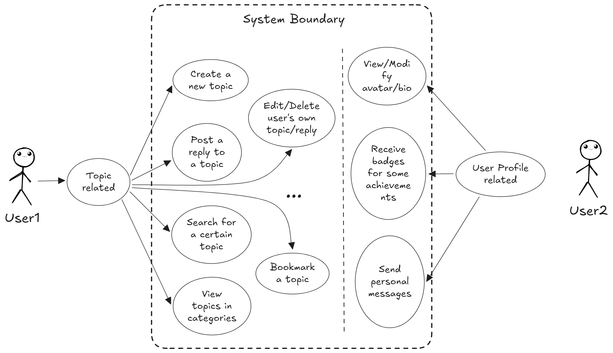
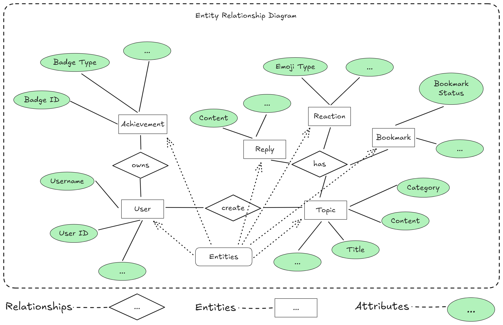

# Level 1 - Make a plan

User requirements


This will be same as the _uses cases_ that you will need to include in your submission.


To make the design easier to implement at first, the web forum should be for **users** only at first. So, for the **users**, they can this web forum to:

1. **Topics/Threads related**
   1. Create a new topic
   2. Post a reply to a new topic
   3. Search for a certain topic
   4. View topics that are categorized in tags, etc
   5. Edit/Delete the user's own topic or reply
   6. Bookmark a topic to receive any update or mute any update from this topic
   7. React to others' topic/reply with emojis
2. **User Profile related**
   1. View and modify user's own profile (avatar, bio)
   2. Receive badges if users achieve some goals (e.g. visit consecutively for 90 days)
   3. Send/Receive personal messages to/from other users
3. ...

<figure><picture><source srcset="../../.gitbook/assets/user-cases-dark.png" media="(prefers-color-scheme: dark)"></picture><figcaption>
User cases
</figcaption></figure>

## Overview of Tools

As you have seen in [overview.md](../overview.md "mention"), the frontend should be written in either [React.js](https://reactjs.org/) or [Typescript](https://www.typescriptlang.org/) and the backend should be written in either [Go](https://golang.org/) or [Ruby on Rails](https://rubyonrails.org/), but must use a _relational database_.

### Frontend

In web development, _frontend_ refers to the **visible part** of a website or application that users directly interact with, including the **design, layout, and interactive elements** like buttons, text, and images, which are built using languages like HTML, CSS, and JavaScript.

### Backend

_Backend_ refers to the **server-side** of a website or application, encompassing all the **logic, databases, and processes** that happen behind the scenes to power the functionality you see on the user interface (frontend), essentially handling **data processing, user authentication, and communication with the database**, while remaining invisible to the user.

### MVC

MVC stands for "**M**odel-**V**iew-**C**ontroller," which is a **software design pattern** that separates the application's data logic (_Model_), user interface (_View_), and processing logic (_Controller_) into distinct components, allowing for **cleaner code, easier maintenance**, and better organization when building web applications.

### [RESTful APIs](../resources.md#restful-apis)

### [Relational Database](../resources.md#relational-database)

## Data

#### What kind of data will your app need?

Based on our [user cases](level-1-make-a-plan.md#user-requirements) shown above, the app will need to store and manage the following types of data:

1. **Topics/Threads Data:**
   * **Topic Details:** Topic ID, Title, Content, Category/Tags, Creation Date, Author ID, ...
   * **Replies/Comments:** Reply ID, Topic ID, Content, Author ID, Creation Date, ...
   * **Reactions (Emojis):** Reaction ID, User ID, Target Post ID (Topic or Reply), Emoji Type, ...
   * **Bookmarks:** Bookmark ID, User ID, Topic ID, Bookmark Status (updates muted/unmuted), ...
2. **User Data:**
   * **User Profile:** User ID, Username, Password (hashed), Email, Avatar URL, Bio, Registration Date, ...
   * **Achievements/Badges:** Badge ID, User ID, Badge Type, Badge Earned Date, ...
3. **Messaging Data:**
   * **Messages:** Message ID, Sender User ID, Receiver User ID, Content, Timestamp, ...

#### How can you keep track of the data?

To keep track of this data, we can use a _relational database management system_ (I think for me it will be MySQL in this project) can be used, as it allows for structured storage and relationships between entities.

<figure><picture><source srcset="../../.gitbook/assets/ERD-dark.png" media="(prefers-color-scheme: dark)"></picture><figcaption>
ERD Design
</figcaption></figure>
