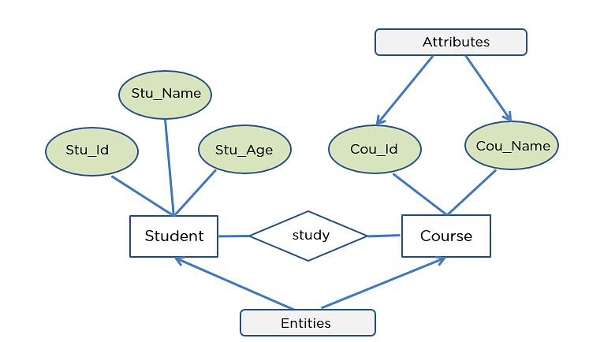

# Resources

## RESTful APIs

Representational State Transfer, REST in short, is an architecture for networked applications. Being one of the simplest architectures to deploy, it is a popular choice for many web services. It is a client-server architecture where a client initiates a request to the server to be processed, and receives a response with updated data. The Application Programming Interface or API defines the specifications of this communication. In the context of this assignment, the server will be our Go or Ruby on Rails application, while the client will be our React application.

Requests and responses can take many forms - JSON is the most common format. JavaScript Object Notation or JSON is a text-based data-interchange format. It is already supported by all modern browsers and server-side scripting languages so you do not need to implement it yourself, but if you want to know more, you can visit [this website](https://www.json.org/json-en.html). You may also want to read up on [HTTP Messages](https://developer.mozilla.org/en-US/docs/Web/HTTP/Messages), which will be how the JSON data are exchanged.

Note that this is just one of the many ways that a frontend can interface with a backend. If you wish to try this out, do check out [this guide](https://guides.rubyonrails.org/api_app.html) for Ruby on Rails and [this guide](https://reactjs.org/docs/faq-ajax.html) for React.

### HTTP Messages

## Relational Database

Relational databases are databases that store data **in tables**, each containing a number of columns and rows. It is called "relational" because tables are linked to other tables through **foreign keys**.


I would say this part is quite similar to CS50's Week 7 content about SQL. You can find more information at [Week 7 - SQL](https://app.gitbook.com/s/6nZ3LlEi4QjmAU8BqKIP/lec-sec-probset/week-7-sql "mention").


### Schema

At the highest level, a database contains a _schema_. A _schema_ is a blueprint of your tables, containing their structures and relationships.

### SQL


For this part, the guide from [AWS](https://aws.amazon.com/what-is/sql/?nc1=h_ls) is quite useful.


Structured query language (SQL) is a programming language for storing and processing information in a [_relational database_](#user-content-fn-1)[^1]_._&#x59;ou can use SQL statements to store, update, remove, search, and retrieve information from the database. You can also use SQL to maintain and optimize database performance.

#### Some Database Jargons

* **Database**: A collection of data organized for **c**reating, **r**eading, **u**pdating, and **d**eleting. (This is **CRUD** principle)
*   **Database Management System (DBMS)**: Software via which you can interact with a data base. And below are some examples:

    * MySQL
    * Oracle
    * PostgreSQL
    * SQLite

    ...
* **SQL**: A **language** via which you can **c**reate, **r**ead, **u**pdate, and **d**elete data in a database.

#### What are the components of a SQL system? 

_Relational database management systems_ (RDBMS) use _structured query language_ (SQL) to store and manage data. The system stores multiple **database tables** that relate to each other. MS SQL Server, MySQL, or MS Access are examples of _relational database management systems_. The following are the components of such a system.

**SQL Table**

A _SQL table_ is the basic element of a relational database. The SQL database table consists of rows and columns. Database engineers create relationships between multiple database tables to optimize data storage space.

#### What is MySQL

MySQL is an open-source _relational database management system_ offered by Oracle. Developers can download and use MySQL without paying a licensing fee. They can install MySQL on different operating systems or cloud servers. MySQL is a popular database system for web applications.

**SQL vs. MySQL**

Structured query language (SQL) is a standard **language** for database creation and manipulation. MySQL is a **relational database program** that uses SQL queries. While SQL commands are defined by international standards, the MySQL software undergoes continual upgrades and improvements.

#### What is a SQL Server

SQL Server is the official name of **Microsoft's** _relational database management system_ that manipulates data with SQL. The _MS SQL Server_ has several editions, and each is designed for specific workloads and requirements.

### Primary Key

A _primary key_ is a column or a set of columns in a table whose values uniquely identify a row in the table. A relational database is designed to enforce the uniqueness of primary keys by allowing only one row with a given primary key value in a table.

### Foreign Key

A _foreign key_ is a column or a set of columns **in a table** whose values correspond to the values of the primary key **in another table.** In order to add a row with a given foreign key value, there must exist a row in the related table with the same primary key value.


A foreign key establishes a **one-way relationship** where one table (the "child") references the primary key of another table (the "parent").


#### Foreign Key vs. Primary Key

**Direction of the Foreign Key**

* The foreign key exists in the child table and points to the parent table's **primary key**.
* This means that from the child table, you can trace the relationship to the parent, but not directly the other way around unless explicitly defined.

For example,

**Parent Table (Users)**:

| UserID (Primary Key) | Name  |
| -------------------- | ----- |
| 1                    | Alice |
| 2                    | Bob   |

**Child Table (Orders)**:

| OrderID (Primary Key) | UserID (Foreign Key) | Amount |
| --------------------- | -------------------- | ------ |
| 101                   | 1                    | 50     |
| 102                   | 2                    | 100    |

* The `UserID` in the `Orders` table references the `UserID` in the `Users` table. This is a one-way relationship.

### Entity-Relationship Diagram

An Entity Relationship Diagram (ERD) is a visual representation that shows how different entities (like people, objects, or concepts) relate to each other within a system.

<figure><figcaption>
ERD example
</figcaption></figure>

#### ERD Deisgn Principles

* **Entities:** Represented by **rectangles**, these are the core elements in the system, like "Student" and "Course" in the example above.&#x20;
* **Attributes:** Details describing an entity, like "Cou\_ID" or "Cou\_Name" within the "Course" entity.&#x20;
* **Relationships:** Shown by **diamonds**, these indicate how entities are connected, like "study" between a "Student" and a "Course".

### DataBase Design Principle

* Create one table for each **entity** in your dataset. For example, you should create **two** tables for the **books and authors**.
* All tables should have a **primary key**. This is a unique id that differentiate one row from every other row.
* The information in the table should depend on the **primary key** only.

[^1]: A relational database stores information in tabular form, with rows and columns representing different data attributes and the various relationships between the data values.
