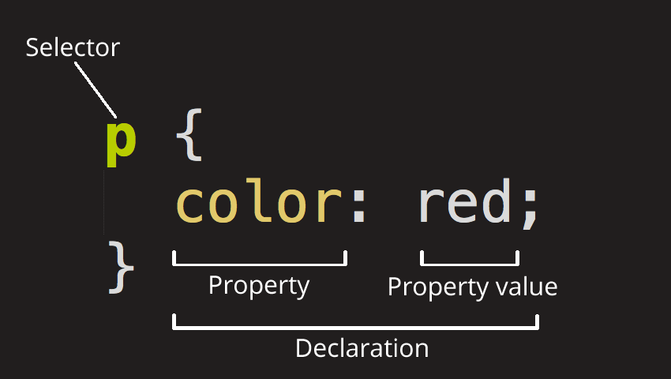
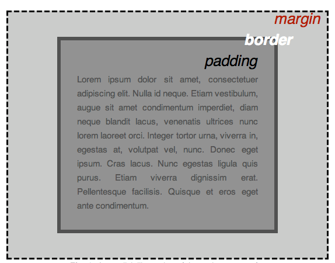

# CSS

CSS (Cascading Style Sheets) is the code that styles web content. _Styling the content_ walks through what you need to get started. We'll answer questions like: How do I make text red? How do I make content display at a certain location in the (webpage) layout? How do I decorate my webpage with background images and colors?

## CSS Basic

> This part is mainly from MDN [CSS Crash Course](https://developer.mozilla.org/en-US/docs/Learn_web_development/Getting_started/Your_first_website/Styling_the_content). I found it pretty useful and suitable for beginners.

Like HTML, CSS is not a programming language. It's not a markup language either. **CSS is a style sheet language.** CSS is what you use to selectively style HTML elements. For example, this CSS selects paragraph text, setting the color to red:


```css
p {
  color: red;
}
```


### CSS Ruleset

Let's dissect the CSS code for red paragraph text to understand how it works:

<figure><figcaption></figcaption></figure>

The whole structure is called a **ruleset**. (The term _ruleset_ is often referred to as just _rule_.) Note the names of the individual parts:

1. **Selector:** This is the HTML element name at the start of the ruleset. It defines the element(s) to be styled (in this example, [`<p>`](https://developer.mozilla.org/en-US/docs/Web/HTML/Element/p) elements). To style a different element, change the selector.
2. **Declaration**: This is a single rule like `color: red;`. It specifies which of the element's **properties** you want to style.
3. **Properties**: These are features of an HTML element that you can change the values of, to make it styled differently. (In this example, `color` is a property of the [`<p>`](https://developer.mozilla.org/en-US/docs/Web/HTML/Element/p) elements.) In CSS, you choose which properties you want to affect in the rule.
4. **Property value**: To the right of the property — after the colon — there is the **property value**. This chooses one out of many possible appearances for a given property. (For example, there are many `color` values in addition to `red`.)


Note the other important parts of the syntax:

* Apart from the selector, each ruleset must be wrapped in curly braces. (`{}`)
* Within each declaration, you must use a colon (`:`) to separate the property from its value or values.
* Within each ruleset, you must use a semicolon (`;`) to separate each declaration from the next one.


To modify multiple property values in one ruleset, write them separated by semicolons, like this:


```css
p {
  color: red;
  width: 500px;
  border: 1px solid black;
}
```


#### Selecting Multiple Elements

You can also select multiple elements and apply a single ruleset to all of them. Separate multiple selectors by commas. For example:


```css
p,
li,
h1 {
  color: red;
}
```


#### Different Types of selectors

There are many different types of selectors. The examples above use **element selectors**, which select all elements of a given type. But we can make more specific selections as well. Here are some of the more common types of selectors:

| Selector name                                              | What does it select                                                                                              | Example                                                                                                                    |
| ---------------------------------------------------------- | ---------------------------------------------------------------------------------------------------------------- | -------------------------------------------------------------------------------------------------------------------------- |
| Element selector (sometimes called a tag or type selector) | All HTML elements of the specified type.                                                                         | <p><code>p</code><br>selects <code>&#x3C;p></code></p>                                                                     |
| ID selector                                                | The element on the page with the specified ID. **On a given HTML page, each id value should be unique.**         | <p><code>#my-id</code><br>selects <code>&#x3C;p id="my-id"></code> or <code>&#x3C;a id="my-id"></code></p>                 |
| Class selector                                             | The element(s) on the page with the specified class. Multiple instances of the same class can appear on a page.  | <p><code>.my-class</code><br>selects <code>&#x3C;p class="my-class"></code> and <code>&#x3C;a class="my-class"></code></p> |
| Attribute selector                                         | The element(s) on the page with the specified attribute.                                                         | <p><code>img[src]</code><br>selects <code>&#x3C;img src="my-image.png"></code> but not <code>&#x3C;img></code></p>         |
| Pseudo-class selector                                      | The specified element(s), but only when in the specified state. (For example, when a cursor hovers over a link.) | <p><code>a:hover</code><br>selects <code>&#x3C;a></code>, but only when the mouse pointer is hovering over the link.</p>   |

### CSS: All about boxes

Something you'll notice about CSS as you use it more: a lot of it is about boxes. This includes setting size, color, and position. Most HTML elements on your page can be thought of as boxes sitting on top of other boxes.

<figure><figcaption></figcaption></figure>

CSS layout is mostly based on the _box model._ Each box taking up space on your page has properties like:

* `padding`, the space around the content. In the example below, it is the space around the paragraph text.
* `border`, the solid line that is just outside the padding.
* `margin`, the space around the outside of the border.

<figure><figcaption></figcaption></figure>

## Learning Resources

* [CSS Crash Course](https://developer.mozilla.org/en-US/docs/Learn_web_development/Getting_started/Your_first_website/Styling_the_content) by MDN
