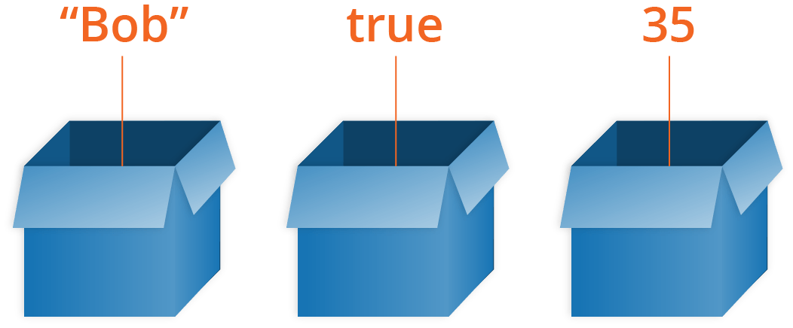

# Variables

After reading the last couple of articles you should now know what JavaScript is, what it can do for you, how you use it alongside other web technologies, and what its main features look like from a high level. In this article, we will get down to the real basics, looking at how to work with the most basic building blocks of JavaScript — Variables.

## What is a variable?

A variable is a **container** for a value, like a number we might use in a sum, or a string that we might use as part of a sentence.

One special thing about variables is that they can contain just about **anything** — not just strings and numbers. Variables can also contain complex data and even entire functions to do amazing things. You'll learn more about this as you go along.


We say variables contain values. This is an important distinction to make. **Variables aren't the values themselves**; they are **containers for values**. You can think of them being like little cardboard boxes that you can store things in.


<figure><figcaption></figcaption></figure>

## Declaring a variable

To use a variable, you've first got to create it — more accurately, we call this declaring the variable. To do this, we type the keyword `let` followed by the name you want to call your variable:


```javascript
let myName;
let myAge;
```


Here we're creating two variables called `myName` and `myAge`.&#x20;


In JavaScript, all code instructions should end with a semicolon (`;`) — your code may work correctly for single lines, but probably won't when you are writing multiple lines of code together. **Try to get into the habit of including it.**


They currently have **no value**; they are empty containers. When you enter the variable names, you should get a value of `undefined` returned. If they don't exist, you'll get an error message.


Don't confuse a variable that exists but has no defined value with a variable that doesn't exist at all — they are very different things. In the box analogy you saw above, not existing would mean there's no box (variable) for a value to go in. No value defined would mean that there is a box, but it has no value inside it.


## Initializing a variable

Once you've declared a variable, you can initialize it with a value. You do this by typing the variable name, followed by an equals sign (`=`), followed by the value you want to give it. For example:


```javascript
myName = "Chris";
myAge = 37;
```


### A note about `var`

You'll probably also see a different way to declare variables, using the `var` keyword:


```javascript
var myName;
var myAge;
```


Back when JavaScript was first created, this was the only way to declare variables. The design of `var` is confusing and error-prone. So `let` was created in modern versions of JavaScript, a new keyword for creating variables that works somewhat differently to `var`, fixing its issues in the process.

Here are some differences between using `let` and `var` to declare variables in JS:

1. When you use `var`, you can declare the same variable as many times as you like, but with `let` you can't.&#x20;

For more differences if you are interested, you can go to [this page](https://developer.mozilla.org/en-US/docs/Learn_web_development/Core/Scripting/Variables#a_note_about_var).

For these reasons and more, we recommend that you use `let` in your code, rather than `var`. Unless you are explicitly writing support for ancient browsers, there is no longer any reason to use `var` as all modern browsers have supported `let` since 2015.

## Updating a variable

Once a variable has been initialized with a value, you can change (or update) that value by giving it a different value by using the `=` operator also. For example,


```javascript
let myName = "Chris";
myName = "Bob";
```


In JS, the variable naming rule is almost the same as other programming languages like C, Java. For more information, you can find it [here](https://developer.mozilla.org/en-US/docs/Learn_web_development/Core/Scripting/Variables#an_aside_on_variable_naming_rules).

## Variable Types

There are a few different types of data we can store in variables. In this section we'll describe these in brief.

### Numbers

You can store numbers in variables, either whole numbers like 30 (also called integers) or decimal numbers like 2.456 (also called floats or floating point numbers). **You don't need to declare variable types in JavaScript**, unlike some other programming languages. When you give a variable a number value, you don't include quotes:


```javascript
let myAge = 17;
```


### Strings

Strings are **pieces of text**. When you give a variable a string value, you need to wrap it in single or double quote marks; otherwise, JavaScript tries to interpret it as another variable name.


```javascript
let dolphinGoodbye = "So long and thanks for all the fish";
```


### Booleans

Booleans are true/false values — they can have two values, `true` or `false`. These are generally used to test a condition, after which code is run as appropriate. So for example, a simple case would be:


```javascript
let iAmAlive = true;
```


Whereas in reality it would be used more like this:


```javascript
let test = 6 < 3;
```


This is using the "less than" operator (`<`) to test whether 6 is less than 3. As you might expect, it returns `false`, because 6 is not less than 3!

### Arrays

An array is a **single object** that contains **multiple values** enclosed in square brackets and separated by commas. Try entering the following lines into your console:


```javascript
let myNameArray = ["Chris", "Bob", "Jim"];
let myNumberArray = [10, 15, 40];
```


Once these arrays are defined, you can access each value by their [**location**](#user-content-fn-1)[^1] within the array.


```javascript
myNameArray[0]; // should return 'Chris'
myNumberArray[2]; // should return 40
```


The square brackets specify an index value corresponding to the position of the value you want returned. You might have noticed that arrays in JavaScript are zero-indexed: the first element is at index 0.

### Objects

In programming, an object is **a structure of code that models a real-life object**. You can have an object that represents a box and contains information about its width, length, and height, or you could have an object that represents a person, and contains data about their name, height, weight, what language they speak, how to say hello to them, and more. For example,


```javascript
let dog = { name: "Spot", breed: "Dalmatian" };
```


To retrieve the information stored in the object, you can use the following syntax:


```javascript
dog.name;
```


## Dynamic typing

JavaScript is a "dynamically typed language", which means that, **unlike some other languages, you don't need to specify what data type a variable will contain (numbers, strings, arrays, etc.**).


This idea is important! When you learn TypeScript in the later course, shoud go back to this idea.


For example, if you declare a variable and give it a value enclosed in quotes, the browser treats the variable as a string:


```javascript
let myString = "Hello";
```


Even if the value enclosed in quotes is just digits, it is still a string — not a number — so be careful:


```javascript
let myNumber = "500"; // oops, this is still a string
typeof myNumber;
myNumber = 500; // much better — now this is a number
typeof myNumber;
```


Try entering the four lines above into your console one by one, and see what the results are. You'll notice that we are using a special operator called [`typeof`](https://developer.mozilla.org/en-US/docs/Web/JavaScript/Reference/Operators/typeof) — this returns the data type of the variable you type after it. The first time it is called, it should return `string`, as at that point the `myNumber` variable contains a string, `'500'`. Have a look and see what it returns the second time you call it.

## Constants in JavaScript

As well as variables, you can declare constants. These are like variables, except that:

* you must initialize them when you declare them
* you can't assign them a new value after you've initialized them.

For example, using `let` you can declare a variable without initializing it:


```javascript
let count;
```


If you try to do this using `const` you will see an error:


```javascript
const count;
```


Note that although a constant in JavaScript must always name the same value, you can change the content of the value that it **names**. This isn't a useful distinction for simple types like numbers or booleans, but consider an object:


```javascript
const bird = { species: "Kestrel" };
console.log(bird.species); // "Kestrel"
```


You can update, add, or remove properties of an object declared using `const`, because even though the content of the object has changed, the constant is still **pointing to the same object**:


```javascript
bird.species = "Striated Caracara";
console.log(bird.species); // "Striated Caracara"
```



This is the idea of [pointers in C](https://app.gitbook.com/s/KipySCGxC8NC1UpA24DS/lec-tut-lab-exes/lecture/lec-07-pointers-memory-management)!


### When to use `const` and when to use `let`

If you can't do as much with `const` as you can with `let`, why would you prefer to use it rather than `let`? In fact `const` is very useful. If you use `const` to name a value, it tells anyone looking at your code that this **name** will never be assigned to a different value. Any time they see this name, they will know what it refers to.

In this course, we adopt the following principle about when to use `let` and when to use `const`:

> _Use `const` when you can, and use `let` when you have to._

This means that if you can initialize a variable when you declare it, and don't need to reassign it later, make it a constant.

[^1]: More technically speaking, it should be index
