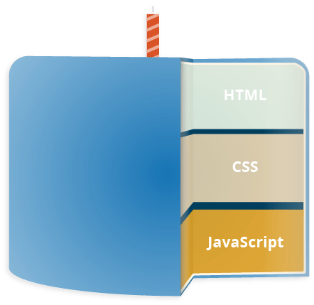
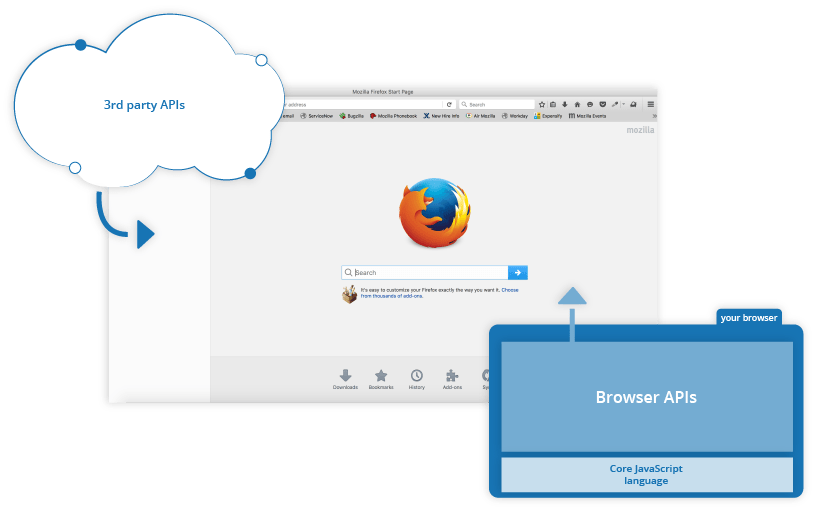
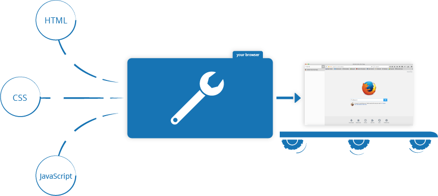

# What is JavaScript?

## A high-level definition

JavaScript is a scripting or programming language that allows you to implement complex features on web pages — every time a web page does more than just sit there and display static information for you to look at — displaying timely content updates, interactive maps, animated 2D/3D graphics, scrolling video jukeboxes, etc. — you can bet that JavaScript is probably involved. It is the third layer of the layer cake of standard web technologies, two of which ([HTML](https://developer.mozilla.org/en-US/docs/Learn_web_development/Core/Structuring_content) and [CSS](https://developer.mozilla.org/en-US/docs/Learn_web_development/Core/Styling_basics)) we have covered in much more detail in other parts of the Learning Area.

<figure><figcaption></figcaption></figure>

* [HTML](../html/) is the markup language that we use to structure and give meaning to our web content, for example defining paragraphs, headings, and data tables, or embedding images and videos in the page.
* [CSS](../css/) is a language of style rules that we use to apply styling to our HTML content, for example setting background colors and fonts, and laying out our content in multiple columns.
* [JavaScript](./) is a scripting language that enables you to create dynamically updating content, control multimedia, animate images, and pretty much everything else. (Okay, not everything, but it is amazing what you can achieve with a few lines of JavaScript code.)

Here is an [example](https://mdn.github.io/learning-area/javascript/introduction-to-js-1/what-is-js/javascript-label.html) provided by MDN to showcase the basic use of JavaScript.

## So what can it really do?

The core client-side JavaScript language consists of some common programming features that allow you to do things like:

* Store useful values inside variables. In the above example for instance, we ask for a new name to be entered then store that name in a variable called `name`.
* Operations on pieces of text (known as "strings" in programming). In the above example we take the string "Player 1: " and join it to the `name` variable to create the complete text label, e.g. "Player 1: Chris".
* Running code in response to certain events occurring on a web page. We used a [`click`](https://developer.mozilla.org/en-US/docs/Web/API/Element/click_event) event in our example above to detect when the label is clicked and then run the code that updates the text label.
* And much more!

What is even more exciting however is the functionality built on top of the client-side JavaScript language. So-called **Application Programming Interfaces** (**APIs**) provide you with extra superpowers to use in your JavaScript code.

APIs are ready-made sets of code building blocks that allow a developer to implement programs that would otherwise be hard or impossible to implement. They do the same thing for programming that ready-made furniture kits do for home building — it is much easier to take ready-cut panels and screw them together to make a bookshelf than it is to work out the design yourself, go and find the correct wood, cut all the panels to the right size and shape, find the correct-sized screws, and _then_ put them together to make a bookshelf.

They generally fall into two categories:

<figure><figcaption></figcaption></figure>

**Browser APIs** are built into your web browser, and are able to expose data from the surrounding computer environment, or do useful complex things. For example:

* The [DOM (Document Object Model) API](https://developer.mozilla.org/en-US/docs/Web/API/Document_Object_Model) allows you to manipulate HTML and CSS, creating, removing and changing HTML, dynamically applying new styles to your page, etc. Every time you see a popup window appear on a page, or some new content displayed (as we saw above in our simple demo) for example, that's the DOM in action.
* The [Geolocation API](https://developer.mozilla.org/en-US/docs/Web/API/Geolocation_API) retrieves geographical information. This is how [Google Maps](https://www.google.com/maps) is able to find your location and plot it on a map.
* The [Canvas](https://developer.mozilla.org/en-US/docs/Web/API/Canvas_API) and [WebGL](https://developer.mozilla.org/en-US/docs/Web/API/WebGL_API) APIs allow you to create animated 2D and 3D graphics. People are doing some amazing things using these web technologies — see [Chrome Experiments](https://experiments.withgoogle.com/collection/chrome) and [webglsamples](https://webglsamples.org/).
* [Audio and Video APIs](https://developer.mozilla.org/en-US/docs/Web/Media/Audio_and_video_delivery) like [`HTMLMediaElement`](https://developer.mozilla.org/en-US/docs/Web/API/HTMLMediaElement) and [WebRTC](https://developer.mozilla.org/en-US/docs/Web/API/WebRTC_API) allow you to do really interesting things with multimedia, such as play audio and video right in a web page, or grab video from your web camera and display it on someone else's computer (try our simple [Snapshot demo](https://chrisdavidmills.github.io/snapshot/) to get the idea).

**Third party APIs** are not built into the browser by default, and you generally have to grab their code and information from somewhere on the Web. For example:

* The [Twitter API](https://developer.x.com/en/docs) allows you to do things like displaying your latest tweets on your website.
* The [Google Maps API](https://developers.google.com/maps/) and [OpenStreetMap API](https://wiki.openstreetmap.org/wiki/API) allows you to embed custom maps into your website, and other such functionality.

There's a lot more available, too! However, don't get over excited just yet. You won't be able to build the next Facebook, Google Maps, or Instagram after studying JavaScript for 24 hours — there are a lot of basics to cover first. And that's why you're here — let's move on!

## What is JavaScript doing on your page?

Here we'll actually start looking at some code, and while doing so, explore what actually happens when you run some JavaScript in your page.

Let's briefly recap the story of what happens when you load a web page in a browser (first talked about in our [What is CSS?](https://developer.mozilla.org/en-US/docs/Learn_web_development/Core/Styling_basics/What_is_CSS#how_is_css_applied_to_html) article). When you load a web page in your browser, you are running your code (the HTML, CSS, and JavaScript) inside an execution environment (the browser tab). This is like a factory that takes in raw materials (the code) and outputs a product (the web page).

<figure><figcaption></figcaption></figure>

A very common use of JavaScript is to dynamically modify HTML and CSS to update a user interface, via the Document Object Model API (as mentioned above).

### Browser security

Each browser tab has its own separate bucket for running code in (these buckets are called "execution environments" in technical terms) — this means that in most cases the code in each tab is run completely separately, and the code in one tab cannot directly affect the code in another tab — or on another website. This is a good security measure — if this were not the case, then pirates could start writing code to steal information from other websites, and other such bad things.

### JavaScript running order

When the browser encounters a block of JavaScript, it generally runs it in order, from top to bottom. This means that you need to be careful what order you put things in. For example, let's return to the block of JavaScript we saw in our first example:


```javascript
const button = document.querySelector("button");

button.addEventListener("click", updateName);

function updateName() {
  const name = prompt("Enter a new name");
  button.textContent = `Player 1: ${name}`;
}

```


Here we first select a button using `document.querySelector`, then attaching an event listener to it using `addEventListener` so that when the button is clicked, the `updateName()` code block (lines 5–8) is run. The `updateName()` code block (these types of reusable code blocks are called "functions") asks the user for a new name, and then inserts that name into the button text to update the display.

If you swapped the order of the first two lines of code, it would no longer work — instead, you'd get an error returned in the [browser developer console](https://developer.mozilla.org/en-US/docs/Learn_web_development/Howto/Tools_and_setup/What_are_browser_developer_tools) — `Uncaught ReferenceError: Cannot access 'button' before initialization`. This means that the `button` object has not been initialized yet, so we can't add an event listener to it.

### Interpreted vs. compiled code

You might hear the terms **interpreted** and **compiled** in the context of programming. In interpreted languages, the code is run from top to bottom and the result of running the code is immediately returned. You don't have to transform the code into a different form before the browser runs it. The code is received in its programmer-friendly text form and processed directly from that.

Compiled languages on the other hand are transformed (compiled) into another form before they are run by the computer. For example, C/C++ are compiled into machine code that is then run by the computer. The program is executed from a binary format, which was generated from the original program source code.

JavaScript is a lightweight interpreted programming language. The web browser receives the JavaScript code in its original text form and runs the script from that. From a technical standpoint, most modern JavaScript interpreters actually use a technique called **just-in-time compiling** to improve performance; the JavaScript source code gets compiled into a faster, binary format while the script is being used, so that it can be run as quickly as possible. However, **JavaScript is still considered an interpreted language**, since the compilation is handled at run time, rather than ahead of time.\\

There are advantages to both types of language, but we won't discuss them right now.

### Server-side vs. client-side code

You might also hear the terms **server-side** and **client-side** code, especially in the context of web development. Client-side code is code that is run on the user's computer — **when a web page is viewed, the page's client-side code is downloaded, then run and displayed by the browser**. In this module we are explicitly talking about **client-side JavaScript**.

Server-side code on the other hand is run on the server, then its results are downloaded and displayed in the browser. Examples of popular server-side web languages include PHP, Python, Ruby, C#, and even JavaScript! JavaScript can also be used as a server-side language, for example in the popular Node.js environment — you can find out more about server-side JavaScript in our [Dynamic Websites – Server-side programming](https://developer.mozilla.org/en-US/docs/Learn_web_development/Extensions/Server-side) topic.

### Dynamic vs. static code

The word **dynamic** is used to describe both client-side JavaScript, and server-side languages — it refers to the ability to update the display of a web page/app to show different things in different circumstances, generating new content as required. Server-side code dynamically generates new content on the server, e.g. pulling data from a database, whereas client-side JavaScript dynamically generates new content inside the browser on the client, e.g. creating a new HTML table, filling it with data requested from the server, then displaying the table in a web page shown to the user. The meaning is slightly different in the two contexts, but related, and both approaches (server-side and client-side) usually work together.

A web page with no dynamically updating content is referred to as **static** — it just shows the same content all the time.

## How do you add JavaScript to your page?

JavaScript is applied to your HTML page in a similar manner to CSS. Whereas CSS uses [`<link>`](https://developer.mozilla.org/en-US/docs/Web/HTML/Element/link) elements to apply external stylesheets and [`<style>`](https://developer.mozilla.org/en-US/docs/Web/HTML/Element/style) elements to apply internal stylesheets to HTML, JavaScript only needs one friend in the world of HTML — the [`<script>`](https://developer.mozilla.org/en-US/docs/Web/HTML/Element/script) element. Let's learn how this works.

### Internal JavaScript

This is to add the JavaScript code directly in your `index.html` in the `script` element, and the final effect is [here](https://mdn.github.io/learning-area/javascript/introduction-to-js-1/what-is-js/apply-javascript-internal.html).


```html
<!DOCTYPE html>
<html lang="en-US">
  <head>
    <meta charset="utf-8">
    <meta name="viewport" content="width=device-width">
    <title>Apply JavaScript example</title>
  </head>
  <body>
    <button>Click me</button>
    <script>
    function createParagraph() {
      const para = document.createElement("p");
      para.textContent = "You clicked the button!";
      document.body.appendChild(para);
    }

    const buttons = document.querySelectorAll("button");

    for (const button of buttons) {
      button.addEventListener("click", createParagraph);
    }
    </script>
  </body>
</html>
```


### External JavaScript

This is to put the JavaScript code into an external file called `script.js`.


```javascript
function createParagraph() {
  const para = document.createElement("p");
  para.textContent = "You clicked the button!";
  document.body.appendChild(para);
}

const buttons = document.querySelectorAll("button");

for (const button of buttons) {
  button.addEventListener("click", createParagraph);
}

```


Then, we can modify the `script` element in the `index.html` to the following:

<pre class="language-html" data-title="index.html" data-line-numbers><code class="lang-html">&#x3C;!DOCTYPE html>
&#x3C;html lang="en-US">
  &#x3C;head>
    &#x3C;meta charset="utf-8">
    &#x3C;meta name="viewport" content="width=device-width">
    &#x3C;title>Apply JavaScript example&#x3C;/title>
<strong>    &#x3C;script type="module" src="script.js">&#x3C;/script>
</strong>  &#x3C;/head>
  &#x3C;body>
    &#x3C;button>Click me&#x3C;/button>
  &#x3C;/body>
&#x3C;/html>
</code></pre>

### Script loading strategies

All the HTML on a page is loaded in the order in which it appears. If you are using JavaScript to manipulate elements on the page (or more accurately, the [Document Object Model](https://developer.mozilla.org/en-US/docs/Learn_web_development/Core/Scripting/DOM_scripting#the_document_object_model)), your code won't work if the JavaScript is loaded and parsed before the HTML you are trying to do something to.

There are a few different strategies to make sure your JavaScript only runs after the HTML is parsed:

* In the [Internal JavaScript](what-is-javascript.md#internal-javascript) example above, the script element is placed at the bottom of the body of the document, and therefore only run after the rest of the HTML body is parsed.
* In the [External JavaScript](what-is-javascript.md#external-javascript) example above, the script element is placed in the head of the document, before the HTML body is parsed. But because we're using `<script type="module">`, the code is treated as a [module](https://developer.mozilla.org/en-US/docs/Web/JavaScript/Guide/Modules) and the browser waits for all HTML to be processed before executing JavaScript modules. (You could also place external scripts at the bottom of the body. But if there is a lot of HTML and the network is slow, it may take a lot of time before the browser can even start fetching and loading the script, so **placing external scripts in the head is usually better**.)

## Comments

As with HTML and CSS, it is possible to write comments into your JavaScript code that will be ignored by the browser, and exist to provide instructions to your fellow developers on how the code works (and you, if you come back to your code after six months and can't remember what you did). Comments are very useful, and you should use them often, particularly for larger applications. There are two types:

* A single line comment is written after a double forward slash (`//`), e.g.


```javascript
// I am a comment
```


* A multi-line comment is written between the strings `/*` and `*/`, e.g.


```javascript
/*
  I am also
  a comment
*/
```


## Summary

So there you go, your first step into the world of JavaScript. We've begun with just theory, to start getting you used to why you'd use JavaScript and what kind of things you can do with it. Along the way, you saw a few code examples and learned how JavaScript fits in with the rest of the code on your website, amongst other things.

JavaScript may seem a bit daunting right now, but don't worry — in this course, we will take you through it in simple steps that will make sense going forward. But before we talk more about the technical details about JavaScript, let's look at a practical example to jump straight in and have a glimpse of the power of JavaScipt.

The practical example is as follows:


