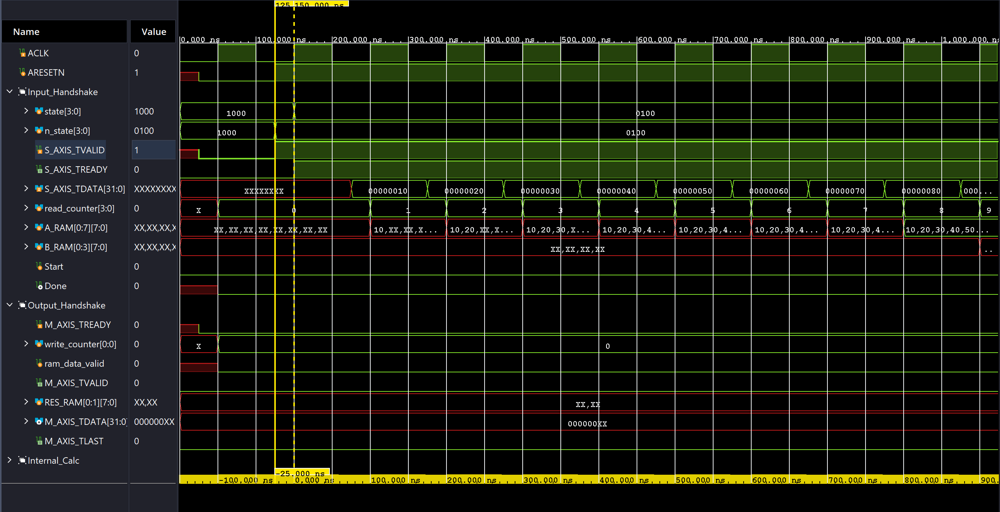
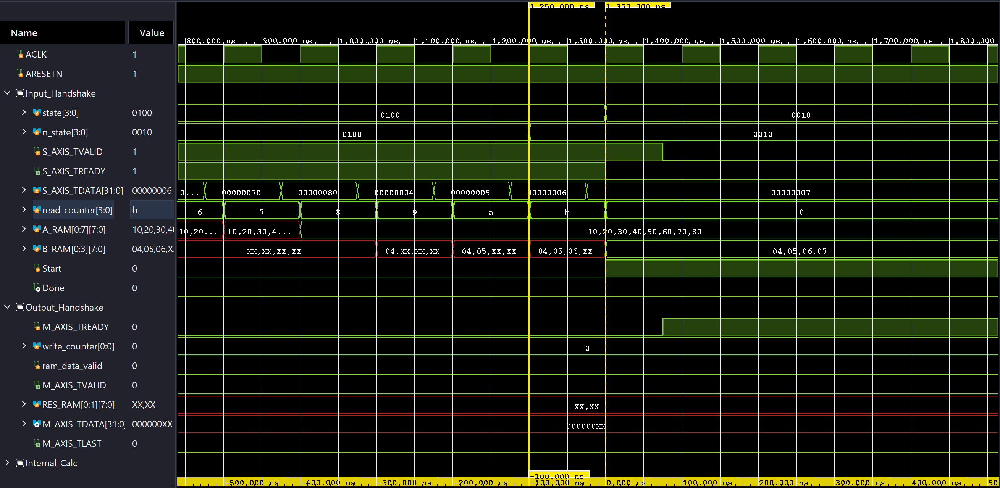
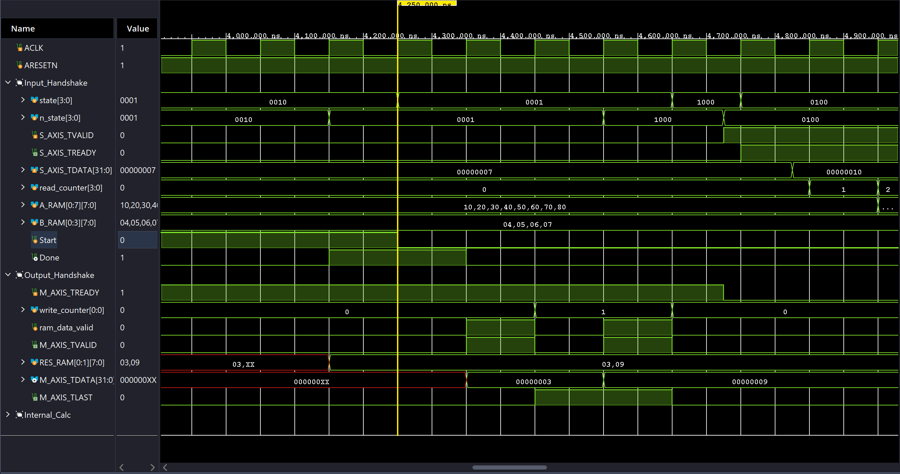

# Lab 01 - Introduction to Hardware Design

## System Overview

In EE4218, we will be using the Kria KV260 SOM Vision Starter Kit containing a Xilinx Zynq Ultrascale+ SoC to implement a **coprocessor**. The overall system overview can be shown as follows:

<figure><figcaption></figcaption></figure>

On our FPGA board, we have two major blocks

1. The Processor System (PS)
2. The UltraScale Programmable Logic (PL)

### Processor System

The processor system of our FPGA board cotains two mains parts

1. The ARM Cortex-A53 In-order Superscalar(dual-issue) processor
2. I/O Peripherals like UART, Ethernet, USB and Debug, etc.

The processor (ARM Cortex-A53) communicates with these I/O peripherals using MMIO[^1] via the **AXI bus**. For example, to communicate, the processor issues standard Load/Store instructions (e.g., `lw`/`sw` in RISC-V assembly) targeting these reserved addresses.

### Programmable Logic

The **Ultrascale programmable logic (PL**) again has two very important parts for now

1. The **bridge** which translates the data fetched via AXI into a stream
2. The **coprocessor** which is responsible for doing the matrix multiplication (2x4 times 4x1)

#### Bridge

The **bridge** is responsible for converting AXI transactions into a streaming data format suitable for high-throughput hardware processing. So exacts steps from PS to the bridge are as follows:

1. Laptop sends data via **UART**.
2. The processor uses a `lw` instruction to read the data from the UART register. Then it uses a `sw` instruction to store the data into the **main memory**.
3. The processor uses a `sw` instruction to writes to the **Bridge** module's status register to wake it up. This step will also provide the **Bridge module** with information telling it
   1. **where** to fetch the data from the PS's main memory
   2. **the size** of the data being fetched.
4. The **bridge module** receives the data and converts it into **AXI Stream** and send it to the coprocessor to process the data.

After the coprocessor done its job, the reverse of the steps above are performed to send the result back to the main memory in the PS.

AXI vs. AXI Stream

**AXI** is part of ARM AMBA, a family of micro controller buses first introduced in 1996. The first version of AXI was first included in AMBA 3.0, released in 2003. AMBA 4.0, released in 2010, includes the second version of AXI, **AXI4**. There are 3 types of AXI4 interfaces:

1. **AXI4** is for **memory mapped interfaces** and allows **burst of up to 256 data transfer cycles** with just a [single address phase](#user-content-fn-2)[^2].
   1. The master sends one address, and the slave receives up to **256 data words**, with **address incrementation handled automatically by hardware**.
2. **AXI4-Lite** is a **light-weight**, **single transaction memory mapped interface**. It has a **small logic footprint** and is a **simple interface** to work with both in **design and usage**.
   1. Similar to AXI4, the master sends a **start address**, but the slave receives **only one data word per transaction**.
3. **AXI4-Stream** removes the requirement for an **address phase altogether** and allows **unlimited data burst size**. **AXI4-Stream interfaces and transfers** do **not have address phases** and are therefore **not considered to be memory-mapped**.
   1. Since there is **no start address**, the slave can receive **an unbounded stream of data**, and AXI4-Stream transfers are therefore **not memory-mapped**.

So, we can see that

* AXI4 is a **memory-mapped protocol** for **reading/writing to specific addresses**, ideal for **processor-to-memory communication**.
* AXIS (AXI4-Stream) is a **high-speed, unidirectional (simplex) protocol** without address channels, designed for **moving data streams between IP blocks**. AXIS is synchronous and master-slave.

***

Now, let's see how the AXI works. Both AXI4 and AXI4-Lite interfaces consist of five different channels:

1. Read Address Channel
2. Write Address Channel
3. Read Data Channel
4. Write Data Channel
5. Write Response Channel

Figure 1-1 shows how an AXI4 read transaction uses the read address and read data channels:

<figure><figcaption>
Figure 1-1: Channel Architecture of Reads
</figcaption></figure>

Figure 1-2 shows how a write transaction uses the write address, write data, and write response channels.

<figure><figcaption>
Figure 1-2: Channel Architecture of Writes
</figcaption></figure>

As shown in the preceding figures, AXI4 provides separate data and address connections for reads and writes, which allows simultaneous, bidirectional data transfer.

***

In our coprocessor IP, we will make use of the AXIS interface to simplify the data receiving and sending processes. A typical coprocessor needs

1. one AXIS channel for inputs (AXIS Slave) and
2. one AXIS channel for outputs (AXIS Master).

AXIS coprocessors can't be connected directly to the AXI4 memory-mapped bus and requires some form of a [bridge](lab-01-introduction-to-hardware-design.md#bridge) such as AXI Stream FIFO or AXI DMA.

<figure><figcaption></figcaption></figure>

Data transfer is always from a Master interface to a Slave interface. This means a hardware block will receive data (input) through its slave interface (let's call it `S_AXIS`), and send data (output) through its master interface (let's call it `M_AXIS`).

* `TVALID` is an indication from the master to the slave that the data placed by the master on `TDATA` is valid.
* `TREADY` is an indication from slave to master that the slave is willing to accept data. The slave should capture the data at the very next active clock edge if `TVALID` and `TREADY` are both true. However, the master is not obliged to send any data simply because `TREADY` is asserted by the slave.
* `TLAST` is an indication from the master to slave that the current data word is the last. `TLAST` is considered a sideband signal and is optional for AXIS. All the other signals mentioned above are essential signals for AXIS. It is useful in scenarios where the slave doesn't know exactly how many data words are sent by the master and is required if the slave is AXI Stream FIFO or AXI DMA, as these IPs (we will see in Lab 3) expect it.
* Other sideband signals such as `TSTRB` and `TKEEP` may need to be asserted by the master if the slave expects it - we will see later that AXI Stream FIFO doesn't, AXI DMA does.

> **References:**
>
> 1. [ARM: AMBA AXI-Stream Protocol Specification](https://developer.arm.com/documentation/ihi0051/latest/)
> 2. [Xilinx: AXI Reference Guide](https://docs.amd.com/v/u/en-US/ug761_axi_reference_guide)

#### Coprocessor

In the coprocessor, we have the following modules

1. 2 RAM: One to store matrix A and the other to store matrix B.
2. The Matrix Multiply Unit: Basically, it is the Multiply-And-Accumulate (MAC) unit.
3. The FSM Control Unit: This is the steering logic within the coprocessor


In Lab 01, we are going to implement the coprocessor and try to optimize its performance.


## Assignment 1

The whole assignment can be divided into three parts of work

1. The FSM design
2. The matrix multiplication unit design
3. Testbench and test cases design

### Finite-State Machine

> One useful document on the [FSM with Datapath](https://www2.imm.dtu.dk/courses/02139/07_fsmd.pdf) design.

I use the FSM with Datapath which has occured in the [Mach-V mul & div unit](https://mendax1234.github.io/Mach-V/hw/uarch/mul-div-unit/) design. The core idea for FSM with Datapath design is that

1. The FSM acts as the master (controller) of the datapath
2. The datapath contains **computing elements** (The matrix multiply unit in this case) and **storage elements** (ARAM, BRAM, and Result RAM).

The FSM with Datapath design used in this assignment is shown as follows:

<figure><figcaption></figcaption></figure>

The signals and their usage can be categorized into the following groups:

1. **System Inputs -> FSM**
   1. `ACLK`: The system clock
   2. `ARESETN`: Active low synchronous reset.
   3. `S_AXIS_TVALID`: Tells the FSM that **valid** input data is arriving (triggers transition from `Idle` to `Read_Inputs`).
   4. `M_AXIS_TREADY`: Tells the FSM that the [downstream slave](#user-content-fn-3)[^3] is ready to receive results (controls flow in `Write_Outputs`).
2. **FSM -> System Outputs**
   1. `S_AXIS_TREADY`: Signals to the master[^4] that this module is ready to accept input.
   2. `M_AXIS_TVALID`: Signals to the slave[^5] that the output data is valid.
   3. `M_AXIS_TLAST`: Signals that the current output data is the last word in the packet.
3. **System Inputs** -> **Datapath**
   1. `S_AXIS_TDATA[31:0]:` The input data words (matrix elements).
4. **Datapath** -> **System Outputs**
   1. `M_AXIS_TDATA[31:0]`: The result data coming out of the `RES_RAM`.
5. **FSM -> Datapath (Control Signals)**
   1. `Start`: Triggers the `matrix_multiply_0` module to begin calculation.
   2. `A_write_en`: Enables writing data into the A RAM.
   3. `B_write_en`: Enables writing data into the B RAM.
   4. `RES_read_en`: Enables reading results from the Result RAM.
6. **Datapath** -> **FSM**
   1. `Done`: Comes from `matrix_multiply_0`; tells the FSM that computation is finished (triggers transition `Compute` -> `Write_Outputs`).
   2. `read_counter`: The current count of input words read.
      * _Usage:_ FSM checks this to decide whether to write to A or B, and when to stop reading.
   3. `write_counter`: The current count of output words sent.
      * _Usage:_ FSM checks this to assert `M_AXIS_TLAST` and to decide when to return to `Idle`.

#### AXIS Handshake Workflow

The fundamental rule for the using AXIS to transfer data is that

> The slave[^6] should capture the data at the very next active clock edge if its corresponding [`TVALID` and `TREADY`](#user-content-fn-7)[^7] are both true (actually these two signals might be true before the very next positive clock edge).

The Handshake process can be divided into the following two phases



#### Input Handshake (Testbench -> IP)

In this phase, the **Testbench acts as the Master** (sending data) and the **IP acts as the Slave** (receiving data).

1. **Master Initiates (TVALID)**: The Testbench asserts `S_AXIS_TVALID = 1` to indicate it has valid data available on the `S_AXIS_TDATA` line.
2. **Slave Responds (TREADY)**: The IP (inside the `Read_Inputs` state) asserts `S_AXIS_TREADY = 1` to indicate it is free to accept new data.
3. **The Transfer (Handshake)**: The Testbench checks `if(S_AXIS_TREADY)`. Since `TVALID` is already 1, if `TREADY` is also 1, the handshake is complete.
4. **Update**: The Testbench assumes the data was successfully captured by the IP. It then updates `S_AXIS_TDATA` with the _next_ data word for the next cycle and increments its word counter.
5. **Termination**: On the final word, the Testbench sets `S_AXIS_TLAST = 1`. After the loop finishes, it de-asserts `S_AXIS_TVALID = 0`.

In the real timing diagram, we can see from the figure below

<figure><figcaption></figcaption></figure>

1. At 125ns, `ARESETN` is released, the testbench **immediately** asserts the `S_AXIS_TVALID` to HIGH and the FSM captures this input change and immediately sets the `n_state=0100` (Read Input). Meanwhile, in the testbench, as `S_AXIS_TREADY` is still 0, the `#100ns` delay is triggered, causing the `S_AXIS_TDATA` to be available only at 225ns.
2. At 150ns, the positive clock edge happens, `state` changes to `0100` (Read Input). During this clock cycle (150ns - 250ns), nothing is written to `A_RAM` as the first `S_AXIS_TDATA` is available at 225ns only.
3. At 250ns, since the `S_AXIS_TDATA` is available 25ns before the clock edge and the first address (0) indicated by the `read_counter` is also available before 250ns, the **write to** `A_RAM` is "done" at the exact clock edge happened at 250ns.
4. This process continues until the following happens

<figure><figcaption></figcaption></figure>

1. At 1250ns, the `read_counter=11` (`NUMBER_OF_INPUT_WORDS - 1`), the FSM **immediately** captures this and update `n_state` to `0010` (Compute).&#x20;
2. At 1350ns, the `S_AXIS_TVALID` is kept HIGH for another 100ns for the last data to be written into `B_RAM`. In the meantime, the `START` of the matrix multiply unit is asserted HIGH.
3. At 1425ns, immediately after `S_AXIS_TVALID` goes down, `M_AXIS_TREADY` goes up.
4. The matrix multiply unit starts computing.


The write process to RAM is done

1. the data arrives before the clock edge
2. the address arrives before the clock edge

At the clock edge, the data will be broadcasted to the next module. This is kind of similar to writing to a FF.




#### Output Handshare (IP -> Testbench)

In this phase, the **IP acts as the Master** (sending results) and the **Testbench acts as the Slave** (receiving results).

* **Slave Initiates (TREADY)**: The Testbench asserts `M_AXIS_TREADY = 1` first. This tells the IP, "I am listening and ready to record your output whenever you are ready."
* **Master Responds (TVALID)**: When the IP finishes its computation (entering `Write_Outputs` state), it asserts `M_AXIS_TVALID = 1` and places the result on `M_AXIS_TDATA`.
* **The Transfer (Handshake)**: The Testbench waits in a loop. When it sees `M_AXIS_TVALID` go high (while its own `TREADY` is high), it records the value from `M_AXIS_TDATA` into its `result_memory`.
* **Termination**: The Testbench continues this loop until it detects the `M_AXIS_TLAST` signal (indicating the packet is done) or its falling edge , at which point it de-asserts `M_AXIS_TREADY = 0`.

After the matrix multiply unit finishes computing,

<figure><figcaption></figcaption></figure>

1. At 4150ns, the matrix multiply unit finishes computing, and it sets `Done` immediately to HIGH. The FSM captures this change immediately and updates `n_state` to `0001` (Write Outputs) immediately.
2. At 4250ns, the `RES_RAM` read signal is asserted to HIGH, the reading process starts, but the data read (`M_AXIS_TDATA`) is available at the **next clock edge** only (at 4350ns). To deal with this situation, another signal called `res_ram_data_valid` is created and it is only asserted high **one cycle** after the `RES_RAM` read signal is asserted to HIGH, indicating the time when the `M_AXIS_TDATA` is ready to be read by the testbench.
   1. To note, `M_AXIS_TVALID=res_ram_data_valid` so that the testbench can read the correct value.
3. At 4550ns, the next state transition logic to transit to `1000` is detected because `write_coutner==NUMBER_OF_OUTPUT_WORDS-1`. And a new round starts at the next clock cycle.



[^1]: The peripherals do not have their own special CPU instructions. Instead, they are mapped to specific physical addresses in the system memory map (hardwired by Xilinx).

[^2]: The **Address Phase** is the "phone call" before the conversation. It is the specific moment when the Master sends the location (address) and control information to the Slave, and they perform a handshake (using `VALID` and `READY`).

    * **Without Address Phase**: The Slave doesn't know _where_ to put the data.
    * **With Address Phase**: The Slave knows exactly which register or memory cell to target.

[^3]: In our case it is the processor system.

[^4]: The processing system.

[^5]: The processing system, same as the master mentioned above.

[^6]: Based on the phase, the **slave** here can be either the **testbench** or the **IP**.

[^7]: More specifically speaking, they can be `S_AXIS_Txxxx` or `M_AXIS_Txxxx` depending on which component (IP or Testbench) is the slave.
