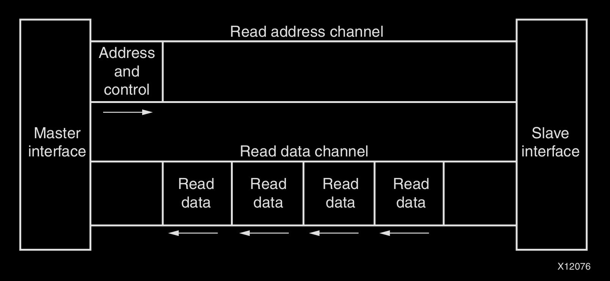
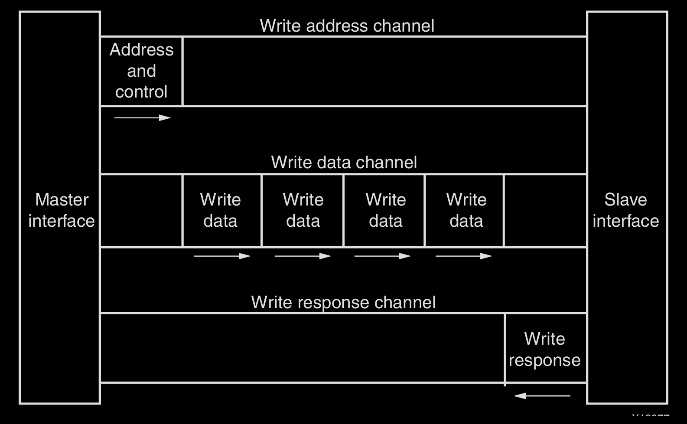
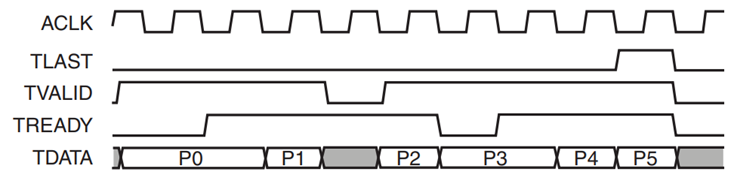

# Lab 01 - Introduction to Hardware Design

## System Overview

In EE4218, we will be using the Kria KV260 SOM Vision Starter Kit containing a Xilinx Zynq Ultrascale+ SoC to implement a **coprocessor**. The overall system overview can be shown as follows:

<figure><figcaption></figcaption></figure>

On our FPGA board, we have two major blocks

1. The Processor System (PS)
2. The UltraScale Programmable Logic (PL)

### Processor System

The processor system of our FPGA board cotains two mains parts

1. The ARM Cortex-A53 In-order Superscalar(dual-issue) processor
2. I/O Peripherals like UART, Ethernet, USB and Debug, etc.

The processor (ARM Cortex-A53) communicates with these I/O peripherals using MMIO[^1] via the **AXI bus**. For example, to communicate, the processor issues standard Load/Store instructions (e.g., `lw`/`sw` in RISC-V assembly) targeting these reserved addresses.

### Programmable Logic

The **Ultrascale programmable logic (PL**) again has two very important parts for now

1. The **bridge** which translates the data fetched via AXI into a stream
2. The **coprocessor** which is responsible for doing the matrix multiplication (2x4 times 4x1)

#### Bridge

The **bridge** is responsible for converting AXI transactions into a streaming data format suitable for high-throughput hardware processing. So exacts steps from PS to the bridge are as follows:

1. Laptop sends data via **UART**.
2. The processor uses a `lw` instruction to read the data from the UART register. Then it uses a `sw` instruction to store the data into the **main memory**.
3. The processor uses a `sw` instruction to writes to the **Bridge** module's status register to wake it up. This step will also provide the **Bridge module** with information telling it
   1. **where** to fetch the data from the PS's main memory
   2. **the size** of the data being fetched.
4. The **bridge module** receives the data and converts it into **AXI Stream** and send it to the coprocessor to process the data.

After the coprocessor done its job, the reverse of the steps above are performed to send the result back to the main memory in the PS.

AXI vs. AXI Stream

**AXI** is part of ARM AMBA, a family of micro controller buses first introduced in 1996. The first version of AXI was first included in AMBA 3.0, released in 2003. AMBA 4.0, released in 2010, includes the second version of AXI, **AXI4**. There are 3 types of AXI4 interfaces:

1. **AXI4** is for **memory mapped interfaces** and allows **burst of up to 256 data transfer cycles** with just a [single address phase](#user-content-fn-2)[^2].
   1. The master sends one address, and the slave receives up to **256 data words**, with **address incrementation handled automatically by hardware**.
2. **AXI4-Lite** is a **light-weight**, **single transaction memory mapped interface**. It has a **small logic footprint** and is a **simple interface** to work with both in **design and usage**.
   1. Similar to AXI4, the master sends a **start address**, but the slave receives **only one data word per transaction**.
3. **AXI4-Stream** removes the requirement for an **address phase altogether** and allows **unlimited data burst size**. **AXI4-Stream interfaces and transfers** do **not have address phases** and are therefore **not considered to be memory-mapped**.
   1. Since there is **no start address**, the slave can receive **an unbounded stream of data**, and AXI4-Stream transfers are therefore **not memory-mapped**.

So, we can see that

* AXI4 is a **memory-mapped protocol** for **reading/writing to specific addresses**, ideal for **processor-to-memory communication**.
* AXIS (AXI4-Stream) is a **high-speed, unidirectional (simplex) protocol** without address channels, designed for **moving data streams between IP blocks**. AXIS is synchronous and master-slave.

***

Now, let's see how the AXI works. Both AXI4 and AXI4-Lite interfaces consist of five different channels:

1. Read Address Channel
2. Write Address Channel
3. Read Data Channel
4. Write Data Channel
5. Write Response Channel

Figure 1-1 shows how an AXI4 read transaction uses the read address and read data channels:

<figure><figcaption>
Figure 1-1: Channel Architecture of Reads
</figcaption></figure>

Figure 1-2 shows how a write transaction uses the write address, write data, and write response channels.

<figure><figcaption>
Figure 1-2: Channel Architecture of Writes
</figcaption></figure>

As shown in the preceding figures, AXI4 provides separate data and address connections for reads and writes, which allows simultaneous, bidirectional data transfer.

***

In our coprocessor IP, we will make use of the AXIS interface to simplify the data receiving and sending processes. A typical coprocessor needs

1. one AXIS channel for inputs (AXIS Slave) and
2. one AXIS channel for outputs (AXIS Master).

AXIS coprocessors can't be connected directly to the AXI4 memory-mapped bus and requires some form of a [bridge](lab-01-introduction-to-hardware-design.md#bridge) such as AXI Stream FIFO or AXI DMA.

<figure><figcaption></figcaption></figure>

Data transfer is always from a Master interface to a Slave interface. This means a hardware block will receive data (input) through its slave interface (let's call it `S_AXIS`), and send data (output) through its master interface (let's call it `M_AXIS`).

* `TVALID` is an indication from the master to the slave that the data placed by the master on `TDATA` is valid.
* `TREADY` is an indication from slave to master that the slave is willing to accept data. The slave should capture the data at the very next active clock edge if `TVALID` and `TREADY` are both true. However, the master is not obliged to send any data simply because `TREADY` is asserted by the slave.
* `TLAST` is an indication from the master to slave that the current data word is the last. `TLAST` is considered a sideband signal and is optional for AXIS. All the other signals mentioned above are essential signals for AXIS. It is useful in scenarios where the slave doesn't know exactly how many data words are sent by the master and is required if the slave is AXI Stream FIFO or AXI DMA, as these IPs (we will see in Lab 3) expect it.
* Other sideband signals such as `TSTRB` and `TKEEP` may need to be asserted by the master if the slave expects it - we will see later that AXI Stream FIFO doesn't, AXI DMA does.

> **References:**
>
> 1. [ARM: AMBA AXI-Stream Protocol Specification](https://developer.arm.com/documentation/ihi0051/latest/)
> 2. [Xilinx: AXI Reference Guide](https://docs.amd.com/v/u/en-US/ug761_axi_reference_guide)

#### Coprocessor

In the coprocessor, we have the following modules

1. 2 RAM: One to store matrix A and the other to store matrix B.
2. The Matrix Multiply Unit: Basically, it is the Multiply-And-Accumulate (MAC) unit.
3. The FSM Control Unit: This is the steering logic within the coprocessor


In Lab 01, we are going to implement the coprocessor and try to optimize its performance.


[^1]: The peripherals do not have their own special CPU instructions. Instead, they are mapped to specific physical addresses in the system memory map (hardwired by Xilinx).

[^2]: The **Address Phase** is the "phone call" before the conversation. It is the specific moment when the Master sends the location (address) and control information to the Slave, and they perform a handshake (using `VALID` and `READY`).

    * **Without Address Phase**: The Slave doesn't know _where_ to put the data.
    * **With Address Phase**: The Slave knows exactly which register or memory cell to target.
