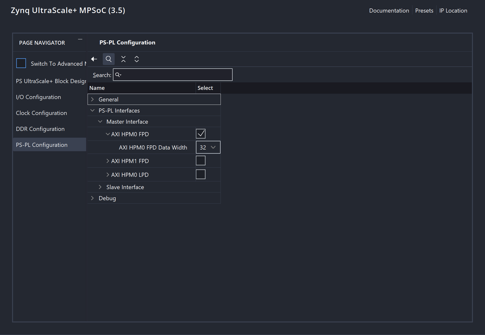
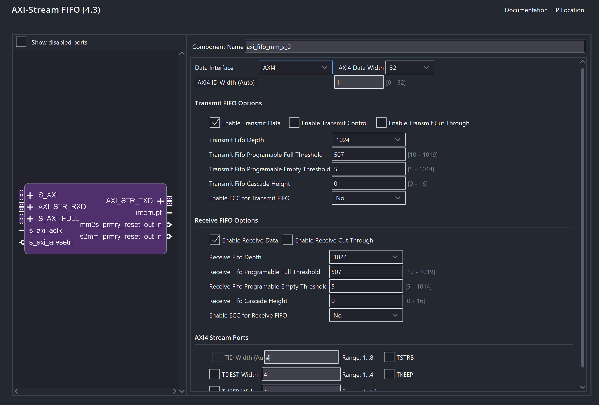
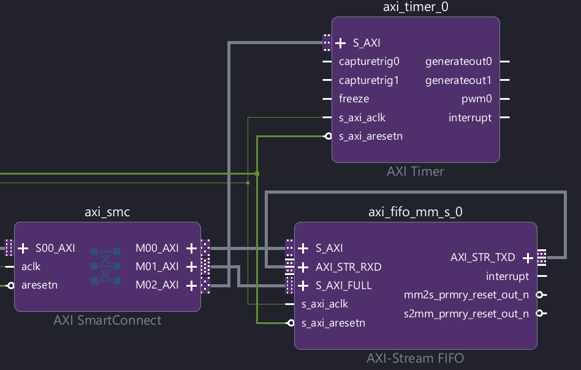

# Lab 02 - Introduction to Hardware/Software Co-Design

In Lab 02, we are going to configure our FPGA and write a C program to enable the feature of sending data and receiving data to and from the coprocessor via UART. The sending and receiving process is shown in the following diagram.

<figure><figcaption></figcaption></figure>


The orange line in the coprocessor module indicates that in this lab, we will just do the "loopback", which means that the coprocessor won't do any calculation and this matrix multiplication job is done **on the ARM A53 processor** on the PS instead. In the future lab, we will open this loop.


## Create the Hardware Platform

The diagram for the hardware platform that we are going to create is shown as follows:

<figure><figcaption></figcaption></figure>

The newly added blocks will be discussed in detail in this section

### Pins

To access the I/O modules in a processor system, such as UART, SPI, and I²C, we must manipulate the interface signals provided by these modules. For example, a UART module typically uses the signals

1. **TXD (Transmit Data)** and
2. **RXD (Receive Data)**.

These signals are connected to the external world through the **physical pins** on the board.

However, assigning a dedicated pin to every interface signal of every I/O module would require a very large number of pins, which is impractical due to physical, cost, and packaging constraints. To address this problem, modern processor systems use **multiplexers** to allow multiple internal I/O signals to share the same physical pins.

With multiplexing, each physical pin can be connected to different internal I/O modules, but only one function is active at a time. The selection of which module is connected to a given pin is controlled by specific **configuration registers**, often called **I/O multiplexing registers** or **pin control registers**. By writing to these registers in software, the processor can dynamically select which I/O module (e.g., UART, SPI, or I²C) is routed to the pins.


In this lab, we configure the our `UART1` to use pin number 36 and 37 on the board.


### Clock

Each module in the Programmable Logic (PL) requires a clock signal to operate. This clock is generated by the Processing System (PS), which contains Phase-Locked Loops (PLLs) capable of producing multiple clock frequencies from a reference clock. These clocks are routed from the PS to the PL.

The clock configuration, such as frequency and enable settings, is controlled through specific registers in the PS.


In this lab, we will be using one clock whose frequency is 100MHz. This clock should be connected to every other module.


### PS - PL Interface

In this lab, we configure the system so that the PS acts as the AXI master and the PL acts as the AXI slave. Since we only need a single AXI connection from PS to PL, we enable `AXI_HPM0_FPD` under the master interface. The data width is set to 32 bits because each transaction transfers 32-bit data.

<figure><figcaption></figcaption></figure>


If we want to change the data to be 64-bit in the future lab, don't forget to change the data bit width here!


After this configuration, the AXI interface from the PS to the PL, shown as the AXI arrow in the diagram, will be created. However, this AXI bus also requires a clock signal to operate. Therefore, we connect the system clock to the AXI interface so that all data transfers on this bus are synchronized to the 100 MHz clock.

<figure><figcaption><p>Connect <code>pl_clk0</code> to <code>maxihpm0_fpd_aclk</code></p></figcaption></figure>

### AXI-Stream FIFO

As shown in the diagram, the AXI-Stream FIFO contains two FIFO memories:

* **Transmit FIFO:** transfers data from AXI (PS) to AXI-Stream (PL)
* **Receive FIFO:** transfers data from AXI-Stream (PL) to AXI (PS)

Make sure the memory-mapped interface used is **AXI4**, not AXI4-Lite, and set the data width to **32 bits**, since all data transfers are 32-bit.


In the block diagram of the AXI-Stream FIFO, the AXI-Lite port **cannot** be omitted.


For the FIFO depth, consider the data required for the matrix multiplication. A ($$64 \times 8$$) matrix and an ($$8 \times 1$$) matrix contain ($$64 \times 8 + 8 \times 1 = 520$$) elements in total. Since 520 exceeds 512, a FIFO depth of 512 is insufficient. Therefore, the FIFO size should be set to **1024** to allow all data to be sent in a single transfer.

<figure><figcaption></figcaption></figure>

As in the lab, we are basically looping back, so we should connect `AXI_STR_TXD` to `AXI_STR_RXD` directly.

<figure><figcaption></figcaption></figure>


In Lab 02, we don't really need to optimize the hardware usage by changing 1024 back to 512 and make some corresponding changes at the software.


#### AXI SmartConnect

After clicking **Run Block Automation**, a new block called **AXI SmartConnect** will be created. This block acts as an interconnect **hub**, allowing the AXI bus from the PS to connect to **multiple** AXI interfaces in the PL.

For example, it connects the PS AXI bus to:

* the **AXI4-Full** port on the AXI-Stream FIFO (for data transfer),
* the **AXI4-Lite** port on the AXI-Stream FIFO (for configuration and control), and
* the **AXI-Lite** port on the AXI Timer (will see later).

In this way, AXI SmartConnect enables one master interface from the PS to communicate with multiple slave modules in the PL.

<figure><figcaption></figcaption></figure>

### AXI-Timer

The AXI-timer will be used to **measure the performance**.


The AXI intreface used in the AXI-timer is **AXI-Lite**.


### MMIO Address

As mentioned earlier, each block is configured by writing to its memory-mapped registers. Each register is located at a specific **offset** from the block’s **base address**. After completing the block diagram, we can open the **Address Editor** tab to view the MMIO base addresses assigned to each block. For example:

* **S\_AXI (AXI-FIFO control, AXI4-Lite):** base address 0xA000\_0000
* **S\_AXI\_FULL (AXI-FIFO data, AXI4):** base address 0xA000\_1000
* **S\_AXI (AXI Timer):** base address 0xA000\_2000

To access a specific register, we use:

$$
\text{Register address = Base address + Offset}
$$

By writing to these addresses, we can configure the blocks, and by reading from them, we can obtain their status or data.

<details>

<summary>The trick of the address range</summary>

Assigning large address blocks (64KB in this case) to small peripherals serves two main purposes: Simplified Decoding and Future Expansion.

1. **Simplified Decoding**: Large, power-of-two address blocks allow the interconnect to decode the target destination by examining fewer high-order address bits (e.g., checking only the top 16 bits for a 64KB block). This reduces the complexity and latency of the address decoding logic compared to resolving fine-grained, byte-exact ranges.
   1. For example, if the decoder sees `0xA000_....`, then it can immediately say, "I don't care what the bottom 16 bits are. If the top starts with `A000`, send it to the AXI-FIFO."
2. **Future Expansion**: Allocating excess address space acts as a "guard band," allowing the hardware IP to add new registers or features in future revisions without overlapping with neighboring peripherals. This ensures that the system's memory map remains stable and backward-compatible with existing software drivers.

</details>


In this lab, we only have 3 addresses because we have one AXI-Stream FIFO, which has

* AXI-Lite, and
* AXI-Full

and an AXI-Timer, which has only AXI-Lite. Thus, for each one of these three AXI interfaces, we have a dedicated address for it.


## Software Development using Vitis

After we create the hardware platform on Vivado, we should be very aware that

1. PS is **not configured** by using **bitstream**, but by **writing to registers**
2. PL is **configured** by using **bistream**

The hierarchy of this Vitis project can be summarized into three parts

1. The Workspace
2. The BSP configuration inside the platform settings
3. The software applications written in C

### Setup Workspace

What essentially happens here is that the Vitis will read the hardware configuration from the `.xsa` file and creates a workspace which contains the everything, like

1. The platform
2. The applications

### Board Support Package

The **Board Support Package (BSP)** is located in the "Settings" of the platform within a Vitis workspace. The BSP acts as the abstraction layer ("translator") between high-level application software and the physical hardware.

* **Software Layer**: Application code (e.g., `printf`, `main()`).
* **BSP Layer**: Low-level drivers, initialization code, memory maps, and vector tables.
* **Hardware Layer**: Physical silicon (IPs likeAXI-FIFOs, AXI-Timers).

The BSP does not create hardware; it configures the **software interface** for hardware defined in Vivado (`.xsa`).

* **Driver Matching**: Automatically assigns software drivers (e.g., `uartps`) to hardware IPs (e.g., `psu_uart_1`).
* **I/O Configuration**: Defines which peripherals handle standard input/output (stdin/stdout).
* **Common Setup**: Both `stdin` and `stdout` directed to `psu_uart_1` for serial console communication.
* **Library Management**: Used to import middleware libraries (e.g., `lwIP` for networking, `xilffs` for file systems).


**One Platform/BSP**: We configure the board (Hardware + Drivers) once. This acts as the foundation.


### Create Software Applications

These are the programs we write. We can create multiple independent applications in our workspace that use this **same Platform**. Usually, there are **two** ways to create applications:


While we can keep many applications in our project folder, the processor can usually only run one application at a time. We choose which one to "Run" or "Debug."


#### Import from the Examples

Under the `driver` tab in the BSP, there are a lot of examples for different IP instances provided by AMD. Thus, one easier way to create create applications on the board is by importing these examples.


In Lab 02, we will just study how the example works and copy & paste the useful code snippets into our own application.


#### Create your own Application

This can be done easily by just clicking the "+" button in the navigator.

<figure><figcaption></figcaption></figure>


While we can keep many applications in our project folder, the processor can usually only run one application at a time. We choose which one to "Run" or "Debug."


### UART Example Code

This program initializes the UART driver using the device's configuration, sets the baud rate to 115200, and transmits the string "Hello World" from the processor to the laptop (RealTerm) via the UART TX line.

#### The Core Method

The following code is the heart of the program. It sends the string one byte at a time inside a `while` loop.


```c
SentCount += XUartPs_Send(&Uart_Ps, &HelloWorld[SentCount], 1);
```


The meaning of the three parameters in this method are:

* `&Uart_Ps` (Instance Pointer): This is the "Handle" to your specific UART hardware. The Kria board has two UARTs (UART0 and UART1). This pointer tells the function _which_ one to use.
* `&HelloWorld[SentCount]` (Data Pointer): This is the memory address of the specific character we want to send right now.
* `1` (Number of Bytes): This is the size of the chunk we are sending. In this specific example, AMD chose to send 1 byte at a time.


The value in the address that the pointer `Uart_Ps` points to is **known** after the initialize function:

```c
XUartPs_CfgInitialize(&Uart_Ps, Config, Config->BaseAddress);
```


#### Preprocessor Directives

These are instructions for the compiler to follow **before** it actually compiles our code. They control which parts of the code get included in the final program based on certain conditions.


```c
#ifdef SYMBOL_NAME
    // 1. This code runs if "SYMBOL_NAME" IS defined.
    // Use this for: "If feature X is enabled, do this."

#else
    // 2. This code runs if "SYMBOL_NAME" is NOT defined.
    // Use this for: "Otherwise, do the default thing."

#endif
```


There are some common variations:

* `#ifndef` (If Not Defined): The opposite of `#ifdef`.
  * _Example:_ "If `SDT` is NOT defined (meaning we are on the old version), use `DeviceID`."
* `#elif` (Else If): Adds another condition.
  * _Example:_ `#elif defined(OTHER_SYMBOL)`


#### The MMIO Address of UART

In the our board, hard-wired PS peripherals like UART reside at fixed addresses (e.g., `0xFF...`) while custom PL peripherals like AXI FIFO rely on flexible addresses assigned by Vivado (e.g., `0xA0...`), explaining the distinct memory ranges.

