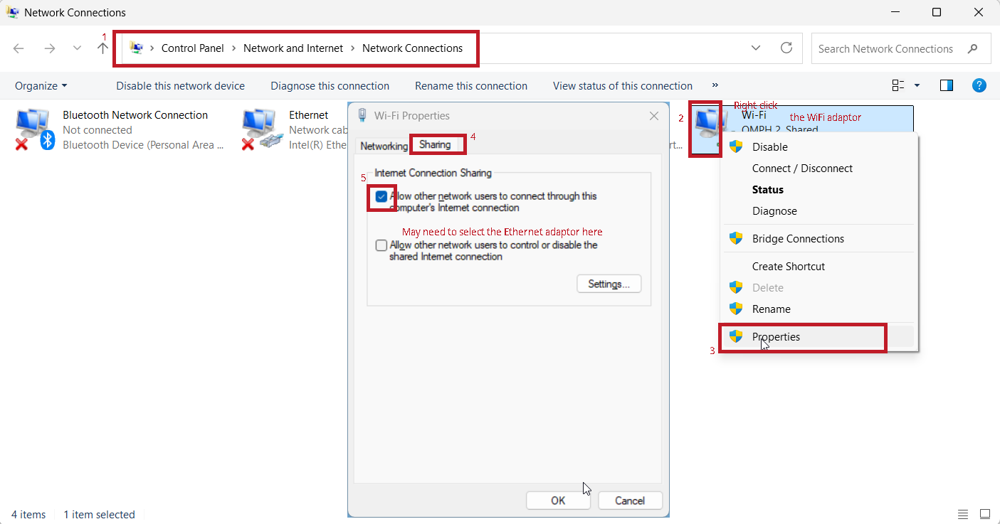

# Lab 04 - High Level Synthesis

In Lab 04, we will have two parts to do/demo.

1. HLS: This part is basically to replace the HDL `myip` we've designed in Lab 01 with the HLS version  along with different optmization skills used in HLS.
2. PYNQ: This is an alternative to replace the **standalone** PS. PYNQ gives us a full Linux OS and python library to operate on. Given that, many fancy stuff like network, image processing, etc are supported on PYNQ. The trade-off is that the **overhead** will be a lot!

## HLS

In this part, we will need to compare the performance improvement between the different versions of `myip` generated used Vitis HLS.

### Connect 2 Coprocessors

In the lab munual, Prof Rajesh said that it is recommended to connect 2 coprocessors to our Zynq so that we can demo the performance difference between the baseline HLS version with the optimized HLS version quickly. To do this on DMA, the complete block diagram is shown below.

<figure><figcaption></figcaption></figure>

To do so, we need to make the following changes:

1. Add another AXI-DMA and the optimized IP, make the connection between `M_AXIS_MM2S` (on DMA) and `S_AXIS` (on coprocessor) and between `S_AXIS_S2MM` (on DMA) and `M_AXIS` (on coprocessor).
2. Increase the number of master interfaces on `axi_smc` from 2 to 3.
   1. Connect the third master interface `M02_AXI` to the `S_AXI_LITE` on the newly added DMA.
3. Increase the number of slave interfaces on `axi_sma_1` from 2 to 4.
   1. Connect the third slave inteface `S02_AXI` to the `M_AXI_MM2S` on the newly added DMA.
   2. Connect the fourth slave inteface `S03_AXI` to the `M_AXI_S2MM` on the newly added DMA.
4. Run the automation to connect the Reset and Clock pins.

### HLS Baseline

As my Vitis (2025.2) will do some optimizations automatically, to disable these optimizations, we need to change the `hls.syn.compile.pipeline_loops` to 0 in the `hls_config.cfg`. Besides, it is safer for us to add the `#pragma HLS pipeline off` manually in our code as well. After doing all this, to verify that our HLS doesn't have any optimization, we can see from the "Performance & Resource Estimates" in the C synthesis report.

<figure><figcaption></figcaption></figure>

More specifically, the "pipelined" column will show **no** for all the loops. This will indicate that our baseline is a **real** baseline.


After we make any changes to the HLS IP, we need to upgrade the IP in the block diagram in our Vivado. After that, we need to generate new bitstream and update the platform on our Vitis by using the "Switch/Re-read XSA" in the `vitis-comp.json` so that we don't need to create new platform.


### HLS Optimization

The purpose of this lab is to demonstrate **one and only one** HLS optimization. Thus, based on our application, which is the matrix multiplication, we have enough resources and thus **unroll** will give us the best performance but worst area usage.

#### Understand HLS Optimization

In [lec-06-high-level-synthesis.md](../lec/lec-06-high-level-synthesis.md "mention"), we have learned that the HLS optimizations are done on loops, no matter it is a normal `for` loop or a dataflow loop. The key idea in understanding the HLS optimization is to **find out the computation done per iteration**. For example, in the following loop,


```cpp
for (j = 0; j < COLS_A; j++) {
#pragma HLS unroll // fully unroll, COLS_A which is 8 multiplier and adder will
                   // be created
  ap_uint<16> temp_product = A_array[(i * COLS_A) + j] * B_array[j];
  sum += temp_product;
}
```


The two obvious computations are **multiply** and **add**.


Except for the obvious computations, there might be some hidden operations within each iteration.


After knowing the main operation per iteration, we can then apply the HLS optimization skills we have learned to these operations:

1. **pipeline**: this is used to overlap the operation per iteration
2. **unroll**: this is used to run more than one operations simultaneously.

#### Unrolling

More specifically, we **fully unroll** all the 4 loops in our application. Theoretically, the clock cycles taken can be divided into three parts

1. Read input A and B: 512 + 8 = 520 cycles.
2. Compute: 1 (if FSM is used to implement, maybe have 1 or 2 more clock cycles)
3. Write output: 64 cycles.

And the real number of clock cycles we get is 587, which is around the same as the theoretical and the 2 more cycles indeed come from the FSM state transition within the compute stage.

<figure><figcaption></figcaption></figure>


Doing unrolling without array partitioning is useless. However in 2025.2 version, the array partition can be done automatically by the tool.


<details>

<summary>Tips on Unrolling</summary>

1. If the unrolling factor is an integer factor of the maximum iteration count, we can use `skip_exit_check` to skip the exit check and thus minimizing the area and simplifying the logic.
2. `region`: An optional keyword that unrolls all loops within the body (region) of the specified loop, without unrolling the enclosing loop itself.

</details>

#### Interface

In C based design, all input and output operations are performed, in zero time, through formal function arguments. In an RTL design these same input and output operations must be performed through a port in the design interface and typically operate using a specific I/O (inputoutput) protocol.

Here, we use AXIS as our I/O protocol. The data comes into the input and out from the output is done **one by one** because of the following sentence from the Xilinix docs.

> After the block-level protocol has been used to start the operation of the block, the port-level IO protocols are used to **sequence** data into and out of the block.

## PYNQ


### PYNQ Setup

In Lab 4 or in this course, the minimal requirement for PYNQ is to setup and run the python equivalent code of the C program on it. That's it. For more fancy techniques on PYNQ, please go to [NUS CEG5203](https://nusmods.com/courses/CEG5203/hardware-acceleration-and-reconfigurable-computing). To setup the PYNQ locally on Windows, I have summarized the following steps from the official lab manual.


Make sure you have installed [balena etcher](https://etcher.balena.io/) and [Mobaxterm](https://mobaxterm.mobatek.net/) or equivalent of these two software on your OS.




#### Flash the Linux OS into the SD card

If you are taking EE4218, NUS would have probably provided you and your team with the SD card and the linux OS `.img` file. So, all you have to do is to flash the linux OS `.img` file into the SD card using balena etcher or the equivalent tool.



#### Setup Linux on Kria

Here, I will only focus on the recommended way to connect to Kria, which is to use the **Ethernet**. As I am using Windows 11, the setting up process requires you to do the following steps in sequence:

1. Plug the SD card with the Linux OS inside into the Kria board.
2. Connect the ethernet from kria to the ethernet port on your laptop.
3. Power on the Kria board.

After that, for Windows users, please go to the following settings in your control panel and setup as follows:

<figure><figcaption></figcaption></figure>


Pay attention to which Ethernet you are using and select the Ethernet adaptor after Step 5 above!


After that, open your terminal on Windows and type `arp -s`, you might get something like below


```ps
Interface: 100.75.116.30 --- 0x7
  Internet Address      Physical Address      Type
  100.100.100.100                             dynamic
  169.254.169.254                             dynamic
  224.0.0.22                                  static
  224.0.0.251                                 static
  239.255.255.250                             static

Interface: 172.31.27.161 --- 0x12
  Internet Address      Physical Address      Type
  172.31.24.1           00-00-5e-00-01-d7     dynamic
  172.31.24.2           dc-68-0c-82-da-37     dynamic
  172.31.24.3           dc-68-0c-82-d8-c9     dynamic
  224.0.0.22            01-00-5e-00-00-16     static
  224.0.0.251           01-00-5e-00-00-fb     static
  224.0.0.252           01-00-5e-00-00-fc     static
  239.255.255.250       01-00-5e-7f-ff-fa     static
  255.255.255.255       ff-ff-ff-ff-ff-ff     static

Interface: 192.168.137.1 --- 0x33
  Internet Address      Physical Address      Type
  192.168.137.219       00-0a-35-14-b3-33     static
  224.0.0.22            01-00-5e-00-00-16     static
  224.0.0.251           01-00-5e-00-00-fb     static
  224.0.0.252           01-00-5e-00-00-fc     static
  239.255.255.250       01-00-5e-7f-ff-fa     static
  255.255.255.255       ff-ff-ff-ff-ff-ff     static
```


Find the interface starting with `192.168.137.1` and within this interface, the only ip address that starts with `192.168.137.*` is the ip address of the Kria board.

After knowing the ip address of the kria board, you can just open your mobaxterm and setup a new session.&#x20;


If you are taking EE4218 in AY25/26 Sem 2, the username is `ubuntu` and password is `CEG5203*`. Otherwise, please contact Prof Rajesh for the username and password.




#### Run PYNQ code on Kria

After connecting to the Kria board, normally we will enter into a ubuntu terminal. In that terminal, to run the pynq code, we need to create a folder with

1. The hardware `.xsa` file
2. The python PYNQ code

To run the pynq code, use the following commands


```shellscript
sudo -s
source /etc/profile.d/pynq_venv.sh
cd /home/ubuntu/PYNQCodeDir/
python3 PYNQCode.py
```



